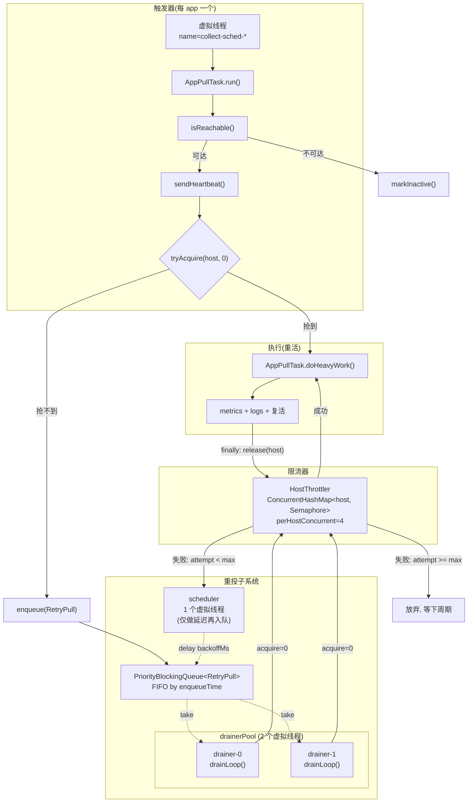
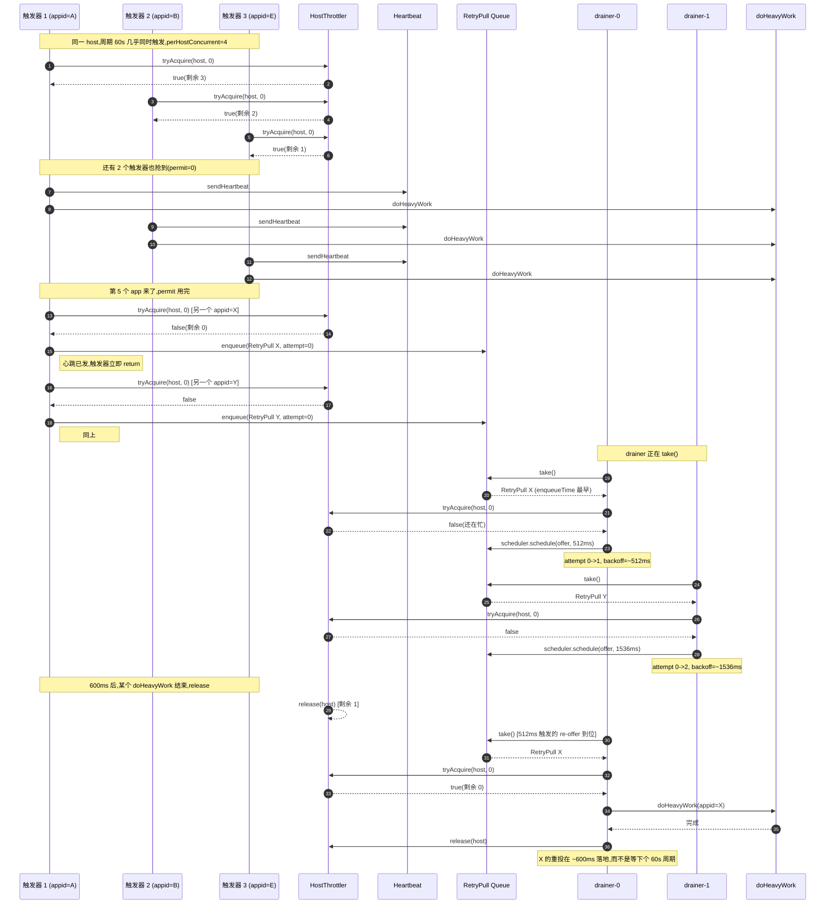
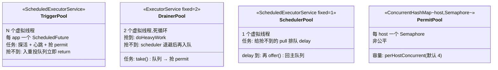

# `@PostConstruct` 注解 & 降级重试架构图

> 适用:spring-watch 调度子系统(`CollectScheduleRegistry`、`PullRetryQueue`)

---

## 一、`@PostConstruct` 是什么

### 1.1 一句话

**Bean 装配完成后、对外可用之前,spring 容器自动调一次的方法**。是 bean 生命周期的"初始化钩子"。

### 1.2 完整定义

| 项 | 说明 |
|---|---|
| 包 | `jakarta.annotation.PostConstruct`(JSR-250 标准) |
| 来源 | Java EE / Jakarta EE 通用规范,**不是 Spring 自创** |
| Spring 何时调 | Bean **构造完成 + 所有 `@Autowired` / `@RequiredArgsConstructor` 注入完成** 之后,**第一次被使用之前** |
| 方法要求 | `void`,无参,不抛 checked exception |
| 调用次数 | 每个 bean 实例**只调一次**(伴随 bean 的整个生命周期) |

### 1.3 触发时机全景

```
Bean 生命周期(单例):

  new Bean()              ← 构造
      │
      │  @Autowired / 构造器注入依赖
      ▼
  populate properties     ← Spring 把依赖塞进来
      │
      ▼
  @PostConstruct 方法     ← ★ 你写 init() 在这里跑
      │
      ▼
  InitializingBean.afterPropertiesSet()  ← Spring 旧式接口
      │
      ▼
  @Bean(initMethod="...")  ← @Configuration 里的旧式声明
      │
      ▼
  Bean 就绪,可被注入/调用
```

### 1.4 在 spring-watch 里的实际用法

#### 用法一:`CollectScheduleRegistry.init()` —— 启动虚拟线程调度池

```java
@Slf4j
@Component
@Order(1)
@RequiredArgsConstructor
public class CollectScheduleRegistry implements ApplicationRunner {

    private final MonitorAppRepository repository;     // ← 已被注入
    private final AppPullTask appPullTask;             // ← 已被注入
    private final AppScheduleProperties properties;   // ← 已被注入

    private ScheduledExecutorService scheduler;        // ← 还没初始化,只声明了

    @PostConstruct                                  // ← 这里才建
    void init() {
        ThreadFactory tf = Thread.ofVirtual().name("collect-sched-", 0).factory();
        this.scheduler = Executors.newScheduledThreadPool(properties.getPoolSize(), tf);
        log.info("[spring-watch: 调度器初始化 - poolSize={}]", properties.getPoolSize());
    }
    ...
}
```

为什么**必须**用 `@PostConstruct`?因为:
- 构造器里 `properties` 还是 `null`(字段注入是构造之后)
- 想用 `properties.getPoolSize()` 必然要等注入完
- 又要在任何 `registry.upsert(...)` 之前把 `scheduler` 建出来
- 唯一合法的钩子就是 `@PostConstruct`

#### 用法二:`PullRetryQueue.start()` —— 启动 drainer 池

```java
@Slf4j
@Component
public class PullRetryQueue {
    private final HostThrottler throttler;            // 已注入
    private final AppPullTask appPullTask;            // 已注入
    private final MonitorAppRepository repository;    // 已注入
    private final AppScheduleProperties properties;  // 已注入

    private ScheduledExecutorService scheduler;       // 未初始化
    private ExecutorService drainerPool;              // 未初始化

    @PostConstruct
    void start() {
        this.scheduler = Executors.newScheduledThreadPool(1, ...);
        this.drainerPool = Executors.newFixedThreadPool(2, ...);
        for (int i = 0; i < 2; i++) {
            drainerPool.submit(this::drainLoop);      // ← 启动 2 个 drainer 虚拟线程
        }
    }

    @PreDestroy
    void stop() {
        running.set(false);
        drainerPool.shutdownNow();                    // ← 对偶,关停
        scheduler.shutdownNow();
    }
}
```

### 1.5 同类钩子对照

| 钩子 | 触发时机 | 典型场景 | 备注 |
|---|---|---|---|
| **构造器** | new 时 | 简单赋值,**不能**读注入的依赖 | — |
| **`@PostConstruct`** | 注入后,首次使用前 | 建连接、起线程池、加载缓存 | ✅ **本次使用** |
| `InitializingBean.afterPropertiesSet()` | 同 `@PostConstruct` | 旧式 Spring 接口 | 等价但更丑 |
| `@Bean(initMethod = "...")` | 同上 | 第三方类无法加注解 | 不常用 |
| `ApplicationRunner.run()` / `CommandLineRunner.run()` | **整个 context 就绪后** | 启动时跑业务逻辑(全量加载) | `CollectScheduleRegistry` 用了它做"启动加载全部 app" |
| `@EventListener(ApplicationReadyEvent.class)` | 同 `ApplicationRunner` | 监听事件,可多个 | 适合发"系统就绪"广播 |
| **`@PreDestroy`** | bean 销毁前 | 关连接、停线程池 | `PullRetryQueue.stop()` 用它 |

### 1.6 常见误区

#### ❌ 误区 1:在构造器里读注入的依赖
```java
@Component
public class Bad {
    private final SomeService svc;
    public Bad(SomeService svc) { this.svc = svc; }
    
    public Bad() {
        svc.doSomething();  // ❌ 此时 svc 还没注入
    }
}
```

#### ❌ 误区 2:在 `@PostConstruct` 里调其他 bean
```java
@PostConstruct
void init() {
    otherBean.doStuff();  // ❌ 不保证 otherBean 已就绪(取决于依赖顺序)
}
```
应改用 `ApplicationRunner` 或 `@Order` 控制。

#### ✅ 正确:只做"自身资源初始化"
```java
@PostConstruct
void init() {
    this.pool = Executors.newFixedThreadPool(N);   // 建自己的线程池
    this.scheduler = Executors.newScheduledThreadPool(M);
    // 只动自己的字段,不碰别的 bean
}
```

---

## 二、降级重试架构图

### 2.1 总体流程(两个池、两个角色)



### 2.2 时序图:同 host 多 app 并发,触发限流



### 2.3 重投退避时序(指数退避)

```mermaid
gantt
    title RetryPull 退避时序(attempt 0~5)
    dateFormat  X
    axisFormat %S s

    section 触发器
    抢 permit 失败 (T=0)     :milestone, 0, 0

    section drainer
    attempt 0 → offer :milestone, 1, 1
    attempt 1 take (T+0.5s)    :a1, 500, 50
    attempt 1 失败 → backoff    :milestone, 550, 0
    attempt 2 take (T+1.5s)    :a2, 1500, 50
    attempt 2 失败 → backoff    :milestone, 1550, 0
    attempt 3 take (T+2.5s)    :a3, 2500, 50
    attempt 3 失败 → backoff    :milestone, 2550, 0
    attempt 4 take (T+6.5s)    :a4, 6500, 50
    attempt 4 失败 → backoff    :milestone, 6550, 0
    attempt 5 take (T+14.5s)   :a5, 14500, 50
    attempt 5 失败 → 放弃      :crit, 14550, 50
```



退避公式(`RetryPull.backoffMs`):
```
backoff = 500ms << min(attempt, 6)  +  jitter[0, base/2)
       = 500ms, 1s, 2s, 4s, 8s, 16s, 32s(封顶)
       + ±50% 随机抖动
```

| attempt | base | 含抖动范围 |
|---|---|---|
| 1 | 500ms | 500~750ms |
| 2 | 1s | 1.0~1.5s |
| 3 | 2s | 2.0~3.0s |
| 4 | 4s | 4.0~6.0s |
| 5 | 8s | 8.0~12.0s |
| 6+ | 32s(封顶) | 32~48s |

`maxAttempts=5` + 第 1 次立即尝试 → 实际总等待最坏约 `0.5+1+2+4+8 = 15.5s` 后放弃。**比"等下个 60s 周期"快 4 倍**。

### 2.4 三个池的角色对照



### 2.5 数据流与所有权

| 数据 | 谁产生 | 谁拥有 | 谁消费 |
|---|---|---|---|
| `RetryPull` | `AppPullTask.run()` | `PriorityBlockingQueue<RetryPull>` | `drainerPool` |
| `Semaphore` permit | `HostThrottler`(per host) | `HostThrottler` | 触发器 **或** drainer(互斥) |
| Heartbeat 事件 | `AppPullTask.run()` 探活后 | `KafkaProducerBridge` | Kafka topic `monitor-heartbeat` |
| Metric/Log 事件 | `doHeavyWork()` | `KafkaProducerBridge` | Kafka topics |

### 2.6 不变量总结

1. **触发器永不阻塞**——`tryAcquire(0)` + 入队即返回
2. **drainer 池是独立的**——2 个虚拟线程平行,不互相等
3. **scheduler 池只做延迟入队**——不抢 permit,不跑业务
4. **permit 所有权唯一**——同一时刻,permit 只被一个角色(触发器 / drainer)持有
5. **重投有上限**——5 次失败就放弃,不让一个 app 长期占着队列
6. **心跳先发后限流**——即使被节流,活性信号已发到 Kafka
7. **关闭顺序**——`@PreDestroy`:先 drainer 后 scheduler,资源成对释放

### 2.7 文件落点索引

| 文件 | 角色 | 关键行 |
|---|---|---|
| `AppPullTask.java` | 触发器主体 | `run()` L36-83,`doHeavyWork()` L85-130 |
| `schedule/PullRetryQueue.java` | 重投队列 | `start()` L46-55,`drainLoop()` L80-88,`processPull()` L90-124 |
| `schedule/RetryPull.java` | 重投元素 | `backoffMs()` L19-26 |
| `schedule/HostThrottler.java` | 限流器 | `tryAcquire()` L19-37 |
| `schedule/CollectScheduleRegistry.java` | 周期调度 | `init()` L43-49,`shutdown()` L51-69 |
