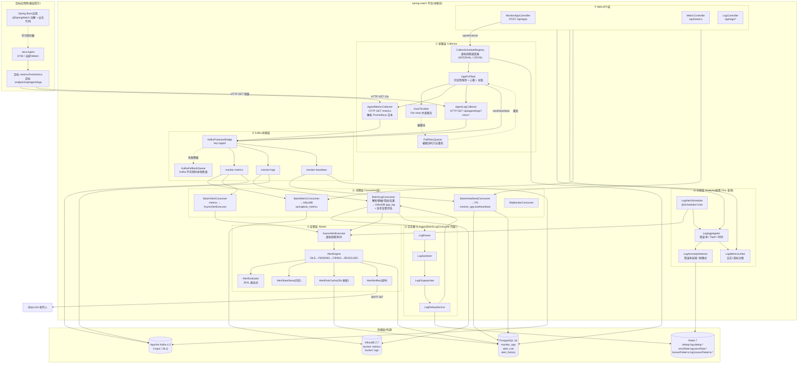
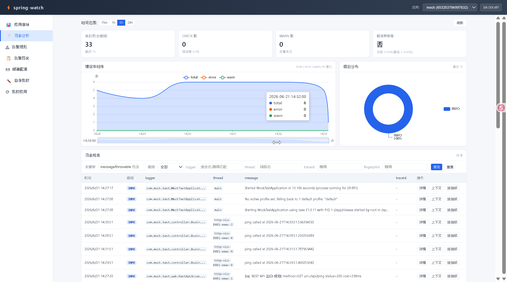
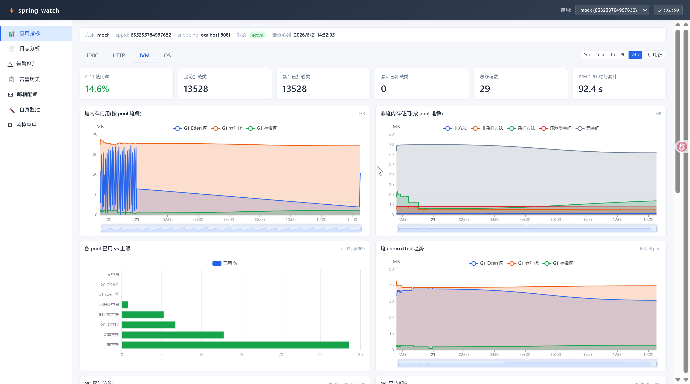
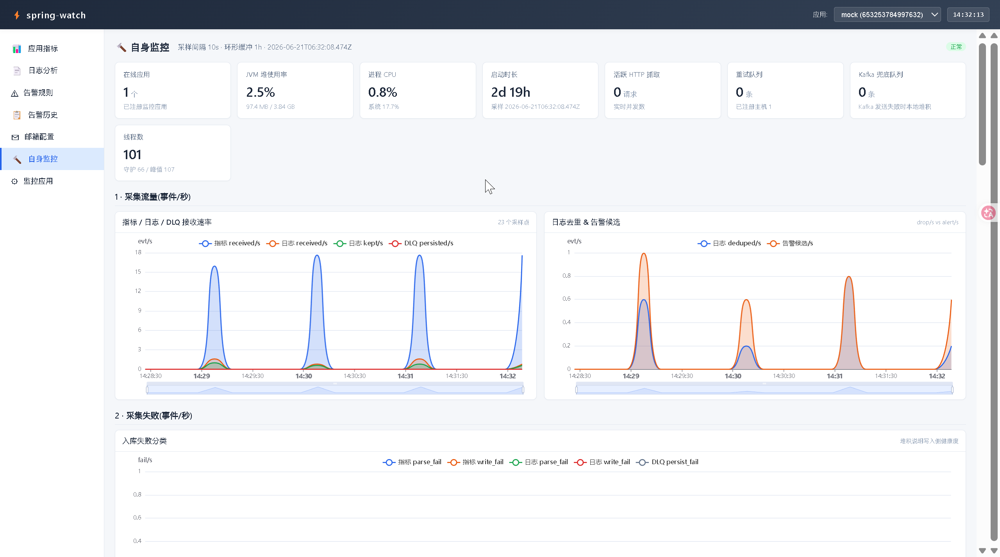

# spring-watch

> 专为 Spring Boot 打造的一站式轻量监控平台 —— 采集、存储、告警、日志分析、可视化，全方位埋点（JDBC / HTTP / OS / JVM / 方法级）。

---

## 项目定位

**spring-watch** 是一个基于 **拉取模型（Pull Model）** 的 Spring Boot 应用监控平台。平台主动 HTTP GET 目标应用的监控端点，聚合指标 / 日志 / 心跳数据，提供实时告警、日志分析与可视化能力。

| 维度 | 说明 |
|------|------|
| **目标用户** | 运维 / SRE / 研发负责人 |
| **目标应用** | 仅限 Spring Boot 应用 |
| **接入方式** | Java Agent（字节码增强） |
| **数据来源** | 仅由 Java Agent 字节码拦截产生，不依赖 Actuator / Micrometer |
| **架构模型** | 拉取（平台主动请求，目标永不推送） |
| **参考借鉴** | HertzBeat、Elasticsearch 监控体系 |

---

## 功能特性

- **指标采集** — 定时拉取目标应用的 `/metrics`（Prometheus 文本格式），支持 JVM / OS / HTTP / JDBC 等多维度指标
- **日志采集与分析** — 增量拉取目标应用日志，经解析、脱敏、指纹去重后写入时序库，支持异常检测、TopN 聚合、日志-指标关联
- **告警引擎** — 完整状态机（IDLE→PENDING→FIRING→RESOLVED），支持 JEXL 表达式、次数/持续时间阈值、SMTP 邮件通知
- **可视化** — 基于 ECharts 的监控面板，支持应用列表、指标曲线、日志检索、告警规则管理
- **存储** — PostgreSQL（元数据）+ InfluxDB（时序数据）+ Redis（缓存/去重/告警状态）
- **消息解耦** — Kafka 异步缓冲采集数据，支持本地降级队列兜底
- **自监控** — Micrometer 全方位埋点（HTTP 连接池、消费延迟、Ingest 链路等）

---

## 架构概览


---

## 技术栈

| 组件 | 技术选型 |
|------|----------|
| 语言 | Java 25 |
| 框架 | Spring Boot 4.0.1 |
| 时序库 | InfluxDB 2.7 |
| 关系库 | PostgreSQL 16 |
| 缓存 | Redis 7 |
| 消息队列 | Apache Kafka |
| 数据库迁移 | Flyway |
| 告警表达式 | Apache Commons JEXL 3.4 |
| 自监控 | Micrometer |
| 可视化 | ECharts（静态 HTML SPA） |

---

## 快速开始

### 前置依赖

- Docker & Docker Compose
- JDK 25+
- Maven 3.9+

### 启动基础设施

```bash
docker compose up -d
```

### 构建并启动

```bash
mvn clean package -DskipTests
java -jar target/spring-watch-1.0.0.jar
```

### 接入目标应用

1. 目标应用挂载 OTel Java Agent（或未来自研 Agent）
2. 复制 `@SpringWatch` 注解与 `SpringWatchAspect` 切面到目标项目
3. 在 spring-watch 平台注册目标应用（名称、Endpoint、Metrics 端口）

---

## 项目状态

> **预览阶段（Preview）** — 核心链路基本可用，正在进行正式版迭代。





### 已实现

- [x] 指标采集（HTTP 拉取 + Prometheus 文本解析）
- [x] 日志增量采集与 Ingest 管道（解析→脱敏→指纹→去重→入库）
- [x] 日志分析（异常检测、TopN 聚合、日志-指标关联、错误率告警）
- [x] 告警引擎（JEXL 表达式、状态机、邮件通知）
- [x] 存储层（InfluxDB + PostgreSQL + Redis + Kafka）
- [x] 可视化（ECharts 监控面板、日志检索、告警规则管理）
- [x] 自监控（Micrometer 指标暴露）
- [x] REST API（应用注册/指标查询/日志检索/告警 CRUD）

### TODO（正式版）

- [x] **渲染层升级** — Vite + Vue 3 + TypeScript + Pinia 重构完成,前端代码见 `frontend/`,开发 `cd frontend && npm i && npm run dev`(代理 `/api` 到 8080),生产 `npm run build` 后产物可覆盖到 `src/main/resources/static/`
- [ ] **E2E 测试** — 补充端到端测试，覆盖采集→入湖→告警全链路
- [ ] **内存优化** — 实现轻量化与高可用，降低常驻内存开销
- [ ] **自研 Java Agent** —
  - 日志采集 Agent（替代目标应用自暴露 `/api/agent/logs`）
  - 方法注解埋点 Agent（字节码层直接织入 `@SpringWatch` 监控逻辑）
  - SQL 执行监控（JDBC 拦截）

---

## 参考与致谢

- [HertzBeat](https://github.com/usthe/hertzbeat) — 监控告警系统，项目初期的重要参考
- Elasticsearch 监控体系 — 日志分析、指标聚合与可视化方案借鉴

---

