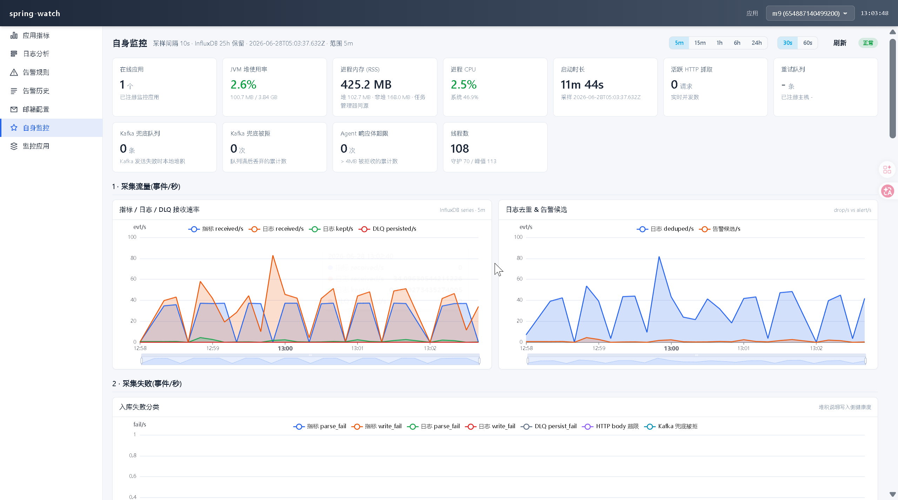
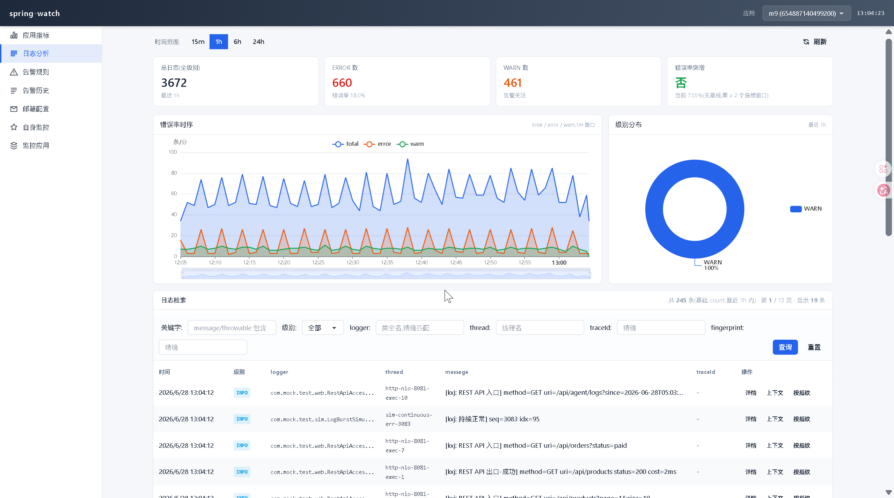
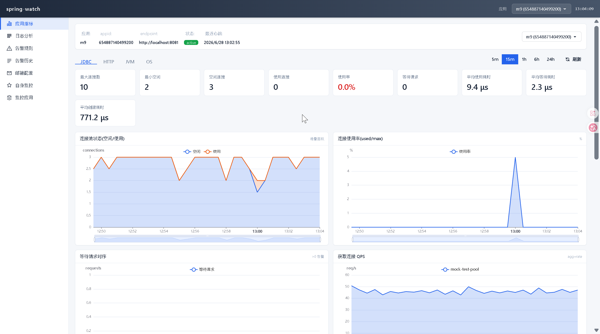

# spring-watch

> 专为 Spring Boot 打造的一站式轻量监控平台 —— 采集、存储、告警、日志分析、可视化，全方位埋点（JDBC / HTTP / OS / JVM / 方法级）。

---

## 项目定位

**spring-watch** 是一个基于 **拉取模型（Pull Model）** 的 Spring Boot 应用监控平台。平台主动 HTTP GET 目标应用的监控端点，聚合指标 / 日志 / 心跳数据，提供实时告警、日志分析与可视化能力。

| 维度 | 说明 |
|------|------|
| **目标用户** | 中小企业团队 / 个人开发者（详见[白皮书 §0.2](白皮书.md#02-目标用户)） |
| **目标应用** | 仅限 Spring Boot 应用 |
| **接入方式** | OTel Java Agent（v1.x 过渡）/ 自研 Agent（v2 目标） |
| **数据来源** | 仅由 Java Agent 字节码拦截产生，不依赖 Actuator / Micrometer |
| **架构模型** | 拉取（平台主动请求，目标永不推送） |
| **部署形态** | 单机全栈单实例，`docker compose up -d` 5 分钟拉起 |
| **参考借鉴** | HertzBeat、Elasticsearch 监控体系 |

---

## 功能特性

- **指标采集** — 定时拉取目标应用的 `/metrics`（Prometheus 文本格式），支持 JVM / OS / HTTP / JDBC 等多维度指标
- **日志采集与分析** — 增量拉取目标应用日志，经解析、脱敏、指纹去重后写入时序库，支持异常检测、TopN 聚合、日志-指标关联、错误率告警
- **告警引擎** — 完整状态机（IDLE→PENDING→FIRING→RESOLVED），支持 JEXL 表达式、次数/持续时间阈值、SMTP 邮件通知、基础设施告警（InfluxDB / Kafka / JVM）
- **可视化** — 基于 Vite + Vue 3 + TypeScript + Pinia + ECharts 的 SPA，支持应用列表、HTTP / JDBC / JVM / OS 多维度指标面板、日志检索、告警规则管理、自监控 7 大模块（总览 / 采集 / JVM / 进程 / 指标库 / InfluxDB / Kafka）
- **存储** — PostgreSQL（元数据）+ InfluxDB 2.7（时序数据，多桶分桶写入）+ Kafka 单 broker（持久化缓冲）
- **消息解耦** — Kafka 异步缓冲采集数据，支持本地降级队列兜底
- **本地缓存** — Caffeine 替代 Redis 承接热路径状态（`LogDedupService` / `AlertStateStore` / `LogAnomalyDetector`），单实例零外置状态依赖
- **自监控** — Micrometer 全方位埋点（HTTP 连接池、消费延迟、Ingest 链路、Kafka 集群健康、4 个 WriteApi 内部状态等）

---

## 架构概览

```mermaid
flowchart TB
    subgraph EXT["目标应用侧（被监控方）"]
        direction TB
        SB["Spring Boot 应用<br/>@WithSpan + 业务代码"]
        AGENT["Java Agent<br/>（OTel v1 / 自研 v2）"]
        META["目标 :metricsPort/metrics<br/>目标 :endpoint/api/agent/logs"]
        SB -.字节码拦截.-> AGENT --> META
    end

    subgraph SW["spring-watch 平台（本服务）"]
        direction TB

        subgraph COLL["① 采集层 Collector"]
            REG["CollectScheduleRegistry<br/>虚拟线程调度器<br/>（INTERVAL / CRON）"]
            TASK["AppPullTask<br/>可达性探测 + 心跳 + 拉取"]
            TH["HostThrottler<br/>Per-Host 并发限流"]
            RTR["PullRetryQueue<br/>被限流时入队重投"]
            MC["AgentMetricsCollector<br/>HTTP GET /metrics<br/>解析 Prometheus 文本"]
            LC["AgentLogCollector<br/>HTTP GET /api/agent/logs?since="]
        end

        subgraph BR["② Kafka 桥接层（单 broker，partitions=3/3/1/1）"]
            PB["KafkaProducerBridge<br/>key=appid"]
            FB["KafkaFallbackQueue<br/>Kafka 不可用时本地降级"]
            T1["monitor-metrics (3)"]
            T2["monitor-logs (3)"]
            T3["monitor-heartbeat (1)"]
        end

        subgraph CONS["③ 消费层 Consumer（批）"]
            BMC["BatchMetricConsumer<br/>→ metricsWriteApi"]
            BLC["BatchLogConsumer<br/>解析/脱敏/指纹/去重<br/>→ logsWriteApi<br/>+ 异步告警评估"]
            BHC["BatchHeartbeatConsumer<br/>→ PG monitor_app.lastHeartbeat"]
            BAC["BatchAlertConsumer<br/>metrics → AsyncAlertExecutor"]
            DLQ["DlqMonitorConsumer"]
        end

        subgraph ING["④ 日志接入 Ingest（BatchLogConsumer 内嵌）"]
            LP["LogParser"]
            LS["LogSanitizer"]
            LF["LogFingerprinter"]
            LD["LogDedupService<br/>Caffeine 本地缓存"]
        end

        subgraph ALERT["⑤ 告警层 Alerter"]
            AE["AlertEngine<br/>IDLE→PENDING→FIRING→RESOLVED"]
            EV["AlertEvaluator<br/>JEXL 表达式"]
            AS["AlertStateStore<br/>Caffeine 本地缓存"]
            ARC["AlertRuleCache（30s 刷新）"]
            AN["AlertNotifier（邮件）"]
            AEX["AsyncAlertExecutor<br/>虚拟线程池（8）"]
        end

        subgraph ANA["⑥ 分析层 Analysis（按需 Flux 查询）"]
            LA["LogAggregator<br/>错误率 / TopN / 时序"]
            LAD["LogAnomalyDetector<br/>错误率突增 / 新模式<br/>Caffeine 本地缓存"]
            LML["LogMetricsLinker<br/>日志+指标关联"]
            LAS["LogAlertScheduler<br/>@Scheduled 1min"]
        end

        subgraph SM["⑦ 自监控层（7 模块）"]
            SMC["SelfMonitorCollector<br/>JVM/进程/Meter 采样"]
            IMC["InfrastructureMetricsCollector<br/>InfluxDB /metrics + Kafka lag"]
            KBJ["KafkaBrokerJmxMonitor<br/>Broker JMX"]
            KPJ["KafkaProducerJmxCollector<br/>Producer JMX"]
            KHM["KafkaHealthMonitor<br/>集群健康"]
            KPU["KafkaPartitionUtilizationGauge<br/>partition 利用率"]
        end

        subgraph WEB["⑧ Web API 层"]
            M_CTRL["MonitorAppController<br/>POST /api/apps"]
            MET_CTRL["MetricController<br/>/api/metrics"]
            L_CTRL["LogController<br/>/api/logs/*"]
            INF_CTRL["InfraController<br/>/api/infra/*"]
            SM_CTRL["SelfMonitorController<br/>/api/self-monitor/*"]
        end

        REG --> TASK
        TASK --> TH
        TH -.被限流.-> RTR -.重投.-> TASK
        TASK --> MC
        TASK --> LC
        MC --> PB
        LC --> PB
        TASK -- sendHeartbeat --> PB
        PB -.失败降级.-> FB
        PB --> T1
        PB --> T2
        PB --> T3

        T1 --> BMC
        T1 --> BAC
        T2 --> BLC
        T3 --> BHC

        BLC --> LP --> LS --> LF --> LD
        LD --> BLC
        BLC --> AEX
        BAC --> AEX
        AEX --> AE
        LAS --> AEX
        AE --> EV
        AE --> AS
        AE --> ARC
        AE --> AN

        LA --> LAD
        LA --> LML
        LAS --> LA

        WEB --> LA
        WEB --> LML
        WEB --> BMC
        WEB --> BHC
        M_CTRL -- upsert/cancel --> REG

        SMC -. 采样 .-> SelfW["selfMetricsWriteApi"]
        IMC -. 采样 .-> InfraW["infraWriteApi"]
        KBJ --> InfraW
        KPJ --> InfraW
        KHM --> InfraW
        KPU --> InfraW
    end

    subgraph STORE["存储层（外部）"]
        PG[("PostgreSQL 16<br/>monitor_app<br/>alert_rule<br/>alert_history<br/>log_dedup_count")]
        IDB[("InfluxDB 2.7<br/>bucket: metrics (WriteApi 独立)<br/>bucket: logs (WriteApi 独立)<br/>bucket: self_metrics<br/>bucket: metrics_5m<br/>bucket: infra_metrics")]
        KF[("Apache Kafka 4.3 单 broker<br/>3 topic / 3 DLQ")]
    end

    META -- "HTTP GET 15s" --> MC
    META -- "HTTP GET 增量" --> LC

    BMC --> IDB
    BLC --> IDB
    BHC --> PG
    AE --> PG
    AN -- "SMTP 587" --> MBOX["@qq.com 收件人"]
    ARC --> PG
    REG --> PG
    BHC --> PG
    T1 & T2 & T3 --> KF
```



---

## 技术栈

| 组件 | 技术选型 |
|------|----------|
| 语言 | Java 25 |
| 框架 | Spring Boot 4.0.1 |
| 时序库 | InfluxDB 2.7（5 个 bucket + 4 个独立 WriteApi） |
| 关系库 | PostgreSQL 16 |
| 本地缓存 | Caffeine（W-TinyLFU，严格有界） |
| 消息队列 | Apache Kafka 4.3 单 broker（partitions 3/3/1/1） |
| 数据库迁移 | Flyway |
| 告警表达式 | Apache Commons JEXL 3.4 |
| 自监控 | Micrometer |
| 前端 | Vite + Vue 3 + TypeScript + Pinia + ECharts + Tailwind + DaisyUI |
| 字节码增强 | OTel Java Agent（v1）/ 自研 Agent（v2 目标） |

---

## 快速开始

### 前置依赖

- Docker & Docker Compose
- JDK 25+
- Maven 3.9+
- Node.js 20+（仅前端开发需要）

### 启动基础设施

```bash
docker compose up -d
```

启动 PostgreSQL 16 / InfluxDB 2.7 / Kafka 4.3 三个容器（**v1.6 已移除 Redis**，全部状态由 Caffeine 承接）。

### 构建并启动

```bash
mvn clean package -DskipTests
java -jar target/spring-watch-1.0.0.jar
```

### 启动前端（开发模式）

```bash
cd frontend
npm install
npm run dev
```

Vite dev server 代理 `/api` 到 `localhost:8080`，访问 `http://localhost:5173` 即可。

### 启动前端（生产模式）

```bash
cd frontend
npm run build
# dist/ 产物可覆盖到 src/main/resources/static/
```

### 接入目标应用

1. 目标应用挂载 OTel Java Agent
2. 在 `pom.xml` 加 1 个 annotation jar（`opentelemetry-instrumentation-annotations`，< 50KB）
3. 业务方法加 `@WithSpan("xxx")` 注解
4. 在 spring-watch 平台注册目标应用（名称、Endpoint、Metrics 端口）

详细接入清单见[白皮书 §6](白皮书.md#6-客户接入标准流程产品文档唯一形态)。

---

## 项目状态

> **v1.6 正式版候选** — 核心链路全部落地，部署形态（单机 / 单 broker / Caffeine 替代 Redis）已收敛。





### 已实现（v1.6 累计）

- [x] 指标采集（HTTP 拉取 + Prometheus 文本解析）
- [x] 日志增量采集与 Ingest 管道（解析→脱敏→指纹→去重→入库）
- [x] 日志分析（异常检测、TopN 聚合、日志-指标关联、错误率告警）
- [x] 告警引擎（JEXL 表达式、状态机、邮件通知、基础设施告警）
- [x] 存储层（InfluxDB 4 桶 WriteApi 分桶 + PostgreSQL + Kafka）
- [x] **Caffeine 替代 Redis**（`LogDedupService` / `AlertStateStore` / `LogAnomalyDetector` 全部本地化，零外置状态依赖，详见 `docs/日志下游Caffeine优化报告.md`）
- [x] 可视化（Vite + Vue 3 + TS + Pinia SPA，7 大自监控模块 + 4 大应用详情模块 + 告警 / 日志 / 应用 / 邮件配置）
- [x] 自监控（Micrometer + InfluxDB `self_metrics` / `infra_metrics` 双桶 + Kafka 集群健康 + 4 个 WriteApi 内部状态面板）
- [x] REST API（应用注册 / 指标查询 / 日志检索 / 告警 CRUD / 基础设施指标 / 自监控）
- [x] **Kafka partition 收敛**（v1.5 实测后 `monitor-metrics=12→3` / `monitor-logs=6→3` / `monitor-heartbeat=3→1` / `*.DLQ=3→1`，详见[白皮书 §0.5 调研结论](白皮书.md#05-部署形态全部单实例故意不集群化)）
- [x] **WriteApi 4 桶分桶**（v1.4 `M-WriteApiSplit` 落地，`metricsWriteApi` / `logsWriteApi` / `selfMetricsWriteApi` / `infraWriteApi` 独立 buffer，单批体积 5x）
- [x] **多个启动时序坑修复**（V12.1 普通 `CREATE INDEX` 治本 / `SelfMonitorCollector` 拆 `registerMeters` + `onApplicationReady` / `lombok.config` 全局 `@Qualifier` 传递 / `influxdb.conf` 移除走 2.x 默认配置）

### TODO（正式版 → v2）

- [ ] **E2E 测试** — 补充端到端测试，覆盖采集→入湖→告警全链路
- [ ] **自研 Java Agent** —
  - 日志采集 Agent（替代目标应用自暴露 `/api/agent/logs`）
  - 方法注解埋点 Agent（字节码层直接织入 `@WithSpan` / 自研注解监控逻辑）
  - SQL 执行监控（JDBC 拦截）
  - 上线后接入流程 = 1 个 `-javaagent` 参数，0 annotation jar / 0 文件复制

---

## 关键文档

- [白皮书](白皮书.md) — 项目定性文件，所有架构设计 / 代码实现 / 对外文档的最终依据
- [日志下游 Caffeine 优化报告](docs/日志下游Caffeine优化报告.md) — v1.6 性能优化落地方案
- [agent-design.md](docs/agent-design.md) — 自研 Agent 架构设计
- [architecture-current.md](docs/architecture-current.md) — 当前架构详解
- [observability-plan.md](docs/observability-plan.md) — 可观测性建设规划
- [memory-architecture.md](docs/memory-architecture.md) — 内存模型与有界防护

---

## 参考与致谢

- [HertzBeat](https://github.com/usthe/hertzbeat) — 监控告警系统，项目初期的重要参考
- Elasticsearch 监控体系 — 日志分析、指标聚合与可视化方案借鉴
- [Caffeine](https://github.com/ben-manes/caffeine) — 高性能本地缓存库，v1.6 全面替代 Redis

---

## 许可证

[MIT](LICENSE)
