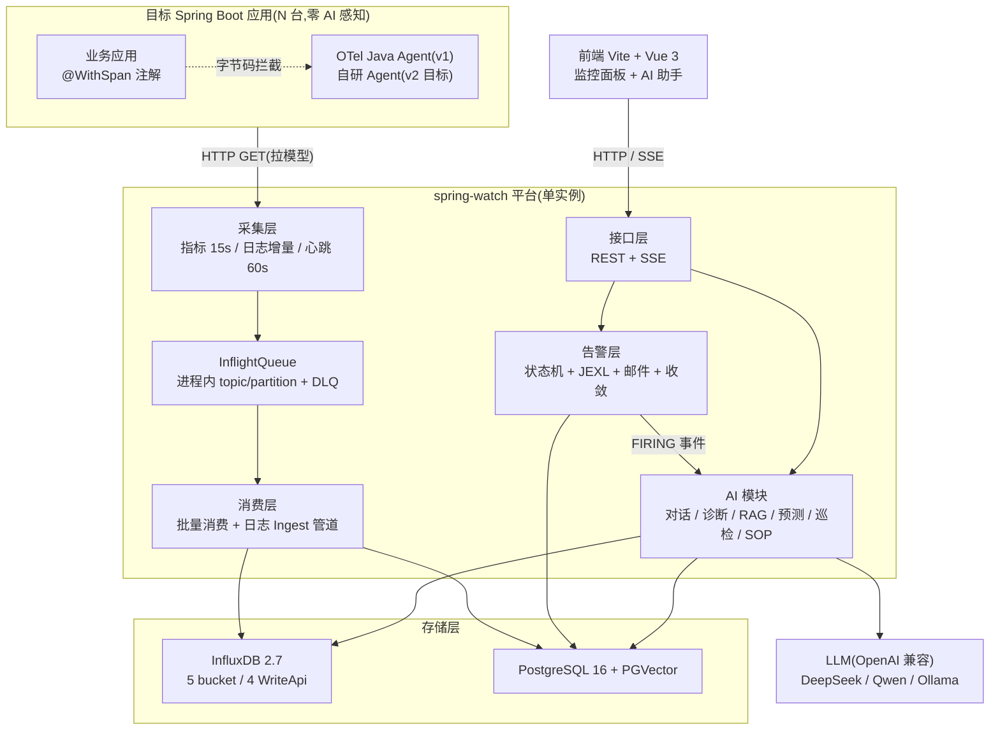
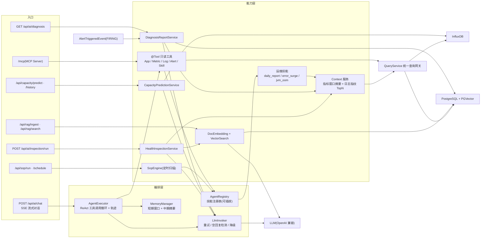
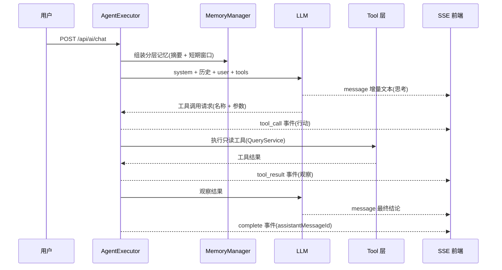

# spring-watch

> 专为 Spring Boot 打造的一站式轻量监控平台 —— 采集、存储、告警、日志分析、可视化,并内置 **AI 智能运维**(对话诊断 / RAG / 容量预测 / 自动巡检),全方位埋点(JDBC / HTTP / OS / JVM / 方法级)。

---

## 项目定位

**spring-watch** 是一个基于 **拉取模型(Pull Model)** 的 Spring Boot 应用监控平台。平台主动 HTTP GET 目标应用的监控端点,聚合指标 / 日志 / 心跳数据,提供实时告警、日志分析与可视化能力;并在同一进程内内置 **AI Agent**,把已有监控数据变成可对话、可诊断、可预测的运维能力。

| 维度 | 说明 |
|------|------|
| **目标用户** | 中小企业团队 / 个人开发者 |
| **目标应用** | 仅限 Spring Boot 应用 |
| **接入方式** | OTel Java Agent(v1.x 过渡)/ 自研 Agent(v2 目标) |
| **数据来源** | 仅由 Java Agent 字节码拦截产生,不依赖 Actuator / Micrometer |
| **架构模型** | 拉取(平台主动请求,目标永不推送) |
| **AI 形态** | 平台侧内置 AI Agent(ReAct 工具调用 + RAG),目标应用零感知、零新增依赖 |
| **部署形态** | 单机全栈单实例,`docker compose up -d` 5 分钟拉起 |
| **参考借鉴** | HertzBeat、Elasticsearch 监控体系 |

### 五大硬约束(白皮书 第二章)

| 约束 | 内容 |
|------|------|
| 拉取模型 | 平台主动 HTTP GET 目标,目标永不推送 |
| 监控平台 | 多应用 SaaS 形态,不做单应用内嵌 |
| 仅限 Spring Boot | 目标应用必须是 Spring Boot 应用 |
| 指标源头 | Java Agent 字节码拦截,不依赖 Actuator / Micrometer |
| 方法级监控 | 自研注解) |

> **高可用定义**(白皮书 0.6):单实例内的自愈与降级(本地队列兜底、DLQ、Caffeine 有界缓存、LLM 降级),而非集群化。AI Agent 完全部署在平台侧,目标应用不装任何新组件、零感知。

---

## 功能特性

### 监控底座

- **指标采集** — 定时拉取目标应用的 `/metrics`(Prometheus 文本格式),支持 JVM / OS / HTTP / JDBC 等多维度指标
- **日志采集与分析** — 增量拉取目标应用日志,经解析、脱敏、指纹去重后写入时序库,支持异常检测、TopN 聚合、日志-指标关联、错误率告警
- **告警引擎** — 完整状态机(IDLE→PENDING→FIRING→RESOLVED),支持 JEXL 表达式、次数/持续时间阈值、SMTP 邮件通知、基础设施告警(InfluxDB / JVM / 进程)
- **可视化** — 基于 Vite + Vue 3 + TypeScript + Pinia + ECharts 的 SPA,支持应用列表、HTTP / JDBC / JVM / OS 多维度指标面板、日志检索、告警规则管理、容量预测、AI 助手、自监控 7 大模块(总览 / 采集 / JVM / 进程 / InfluxDB / InflightQueue / 指标库)
- **存储与缓冲** — PostgreSQL(PGVector,元数据 + 向量)+ InfluxDB 2.7(时序数据,多桶分桶写入)+ 进程内 InflightQueue(采集→消费解耦)
- **消息解耦** — 进程内 InflightQueue(topic/partition + P2C 路由)异步缓冲采集数据,背压降级 + 进程内 DLQ 兜底,零外置组件
- **本地缓存** — Caffeine 替代 Redis 承接热路径状态(`LogDedupService` / `AlertStateStore` / `LogAnomalyDetector`),单实例零外置状态依赖
- **自监控** — Micrometer 全方位埋点(HTTP 连接池、消费延迟、Ingest 链路、InflightQueue pending/rejected、4 个 WriteApi 内部状态等)

### AI 智能运维(ai 模块)

- **流式对话** — `POST /api/ai/chat` SSE 流式问答,LLM 自主调用只读工具查应用 / 指标 / 日志 / 告警,回答必须引用真实数据
- **ReAct 执行轨迹** — 工具调用"行动(入参)/ 观察(结果)"实时推送前端,可折叠展示,推理过程透明可审计
- **分层记忆** — 短期窗口(最近 12 条)+ 中期摘要(超阈值自动压缩为 `role=summary` 注入),长对话不丢关键事实
- **告警智能诊断** — FIRING 事件自动触发:前后 30min 指标窗口 + ERROR 日志指纹 Top10 → 四段式根因报告;同 app 5min 冷却 + 并发限 2,LLM 失败降级落库
- **告警收敛** — 相似告警 5min 窗口聚类(leader 通知 / member 抑制),风暴摘要邮件汇总
- **日志智能摘要** — 每日 09:00 自动聚合各应用 ERROR 指纹 TopN,推送系统会话
- **容量预测** — 基于 `metrics_5m` 线性回归预测 OOM / 磁盘 / CPU 风险,LLM 仅做解释(可降级为统计摘要)
- **RAG 知识库** — 文档切片 + embedding 入 PGVector,诊断报告自动回灌,越用越准
- **自动巡检** — 每周一 08:00 全应用健康体检(指标 + 日志 + 知识库)→ 结构化报告推送
- **SOP 技能调度** — 技能注册表 + cron 定时执行(`daily_report` / `error_surge_diagnosis` / `jvm_oom_diagnosis`),对话内也可调用
- **MCP Server** — `/mcp` 暴露平台工具,外部 MCP 客户端可接入
- **全链路降级** — LLM 调用统一重试 2 次 + 空回复检测,失败降级为证据摘要,不阻塞告警与监控主链路

---

## 架构概览

### 总体架构


```mermaid
flowchart TB
    subgraph TARGET["目标 Spring Boot 应用(N 台,零 AI 感知)"]
        APP["业务应用<br/>@WithSpan 注解"]
        AGENT["OTel Java Agent(v1)<br/>自研 Agent(v2 目标)"]
        APP -. 字节码拦截 .-> AGENT
    end

    subgraph PLATFORM["spring-watch 平台(单实例)"]
        COLLECT["采集层<br/>指标 15s / 日志增量 / 心跳 60s"]
        INFLIGHT["InflightQueue<br/>进程内 topic/partition + DLQ"]
        CONSUMER["消费层<br/>批量消费 + 日志 Ingest 管道"]
        ALERT["告警层<br/>状态机 + JEXL + 邮件 + 收敛"]
        AI["AI 模块<br/>对话 / 诊断 / RAG / 预测 / 巡检 / SOP"]
        WEB["接口层<br/>REST + SSE"]
    end

    subgraph STORE["存储层"]
        IDB["InfluxDB 2.7<br/>5 bucket / 4 WriteApi"]
        PG["PostgreSQL 16 + PGVector"]
    end

    UI["前端 Vite + Vue 3<br/>监控面板 + AI 助手"]
    LLM["LLM(OpenAI 兼容)<br/>DeepSeek / Qwen / Ollama"]

    TARGET -->|"HTTP GET(拉模型)"| COLLECT
    COLLECT --> INFLIGHT --> CONSUMER
    CONSUMER --> IDB
    CONSUMER --> PG
    ALERT --> PG
    AI --> IDB
    AI --> PG
    ALERT -->|"FIRING 事件"| AI
    AI --> LLM
    WEB --> ALERT
    WEB --> AI
    UI -->|"HTTP / SSE"| WEB
```

### AI 模块架构


```mermaid
flowchart LR
    subgraph ENTRY["入口"]
        CHAT["POST /api/ai/chat<br/>SSE 流式对话"]
        DIAGQ["GET /api/ai/diagnosis"]
        INSPQ["POST /api/ai/inspection/run"]
        RAGQ["/api/rag/ingest · /api/rag/search"]
        CAPQ["/api/capacity/predict · /history"]
        SOPQ["/api/sop/run · /schedule"]
        MCP["/mcp(MCP Server)"]
    end

    subgraph ORCH["编排层"]
        EXEC["AgentExecutor<br/>ReAct 工具调用循环 + 轨迹"]
        MEM["MemoryManager<br/>短期窗口 + 中期摘要"]
        REG["AgentRegistry<br/>技能注册表(可插拔)"]
        INV["LlmInvoker<br/>重试 / 空回复检测 / 降级"]
    end

    subgraph ABILITY["能力层"]
        TOOLS["@Tool 只读工具<br/>App / Metric / Log / Alert / Skill"]
        SKILLS["运维技能<br/>daily_report / error_surge / jvm_oom"]
        CTX["Context 服务<br/>指标窗口摘要 + 日志指纹 TopN"]
        DIAG["DiagnosisReportService"]
        RAG["DocEmbedding + VectorSearch"]
        PRED["CapacityPredictionService"]
        INSP["HealthInspectionService"]
        SOP["SopEngine(定时扫描)"]
    end

    QG["QueryService 统一查询网关"]
    IDB["InfluxDB"]
    PG["PostgreSQL + PGVector"]
    LLM["LLM(OpenAI 兼容)"]
    EVT["AlertTriggeredEvent(FIRING)"]

    CHAT --> EXEC
    DIAGQ --> DIAG
    INSPQ --> INSP
    RAGQ --> RAG
    CAPQ --> PRED
    SOPQ --> SOP
    MCP --> TOOLS

    EXEC --> MEM
    EXEC --> INV
    EXEC --> TOOLS
    TOOLS --> REG
    REG --> SKILLS
    SKILLS --> CTX
    TOOLS --> QG
    CTX --> QG
    DIAG --> CTX
    DIAG --> INV
    DIAG --> PG
    EVT --> DIAG
    RAG --> PG
    RAG --> LLM
    PRED --> IDB
    PRED --> INV
    INSP --> CTX
    INSP --> RAG
    INSP --> INV
    SOP --> REG
    INV --> LLM
    QG --> IDB
    QG --> PG
```

---

## AI 智能运维模块

### 能力矩阵

| 阶段 | 能力 | 入口 | 关键实现 |
|------|------|------|----------|
| P0 | SSE 流式对话 | `POST /api/ai/chat` | `AgentExecutor`:会话落库 + 分层记忆 + 工具调用循环 |
| P0 | 会话管理 | `POST/GET /api/ai/conversations`、`GET /{id}/messages` | `chat_conversation` / `chat_message` |
| P0 | 只读工具 | LLM 自主调用(`GET /api/ai/skills` 查看技能) | `AppQueryTool` / `MetricQueryTool` / `LogQueryTool` / `AlertQueryTool` |
| P0 | 告警智能诊断 | FIRING 事件 → `GET /api/ai/diagnosis?appid=` | 30min 指标窗口 + 日志指纹 Top10 + 四段式报告 + 冷却限流 |
| P1 | 告警收敛 | `AlertLifecycleService.fire()` 内 | `AlertAggregationService`:appid + ruleType + metric/指纹,5min 窗口分组 |
| P1 | 每日日志摘要 | cron 每日 09:00 | `DailyLogSummaryScheduler` → `chat_message(role=system_push)` |
| P2 | 容量预测 | `GET /api/capacity/predict`、`GET /api/capacity/history` | `metrics_5m` 线性回归 + OOM/DISK/CPU 场景 + 风险等级 |
| P2 | RAG 知识库 | `POST /api/rag/ingest`、`GET /api/rag/search?q=` | 500 字符切片 / 重叠 50 + PGVector 余弦检索 + 诊断回灌 |
| P3 | 自动巡检 | `POST /api/ai/inspection/run`、cron 周一 08:00 | `HealthInspectionService`:指标 + 日志 + RAG → LLM 报告 |
| 远期 | SOP 技能 | `POST /api/sop/run`、`POST /api/sop/schedule` | `SopEngine` cron 扫描 + `AgentRegistry` 按名寻址 |
| 远期 | MCP Server | `/mcp`(SSE) | `spring-ai-starter-mcp-server-webmvc` 暴露平台工具 |

### ReAct 对话执行轨迹

平台基于 **Spring AI 2.0 ChatClient + Tool Calling Advisor** 实现 ReAct(思考 → 行动 → 观察)循环,并把工具调用细节实时透出到前端:


```mermaid
sequenceDiagram
    participant U as 用户
    participant A as AgentExecutor
    participant M as MemoryManager
    participant L as LLM
    participant T as Tool 层
    participant S as SSE 前端

    U->>A: POST /api/ai/chat
    A->>M: 组装分层记忆(摘要 + 短期窗口)
    A->>L: system + 历史 + user + tools
    L-->>S: message 增量文本(思考)
    L-->>A: 工具调用请求(名称 + 参数)
    A-->>S: tool_call 事件(行动)
    A->>T: 执行只读工具(QueryService)
    T-->>A: 工具结果
    A-->>S: tool_result 事件(观察)
    A->>L: 观察结果
    L-->>S: message 最终结论
    A-->>S: complete 事件(assistantMessageId)
```

- SSE 事件:`message`(增量文本)/ `tool_call`、`tool_result`(ReAct 轨迹)/ `complete` / `error`
- 前端 AI 助手面板以可折叠的「ReAct 思考/执行轨迹」展示每次工具调用的入参与返回摘要

### 分层记忆

| 层级 | 载体 | 说明 |
|------|------|------|
| 短期记忆 | `chat_message`(最近 12 条) | 直接透传 user / assistant 消息 |
| 中期记忆 | `role=summary` 摘要消息 | 普通消息超过 24 条触发 LLM 压缩,以 `SystemMessage` 注入 |
| 长期记忆 | RAG 知识库(PGVector) | 白皮书 / 故障手册 / 历史诊断报告切片 |

### 降级与安全

| 风险 | 对策 |
|------|------|
| LLM 幻觉 | 工具返回真实证据,提示词要求引用数据、标注置信度;报告尾部标注"AI 生成,仅供参考" |
| LLM 调用成本 | 上下文摘要化控制 token;诊断冷却 5min + 并发限 2;模型可配置替换 |
| LLM 不可用 | `LlmInvoker` 重试 2 次后降级为证据摘要,不抛异常、不阻塞告警链路 |
| 敏感数据 | 复用 `LogSanitizer` 脱敏;工具只读且默认 TopN 摘要,不放行日志全文 |
| 工具循环失控 | 由 Spring AI `ToolCallingAdvisor` 限制单工具 / 总调用次数,超出即中断 |

---

## 技术栈

| 组件 | 技术选型 |
|------|----------|
| 语言 | Java 25 |
| 框架 | Spring Boot 4.0.1 |
| AI 框架 | Spring AI 2.0.1(ChatClient + Tool Calling + Advisor + MCP Server) |
| LLM | OpenAI 兼容远端 API(DeepSeek / Qwen / Ollama 可配) |
| 向量检索 | PGVector(`pgvector/pgvector:pg16`)+ 余弦检索 |
| 时序库 | InfluxDB 2.7(5 个 bucket + 4 个独立 WriteApi) |
| 关系库 | PostgreSQL 16 |
| 本地缓存 | Caffeine(W-TinyLFU,严格有界) |
| 进程内队列 | InflightQueue(topic/partition 3/3/1/1 + DLQ,JCTools 无锁队列) |
| 数据库迁移 | Flyway |
| 告警表达式 | Apache Commons JEXL 3.4 |
| 自监控 | Micrometer |
| 前端 | Vite + Vue 3 + TypeScript + Pinia + ECharts + Tailwind + DaisyUI |
| 字节码增强 | OTel Java Agent(v1)/ 自研 Agent(v2 目标) |

---

## 快速开始

### 前置依赖

- Docker & Docker Compose
- JDK 25+
- Maven 3.9+
- Node.js 20+(仅前端开发需要)
- 一个 OpenAI 兼容的 LLM API Key(AI 功能需要;不配置时 AI 链路自动降级,不影响监控主链路)

### 配置环境变量

```bash
# .env(AI 模块)
AI_API_KEY=sk-xxxx
AI_BASE_URL=https://api.deepseek.com   # 或 Qwen / Ollama 兼容端点
AI_MODEL=deepseek-chat
```

### 启动基础设施

```bash
docker compose up -d
```

启动 PostgreSQL 16(含 PGVector)/ InfluxDB 2.7 两个容器(**Redis 与 Kafka 均已移除**,采集→消费缓冲为进程内 InflightQueue,零外置队列组件)。

### 构建并启动

```bash
mvn clean package -DskipTests
java -jar target/spring-watch-1.0.0.jar
```

### 启动前端(开发模式)

```bash
cd frontend
npm install
npm run dev
```

Vite dev server 代理 `/api` 到 `localhost:8080`,访问 `http://localhost:5173` 即可。

### 启动前端(生产模式)

```bash
cd frontend
npm run build
# dist/ 产物可覆盖到 src/main/resources/static/
```

### 接入目标应用

1. 目标应用挂载 OTel Java Agent
2. 在 `pom.xml` 加 1 个 annotation jar(`opentelemetry-instrumentation-annotations`,< 50KB)
3. 业务方法加 `@WithSpan("xxx")` 注解
4. 在 spring-watch 平台注册目标应用(名称、Endpoint、Metrics 端口)

### 体验 AI 助手

打开前端左侧「AI 助手」页面,可直接对话,例如:

- `app-1 过去1小时错误率怎么样?`
- `查询 app-1 的 JVM 堆内存最新值`
- `当前有哪些未恢复的告警?`

对话过程中可展开每条回复的「ReAct 思考/执行轨迹」,查看 AI 调用了哪些工具、传了什么参数、返回了什么证据。

---


## 文档导航

| 文档 | 内容 |
|------|------|
| [白皮书](白皮书.md) | 产品定位、五大硬约束、部署形态、FAQ、演进路线 |
| [架构图](docs/architecture.md) | 全链路架构、数据流分层、存储、告警状态机、部署拓扑 |
| [AI Agent 规划](docs/ai-agent规划.md) | AI 模块定位、包结构、落地路径、技术选型、风险对策 |
| [AI 模块功能清单与测试设计](docs/AI模块功能清单与测试设计.md) | P0→P3 功能清单、测试用例、验收标准 |
| [分层记忆详解](docs/分层记忆上下文构建详解.md) | MemoryManager 短期/中期记忆组装与压缩流程 |
| [AI 基准测试设计](docs/AI基准测试设计方案.md) | LLM 链路 / RAG / 收敛的延迟与吞吐基线 |
| [AI 模块容器测试方案](docs/AI模块容器测试方案.md) | 容器化测试环境与步骤 |

---

## 参考与致谢

- [HertzBeat](https://github.com/usthe/hertzbeat) — 监控告警系统,项目初期的重要参考
- [Spring AI](https://docs.spring.io/spring-ai/reference/) — ChatClient / Tool Calling / MCP Server
- Elasticsearch 监控体系 — 日志分析、指标聚合与可视化方案借鉴
