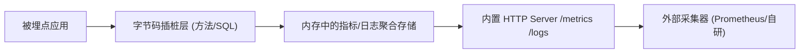
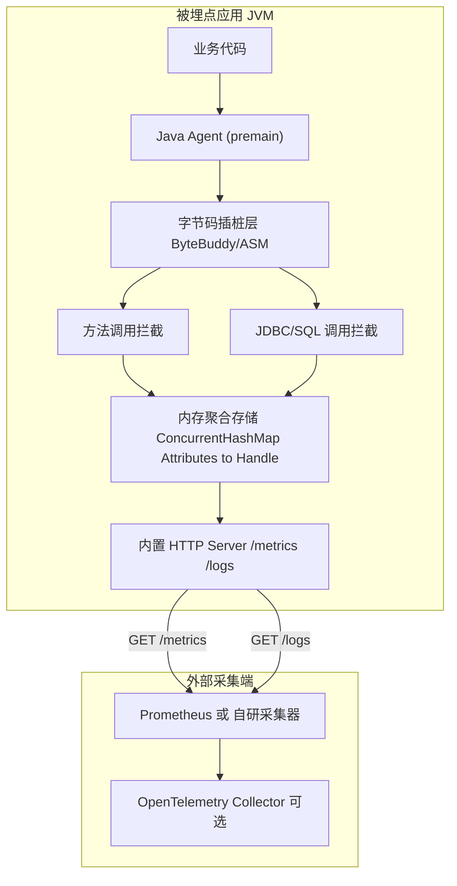

# DeepWiki Q&A with Code Context for Repository: open-telemetry/opentelemetry-java
## Q1
我现在在做一个java agent,一个在能够拥有opentelemetry同等收集指标数据,还能收集方法,sql调用指标数据.二是opentelemetry日志是主动推送,我想我的Java agent能够改为暴露拉取的.你帮我规划一下最小实现架构,以及哪些可以借鉴
### Answer
## 概述

你想做的其实是两件独立的事:(1) 一个能采集指标+方法调用+SQL调用的 Java Agent;(2) 把 OpenTelemetry 中"日志主动推送"的模式改造成"暴露端点、被动拉取"的模式。第二点在 `opentelemetry-java` 仓库里已经有一个非常对应的参考实现——`PrometheusHttpServer`,它就是把"推送式导出"改造成"拉取式导出"的范例。第一点(方法/SQL 埋点)属于字节码插桩范畴,不在 `opentelemetry-java`(SDK 仓库)里,而是在 `opentelemetry-java-instrumentation` 仓库,这部分我在当前上下文中没有看到代码,无法给出具体引用。

---

## 一、可直接借鉴:Push vs Pull 的架构模式

### 1. OTel 的两种导出模型

OTel Java SDK 里,`MetricReader` 是一个抽象接口,`PeriodicMetricReader` 和 `PrometheusHttpServer` 都实现了它,但行为完全不同:

- **Push 模型**:`PeriodicMetricReader` 定时收集数据,然后调用 `MetricExporter.export()` 主动推给后端(OTLP gRPC/HTTP 等)。
- **Pull 模型**:`PrometheusHttpServer` 不定时推送,而是启动一个内嵌 HTTP Server,当 Prometheus 来 `GET /metrics` 抓取时才触发收集 opentelemetry-java:11-34 。

这正是你想给日志模块做的改造——把"日志处理器主动推给 Collector"改成"暴露一个可拉取的端点"。`PrometheusHttpServer` 的整体设计可以直接照搬到你的日志/指标模块上:

- 内部持有一个 `HTTPServer`(可以换成 Jetty/内置 `HttpServer`),监听端口 opentelemetry-java:13-24 。
- 用 `PrometheusHttpServerBuilder` 一类的 Builder 模式暴露 host/port/executor 等配置项(参见 wiki 中的 `PrometheusHttpServerBuilder` 方法列表)。
- 实际数据抓取逻辑挂在 `CollectionRegistration`/`MetricReader` 接口上,当 HTTP 请求到来时才触发底层 `SdkMeterProvider` 做一次 collect,而不是定时任务。

集成测试 `CollectorIntegrationTest` 演示了这个拉模式如何与真正的 OTel Collector 对接——Collector 主动去 scrape `PrometheusHttpServer` 暴露的端口,而不是等 SDK 推数据过来 opentelemetry-java:72-86 。这与你想要"暴露拉取端点"的目标场景几乎一致,可以把这段测试当作端到端参考架构来读。

### 2. 数据聚合结构可以借鉴的点

`DefaultSynchronousMetricStorage.collect()` 中区分了 `MemoryMode.REUSABLE_DATA` 和 `IMMUTABLE_DATA` 两种内存管理策略,在高频拉取场景(如你的 Agent 被频繁 scrape)下,复用聚合器句柄能显著降低 GC 压力 opentelemetry-java:236-267 。如果你的日志/指标也做成"拉取时才聚合"的模式,建议同样支持这两种模式,尤其是当你的 Agent 挂载在生产环境高吞吐服务上时。

---

## 二、最小实现架构建议

结合以上借鉴点,一个最小可行架构大致是:



- **字节码插桩层**:premain + ByteBuddy/ASM 拦截方法调用和 JDBC (`java.sql.Statement#execute` 等) 调用,记录耗时、次数、异常等。这部分在 `opentelemetry-java`(当前仓库)里没有对应代码,它属于 `opentelemetry-java-instrumentation` 的范畴,我没有该仓库的上下文,无法给出具体引用,建议单独开一个 Devin 会话去分析那个仓库。
- **聚合存储**:借鉴 `DefaultSynchronousMetricStorage` 的 `AggregatorHandle` + `ConcurrentHashMap<Attributes, Handle>` 设计,按标签(方法名、SQL 语句指纹等)做维度聚合 opentelemetry-java:215-234 。
- **拉取端点**:直接照搬 `PrometheusHttpServer` 的实现思路——用 `com.sun.net.httpserver.HttpHandler` 起一个轻量 HTTP Server,当有请求到达时才触发一次 collect 并序列化输出 opentelemetry-java:13-33 。日志可以仿照同样套路,做一个 `/logs` 端点,把最近窗口内的日志缓冲区吐出去。

---

## Notes

- `opentelemetry-java` 只是 SDK/Exporter 层的实现,不包含"自动埋点方法调用/SQL调用"的字节码插桩逻辑;这部分逻辑实际存在于 `opentelemetry-java-instrumentation`(一个独立仓库),当前索引没有覆盖,若需要参考具体的 JDBC/方法插桩代码,建议单独开 Devin session 去查看那个仓库。
- `PrometheusHttpServer` 是目前上下文中唯一能直接对应"拉取模式"的现成实现,推荐重点参考;`PeriodicMetricReader`(推送模式)可以作为对照理解两者接口差异,但本次上下文未提供其源码细节,只在 wiki 摘要中出现。
- `docs/sdk-configuration-design.md` 中关于全局 SDK 单例、依赖注入的讨论,和你的问题关系不大,仅供参考,不作为主要依据。

Wiki pages you might want to explore:
- [Exporters (open-telemetry/opentelemetry-java)](/wiki/open-telemetry/opentelemetry-java#4)
- [Build and Release System (open-telemetry/opentelemetry-java)](/wiki/open-telemetry/opentelemetry-java#7)
### Citations
**File:** exporters/prometheus/src/main/java/io/opentelemetry/exporter/prometheus/PrometheusHttpServer.java (L11-34)
```java
package io.opentelemetry.exporter.prometheus;

import com.sun.net.httpserver.Authenticator;
import com.sun.net.httpserver.HttpHandler;
import io.opentelemetry.sdk.common.CompletableResultCode;
import io.opentelemetry.sdk.common.export.MemoryMode;
import io.opentelemetry.sdk.internal.DaemonThreadFactory;
import io.opentelemetry.sdk.metrics.Aggregation;
import io.opentelemetry.sdk.metrics.InstrumentType;
import io.opentelemetry.sdk.metrics.data.AggregationTemporality;
import io.opentelemetry.sdk.metrics.export.CollectionRegistration;
import io.opentelemetry.sdk.metrics.export.DefaultAggregationSelector;
import io.opentelemetry.sdk.metrics.export.MetricReader;
import io.prometheus.metrics.exporter.httpserver.HTTPServer;
import io.prometheus.metrics.model.registry.PrometheusRegistry;
import java.io.IOException;
import java.io.UncheckedIOException;
import java.net.InetSocketAddress;
import java.util.concurrent.ExecutorService;
import java.util.concurrent.LinkedBlockingQueue;
import java.util.concurrent.ThreadPoolExecutor;
import java.util.concurrent.TimeUnit;
import java.util.function.Predicate;
import javax.annotation.Nullable;
```
**File:** exporters/prometheus/src/test/java/io/opentelemetry/exporter/prometheus/CollectorIntegrationTest.java (L72-86)
```java
  @BeforeAll
  static void beforeAll() {
    PrometheusHttpServer prometheusHttpServer = PrometheusHttpServer.builder().setPort(0).build();
    prometheusPort = prometheusHttpServer.getAddress().getPort();
    resource = Resource.getDefault();
    meterProvider =
        SdkMeterProvider.builder()
            .setResource(resource)
            .registerMetricReader(prometheusHttpServer)
            .build();
    exposeHostPorts(prometheusPort);

    grpcServer = new OtlpGrpcServer();
    grpcServer.start();
    exposeHostPorts(grpcServer.httpPort());
```
**File:** sdk/metrics/src/main/java/io/opentelemetry/sdk/metrics/internal/state/DefaultSynchronousMetricStorage.java (L215-234)
```java
    ConcurrentHashMap<Attributes, AggregatorHandle<T, U>> aggregatorHandles;
    if (reset) {
      AggregatorHolder<T, U> holder = this.aggregatorHolder;
      this.aggregatorHolder =
          (memoryMode == REUSABLE_DATA)
              ? new AggregatorHolder<>(previousCollectionAggregatorHandles)
              : new AggregatorHolder<>();

      // Increment recordsInProgress by 1, which produces an odd number acting as a signal that
      // record operations should re-read the volatile this.aggregatorHolder.
      // Repeatedly grab recordsInProgress until it is <= 1, which signals all active record
      // operations are complete.
      int recordsInProgress = holder.activeRecordingThreads.addAndGet(1);
      while (recordsInProgress > 1) {
        recordsInProgress = holder.activeRecordingThreads.get();
      }
      aggregatorHandles = holder.aggregatorHandles;
    } else {
      aggregatorHandles = this.aggregatorHolder.aggregatorHandles;
    }
```
**File:** sdk/metrics/src/main/java/io/opentelemetry/sdk/metrics/internal/state/DefaultSynchronousMetricStorage.java (L236-267)
```java
    List<T> points;
    if (memoryMode == REUSABLE_DATA) {
      reusableResultList.clear();
      points = reusableResultList;
    } else {
      points = new ArrayList<>(aggregatorHandles.size());
    }

    // In DELTA aggregation temporality each Attributes is reset to 0
    // every time we perform a collection (by definition of DELTA).
    // In IMMUTABLE_DATA MemoryMode, this is accomplished by removing all aggregator handles
    // (into which the values are recorded) effectively starting from 0
    // for each recorded Attributes.
    // In REUSABLE_DATA MemoryMode, we strive for zero allocations. Since even removing
    // a key-value from a map and putting it again on next recording will cost an allocation,
    // we are keeping the aggregator handles in their map, and only reset their value once
    // we finish collecting the aggregated value from each one.
    // The SDK must adhere to keeping no more than maxCardinality unique Attributes in memory,
    // hence during collect(), when the map is at full capacity, we try to clear away unused
    // aggregator handles, so on next recording cycle using this map, there will be room for newly
    // recorded Attributes. This comes at the expanse of memory allocations. This can be avoided
    // if the user chooses to increase the maxCardinality.
    if (memoryMode == REUSABLE_DATA && reset) {
      if (aggregatorHandles.size() >= maxCardinality) {
        aggregatorHandles.forEach(
            (attribute, handle) -> {
              if (!handle.hasRecordedValues()) {
                aggregatorHandles.remove(attribute);
              }
            });
      }
    }
```
## Q2
画一下架构图用mermaid
### Answer
## 架构图



---

## 各节点对应参考实现

| 图中节点 | 建议参考 |
|---|---|
| `Agent` / `Instrumentation` | 不在 `opentelemetry-java` 仓库内,属于 `opentelemetry-java-instrumentation`,当前上下文未覆盖,建议单独分析该仓库 |
| `Storage`(聚合存储) | 参考 `DefaultSynchronousMetricStorage` 中 `ConcurrentHashMap<Attributes, AggregatorHandle<T, U>>` 的句柄复用设计 opentelemetry-java:215-234 ,以及 `REUSABLE_DATA` 模式下减少 GC 分配的收集逻辑 opentelemetry-java:236-267  |
| `PullServer`(拉取端点) | 直接对应 `PrometheusHttpServer`,它实现 `MetricReader` 接口,内部持有一个 `HTTPServer` 并在被抓取时才触发收集,而非定时推送 opentelemetry-java:36-48 ;构造函数里可以看到它如何绑定 host/port/executor/registry 来启动 HTTP 服务 opentelemetry-java:64-110  |
| `Scraper`/`Collector` | 端到端可参考 `CollectorIntegrationTest`,展示 Collector 主动去 scrape `PrometheusHttpServer` 暴露的端口这一"拉取"流程 opentelemetry-java:72-86  |
| 声明式配置层面的 Push vs Pull 二选一 | `MetricReaderFactory` 中可以看到 SDK 声明式配置本身就区分了 `PeriodicMetricReaderModel`(push)和 `PullMetricReaderModel`(pull,目前仅支持 prometheus) opentelemetry-java:38-52  |

## Notes

- `PullMetricReaderFactory` 目前硬编码只支持 `prometheusModel`,如果你要做自定义拉取协议(如 `/logs`),这段逻辑本身不能直接复用,只能作为设计思路参考,即"pull reader 是一种独立于 push exporter 的顶层类型" opentelemetry-java:88-122 。
- 方法/SQL 埋点(`Instrumentation`、`MethodHook`、`SqlHook`)在 `opentelemetry-java` 仓库中没有对应代码,图中这几个节点是概念性占位,并非本仓库已有实现。

Wiki pages you might want to explore:
- [Exporters (open-telemetry/opentelemetry-java)](/wiki/open-telemetry/opentelemetry-java#4)
- [Build and Release System (open-telemetry/opentelemetry-java)](/wiki/open-telemetry/opentelemetry-java#7)
### Citations
**File:** exporters/prometheus/src/main/java/io/opentelemetry/exporter/prometheus/PrometheusHttpServer.java (L36-48)
```java
/**
 * A {@link MetricReader} that starts an HTTP server that will collect metrics and serialize to
 * Prometheus text format on request.
 */
public final class PrometheusHttpServer implements MetricReader {

  private final PrometheusHttpServerBuilder builder;
  private final HTTPServer httpServer;
  private final PrometheusMetricReader prometheusMetricReader;
  private final PrometheusRegistry prometheusRegistry;
  private final String host;
  private final MemoryMode memoryMode;
  private final DefaultAggregationSelector defaultAggregationSelector;
```
**File:** exporters/prometheus/src/main/java/io/opentelemetry/exporter/prometheus/PrometheusHttpServer.java (L64-110)
```java
  PrometheusHttpServer(
      PrometheusHttpServerBuilder builder,
      String host,
      int port,
      @Nullable ExecutorService executor,
      PrometheusRegistry prometheusRegistry,
      boolean otelScopeEnabled,
      @Nullable Predicate<String> allowedResourceAttributesFilter,
      MemoryMode memoryMode,
      @Nullable HttpHandler defaultHandler,
      DefaultAggregationSelector defaultAggregationSelector,
      @Nullable Authenticator authenticator) {
    this.builder = builder;
    this.prometheusMetricReader =
        new PrometheusMetricReader(otelScopeEnabled, allowedResourceAttributesFilter);
    this.host = host;
    this.memoryMode = memoryMode;
    this.prometheusRegistry = prometheusRegistry;
    prometheusRegistry.register(prometheusMetricReader);
    // When memory mode is REUSABLE_DATA, concurrent reads lead to data corruption. To prevent this,
    // we configure prometheus with a single thread executor such that requests are handled
    // sequentially.
    if (memoryMode == MemoryMode.REUSABLE_DATA) {
      executor =
          new ThreadPoolExecutor(
              1,
              1,
              0L,
              TimeUnit.MILLISECONDS,
              new LinkedBlockingQueue<>(),
              new DaemonThreadFactory("prometheus-http-server"));
    }
    try {
      this.httpServer =
          HTTPServer.builder()
              .hostname(host)
              .port(port)
              .executorService(executor)
              .registry(prometheusRegistry)
              .defaultHandler(defaultHandler)
              .authenticator(authenticator)
              .buildAndStart();
    } catch (IOException e) {
      throw new UncheckedIOException("Could not create Prometheus HTTP server", e);
    }
    this.defaultAggregationSelector = defaultAggregationSelector;
  }
```
**File:** exporters/prometheus/src/test/java/io/opentelemetry/exporter/prometheus/CollectorIntegrationTest.java (L72-86)
```java
  @BeforeAll
  static void beforeAll() {
    PrometheusHttpServer prometheusHttpServer = PrometheusHttpServer.builder().setPort(0).build();
    prometheusPort = prometheusHttpServer.getAddress().getPort();
    resource = Resource.getDefault();
    meterProvider =
        SdkMeterProvider.builder()
            .setResource(resource)
            .registerMetricReader(prometheusHttpServer)
            .build();
    exposeHostPorts(prometheusPort);

    grpcServer = new OtlpGrpcServer();
    grpcServer.start();
    exposeHostPorts(grpcServer.httpPort());
```
**File:** sdk-extensions/incubator/src/main/java/io/opentelemetry/sdk/extension/incubator/fileconfig/MetricReaderFactory.java (L38-52)
```java
  @Override
  public MetricReaderAndCardinalityLimits create(
      MetricReaderModel model, SpiHelper spiHelper, List<Closeable> closeables) {
    PeriodicMetricReaderModel periodicModel = model.getPeriodic();
    if (periodicModel != null) {
      return PeriodicMetricReaderFactory.INSTANCE.create(periodicModel, spiHelper, closeables);
    }

    PullMetricReaderModel pullModel = model.getPull();
    if (pullModel != null) {
      return PullMetricReaderFactory.INSTANCE.create(pullModel, spiHelper, closeables);
    }

    throw new DeclarativeConfigException("reader must be set");
  }
```
**File:** sdk-extensions/incubator/src/main/java/io/opentelemetry/sdk/extension/incubator/fileconfig/MetricReaderFactory.java (L88-122)
```java
  private static class PullMetricReaderFactory
      implements Factory<PullMetricReaderModel, MetricReaderAndCardinalityLimits> {

    private static final PullMetricReaderFactory INSTANCE = new PullMetricReaderFactory();

    private PullMetricReaderFactory() {}

    @Override
    public MetricReaderAndCardinalityLimits create(
        PullMetricReaderModel model, SpiHelper spiHelper, List<Closeable> closeables) {
      PullMetricExporterModel exporterModel =
          requireNonNull(model.getExporter(), "pull metric reader exporter");

      ExperimentalPrometheusMetricExporterModel prometheusModel =
          exporterModel.getPrometheusDevelopment();

      if (prometheusModel != null) {
        MetricReader metricReader =
            FileConfigUtil.loadComponent(
                spiHelper, MetricReader.class, "prometheus", prometheusModel);
        CardinalityLimitSelector cardinalityLimitSelector = null;
        if (model.getCardinalityLimits() != null) {
          cardinalityLimitSelector =
              CardinalityLimitsFactory.getInstance()
                  .create(model.getCardinalityLimits(), spiHelper, closeables);
        }

        MetricReaderAndCardinalityLimits readerAndCardinalityLimits =
            MetricReaderAndCardinalityLimits.create(metricReader, cardinalityLimitSelector);
        return FileConfigUtil.addAndReturn(closeables, readerAndCardinalityLimits);
      }

      throw new DeclarativeConfigException(
          "prometheus is the only currently supported pull reader");
    }
```
