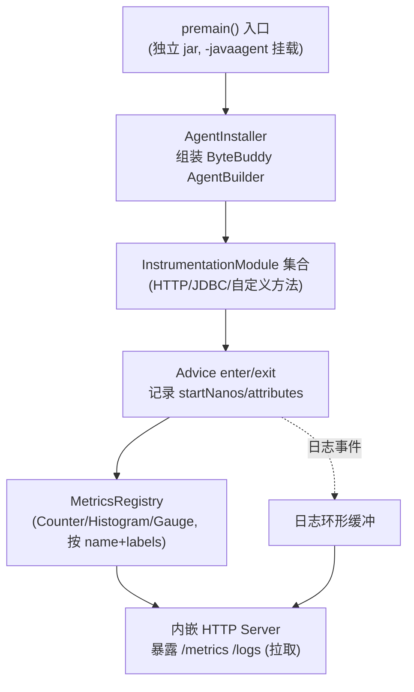

# 最小可行架构规划

## 1. 总体分层借鉴 OTel Agent 的类加载器隔离设计

OpenTelemetry Java Instrumentation 的 agent 从 `premain` 入口开始,严格按类加载器分层:系统类加载器只放一个入口类,Bootstrap 类加载器放全局可见的 API/桥接类,Agent 类加载器放 ByteBuddy + SDK + 所有 instrumentation 实现,Extension 类加载器隔离用户扩展。 [1](#0-0) [2](#0-1)

对于最小实现,不需要做到这么复杂的四层隔离,但至少要借鉴两条核心原则:
- **agent 自身依赖(ByteBuddy、指标注册表、HTTP server)要做 shading/relocate**,避免与被探测应用的依赖冲突,这也是 OTel 用 `inst/` 目录 + `.classdata` 后缀隐藏 agent 类的原因。 [3](#0-2)
- **premain 里做的事情要少而快**:只负责安装 `ClassFileTransformer`,真正的初始化和 SDK 启动异步/延迟完成。 [4](#0-3)

## 2. 字节码插桩层:借鉴 InstrumentationModule / TypeInstrumentation 模式

这是最值得直接照搬的设计。每个探测目标(HTTP client、JDBC、某个方法)都被建模为:
- 一个 `InstrumentationModule`(通过 `@AutoService`/`ServiceLoader` 注册,可插拔开关) [5](#0-4)
- 内部包含若干 `TypeInstrumentation`,每个声明 `typeMatcher()`(匹配哪些类)和 `transform()`(往哪些方法织入 Advice) [6](#0-5)
- Advice 用 ByteBuddy `@Advice.OnMethodEnter`/`@Advice.OnMethodExit` 写方法进入/退出的逻辑,通过 `Context`/`@Advice.Local` 或非 inline 模式下的返回值在 enter/exit 间传状态。 [7](#0-6)

对你的"方法调用指标"需求,这个模式可以直接套用:自定义一个通用的 `MethodMetricsInstrumentation`,`typeMatcher` 按配置文件(类名/包名/注解)匹配,Advice 记录耗时、调用次数、异常率。可以再借鉴 `CallDepth`(线程本地的调用深度计数器)避免递归调用时重复计数。 [8](#0-7)

`AgentInstaller` 里 ByteBuddy `AgentBuilder` 的组装方式(pool strategy、transform listener、location strategy 等)也值得参考,尤其是它对性能做的取舍(如用 `MethodGraph.Compiler.ForDeclaredMethods` 避免遍历整个类层次)。 [9](#0-8)

## 3. SQL 调用指标:借鉴 JDBC instrumentation + SQL 解析

JDBC 探测的思路是拦截 `java.sql.Statement`/`PreparedStatement` 的 `execute*` 方法 [10](#0-9) ,在 Advice 里通过 `JdbcSingletons.processSql()` 处理原始 SQL(脱敏/加 SQL comment),并用一个统一的 `Instrumenter` 记录 span 和指标。 [11](#0-10)

如果你要采集"SQL 调用指标数据"(比如按 SQL 操作类型/表名聚合的耗时、QPS),`SqlQueryAnalyzer`/`AutoSqlSanitizer`(用 JFlex 写的词法分析器)是现成可以借鉴甚至直接复用的组件——它能把 SQL 参数化(防止把具体参数值当作高基数标签)、提取操作类型(SELECT/INSERT/...)和主表名,同时做了缓存以避免重复解析开销。 [12](#0-11)  这个思路(而非自己写正则去解析 SQL)能省掉大量踩坑成本。

## 4. 指标模型:借鉴 Instrumenter API 的 OperationListener/OperationMetrics

OTel 的 `Instrumenter` 把"生成 span"和"记录指标"解耦为可插拔的 `OperationListener`:`onStart()` 拿到开始时间戳和属性,`onEnd()` 拿到结束时间戳和属性,计算 duration 后写入 histogram/counter。 [13](#0-12)  RPC 指标的实现是个很好的参考样例,展示了如何用 `Context` 在 onStart/onEnd 间传递状态并计算耗时。 [14](#0-13)

你的最小实现可以简化为:方法/SQL Advice 在 enter 记录 `startNanos`+属性,在 exit 调一个统一的 `MetricsRecorder.record(attributes, durationNanos, throwable)`,内部维护 histogram(耗时分布)、counter(调用次数)、按 label 分类。不需要一开始就实现完整的 `Instrumenter`/`SpanKind` 抽象,除非你也要做 tracing。

## 5. 关键差异点:push 改 pull —— 借鉴 Prometheus Exporter 的模式

OpenTelemetry 默认的 OTLP exporter 是主动推送(agent 周期性把 metrics/traces/logs POST 到 collector)。但 SDK 自带的 `otel.metrics.exporter=prometheus` 配置项就是一种"拉"模式:agent 内部启动一个 HTTP server,暴露 `/metrics` 端点,由 Prometheus 定时来拉。 [15](#0-14)  相关配置项(`otel.metrics.exporter`、`otel.exporter.otlp.*`等)在 spring-boot-autoconfigure 的配置元数据里也有列出,可以看到 push(otlp/console)和你要做的 pull 是并列的可插拔"exporter"概念。 [16](#0-15)

对你的 agent,把"改为暴露拉取"理解为:
1. Agent 内部不做定时上报线程,而是启动一个轻量 HTTP server(JDK 自带 `com.sun.net.httpserver.HttpServer` 即可,不需要引入 Jetty 这类重依赖,避免和应用冲突)。
2. `/metrics` 端点触发时才遍历所有已注册的 Meter/Counter/Histogram,序列化成 Prometheus text exposition format(或者自定义 JSON,取决于你的采集端是谁)返回。
3. 日志同理:与其像 OTel Log Appender 那样主动 export,可以改成一个环形缓冲区(ring buffer)存最近 N 条日志,暴露一个 `/logs` 拉取接口,或做增量游标(offset-based)拉取协议。

这一步完全不需要照抄 OTel SDK 的 exporter 接口(`MetricExporter`/`LogRecordExporter`),因为那套是为 push 语义设计的(`export(Collection<MetricData>)`然后立刻发走)。你只需要保留它的"数据模型"部分:Instrument 分类(Counter/UpDownCounter/Histogram)、Attributes 作为标签、Resource 作为服务级元数据,这些概念可以直接借鉴。

## 6. 建议的最小实现骨架



其中 `Modules` 里的 JDBC/方法探测部分直接借鉴上面提到的 `TypeInstrumentation` + Advice 模式和 `SqlQueryAnalyzer`;`Registry`+`HttpServer` 部分不借鉴 OTel SDK 的 push exporter,而是自研一个极简的、按拉取语义设计的内存指标存储 + HTTP handler。

## 需要注意的取舍

- 是否需要 Muzzle 安全检查(编译期校验探测代码与目标库版本兼容)取决于你要支持多少个库版本;最小实现阶段可以先跳过,后期库版本多了再引入。 [17](#0-16)
- 是否需要 indy(invokedynamic)非内联模式取决于你要不要支持给 advice 代码打断点调试、以及是否要用高版本 Java 语法写 advice;最小实现可以先用简单的 inline 模式。 [18](#0-17)

### Citations

**File:** docs/contributing/javaagent-structure.md (L1-20)
```markdown
# Javaagent structure

The javaagent can be logically divided into several parts, based on the class loader that contains
particular classes (and resources) in the runtime:

- The main agent class living in the system class loader.
- Classes that live in the bootstrap class loader.
- Classes that live in the agent class loader.
- Javaagent extensions, and the extension class loader(s).

## System class loader

The only class that is loaded by the system class loader is the
`io.opentelemetry.javaagent.OpenTelemetryAgent` class. This is the main class of the javaagent, it
implements the
[Java instrumentation agent specification](https://docs.oracle.com/javase/8/docs/api/java/lang/instrument/package-summary.html).
This class is loaded during application startup by the system class loader. Its sole
responsibility is to push the agent's classes into JVM's bootstrap class loader and immediately
delegate to the `io.opentelemetry.javaagent.bootstrap.AgentInitializer` class, living in the
bootstrap class loader.
```

**File:** docs/contributing/javaagent-structure.md (L60-90)
```markdown
## Agent class loader

The agent class loader contains almost everything else not mentioned before, including:

- **The `javaagent-tooling` module**:
  this module picks up the initialization process started by `OpenTelemetryAgent`
  and `javaagent-bootstrap` and actually finishes the work, starting up the OpenTelemetry SDK and
  building and installing the `ClassFileTransformer` in the JVM. The javaagent
  uses [ByteBuddy](https://bytebuddy.net) to configure and construct the `ClassFileTransformer`.
  This module is internal and its APIs are considered unstable.
- **The `muzzle` module**:
  it contains classes that are internally used by [muzzle](muzzle.md), our safety net feature. This
  module is internal and its APIs are considered unstable.
- **The `io.opentelemetry.javaagent.extension` package from the `javaagent-extension-api` module**:
  this package contains common extension points and SPIs that can be used to customize the agent
  behavior.
- All modules using the `otel.javaagent-instrumentation` Gradle plugin:
  these modules contain actual javaagent instrumentations. Almost all of them implement
  the `InstrumentationModule`, some of them include a library instrumentation as an `implementation`
  dependency. You can read more about writing instrumentations [here](writing-instrumentation.md).
  By convention, all these modules are named according to this
  pattern: `:instrumentation:...:javaagent`.
- The [OpenTelemetry SDK](https://github.com/open-telemetry/opentelemetry-java/tree/main/sdk/all),
  along with various exporters and SDK extensions.
- [ByteBuddy](https://bytebuddy.net).

Inside the javaagent jar, all classes and resources that are meant to be loaded by
the `AgentClassLoader` are placed inside the `inst/` directory. All Java class files have
the `.classdata` extension (instead of just `.class`) - this ensures that they will not be loaded by
general class loaders included with the application, making the javaagent internals completely
isolated from the application code.
```

**File:** docs/safety-mechanisms.md (L63-84)
```markdown
## Classloader separation

See more details about the class loader separation in [javaagent structure](./contributing/javaagent-structure.md).

The Java agent makes sure to include as little code as possible in the user app's class loader, and
all code that is included is either unique to the agent itself or shaded in the agent build. This is
because if the agent included classes that are also used by the user's app and there was a version
mismatch, it could cause linkage crashes.

Instead of executing code in the app's class loader, the agent has its own agent class loader where
instrumentation is loaded and exporters and the SDK is configured. Only when applying an
instrumentation (which will have passed Muzzle runtime checks) do we inject any additional classes
that are needed by the instrumentation into the user's class loader. These classes are always either
unique to the agent or shaded versions of public libraries such as our library instrumentation
modules and cannot cause version conflicts.

To ensure agent classes are not automatically loaded into the user's class loader, possibly by an
eager loading application server, they are hidden in the agent JAR as standard, non-Java files.
All packages are moved into a subdirectory `inst` and all classes are renamed from `.class` to
`.classdata`, ensuring applications with any sort of automatic classpath scanning will not find
agent classes. The agent class loader understands this convention and unobfuscates when loading
classes.
```

**File:** javaagent-tooling/src/main/java/io/opentelemetry/javaagent/tooling/AgentInstaller.java (L90-121)
```java
  public static void installBytebuddyAgent(Instrumentation inst, ClassLoader extensionClassLoader) {
    addByteBuddyRawSetting();

    Integer strictContextStressorMillis = Integer.getInteger(STRICT_CONTEXT_STRESSOR_MILLIS);
    if (strictContextStressorMillis != null) {
      ContextStorage.addWrapper(
          storage -> new StrictContextStressor(storage, strictContextStressorMillis));
    }

    logVersionInfo();
    if (EarlyInitAgentConfig.get().isEnabled()) {
      List<AgentListener> agentListeners = loadOrdered(AgentListener.class, extensionClassLoader);
      installBytebuddyAgent(inst, extensionClassLoader, agentListeners);
    } else {
      logger.fine("Agent is disabled, not installing instrumentations.");
    }
  }

  private static void installBytebuddyAgent(
      Instrumentation inst,
      ClassLoader extensionClassLoader,
      Iterable<AgentListener> agentListeners) {

    WeakRefAsyncOperationEndStrategies.initialize();
    EmbeddedInstrumentationProperties.setPropertiesLoader(extensionClassLoader);
    setDefineClassHandler();
    FieldBackedImplementationConfiguration.configure();
    // preload ThreadLocalRandom to avoid occasional
    // java.lang.ClassCircularityError: java/util/concurrent/ThreadLocalRandom
    // see https://github.com/raphw/byte-buddy/issues/1666 and
    // https://bugs.openjdk.org/browse/JDK-8164165
    ThreadLocalRandom.current();
```

**File:** javaagent-tooling/src/main/java/io/opentelemetry/javaagent/tooling/AgentInstaller.java (L123-138)
```java
    AgentBuilder agentBuilder =
        newAgentBuilder(
                // default method graph compiler inspects the class hierarchy, we don't need it, so
                // we use a simpler and faster strategy instead
                new ByteBuddy()
                    .with(MethodGraph.Compiler.ForDeclaredMethods.INSTANCE)
                    .with(VisibilityBridgeStrategy.Default.NEVER)
                    .with(InstrumentedType.Factory.Default.FROZEN))
            .with(AgentBuilder.TypeStrategy.Default.DECORATE)
            .disableClassFormatChanges()
            .with(AgentBuilder.RedefinitionStrategy.RETRANSFORMATION)
            .with(new RedefinitionDiscoveryStrategy())
            .with(AgentBuilder.DescriptionStrategy.Default.POOL_ONLY)
            .with(AgentTooling.poolStrategy())
            .with(AgentTooling.transformListener())
            .with(AgentTooling.locationStrategy());
```

**File:** docs/contributing/writing-instrumentation-module.md (L12-40)
```markdown
## The centerpiece of each javaagent instrumentation: `InstrumentationModule`

An `InstrumentationModule` describes a set of individual `TypeInstrumentation` that need to be
applied together to correctly instrument a specific library. Type instrumentations grouped in a
module share helper classes, [muzzle runtime checks](muzzle.md), and applicable class loader criteria,
and can only be enabled or disabled as a set.

The OpenTelemetry javaagent finds all modules by using Java's `ServiceLoader` API. To make your
instrumentation visible, make sure that a proper `META-INF/services/` file is present in
the javaagent jar. The easiest way to do it is using `@AutoService`:

```java

@AutoService(InstrumentationModule.class)
public class MyLibraryInstrumentationModule extends InstrumentationModule {
  // ...
}
```

An `InstrumentationModule` needs to have at least one name. The user of the javaagent can
[suppress a chosen instrumentation][suppress] by referring to it by one of
its names. The instrumentation module names use `kebab-case`. The main instrumentation name, which
is the first one, must be the same as the gradle module name, excluding the version suffix if present.

```java
public MyLibraryInstrumentationModule() {
  super("my-library", "my-library-1.0");
}
```
```

**File:** docs/contributing/writing-instrumentation-module.md (L301-329)
```markdown

```java
@Advice.OnMethodEnter(suppress = Throwable.class)
public static void onEnter(@Advice.Argument(1) Object request,
                           @Advice.Local("otelContext") Context context,
                           @Advice.Local("otelScope") Scope scope) {
  Context parentContext = Java8BytecodeBridge.currentContext();

  if (!instrumenter().shouldStart(parentContext, request)) {
    return;
  }

  context = instrumenter().start(parentContext, request);
  scope = context.makeCurrent();
}

@Advice.OnMethodExit(suppress = Throwable.class, onThrowable = Throwable.class)
public static void onExit(@Advice.Argument(1) Object request,
                          @Advice.Return Object response,
                          @Advice.Thrown Throwable exception,
                          @Advice.Local("otelContext") Context context,
                          @Advice.Local("otelScope") Scope scope) {
  if (scope == null) {
    return;
  }
  scope.close();
  instrumenter().end(context, request, response, exception);
}
```
```

**File:** docs/contributing/writing-instrumentation-module.md (L343-363)
```markdown
## Non-inlined instrumentation

The most common way to instrument code with ByteBuddy relies on inlining, this strategy will be
referred as "inlined" strategy as opposed to "non-inlined".

For inlined advices, the advice code is directly copied into the instrumented method.
In addition, all helper classes are injected into the classloader of the instrumented classes.

For indy, advice classes are not inlined. Instead, they are loaded alongside all helper classes
into a special `InstrumentationModuleClassloader`, which sees the classes from both the instrumented
application classloader and the agent classloader.
The instrumented classes call the advice classes residing in the `InstrumentationModuleClassloader` via
invokedynamic bytecode instructions.

Using indy instrumentation has these advantages:

- allows instrumentation to have breakpoints set in them and be debugged using standard debugging techniques.
- provides clean isolation of instrumentation advice from the application and other instrumentations
- allows advice classes to contain static fields and methods which can be accessed from the advice entry points - in fact generally good development practices are enabled (whereas inlined advices are [restricted in how they can be implemented](#inlined-instrumentation))
- advice classes have access to agent code so communicating between advice and agent does not need an api in boot loader
- advice classes code does not require to be compatible with instrumented class, for example we can call a static interface method in advice when instrumented class is compiled for Java 7 or older.
```

**File:** instrumentation/jdbc/javaagent/src/main/java/io/opentelemetry/javaagent/instrumentation/jdbc/StatementInstrumentation.java (L30-61)
```java
class StatementInstrumentation implements TypeInstrumentation {

  @Override
  public ElementMatcher<ClassLoader> classLoaderOptimization() {
    return hasClassesNamed("java.sql.Statement");
  }

  @Override
  public ElementMatcher<TypeDescription> typeMatcher() {
    // SQLite declares many Statement methods on JDBC3Statement, but only its JDBC4Statement
    // subclass implements java.sql.Statement.
    return implementsInterface(named("java.sql.Statement"))
        .or(named("org.sqlite.jdbc3.JDBC3Statement"));
  }

  @Override
  public void transform(TypeTransformer transformer) {
    transformer.applyAdviceToMethod(
        nameStartsWith("execute").and(takesArgument(0, String.class)).and(isPublic()),
        getClass().getName() + "$StatementAdvice");
    transformer.applyAdviceToMethod(
        named("addBatch").and(takesArgument(0, String.class)).and(isPublic()),
        getClass().getName() + "$AddBatchAdvice");
    transformer.applyAdviceToMethod(
        named("clearBatch").and(isPublic()), getClass().getName() + "$ClearBatchAdvice");
    transformer.applyAdviceToMethod(
        namedOneOf("executeBatch", "executeLargeBatch").and(takesNoArguments()).and(isPublic()),
        getClass().getName() + "$ExecuteBatchAdvice");
    transformer.applyAdviceToMethod(
        named("close").and(isPublic()).and(takesNoArguments()),
        getClass().getName() + "$CloseAdvice");
  }
```

**File:** instrumentation/jdbc/javaagent/src/main/java/io/opentelemetry/javaagent/instrumentation/jdbc/StatementInstrumentation.java (L64-82)
```java
  public static class StatementAdvice {

    @AssignReturned.ToArguments(@ToArgument(value = 0, index = 1))
    @Advice.OnMethodEnter(suppress = Throwable.class, inline = false)
    public static Object[] onEnter(@Advice.Argument(0) String sql, @Advice.This Object object) {
      if (!(object instanceof Statement)) {
        return new Object[] {null, sql};
      }
      Statement statement = (Statement) object;
      if (JdbcSingletons.isWrapper(statement, Statement.class)) {
        return new Object[] {null, sql};
      }

      String processedSql = JdbcSingletons.processSql(statement, sql, true);
      return new Object[] {
        JdbcAdviceScope.startStatement(CallDepth.forClass(Statement.class), sql, statement),
        processedSql
      };
    }
```

**File:** instrumentation/jdbc/javaagent/src/main/java/io/opentelemetry/javaagent/instrumentation/jdbc/JdbcSingletons.java (L31-76)
```java
public class JdbcSingletons {
  private static final Instrumenter<DbRequest, Void> statementInstrumenter;
  private static final Instrumenter<DbRequest, Void> transactionInstrumenter;
  private static final Instrumenter<DataSource, DbInfo> dataSourceInstrumenter =
      createDataSourceInstrumenter(GlobalOpenTelemetry.get(), true);
  private static final SqlCommenter sqlCommenter = configureSqlCommenter();
  private static final Cache<Class<?>, Boolean> wrapperClassCache = Cache.weak();
  public static final boolean CAPTURE_QUERY_PARAMETERS;

  static {
    AttributesExtractor<DbRequest, Void> servicePeerExtractor =
        ServicePeerAttributesExtractor.create(
            new JdbcAttributesGetter(), GlobalOpenTelemetry.get());

    CAPTURE_QUERY_PARAMETERS =
        DeclarativeConfigUtil.getInstrumentationConfig(GlobalOpenTelemetry.get(), "jdbc")
            .getBoolean("capture_query_parameters/development", false);

    statementInstrumenter =
        JdbcInstrumenterFactory.createStatementInstrumenter(
            GlobalOpenTelemetry.get(),
            singletonList(servicePeerExtractor),
            true,
            DbConfig.isQuerySanitizationEnabled(GlobalOpenTelemetry.get(), "jdbc"),
            CAPTURE_QUERY_PARAMETERS);

    transactionInstrumenter =
        JdbcInstrumenterFactory.createTransactionInstrumenter(
            GlobalOpenTelemetry.get(),
            singletonList(servicePeerExtractor),
            DeclarativeConfigUtil.getInstrumentationConfig(GlobalOpenTelemetry.get(), "jdbc")
                .get("transaction/development")
                .getBoolean("enabled", false));
  }

  public static Instrumenter<DbRequest, Void> transactionInstrumenter() {
    return transactionInstrumenter;
  }

  public static Instrumenter<DbRequest, Void> statementInstrumenter() {
    return statementInstrumenter;
  }

  public static Instrumenter<DataSource, DbInfo> dataSourceInstrumenter() {
    return dataSourceInstrumenter;
  }
```

**File:** instrumentation-api-incubator/src/main/java/io/opentelemetry/instrumentation/api/incubator/semconv/db/SqlQueryAnalyzer.java (L16-57)
```java
/**
 * This class is responsible for masking potentially sensitive parameters in SQL (and SQL-like)
 * statements and queries.
 */
public final class SqlQueryAnalyzer {
  private static final SupportabilityMetrics supportability = SupportabilityMetrics.instance();

  private static final Cache<CacheKey, SqlQuery> sqlToQueryCache = Cache.bounded(1000);
  private static final Cache<CacheKey, SqlQuery> sqlToQueryCacheWithSummary = Cache.bounded(1000);
  private static final int LARGE_QUERY_THRESHOLD = 10 * 1024;

  public static SqlQueryAnalyzer create(boolean querySanitizationEnabled) {
    return new SqlQueryAnalyzer(querySanitizationEnabled);
  }

  private final boolean querySanitizationEnabled;

  private SqlQueryAnalyzer(boolean querySanitizationEnabled) {
    this.querySanitizationEnabled = querySanitizationEnabled;
  }

  public SqlQuery analyze(@Nullable String query, SqlDialect dialect) {
    if (SemconvStability.v3Preview()) {
      return analyzeWithSummary(query, dialect);
    }
    if (!querySanitizationEnabled || query == null) {
      return SqlQuery.create(query, null, null);
    }
    // sanitization result will not be cached for queries larger than the threshold to avoid
    // cache growing too large
    // https://github.com/open-telemetry/opentelemetry-java-instrumentation/issues/13180
    if (query.length() > LARGE_QUERY_THRESHOLD) {
      return analyzeImpl(query, dialect);
    }
    return sqlToQueryCache.computeIfAbsent(
        CacheKey.create(query, dialect), k -> analyzeImpl(query, dialect));
  }

  private static SqlQuery analyzeImpl(String query, SqlDialect dialect) {
    supportability.incrementCounter(SQL_SANITIZER_CACHE_MISS);
    return AutoSqlSanitizer.sanitize(query, dialect);
  }
```

**File:** instrumentation-api/src/main/java/io/opentelemetry/instrumentation/api/instrumenter/InstrumenterBuilder.java (L338-362)
```java
  List<OperationListener> buildOperationListeners() {
    // just copy the listeners list if there are no metrics registered
    if (operationMetrics.isEmpty()) {
      return new ArrayList<>(operationListeners);
    }

    List<OperationListener> listeners =
        new ArrayList<>(operationListeners.size() + operationMetrics.size());
    listeners.addAll(operationListeners);

    MeterBuilder meterBuilder = openTelemetry.getMeterProvider().meterBuilder(instrumentationName);
    if (instrumentationVersion != null) {
      meterBuilder.setInstrumentationVersion(instrumentationVersion);
    }
    String schemaUrl = getSchemaUrl();
    if (schemaUrl != null) {
      meterBuilder.setSchemaUrl(schemaUrl);
    }
    Meter meter = meterBuilder.build();
    for (OperationMetrics factory : operationMetrics) {
      listeners.add(factory.create(meter));
    }

    return listeners;
  }
```

**File:** instrumentation-api-incubator/src/main/java/io/opentelemetry/instrumentation/api/incubator/semconv/rpc/RpcClientMetrics.java (L111-153)
```java
  @Override
  public Context onStart(Context context, Attributes startAttributes, long startNanos) {
    return context.with(
        RPC_CLIENT_REQUEST_METRICS_STATE,
        new AutoValue_RpcClientMetrics_State(
            startAttributes, startNanos, context.get(OLD_RPC_METHOD_CONTEXT_KEY)));
  }

  @Override
  public void onEnd(Context context, Attributes endAttributes, long endNanos) {
    State state = context.get(RPC_CLIENT_REQUEST_METRICS_STATE);
    if (state == null) {
      logger.log(
          FINE,
          "No state present when ending context {0}. Cannot record RPC request metrics.",
          context);
      return;
    }
    Attributes attributes = state.startAttributes().toBuilder().putAll(endAttributes).build();
    double durationNanos = endNanos - state.startTimeNanos();

    if (emitOldRpcSemconv()) {
      Attributes oldAttributes = getOldAttributes(attributes, state);

      if (oldClientDurationHistogram != null) {
        oldClientDurationHistogram.record(durationNanos / NANOS_PER_MS, oldAttributes, context);
      }

      Long rpcClientRequestBodySize = attributes.get(RpcSizeAttributesExtractor.RPC_REQUEST_SIZE);
      if (oldClientRequestSize != null && rpcClientRequestBodySize != null) {
        oldClientRequestSize.record(rpcClientRequestBodySize, oldAttributes, context);
      }

      Long rpcClientResponseBodySize = attributes.get(RpcSizeAttributesExtractor.RPC_RESPONSE_SIZE);
      if (oldClientResponseSize != null && rpcClientResponseBodySize != null) {
        oldClientResponseSize.record(rpcClientResponseBodySize, oldAttributes, context);
      }
    }

    if (stableClientDurationHistogram != null) {
      stableClientDurationHistogram.record(durationNanos / NANOS_PER_S, attributes, context);
    }
  }
```

**File:** smoke-tests/src/test/java/io/opentelemetry/smoketest/PrometheusSmokeTest.java (L20-41)
```java
  @Override
  protected void configure(SmokeTestOptions<Integer> options) {
    options
        .springBoot()
        .env("OTEL_METRICS_EXPORTER", "prometheus")
        .env("OTEL_EXPORTER_PROMETHEUS_HOST", "0.0.0.0")
        .env("OTEL_EXPORTER_PROMETHEUS_PORT", String.valueOf(PROMETHEUS_PORT))
        .extraPorts(PROMETHEUS_PORT);
  }

  @ParameterizedTest
  // restore after image update
  // @ValueSource(ints = {8, 11, 17, 21, 25})
  @ValueSource(ints = {8, 21, 25})
  void shouldExportMetrics(int jdk) {
    start(jdk);
    client().get("/greeting").aggregate().join();

    WebClient prometheusClient = WebClient.of("h1c://localhost:" + getMappedPort(PROMETHEUS_PORT));
    String prometheusData = prometheusClient.get("/metrics").aggregate().join().contentUtf8();

    assertThat(prometheusData).contains("jvm_memory_used");
```

**File:** instrumentation/spring/spring-boot-autoconfigure/src/main/resources/META-INF/additional-spring-configuration-metadata.json (L806-823)
```json
    },
    {
      "name": "otel.metrics.exporter",
      "values": [
        {
          "value": "console",
          "description": "The console exporter prints exported metrics to stdout. It's mainly used for testing and debugging."
        },
        {
          "value": "none",
          "description": "No autoconfigured exporter."
        },
        {
          "value": "otlp",
          "description": "OpenTelemetry Protocol (OTLP) exporter."
        }
      ]
    },
```
