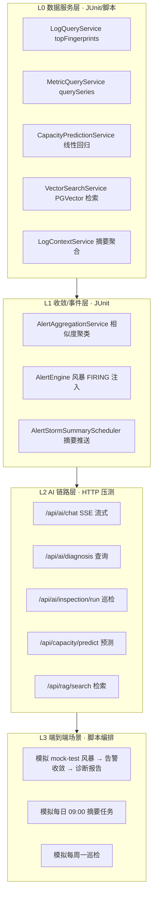
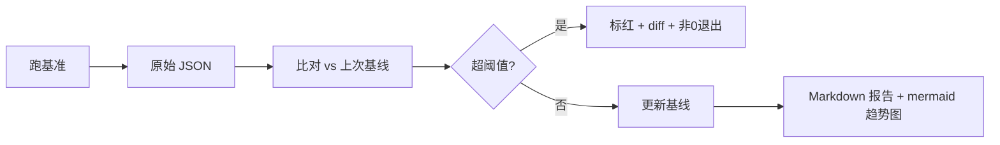
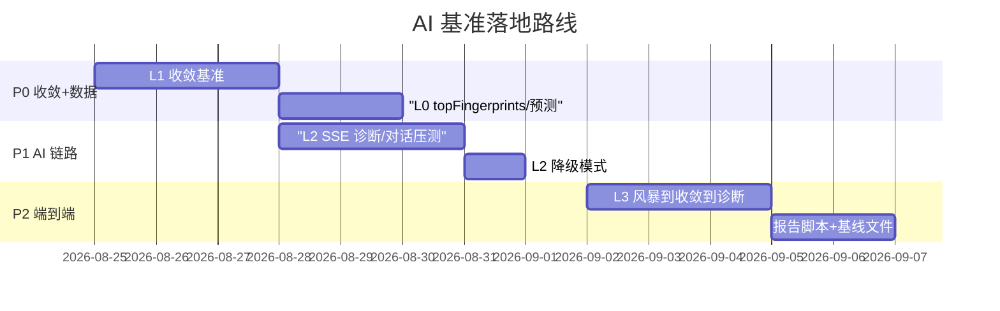

# spring-watch AI 模块基准测试设计方案

> 范围:`ai` 模块(P0 告警诊断 / P1 告警收敛+日志摘要 / P2 容量预测+RAG / P3 巡检 / SOP+MCP)
> 目标:给 **AI 链路 + 告警收敛 + 数据检索** 建立可量化、可回归、可持续观测的基准,防止
> 新增能力在数据量放大 / 告警风暴 / LLM 抖动下退化。
> 说明:本方案是"设计文档",基准用例给出目标函数、输入规模、指标与阈值;落地时按 P0/P1/P2 分批实现。

## 1. 背景与目标

AI 模块已完成 P0~P3 + 远期功能,但**没有任何性能基线**。新增能力全部依赖底层
InfluxDB(指标/日志)与 PostgreSQL(会话/诊断/向量),存在两类核心风险:

1. **LLM 链路抖动**:诊断/对话/巡检/摘要均调用远端 LLM,失败率与延迟直接决定
   "30s 出报告"的 SLA 能否守住;降级路径是否按设计触发需要可观测。
2. **风暴放大**:告警收敛、日志摘要、RAG 回灌在告警风暴/大数据量下的 CPU 与
   数据库压力无基线,无法证明"收敛真的收敛了"。

目标:

- 为 AI 各能力建立**端到端延迟 / 吞吐 / 降级触发率**基线(LLM 可 mock 或直连可控模型);
- 为**告警收敛**建立"抑制率 / 首报延迟 / 风暴摘要推送成功率"基线;
- 为 **RAG 检索 / 容量预测 / 日志摘要**建立 InfluxDB + PGVector 查询延迟基线;
- 全部指标输出 JSON + Markdown 报告,可进 CI 做趋势与阈值校验。

## 2. 基准分层



## 3. 工具选型

| 层 | 工具 | 理由 |
|---|---|---|
| L0 | JUnit 5 + 计时断言 / 独立 runner | 复用现有测试框架,直连 QueryService,无 HTTP 开销 |
| L1 | JUnit 5 + Caffeine 状态注入 | 直接构造 AlertRule/MetricEvent,可控风暴波形 |
| L2 | k6(或 Apache Bench) | SSE 流式 + JSON 接口压测,`stream` 模式可测 SSE 首字延迟 |
| L3 | Shell/Node 编排脚本 | 启动 mock-test 风暴 → 观察收敛 → 拉诊断报告,端到端验证 |
| 报告 | Node 脚本汇总 | JSON → Markdown 表格 + mermaid 趋势图(沿用前端基准思路) |

> 依赖新增:k6(可选)、Node 内置脚本(无新后端依赖)。LLM 降级测试用 `AI_API_KEY=sk-xxx`(无效 key)触发。

## 4. 造数与输入可控

基准最忌依赖真实时序抖动。统一造数:

- **指标**:mock-test `steady` 模拟器已按 `batch-min/max + jdbc/http/error-ratio` 产生
  `springboot_metrics`;加大 `batch-max` / 缩短 `interval-ms` 即可放大数据量。
- **日志风暴**:`mock-test` `LogBurstSimulator` 已提供 `error-burst`(60 条/180s)与
  `continuous-error`(持续错误流)两种波形;`warn-count` 调大模拟 WARN 风暴。
- **告警风暴**:注入 N 条同 appid + 同 metric 的 FIRING 事件,验证收敛组只首报通知。
- **RAG**:预置 白皮书切片 N 条(100/500/2000),查同语义问题验证召回延迟与相似度分布。

| 档位 | 说明 | 规模 |
|---|---|---|
| S | 单应用 · 1 指标 · 100 条 ERROR | 1 app / 10 app 规则 |
| M | 5 应用 · 每应用 5 指标 · 500 条 ERROR | 5 app / 50 规则 |
| L | 20 应用 · 每应用 10 指标 · 5000 条 ERROR | 20 app / 200 规则 |
| XL | 100 应用风暴 · 全部规则同时 FIRING | 100 app / 500 规则 |

## 5. L0 数据服务层基准用例

指标:`单次耗时 p50/p95`、`ops/s`、`返回行数`。基准 = 直接调用 Service(不带 HTTP)。

| ID | 被测函数 | 输入规模 | 关注指标 | 建议基线(首跑后校准) |
|---|---|---|---|---|
| L0-01 | `LogQueryService.topFingerprints` | S/M/L 档 ERROR | 耗时 | L 档 < 300ms |
| L0-02 | `MetricQueryService.querySeries` | 24h@5m 降采样 | 耗时 | < 200ms |
| L0-03 | `CapacityPredictionService.predict` 线性回归 | 30 点 | 耗时 | < 20ms(不含 LLM) |
| L0-04 | `VectorSearchService.search` | 100/500/2000 切片 | 耗时 | 2000 条 < 100ms |
| L0-05 | `LogContextService.summarizeAll` | 20 app × top10 | 耗时 | < 2s(含 InfluxDB 查询) |
| L0-06 | `DiagnosisReportService.buildEvidence` | L 档窗口 | 耗时 | < 2s(不含 LLM) |

> 关键:LLM 调用与数据服务分离测量。`predict`/`buildEvidence` 先测数据部分,再单独测 LLM 段。

## 6. L1 收敛/事件层基准用例

核心验证:**风暴期只通知首报,其余抑制,风暴摘要按阈值推送**。

| ID | 场景 | 输入 | 关注指标 | 建议基线 |
|---|---|---|---|---|
| L1-01 | 同类收敛 | 同 key 连续 10 次 FIRING | 首报=1 / 抑制=9 / 组count=10 | 抑制率 100% |
| L1-02 | 跨规则收敛 | 同 appid 不同 metric 各 5 次 | 组数=2,每组成员 5 | 组数正确 |
| L1-03 | 静默窗口过期 | 同 key,间隔 > 5min | 重新成为首报 | 窗口生效 |
| L1-04 | 风暴摘要 | 抑制数 ≥ min-storm-count(3) | 摘要推送次数 | 每组 1 次 |
| L1-05 | 并发安全 | 同 key 100 并发 FIRING | 组count 精确 100,无重复组ID | 无并发错乱 |
| L1-06 | 收敛落库 | 收敛后 alert_history 字段 | agg_role/agg_suppressed 正确 | 字段齐全 |

> L1 直接调用 `AlertAggregationService.decide` 与 `AlertLifecycleService.fire`,用
> `AlertTriggeredEvent` 计数验证诊断事件只在首报触发。

## 7. L2 AI 链路层基准用例

HTTP 压测(LLM 直连可控模型,或 `AI_API_KEY=sk-xxx` 降级模式两种跑法):

| ID | 接口 | 负载 | 指标 | 建议基线 |
|---|---|---|---|---|
| L2-01 | `POST /api/ai/chat`(SSE) | 10 并发 × 5 轮 | 首字延迟 / 完整耗时 / 降级率 | 首字 < 2s |
| L2-02 | `GET /api/ai/diagnosis?appid=` | 100 请求 | p95 耗时 | < 300ms(纯查询) |
| L2-03 | `POST /api/ai/inspection/run` | 单次(LLM 长输出) | 完成耗时 / 降级率 | < 60s |
| L2-04 | `GET /api/capacity/predict` | 100 请求(LLM 关) | p95 耗时 | < 200ms |
| L2-05 | `GET /api/rag/search?q=` | 500 请求 | p95 耗时 / 命中率 | < 100ms |
| L2-06 | LLM 降级 | 全部接口无效 key | 降级触发率 / 返回结构 | 100% 降级不抛错 |

> SSE 首字延迟:k6 用 `stream: true` 或自定义脚本读第一 chunk 计时。

## 8. L3 端到端场景

| ID | 场景 | 步骤 | 指标 |
|---|---|---|---|
| L3-01 | 风暴→收敛→诊断 | mock-test 触发 error-burst → 告警 FIRING → 收敛抑制 → 诊断报告落库 | 收敛抑制率、诊断报告 status、30s SLA |
| L3-02 | 每日摘要 | 手动触发 `DailyLogSummaryScheduler` | 摘要生成耗时、system_push 落库成功 |
| L3-03 | 每周巡检 | `POST /api/ai/inspection/run` | 报告长度、system_push 落库 |
| L3-04 | RAG 回灌 | 生成 N 诊断报告后查同问题 | 检索命中数 / 相似度提升 |

## 9. 报告与趋势



- 基线文件:`bench/.baseline.json`(按用例 ID 存 p50/p95);
- 报告:`docs/bench-reports/{date}-ai.md`(汇总表 + 趋势图);
- 判定:单用例 p95 超基线 +30% 或连续 3 次超 +20% 判失败;
- 抖动处理:每用例 warmup + 多次采样取中位数。

## 10. 目录结构与运行

```
scripts/bench/
├── fixtures/            # 造数:注入规则/切片/事件
│   ├── seed-rag.mjs     # RAG 切片造数
│   └── storm-burst.mjs  # 告警风暴注入
├── l0-data/             # L0 数据服务基准(JUnit or 独立 runner)
├── l1-converge/         # L1 收敛基准
├── l2-http/             # k6 脚本
├── l3-e2e/              # 端到端编排脚本
└── runner/report.mjs    # JSON → Markdown + 阈值判定
```

```jsonc
// package.json(前端/脚本)追加
{
  "bench:ai": "node scripts/bench/l0 && node scripts/bench/l1 && k6 run scripts/bench/l2 && node scripts/bench/l3 && node scripts/bench/runner/report.mjs"
}
```

## 11. 优先实现路线



- **P0**(必做):L1 收敛正确性 + L0 数据服务延迟,先锁住"收敛不崩 + 查询不慢";
- **P1**:L2 AI 链路压测(SSE 首字 / 诊断 p95 / 降级),守 30s SLA;
- **P2**:L3 端到端编排 + 报告脚本接入 CI。

## 12. 风险与局限

- **LLM 抖动**:远端 LLM 延迟方差大,基准须分"数据段 vs LLM 段",LLM 段用固定模型+固定 prompt 且跑两遍取最低;
- **降级路径**:无效 key 测试只验证"不抛错",不验证 LLM 可用时的质量;质量基准建议用固定样例人工抽查;
- **收敛语义**:同 key 定义为 appid+ruleType+metric/fingerprint,若业务期望更细粒度需在 L1 补充用例;
- **PGVector 维度**:embedding 维度与 HNSW 索引强绑定,换模型需重建索引,基准前固定模型;
- **未覆盖**:MCP Server 吞吐、SOP 定时任务长跑稳定性(可后续加)。

任务已完成!kxj