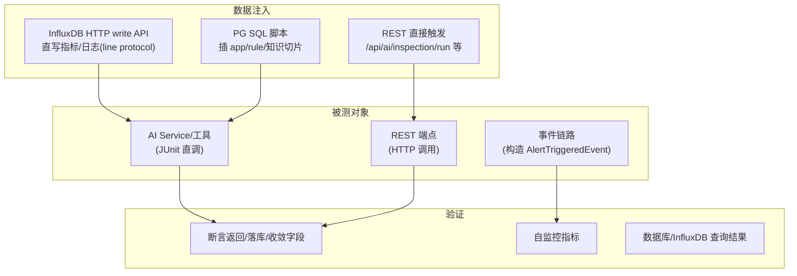
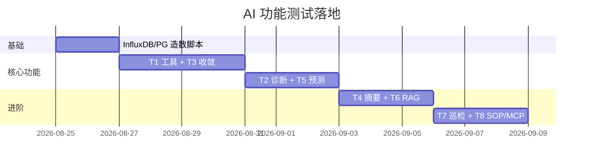

# spring-watch AI 模块功能清单与测试设计

> 范围:AI 模块已落地功能(P0 诊断 / P1 收敛+摘要 / P2 预测+RAG / P3 巡检 / SOP+MCP)
> 目的:先捋清"AI 增强了什么",再针对每个功能设计**不依赖 mock-test** 的测试。
> 测试数据注入原则:通过 spring-watch 自身链路(InfluxDB write API / PG SQL / REST 触发)造数,
> 不启动任何外部模拟应用。

---

## 一、AI 模块功能总览

```mermaid
flowchart LR
    subgraph F0["P0 对话与诊断"]
        A1["SSE 流式对话<br/>(/api/ai/chat)"]
        A2["4 个只读工具<br/>(App/Metric/Log/Alert)"]
        A3["告警智能诊断<br/>(/api/ai/diagnosis)"]
    end
    subgraph F1["P1 收敛与摘要"]
        B1["告警收敛<br/>(AlertAggregationService)"]
        B2["每日日志摘要<br/>(DailyLogSummaryScheduler)"]
    end
    subgraph F2["P2 预测与知识"]
        C1["容量预测<br/>(/api/capacity)"]
        C2["RAG 知识库<br/>(/api/rag)"]
    end
    subgraph F3["P3 巡检"]
        D1["全应用自动巡检<br/>(/api/ai/inspection)"]
    end
    subgraph F4["远期 SOP/MCP"]
        E1["SOP 技能引擎<br/>(/api/sop)"]
        E2["MCP Server<br/>(/mcp)"]
    end
    F0 --> F1 --> F2 --> F3
    F3 -.-> F4
```



---

## 二、功能清单(逐项)

### 2.1 对话与工具(P0)

| # | 功能 | 入口 | 关键实现 |
|---|---|---|---|
| F1 | SSE 流式对话 | `POST /api/ai/chat` | `AiChatService.chat()`:会话持久化 + 最近12条上下文 + 失败降级 |
| F2 | 会话管理 | `POST/GET /api/ai/conversations`、`GET /messages` | `ChatConversation/ChatMessage` |
| F3 | 应用查询工具 | `AppQueryTool` @Tool | `listApps/getApp`(只读) |
| F4 | 指标查询工具 | `MetricQueryTool` @Tool | `latest/series/listAvailable` |
| F5 | 日志查询工具 | `LogQueryTool` @Tool | `search/topFingerprints/errorRateSeries/fingerprintDetail` |
| F6 | 告警查询工具 | `AlertQueryTool` @Tool | `listRules/listHistory` |

### 2.2 告警智能诊断(P0)

| # | 功能 | 入口 | 关键实现 |
|---|---|---|---|
| F7 | 告警诊断 | FIRING 事件 → `AlertDiagnosisTrigger` | `DiagnosisReportService`:30min 指标窗口 + 日志指纹 Top10 + 四段式报告 + 降级落库 |
| F8 | 诊断报告查询 | `GET /api/ai/diagnosis?appid=` | 按 appid 分页 |
| F9 | 诊断并发/冷却 | `AlertDiagnosisTrigger` | 同 app 5min 冷却 + 并发限 2 |

### 2.3 告警收敛(P1)

| # | 功能 | 入口 | 关键实现 |
|---|---|---|---|
| F10 | 相似告警聚类 | `AlertLifecycleService.fire()` 内调用 | `AlertAggregationService.decide()`:appid+ruleType+metric/fingerprint 指纹,5min 窗口分组 |
| F11 | 风暴抑制 | fire() 首报/静默 | leader 通知+诊断;member 抑制,只落库标注 |
| F12 | 风暴摘要推送 | `AlertStormSummaryScheduler` | 抑制数≥阈值推邮件汇总 |
| F13 | 收敛组落库/展示 | `AlertHistory` 收敛字段 + 前端 | `agg_group_id/role/suppressed/count` |

### 2.4 日志智能摘要(P1)

| # | 功能 | 入口 | 关键实现 |
|---|---|---|---|
| F14 | 每日错误摘要 | `DailyLogSummaryScheduler`(cron 09:00) | `LogContextService.summarizeAll()` 聚合各 app ERROR 指纹 |
| F15 | 摘要落库 | system_push 消息 | 写 `chat_message(role=system_push)`,前端可查 |

### 2.5 容量预测(P2)

| # | 功能 | 入口 | 关键实现 |
|---|---|---|---|
| F16 | 趋势预测 | `GET /api/capacity/predict?appid=&metric=&horizon=` | `CapacityPredictionService`:metrics_5m 线性回归 + 场景/风险判定 |
| F17 | 预测解释 | 同上(LLM 可选) | LLM 仅解释,失败降级统计摘要 |
| F18 | 历史预测 | `GET /api/capacity/history` | 落库 `capacity_prediction` |

### 2.6 RAG 知识库(P2)

| # | 功能 | 入口 | 关键实现 |
|---|---|---|---|
| F19 | 文档切片入库 | `POST /api/rag/ingest` | `DocEmbeddingService`:500字符切片+重叠50,embedding 远端 API |
| F20 | 相似检索 | `GET /api/rag/search?q=` | `VectorSearchService`:PGVector 余弦检索(native SQL) |
| F21 | 诊断报告回灌 | 诊断落库后自动 | 异步入 knowledge_chunk,越用越准 |

### 2.7 自动巡检(P3)

| # | 功能 | 入口 | 关键实现 |
|---|---|---|---|
| F22 | 全应用巡检 | `POST /api/ai/inspection/run`、cron 周一08:00 | `HealthInspectionService`:指标+日志+RAG → LLM 报告 |
| F23 | 巡检推送 | system_push | 写 chat_message("自动巡检"会话) |

### 2.8 SOP 技能与 MCP(远期)

| # | 功能 | 入口 | 关键实现 |
|---|---|---|---|
| F24 | 技能执行 | `POST /api/sop/run` | `SopEngine`:daily_report / error_surge_diagnosis / jvm_oom_diagnosis |
| F25 | 定时巡检表 | `POST /api/sop/schedule` | `sop_schedule` 表,cron 计算下次执行 |
| F26 | MCP Server | `/mcp`(SSE) | `spring-ai-starter-mcp-server-webmvc` 暴露 4 工具 |

---

## 三、测试设计总原则(不依赖 mock-test)



- **造数不走 mock-test**:指标/日志用 `curl POST http://influxdb:8086/api/v2/write?bucket=...&org=...` 直写(line protocol);
- **告警链路可独立触发**:构造 `AlertTriggeredEvent` 直接调 `AlertDiagnosisTrigger`(JUnit),或写指标触发规则评估;
- **LLM 可控**:测试分"LLM 直连"与"降级(`AI_API_KEY=sk-xxx`)"两态;
- **验证可断言**:每个功能都有可观测落库(alert_history / diagnosis_report / capacity_prediction / knowledge_chunk / chat_message / sop_schedule)。

---

## 四、功能 → 测试用例映射

| 功能 | 测试层 | 用例组 |
|---|---|---|
| F1~F6 对话/工具 | JUnit + HTTP | T1 对话与工具 |
| F7~F9 诊断 | JUnit 事件 + HTTP | T2 告警诊断 |
| F10~F13 收敛 | JUnit 状态机 + HTTP | T3 告警收敛 |
| F14~F15 摘要 | JUnit 定时器 + DB 断言 | T4 日志摘要 |
| F16~F18 预测 | JUnit Service + HTTP | T5 容量预测 |
| F19~F21 RAG | JUnit Service + HTTP | T6 RAG 知识库 |
| F22~F23 巡检 | HTTP + DB 断言 | T7 自动巡检 |
| F24~F26 SOP/MCP | HTTP + JUnit | T8 SOP 与 MCP |

---

## 五、T1 对话与工具测试

数据注入:PG SQL 插 2 个 app + 若干规则;InfluxDB 直写指标/日志。

| ID | 场景 | 步骤 | 断言 |
|---|---|---|---|
| T1-01 | 新建会话 | `POST /api/ai/conversations` | 返回 id,`chat_conversation` 有记录 |
| T1-02 | SSE 对话(降级态) | `POST /api/ai/chat` body={message:"查一下 app-1 过去1小时错误率"} | SSE 流返回,不以异常结束;user/assistant 消息落库 |
| T1-03 | 工具 AppQueryTool | 直调 `appQueryTool.listApps(null,20)` | JSON 含 count/rows,rows 含注册 app |
| T1-04 | 工具 MetricQueryTool | 直调 `latest(appid,"jvm_memory_used_bytes",null)` | JSON 含 rows,值来自 InfluxDB 直写数据 |
| T1-05 | 工具 LogQueryTool | 直调 `topFingerprints(appid,..,10,"ERROR")` | 指纹数与 InfluxDB 直写 ERROR 数一致 |
| T1-06 | 工具 AlertQueryTool | 直调 `listHistory(appid,null,20)` | rows 含 FIRING 记录 |
| T1-07 | 对话历史组装 | 连发 15 条消息 | 上下文只取最近 12 条(查 service 逻辑) |
| T1-08 | 消息空校验 | `POST /api/ai/chat` body={message:""} | 返回"消息不能为空",不落库 |

> 降级态测试:环境 `AI_API_KEY=sk-xxx`(无效 key),验证 `doOnError` → 落库"诊断失败..."不抛错。

---

## 六、T2 告警诊断测试

数据注入:InfluxDB 直写 app 指标窗口(前后30min)+ ERROR 日志;构造 `AlertTriggeredEvent`。

| ID | 场景 | 步骤 | 断言 |
|---|---|---|---|
| T2-01 | 正常诊断 | 构造 event 调 `diagnosisReportService.diagnose()` | `diagnosis_report` status=success/ degraded,report 非空,evidence 含指标窗口+日志TopN |
| T2-02 | LLM 失败降级 | `AI_API_KEY=sk-xxx` 跑 T2-01 | status=degraded,report 含"LLM 诊断失败"+原始证据,不抛异常 |
| T2-03 | 冷却限流 | 同 appid 连续 2 次触发(间隔<5min) | 第二次被 cooldown 跳过(触发器日志/计数) |
| T2-04 | 并发限 2 | 3 个不同 app 同时诊断 | 第 3 个在 semaphore 等待,不并发超限 |
| T2-05 | 诊断查询 | `GET /api/ai/diagnosis?appid=&page=0&size=10` | rows 倒序返回,count 正确 |
| T2-06 | 无日志场景 | 只写指标不写 ERROR 日志 | evidence 含"无ERROR日志",仍生成报告 |

> 注意:T2-03/04 属触发器并发行为,建议用 `AlertDiagnosisTrigger` 内部状态断言 + 日志。

---

## 七、T3 告警收敛测试

数据注入:PG 插规则 + app;JUnit 直接构造 `MetricEvent` 调 `AlertLifecycleService.fire()`(或走 `AlertEngine`)。

| ID | 场景 | 步骤 | 断言 |
|---|---|---|---|
| T3-01 | 同类收敛 | 同 appid+metric 连发 10 次 FIRING | 仅 1 条 leader(通知),9 条 member(抑制);`alert_history.agg_group_id` 相同,`agg_suppressed` 正确 |
| T3-02 | 首报即达 | 首次 fire | notifyResult 非 suppressed,发布 `AlertTriggeredEvent` 一次 |
| T3-03 | 同类静默 | 第 2~N 次 fire | notifyResult 含 suppressed,不发布事件 |
| T3-04 | 跨规则分组 | 同 app 不同 metric 各 5 次 | 2 个不同 agg_group_id |
| T3-05 | 静默窗口过期 | 间隔 >5min 再次 fire | 重新成为 leader(新 group_id) |
| T3-06 | 风暴摘要 | 抑制数≥3 后跑 `pushStormSummaries()` | 邮件提交(mailExecutor 日志),summary 计数+1 |
| T3-07 | 收敛前端字段 | 查 `GET /api/alert/history` | 行含 aggGroupId/aggRole/aggSuppressed |

> 收敛窗口 5min 测试:把 `silence-minutes` 临时调小(如 0.1 分钟→改配置支持小数或毫秒)或直接注入不同 firstAt。

---

## 八、T4 日志摘要测试

数据注入:InfluxDB 直写昨日 ERROR 日志(3 个 app 各若干指纹)。

| ID | 场景 | 步骤 | 断言 |
|---|---|---|---|
| T4-01 | 聚合正确性 | 直调 `logContextService.summarizeAppErrors(appid,..,10)` | totalErrors=直写数,fingerprintCounts 与直写指纹一致 |
| T4-02 | 每日摘要生成 | 调 `dailyLogSummaryScheduler.generateDailySummary()` | `chat_message(role=system_push)` 落库,content 含 app 名与指纹 |
| T4-03 | 无错误窗口 | 窗口内无 ERROR | 摘要含"无 ERROR 日志" |
| T4-04 | 窗口边界 | 调整 `window-hours` | from 计算正确(查 service 逻辑) |
| T4-05 | system_push 可查 | `GET /api/ai/conversations/{id}/messages` | 找到"系统推送"会话含摘要 |

---

## 九、T5 容量预测测试

数据注入:InfluxDB 直写 metrics_5m 桶(app 指标 6h 窗口,含上升趋势)。

| ID | 场景 | 步骤 | 断言 |
|---|---|---|---|
| T5-01 | 线性预测 | 直调 `capacityPredictionService.predict(appid,"jvm_memory_used_bytes",24)` | 返回 predicted>current(上升趋势),slope>0,confidence 合理 |
| T5-02 | 数据不足 | 只有 2 个点 | 返回 null,接口 404 "数据不足" |
| T5-03 | 场景判定 | heap→OOM / disk→DISK / cpu→CPU | scenario 映射正确 |
| T5-04 | 风险等级 | 高使用率 disk | risk=warning/critical |
| T5-05 | 落库与查询 | `runAndPersist` 后 `GET /api/capacity/history` | capacity_prediction 有记录,rows 含 predictedValue |
| T5-06 | 降级解释 | 无效 key | explanation=统计摘要,不抛错 |

---

## 十、T6 RAG 知识库测试

数据注入:PG SQL 预置知识切片(或调 `POST /api/rag/ingest`),embedding 可用无效 key 跳过(向量 null 不参与检索)。

| ID | 场景 | 步骤 | 断言 |
|---|---|---|---|
| T6-01 | 切片正确性 | 直调 `docEmbeddingService.split("...5000字符...")` | chunk 数≈10,每段≤500,重叠 50 |
| T6-02 | 入库 | `POST /api/rag/ingest`(有效 embedding) | knowledge_chunk 有记录,embedding 非空 |
| T6-03 | 相似检索 | 直调 `vectorSearchService.search("OOM 排查",5)` | hits 非空,similarity 降序 |
| T6-04 | 空库检索 | 无切片时 search | 返回空 list 不抛错 |
| T6-05 | 回灌联动 | 生成诊断报告后 | knowledge_chunk 有 source=diagnosis_report 记录 |
| T6-06 | 无效 embedding | 无效 key ingest | 入库成功但 embedding=null,search 跳过它不报错 |

---

## 十一、T7 自动巡检测试

数据注入:PG 插 2 active app + InfluxDB 直写指标/日志。

| ID | 场景 | 步骤 | 断言 |
|---|---|---|---|
| T7-01 | 全应用体检 | `POST /api/ai/inspection/run` | 返回 report 非空;含各 app 段 |
| T7-02 | 降级态 | 无效 key | report=证据摘要,HTTP 200 |
| T7-03 | 推送落库 | 巡检后 | chat_message("自动巡检"会话)含报告 |
| T7-04 | 跳过 infra | self://infra app 存在 | 不进入巡检证据 |
| T7-05 | RAG 参与 | 知识库有相关片段 | report 或 evidence 引用知识片段 |

---

## 十二、T8 SOP 与 MCP 测试

| ID | 场景 | 步骤 | 断言 |
|---|---|---|---|
| T8-01 | 技能执行 | `POST /api/sop/run` body={sopName:"error_surge_diagnosis",appid} | 返回 ok;"SOP技能"会话有 system_push |
| T8-02 | 未知技能 | sopName:"xxx" | 落库"未知技能"不抛错 |
| T8-03 | 定时任务 | `POST /api/sop/schedule`(cron) | sop_schedule 落库,next_run_time 计算正确 |
| T8-04 | 到点执行 | next_run_time<=now 跑 `scanDueTasks()` | last_run_time 更新,下个 next_run_time 按 cron |
| T8-05 | 删除任务 | `DELETE /api/sop/schedules/{id}` | 记录删除 |
| T8-06 | MCP 端点存在 | `GET /mcp`(或 SSE 握手) | 返回 200/非404(按 starter 协议) |
| T8-07 | MCP 工具注册 | 检查 ToolCallbackProvider | 4 个 @Tool 已注册(可断言 bean 方法数) |

---

## 十三、测试目录与运行方式(不依赖 mock-test)

```
src/test/java/com/springwatch/ai/
├── tool/        # T1 工具直调
├── diagnosis/   # T2 诊断
├── alerter/     # T3 收敛
├── summary/     # T4 摘要
├── predict/     # T5 预测
├── rag/         # T6 RAG
├── inspection/  # T7 巡检
├── sop/         # T8 SOP/MCP
scripts/test-ai/
├── seed-influx.mjs   # InfluxDB write API 造数(指标/日志)
├── seed-pg.sql       # PG 造数(app/rule/切片)
└── trigger.mjs       # REST 触发巡检/摘要/预测
```

```jsonc
// package.json 追加(脚本层)
{
  "test:ai": "node scripts/test-ai/seed-influx.mjs && node scripts/test-ai/seed-pg.sql && mvn -Dtest='com.springwatch.ai.**' test && node scripts/test-ai/trigger.mjs"
}
```

> InfluxDB 直写示例(指标):
> `curl -XPOST 'http://localhost:8086/api/v2/write?org=spring-watch&bucket=metrics&precision=s' \
>   --data-binary 'springboot_metrics,appid=1,metric=jvm_memory_used_bytes,method=x value=800000000 1716000000'`

> 日志直写示例:
> `curl -XPOST 'http://localhost:8086/api/v2/write?org=spring-watch&bucket=logs&precision=s' \
>   --data-binary 'app_log,appid=1,level=ERROR,logger=OrderService,threadName=main message="NPE xxx" 1716000000'`

---

## 十四、验收标准对照

| 验收项 | 测试用例 | 说明 |
|---|---|---|
| FIRING→30s 诊断报告 | T2-01/02 | 覆盖正常+降级 |
| NL2Query 工具返回正确 | T1-02/04/05 | 覆盖对话+工具 |
| LLM 失败不阻塞告警链路 | T2-02、T5-06、T7-02 | 降级态全链路 |
| 风暴抑制生效 | T3-01~03 | 首报/静默/分组 |
| 摘要/预测/RAG/巡检闭环 | T4/T5/T6/T7 | 落库断言 |

---

## 十五、实施顺序



- **P0**:造数脚本 + T1 工具 + T3 收敛(最高价值,纯 JUnit 可跑)
- **P1**:T2 诊断 + T5 预测(依赖 InfluxDB 造数)
- **P2**:T4/T6/T7/T8(LLM 降级态兜底)

任务已完成!kxj