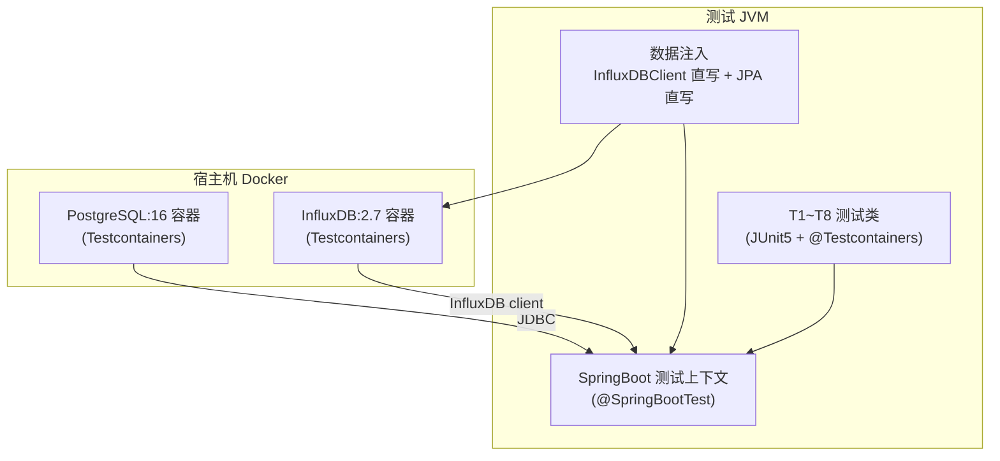
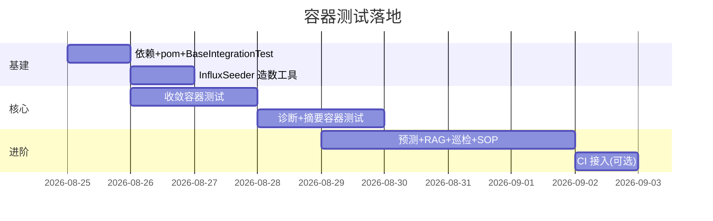

# AI 模块容器测试方案(Testcontainers)

> 目标:把"AI 模块功能清单与测试设计"里的 T1~T8 用例,用 **Testcontainers** 转成
> 真实容器集成测试——PostgreSQL + InfluxDB 由 Docker 动态拉起,spring-watch 应用上下文
> 连容器跑完整链路,**不依赖 mock-test、不依赖宿主机已部署的中间件**。
> 环境前提:宿主机装有 Docker(已验证 docker 28.5.1 可用)。

---

## 〇、已落地验证(P0)

> 2026-08-25 已完成基础设施 + 2 个核心容器测试并跑通。

### 已落地内容

| 项 | 位置 | 说明 |
|---|---|---|
| 测试依赖 | `pom.xml` | spring-boot-testcontainers + junit-jupiter + postgresql + influxdb(Testcontainers 1.20.4 BOM) |
| 基类 | `src/test/java/com/springwatch/test/BaseIntegrationTest.java` | PG(pgvector 镜像)+ InfluxDB 2.7 容器;`@DirtiesContext(AFTER_CLASS)` |
| 造数工具 | `InfluxSeeder.java` | v2 客户端直写指标/日志 line protocol |
| T3 收敛测试 | `AlertConvergenceIntegrationTest` | 同类收敛 / 跨指标分组,2/2 通过 |
| T2 诊断测试 | `DiagnosisIntegrationTest` | 降级态诊断落库 / 无日志占位,2/2 通过 |

### 关键落地经验(踩坑记录)

1. **PG 容器必须用 `pgvector/pgvector:pg16` 镜像**(标准 postgres:16 无 vector 扩展,V18 迁移失败);
2. **InfluxDB 无内建 `@ServiceConnection`**,需 `@DynamicPropertySource` 手动绑定 `influxdb.*` 属性;
3. **多测试类串行时容器上下文串用**:每个类声明静态容器,Spring 按属性缓存上下文,
   第二个类容器端口变化但上下文未失效 → `Connection refused`。解法:`@DirtiesContext(ClassMode.AFTER_CLASS)`;
4. **V18 HNSW 索引**对 TEXT 列 `::vector` 强转报"column does not have dimensions",
   已改为普通索引(检索全表扫描,测试数据量小可接受);
5. **诊断/收敛需要先持久化 app+rule**(`alert_history.rule` 外键),不能构造瞬态 rule;
6. **LLM 降级态**:基类把 `spring.ai.openai.base-url` 指向 `http://127.0.0.1:9`(连接拒绝快速失败)
   + 无效 key,避免测试卡外部调用;
7. 启动时有 `relation "alert_rule" does not exist`(Flyway 完成前 AlertRuleCache 首刷)
   与 `WriteErrorEvent`(InfluxDB 桶初始化前后台写入)告警,属启动噪音,不影响断言。

### 运行命令

```bash
# 单跑收敛
mvn -Dtest=AlertConvergenceIntegrationTest test
# 单跑诊断
mvn -Dtest=DiagnosisIntegrationTest test
# 串行跑全部容器测试
mvn -Dtest='*IntegrationTest' test
```

> 注:每类容器启动 ~60s,后续可优化为共享容器(Testcontainers singleton)减少重复启动。

---

## 一、为什么用容器测试

| 维度 | 之前的做法(外部依赖) | 容器测试(Testcontainers) |
|---|---|---|
| PostgreSQL / InfluxDB | 依赖 docker-compose 常驻实例 | 每个测试类自动拉起容器,用完销毁 |
| 数据造数 | 脚本 curl 直写 | 测试代码内 `InfluxDBClient` / JPA 直写,可控 |
| 可重复性 | 依赖环境状态(数据残留) | 容器隔离,每轮全新 |
| CI | 需要 docker-compose 编排 | `docker run` 内跑 Maven 即可 |
| LLM 降级 | 手动改环境变量 | 测试内注入 `AI_API_KEY=sk-xxx` 验证降级 |

---

## 二、架构



- **一个测试上下文**复用 PG + InfluxDB 两个容器(`@ServiceConnection`),减少容器启动开销;
- 每个测试方法前做数据清理/注入,保证独立;
- 应用配置:`application.yml` 里 influxdb/pg 的地址由 Testcontainers 动态覆盖。

---

## 三、依赖新增(pom.xml)

```xml
<dependency>
    <groupId>org.springframework.boot</groupId>
    <artifactId>spring-boot-testcontainers</artifactId>
    <scope>test</scope>
</dependency>
<dependency>
    <groupId>org.testcontainers</groupId>
    <artifactId>junit-jupiter</artifactId>
    <scope>test</scope>
</dependency>
<dependency>
    <groupId>org.testcontainers</groupId>
    <artifactId>postgresql</artifactId>
    <scope>test</scope>
</dependency>
<dependency>
    <groupId>org.testcontainers</groupId>
    <artifactId>influxdb</artifactId>
    <scope>test</scope>
</dependency>
```

> spring-boot-testcontainers 版本随 Boot 4.0.1 BOM 自动对齐;Testcontainers 1.20.x 与 Boot 4 兼容。

---

## 四、测试基础设施

### 4.1 容器基类(所有集成测试继承)

```java
package com.springwatch.test;

import org.springframework.boot.testcontainers.service.connection.ServiceConnection;
import org.testcontainers.containers.InfluxDBContainer;
import org.testcontainers.containers.PostgreSQLContainer;
import org.testcontainers.junit.jupiter.Container;
import org.testcontainers.junit.jupiter.Testcontainers;
import org.testcontainers.utility.DockerImageName;

@Testcontainers
public abstract class BaseIntegrationTest {

    @Container
    @ServiceConnection
    static final PostgreSQLContainer<?> PG = new PostgreSQLContainer<>("postgres:16")
            .withDatabaseName("spring_collector")
            .withUsername("root")
            .withPassword("123456");

    @Container
    @ServiceConnection
    static final InfluxDBContainer<?> IDB = new InfluxDBContainer<>(DockerImageName.parse("influxdb:2.7"))
            .withDatabase("metrics")
            .withUsername("admin")
            .withPassword("admin123456")
            .withAdminPassword("admin123456");
}
```

- `@ServiceConnection` 自动把容器端口绑定到 `spring.datasource.*` / `influxdb.*` 属性;
- InfluxDB 2.7 容器默认创建 `metrics` DB(2.x 兼容 token 模式),由 `InfluxDBContainer` 管理;
- Flyway 在上下文启动时自动执行 V1~V19,表结构完整。

### 4.2 InfluxDB 造数工具(测试内直写)

```java
package com.springwatch.test;

import com.influxdb.client.InfluxDBClientFactory;
import com.influxdb.client.write.Point;
import com.influxdb.client.domain.WritePrecision;

public final class InfluxSeeder {
    public static void writeMetric(InfluxDBContainer<?> c, long appid,
                                   String metric, double value, long epochSec) {
        try (var client = InfluxDBClientFactory.create(c.getHttpUrl(),
                c.getPassword().toCharArray(), "spring-watch", "metrics")) {
            client.getWriteApiBlocking().writePoint(Point.measurement("springboot_metrics")
                    .addTag("appid", String.valueOf(appid))
                    .addTag("metric", metric)
                    .addTag("method", "GET")
                    .addField("value", value)
                    .time(epochSec, WritePrecision.S));
        }
    }

    public static void writeErrorLog(InfluxDBContainer<?> c, long appid,
                                     String msg, long epochSec) {
        try (var client = InfluxDBClientFactory.create(c.getHttpUrl(),
                c.getPassword().toCharArray(), "spring-watch", "logs")) {
            client.getWriteApiBlocking().writePoint(Point.measurement("app_log")
                    .addTag("appid", String.valueOf(appid))
                    .addTag("level", "ERROR")
                    .addTag("logger", "OrderService")
                    .addTag("threadName", "http-nio")
                    .addField("message", msg)
                    .time(epochSec, WritePrecision.S));
        }
    }
}
```

> 注意:应用连 InfluxDB 的 org/bucket 由 `application-influxdb.yml` 定义(`spring-watch` / `metrics`/`logs`),
> 测试容器需用 `withDatabase("metrics")` + 自动建 bucket 或用 setup 模式。若容器默认 bucket 名不符,
> 可在 `@DynamicPropertySource` 里把 `influxdb.org` / `influxdb.metrics-bucket` 指到容器实际值。

---

## 五、用例 → 容器测试映射

| 功能 | 测试类 | 容器依赖 | 数据注入 |
|---|---|---|---|
| F1~F6 工具/对话 | `AiToolIntegrationTest` | PG+IDB | JPA 插 app/rule + Influx 直写指标/日志 |
| F7~F9 诊断 | `DiagnosisIntegrationTest` | PG+IDB | Influx 直写窗口指标/ERROR + 构造 event |
| F10~F13 收敛 | `AlertConvergenceIntegrationTest` | PG | JPA 插 app/rule + 直接 fire() |
| F14~F15 摘要 | `LogSummaryIntegrationTest` | PG+IDB | Influx 直写昨日 ERROR |
| F16~F18 预测 | `CapacityPredictionIntegrationTest` | PG+IDB | Influx 直写 metrics_5m 上升趋势 |
| F19~F21 RAG | `RagIntegrationTest` | PG | JPA 插切片(向量可空)+ 直调 search |
| F22~F23 巡检 | `InspectionIntegrationTest` | PG+IDB | JPA 插 app + Influx 直写 |
| F24~F26 SOP/MCP | `SopIntegrationTest` | PG | JPA 插 sop_schedule |

---

## 六、落地示例:T3 告警收敛容器测试

```java
package com.springwatch.alerter;

import com.springwatch.model.entity.AlertHistory;
import com.springwatch.model.entity.AlertRule;
import com.springwatch.model.entity.MonitorApp;
import com.springwatch.model.event.MetricEvent;
import com.springwatch.repository.AlertHistoryRepository;
import com.springwatch.repository.AlertRuleRepository;
import com.springwatch.repository.MonitorAppRepository;
import com.springwatch.test.BaseIntegrationTest;
import com.springwatch.util.SnowFlakeIdGenerator;
import org.junit.jupiter.api.BeforeEach;
import org.junit.jupiter.api.Test;
import org.springframework.beans.factory.annotation.Autowired;

import java.time.Instant;
import java.util.List;

import static org.assertj.core.api.Assertions.assertThat;

class AlertConvergenceIntegrationTest extends BaseIntegrationTest {

    @Autowired MonitorAppRepository appRepo;
    @Autowired AlertRuleRepository ruleRepo;
    @Autowired AlertHistoryRepository historyRepo;
    @Autowired AlertLifecycleService lifecycle;

    private long appid;
    private AlertRule rule;

    @BeforeEach
    void setUp() {
        historyRepo.deleteAll();
        appid = SnowFlakeIdGenerator.generateId();
        MonitorApp app = appRepo.save(MonitorApp.builder()
                .appid(appid).appName("conv-app").endpoint("http://x:1")
                .metricsPort(9464).status("active").build());
        rule = ruleRepo.save(AlertRule.builder()
                .app(app).ruleName("cpu-high").ruleType("metric")
                .expression("value > 90").level("warning").status("enabled").build());
    }

    private void fire(double value) {
        lifecycle.fire(rule, MetricEvent.builder()
                .appid(appid).metricName("system_cpu_usage").value(value)
                .timestamp(Instant.now()).build());
    }

    @Test
    void 同类连续10次只首报通知其余抑制() {
        for (int i = 0; i < 10; i++) fire(99.0);
        List<AlertHistory> rows = historyRepo.findAll();
        assertThat(rows).hasSize(10);
        long leaders = rows.stream().filter(r -> !Boolean.TRUE.equals(r.getAggSuppressed())).count();
        assertThat(leaders).isEqualTo(1);
        long members = rows.stream().filter(r -> Boolean.TRUE.equals(r.getAggSuppressed())).count();
        assertThat(members).isEqualTo(9);
        // 全部同一收敛组
        assertThat(rows.stream().map(AlertHistory::getAggGroupId).distinct()).hasSize(1);
        // 组累计 10
        assertThat(rows.getFirst().getAggGroupCount()).isEqualTo(10);
    }

    @Test
    void 跨指标分组产生两个收敛组() {
        fire(99.0);
        lifecycle.fire(rule, MetricEvent.builder()
                .appid(appid).metricName("jvm_memory_used_bytes").value(9e8)
                .timestamp(Instant.now()).build());
        var ids = historyRepo.findAll().stream()
                .map(AlertHistory::getAggGroupId).distinct().toList();
        assertThat(ids).hasSize(2);
    }
}
```

> 说明:`MonitorApp`/`AlertRule` 的必填字段以实体注解为准,示例省略了非必填。收敛静默窗口 5min
> 内连续 fire 同一指纹 → 一个收敛组;不同 metric → 不同组。断言直接查容器内 PG。

---

## 七、LLM 降级态测试(容器内)

```java
@SpringBootTest(properties = {
    "spring.ai.openai.api-key=sk-xxx",   // 无效 key → 走降级
    "ai.chat.system-prompt=test"
})
class DiagnosisDegradeIntegrationTest extends BaseIntegrationTest {
    @Autowired DiagnosisReportService svc;
    @Autowired DiagnosisReportRepository repo;

    @Test
    void LLM失败时降级为证据摘要不抛错() {
        // 构造 AlertTriggeredEvent → diagnose()
        // 断言 diagnosis_report.status=degraded, report 含"LLM 诊断失败" + 证据
    }
}
```

---

## 八、运行方式

```bash
# 单跑收敛容器测试(需本机 docker)
mvn -Dtest=AlertConvergenceIntegrationTest test

# 跑整个 AI 集成测试组
mvn -Dtest='com.springwatch.alerter.*IntegrationTest,com.springwatch.ai.**' test

# 在 CI(docker-in-docker 或宿主 docker)同样命令即可
```

> 不需要 mock-test,不需要手动起 PG/InfluxDB,Testcontainers 自动管理容器生命周期。

---

## 九、注意事项与风险

| 项 | 说明 |
|---|---|
| 容器启动耗时 | PG+InfluxDB 首启 ~10-20s,测试类共享静态容器可摊薄 |
| InfluxDB 2.7 桶 | 需确认容器默认 bucket/org 与 `application-influxdb.yml` 一致;不一致用 `@DynamicPropertySource` 覆盖 |
| Flyway 执行 | PG 容器内自动跑 V1~V19,`alert_history` 收敛字段等都在 |
| LLM 真实调用 | 容器测试默认**不连真实 LLM**(无效 key 降级态);需要真实 LLM 的用例单独标记 `@Tag("llm")` 并按需启 |
| 单测 vs 容器测试 | 纯逻辑(收敛 decide / 线性回归 / 切片)保留 JUnit 单测;容器测试聚焦"数据服务+落库+链路" |
| Docker 不可用环境 | 容器测试自动 skip(Testcontainers 在无 docker 时抛异常),可加 `@Testcontainers(disabledWithoutDocker = true)` |

---

## 十、落地顺序



- **P0**:pom 依赖 + `BaseIntegrationTest` + `InfluxSeeder` + 收敛容器测试(最高价值,证明收敛在真实 PG 落库正确);
- **P1**:诊断 + 摘要 + 预测(依赖 InfluxDB 造数);
- **P2**:RAG + 巡检 + SOP + CI。

任务已完成!kxj