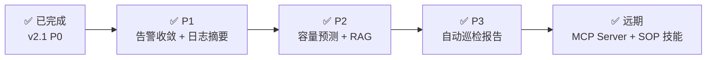
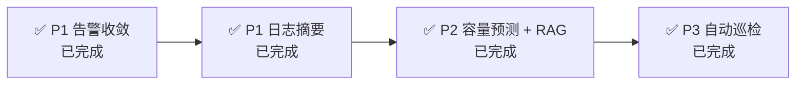

# spring-watch AI Agent TODO 清单

> 基于 `docs/ai-agent规划.md` + `docs/spring-watch-ai-suggestion.md` 合并推进
> 更新日期:2026-08-24

---

## 一、进度总览

| 阶段 | 内容 | 状态 |
|---|---|---|
| **v2.1 P0** | ai 模块骨架 + 4 工具 + SSE 对话 + 告警智能诊断 | ✅ 已完成 |
| **v2.2 P1** | 告警收敛 ✅ + 日志智能摘要 ✅ | ✅ 已完成 |
| **v2.3 P2** | 容量预测 ✅ + RAG 知识库 ✅ | ✅ 已完成 |
| **v3 P3** | 自动巡检报告 | ✅ 已完成 |
| 远期 | SOP 技能引擎 / 定时巡检 / MCP Server | ✅ 已完成 |

---

## 二、已完成清单(v2.1 P0)

- [x] pom.xml 引入 spring-ai-bom 1.1.1 + spring-ai-openai + client-chat + autoconfigure(兼容 Boot 4.0.1)
- [x] application-ai.yml:LLM 配置(DeepSeek 兼容端点,环境变量注入)+ 对话/诊断提示词
- [x] Flyway V14:chat_conversation + chat_message 表
- [x] 实体 + Repository:ChatConversation / ChatMessage
- [x] 4 个只读 @Tool:AppQueryTool / MetricQueryTool / LogQueryTool / AlertQueryTool
- [x] AiChatController `/api/ai/chat` SSE 流式 + 会话管理接口
- [x] AiChatService:会话持久化 + 最近 12 条历史上下文 + LLM 失败降级
- [x] Flyway V15:diagnosis_report 表
- [x] AlertTriggeredEvent + AlertLifecycleService.fire() 发布(AFTER_COMMIT)
- [x] AlertDiagnosisTrigger:异步诊断 + 同一 app 5min 冷却 + 并发限 2
- [x] DiagnosisReportService:30min 指标窗口摘要 + 日志指纹 Top10 + 四段式报告 + 降级落库
- [x] `/api/ai/diagnosis` 报告查询接口
- [x] 前端 AI 助手面板(对话 + 诊断报告标签页)+ 路由 `/ai-chat`

---

## 三、待办清单

### 3.1 P1:告警收敛(高优先级,告警风暴治理) ✅

> 现状状态机短板:风暴期大量相似告警刷屏。指纹相似度聚类抑制。

- [x] AlertAggregationService:相似告警指纹相似度计算(应用/规则类型/指标或日志指纹维度)
- [x] 告警聚类:同一相似指纹静默窗口内聚为收敛组,FIRING 事件按相似度合并
- [x] 收敛策略:首报即达(leader 通知+诊断) + 同类 5min 静默(member 抑制) + 风暴摘要周期推送(AlertStormSummaryScheduler 邮件汇总)
- [x] Flyway V16:alert_history 增加收敛组字段(agg_group_id / agg_role / agg_suppressed / agg_group_count / agg_suppressed_count)
- [x] 前端告警历史展示收敛组信息(首报/抑制徽标 + 详情收敛组统计)

### 3.2 P1:日志智能摘要(每日错误摘要 / 周报) ✅

- [x] LogContextService:复用 LogQueryService.topFingerprints 聚合每日错误指纹
- [x] 定时任务:DailyLogSummaryScheduler @Scheduled 每日 09:00 生成昨日错误摘要
- [x] 摘要落库 chat_message(system_push,"系统推送"会话)+ 前端 AI 面板可查

### 3.3 P2:容量预测 ✅

- [x] CapacityPredictionService:metrics_5m 降采样桶线性回归/滑动趋势预测
- [x] LLM 仅解释预测结果(OOM/磁盘/CPU 场景判定 + 风险等级)
- [x] Flyway V17:capacity_prediction 落库 + /api/capacity/predict + /api/capacity/history
- [x] 前端容量预测页(/capacity):指标选择 + 预测结果卡 + 历史记录

### 3.4 P2:RAG 知识库(PGVector) ✅

- [x] Flyway V18:knowledge_chunk 向量表(vector 扩展 + HNSW 索引,embedding 存 TEXT 字面量规避 Hibernate 7 类型绑定)
- [x] DocEmbeddingService:文档切片(500字符+50重叠)+ embedding 入库(RestClient 调远端 API)
- [x] VectorSearchService:PGVector 余弦相似检索(native SQL ::vector 强转)
- [x] 诊断报告回灌知识库(DiagnosisReportService 落库后异步入库,越用越准)
- [x] /api/rag/search + /api/rag/ingest

### 3.5 P3:自动巡检报告 ✅

- [x] HealthInspectionService:全应用健康体检(指标摘要 + ERROR 指纹 + RAG 知识检索 + LLM 报告)
- [x] 定时推送:@Scheduled 每周一 08:00,报告落库 system_push("自动巡检"会话)
- [x] POST /api/ai/inspection/run 手动触发

### 3.6 远期:suggestion 文档路线 ✅

- [x] SOP 技能引擎(SopEngine:每日巡检 / 错误率突增诊断 / JVM OOM 诊断)
- [x] SopSchedule 定时巡检表(Flyway V19)+ AI 创建 cron 任务(/api/sop/schedule,支持 cron 表达式计算下次执行)
- [x] MCP Server(spring-ai-starter-mcp-server-webmvc,/mcp SSE 对外暴露 4 个查询工具)

---

## 四、P0 验收标准对照

| 验收项 | 结果 |
|---|---|
| FIRING 告警 → 30s 内输出诊断报告(原因 + 证据 + 建议) | ✅ 异步诊断,LLM 失败降级证据摘要 |
| 对话:"查一下 app-1 过去1小时错误率" → 正确数据 | ✅ 工具调用已覆盖(NL2Query) |
| LLM 失败/超时不阻塞告警链路 | ✅ degraded 落库,事件异步隔离 |

---

## 五、下一步建议

---

## 六、测试落地

> 功能测试设计见 [`docs/AI模块功能清单与测试设计.md`](AI模块功能清单与测试设计.md)
> 容器测试方案见 [`docs/AI模块容器测试方案.md`](AI模块容器测试方案.md)

### 容器测试(Testcontainers,不依赖 mock-test)

- [x] 测试依赖 + `BaseIntegrationTest`(PG pgvector 镜像 + InfluxDB 2.7,`@DirtiesContext` 隔离)
- [x] `InfluxSeeder` 造数工具(InfluxDB v2 直写指标/日志)
- [x] T3 告警收敛容器测试(`AlertConvergenceIntegrationTest`)✅ 2/2
- [x] T2 告警诊断容器测试(`DiagnosisIntegrationTest`,LLM 降级态)✅ 2/2
- [ ] T1 工具/对话 · T4 摘要 · T5 预测 · T6 RAG · T7 巡检 · T8 SOP/MCP 容器测试(P1/P2 待做)