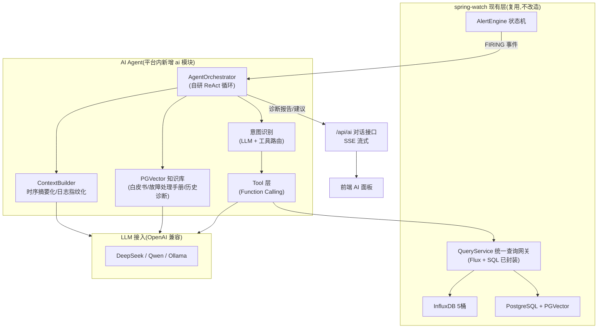
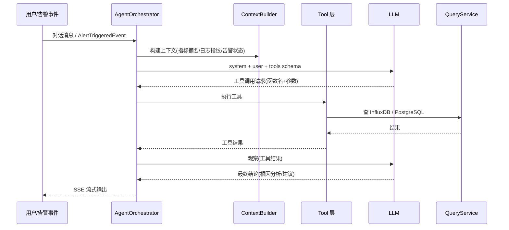

# spring-watch AI Agent 规划

> 范围:忽略自研 Java Agent(v2),AI Agent 完全落在平台侧,目标应用零感知。
> 定位:平台 = 数据底座 + 工具层 + 自研 Agent 编排,把现有数据变成 AI-ready。

---

## 一、定位与原则

| 原则 | 说明 |
|------|------|
| **纯平台侧** | AI Agent 部署在 spring-watch 内,目标应用不装任何新组件、零感知 |
| **数据复用** | InfluxDB 5桶 / PostgreSQL / Kafka / Caffeine 直接成为 Agent 的"感知器官",不改造现有链路 |
| **零外依赖** | 不引 LangChain 等重框架、不引向量数据库中间件(PGVector 复用 PostgreSQL)、LLM 走 OpenAI 兼容远端 API |
| **贴合约束** | 单实例部署、拉模型不动、资源基线 5~7GB 不变 |
| **可观测** | AI 链路(MDC / LLM 调用 / 工具调用)纳入现有自监控体系 |

---

## 二、总体架构



---

## 三、模块设计

### 3.1 ai 模块包结构(新增,沿用现有分层)

```text
src/main/java/com/springwatch/ai/
├── agent/              # 编排核心
│   ├── AgentOrchestrator.java      # ReAct 循环(最大迭代数限制)
│   ├── AgentContext.java           # 会话上下文(session + 工具结果)
│   └── ReActLoop.java              # 思考-行动-观察循环
├── llm/
│   ├── LlmClient.java              # OpenAI 兼容客户端(DeepSeek/Qwen/Ollama)
│   ├── LlmConfig.java              # apiKey / baseUrl / model / temperature
│   └── LlmRequestBuilder.java      # 系统提示词 + 工具 schema 组装
├── context/
│   ├── MetricContextService.java   # 时序摘要化(min/max/趋势/异常窗口)
│   ├── LogContextService.java      # 日志指纹化 + 错误 TopN
│   └── AlertContextService.java    # 当前 FIRING 状态 + 历史
├── tool/
│   ├── Tool.java                   # 工具接口(name/description/execute)
│   ├── MetricQueryTool.java        # 查指标 → QueryService
│   ├── LogQueryTool.java           # 查日志 → LogQueryService
│   ├── AlertQueryTool.java         # 查告警 → AlertRuleService
│   └── AppQueryTool.java           # 查应用 → MonitorAppService
├── rag/
│   ├── DocEmbeddingService.java    # 文档切片 + embedding 入库
│   ├── VectorSearchService.java    # PGVector 相似检索
│   └── KnowledgeBase.java          # 白皮书/故障手册/历史诊断报告
├── diagnosis/
│   ├── AlertDiagnosisTrigger.java  # 订阅 AlertTriggeredEvent
│   └── DiagnosisReportService.java # 诊断报告生成 + 落库
└── web/
    ├── AiChatController.java       # /api/ai/chat (SSE 流式)
    └── AiChatService.java          # 对话会话管理
```

### 3.2 Agent 编排流程(自研 ReAct)



**循环约束(防失控)**:
- 最大迭代 8 轮(工具调用次数上限)
- 每轮工具调用超时 10s
- 工具只读,不提供写操作(写操作走现有 REST,Agent 仅建议)
- 上下文窗口预算:系统提示词固定 + 摘要化数据 ≤ 8k token

---

## 四、关键设计决策

| 决策点 | 选型 | 备选 | 理由 |
|---|---|---|---|
| Agent 框架 | **自研轻量 ReAct** | LangChain4j | 项目风格自研、单实例、零冗余依赖;LangChain4j 对 Java 生态支持一般且版本迭代激进 |
| LLM 接入 | OpenAI 兼容远端 API(DeepSeek/Qwen),Ollama 可配 | 本地部署模型 | 不引本地模型,符合资源基线;配置化 baseUrl 随时可切 |
| 向量库 | **PGVector(PostgreSQL 已有)** | 引 Milvus/ES | 不引新中间件,延续"Caffeine 替代 Redis"的零外依赖哲学 |
| 工具层 | 平台 REST 层 QueryService 封装成 Tool | Agent 直连 Influx | QueryService 已统一封装,Agent 只面对 API,不碰底层 |
| 上下文策略 | **时序摘要化**,不灌原始数据 | 原始时序直接喂 | LLM 不能吃 15s 粒度原始数据,只喂 min/max/趋势/异常窗口 |
| 触发方式 | 主动对话 + AlertEngine FIRING 自动触发诊断 | 仅对话 | 把 AI 挂进现有状态机,告警即诊断,价值最大 |
| 会话存储 | Caffeine 短期会话 + PG 历史报告 | Redis | 延续 v1.6 零外状态依赖收敛 |
| 输出方式 | SSE 流式 | 全量 JSON | 长诊断报告首字延迟低,前端体验好 |
| 安全 | 工具只读、LLM 输出脱敏校验、敏感字段不透传 | 无限制 | 日志脱敏链路复用 LogSanitizer 规则 |

---

## 五、落地路径

| 阶段 | 内容 | 价值 | 依赖 |
|---|---|---|---|
| **P0** | 告警智能诊断:FIRING 自动拉取前后 30min 指标窗口 + 错误日志 TopN + 关联应用,输出根因分析报告 | 最高,直接解决告警值班痛点 | AlertTriggeredEvent 事件、Metric/Log ContextService |
| **P0** | NL2Query:"过去 1 小时错误率" → 自动生成 Flux 查询并返回图表数据 | 高,降低使用门槛 | MetricQueryTool + Flux 模板 |
| **P1** | 告警收敛:相似告警聚类抑制(风暴治理,现状态机短板) | 高,告警风暴是运维核心痛点 | AlertContextService + 指纹相似度 |
| **P1** | 日志智能摘要:每日错误摘要 / 周报自动生成 | 中高,省人工 | LogContextService + 定时任务 |
| **P2** | 容量预测:指标趋势预测 OOM / 磁盘 / CPU(统计模型先行,LLM 仅解释) | 中,前瞻价值 | metrics_5m 降采样桶 |
| **P3** | 自动巡检报告:全应用健康体检 + 建议 | 中 | RAG + 全部 Tool |

**P0 里程碑验收标准**:
- 一个 FIRING 告警 → 30s 内输出诊断报告(原因 + 证据指标/日志 + 建议)
- 对话接口:"查一下 app-1 过去 1 小时错误率" → 返回正确数据 + 图表
- LLM 调用失败/超时有降级(返回"诊断失败" + 原始指标摘要,不阻塞告警链路)

---

## 六、强平台侧:现有层改造清单

平台侧不推倒重来,只做 4 件事把数据变成 **AI-ready**:

1. **查询网关统一化(仅新增,不改动)**
   - 新增 `MetricContextService`:Flux 查询 → 摘要化(窗口 min/max/均值/趋势/异常点)
   - 新增 `LogContextService`:日志指纹聚合 + 错误 TopN,复用 `LogFingerprinter`
   - Agent 只走 QueryService 一条路,不新增第二查询通道

2. **告警-诊断联动(小改)**
   - AlertEngine 状态机 FIRING 时发布 `AlertTriggeredEvent`
   - `AlertDiagnosisTrigger` 订阅 → 触发诊断(异步,不阻塞告警通知主链路)

3. **自监控纳入 AI 链路(小改)**
   - LLM 调用次数 / 耗时 / 失败率 / token 用量 → `self_metrics` 桶
   - 复用 Micrometer 埋点 + 现有 7 大自监控面板,新增 AI 模块

4. **知识库沉淀(PGVector)**
   - Flyway 新增向量表迁移
   - 白皮书切片 + 每次诊断报告入库,越用越准
   - embedding 模型:bge-m3(text-embedding 兼容)或远端 embedding API

---

## 七、技术选型明细

| 组件 | 选型 | 说明 |
|---|---|---|
| LLM 客户端 | 自研轻量 HTTP 客户端(WebClient) | OpenAI chat/completions 协议,配置化 |
| 工具调用 | function calling 协议 | DeepSeek / Qwen / OpenAI 均支持 |
| 向量 | PGVector 扩展 + JVector 实现 | 复用 PG 连接池,HNSW 索引 |
| 会话 | Caffeine(短期) + PG(诊断报告落库) | 无 Redis |
| 流式 | SSE(Flux + Sinks.Many) | Spring WebFlux 已具备 |
| 前端 | 新增 AI 对话面板(聊天气泡 + 诊断报告卡片) | 复用 Vite + Vue 3 + DaisyUI |

---

## 八、风险与对策

| 风险 | 对策 |
|---|---|
| LLM 幻觉导致错误根因 | 工具结果必须带证据(指标窗口原文 + 日志原文),要求 LLM 结论引用证据;诊断报告标注"AI 生成,供参考" |
| LLM 调用成本 | 上下文摘要化控制 token;模型可配(便宜模型兜底);诊断频率限流(同一 app 5min 内不重复诊断) |
| LLM 不可用 | 降级:输出指标/日志摘要原文,不阻塞告警链路;自监控面板可见失败率 |
| 敏感数据泄漏给 LLM | 复用 LogSanitizer 脱敏规则;LLM 请求前强制脱敏;只读工具不放行日志全文(默认 TopN 摘要) |
| 单实例资源 | Agent 编排全部异步(虚拟线程/现有线程池),诊断任务限并发 2;LLM 远端调用不占本地 CPU |
| 工具循环失控 | 最大 8 轮迭代 + 每轮 10s 超时 + 总时长 60s 上限 |

---

## 九、演进路线(在现有 v2 路线之上追加)

| 版本 | 目标 | 关键变更 |
|---|---|---|
| **v2** | 自研 Java Agent(暂缓,按用户指示忽略) | 1 参数接入 |
| **v2.1(AI)** | P0:告警智能诊断 + NL2Query | ai 模块骨架、Tool 层、SSE 对话 |
| **v2.2(AI)** | P1:告警收敛 + 日志摘要 | AlertContextService、定时摘要任务 |
| **v2.3(AI)** | P2:容量预测 + RAG 知识库 | 统计预测 + PGVector 沉淀 |
| **v3(AI)** | P3:自动巡检报告 | 全应用体检 + 建议闭环 |