# spring-watch 当前架构分析（v1.x 实时代码）

> 基于 `src/main/java/com/springwatch/**` 实际包结构，**不**复用 README 中预览版的 7 层图。
> README 架构图停留在"预览阶段"，与正式版代码相比有以下重大差异：
> - 新增 **自监控闭环**（README 仅在脚注提及）
> - 新增 **告警历史保留**、**PendingStateScanner**、**独立邮件线程池**
> - 告警评估多了一条 **定时合成 MetricEvent** 路径（LogAlertScheduler）
> - 接入层新增 **OtelConfigGenerator**（应用注册时生成 OTel 启动命令）
> - 增加 **NotificationController**（告警通知配置 CRUD）
> - ingest 增加 **双写定时任务**（Redis→PG dedup count）

---

## 1. 实际包结构（11 包，72 文件）

```
com.springwatch
├── SpringWatchApplication        # 启动类
├── alerter/    (12 类)           # 告警全栈
├── analysis/   ( 3 类)           # 日志分析
├── collector/  ( 9 类)           # 采集层 + 调度子包
│   └── schedule/  ( 6 类)        # 调度/限流/重试
├── config/     (10 类)           # 配置/初始化
├── consumer/   ( 5 类)           # Kafka 批消费 + DLQ
├── ingest/     ( 4 类)           # 日志接入管道
├── model/      (11 类)           # DTO/Entity/Event
├── monitor/    ( 1 类)           # SelfMonitorCollector
├── repository/ ( 6 类)           # JPA 仓库
├── service/    ( 7 类)           # 业务服务
├── util/       ( 1 类)           # SnowFlakeIdGenerator
└── web/        ( 6 类)           # REST 控制器
```

---

## 2. 数据流总图（实际接线）

```mermaid
flowchart TB
    subgraph EXT["目标应用(被监控方)"]
        direction LR
        TGT["Spring Boot + OTel Agent<br/>Prometheus :metricsPort/metrics"]
    end

    subgraph SW["spring-watch 平台"]
        direction TB

        subgraph COLL["① 采集层 collector/"]
            direction TB
            OTELGEN["OtelConfigGenerator<br/>注册时生成 OTel 启动命令"]
            REG["CollectScheduleRegistry<br/>虚拟线程调度(INTERVAL/CRON)"]
            TSK["AppPullTask<br/>可达探测+心跳+拉取"]
            TH["HostThrottler<br/>Per-Host 并发限流"]
            RQ["PullRetryQueue + RetryPull<br/>被限流/不可达入队重投"]
            HTTP["AgentHttpClient<br/>(统一 HTTP 客户端)"]
            MC["AgentMetricsCollector"]
            LC["AgentLogCollector"]
        end

        subgraph BR["② Kafka 桥接层"]
            direction TB
            PB["KafkaProducerBridge<br/>key=appid"]
            FB["KafkaFallbackQueue<br/>Kafka 不可用本地降级"]
            T1["monitor-metrics"]
            T2["monitor-logs"]
            T3["monitor-heartbeat"]
            T1D["monitor-metrics.DLQ"]
            T2D["monitor-logs.DLQ"]
            T3D["monitor-heartbeat.DLQ"]
        end

        subgraph CONS["③ 消费层 consumer/"]
            direction TB
            BMC["BatchMetricConsumer<br/>→ InfluxDB springboot_metrics"]
            BLC["BatchLogConsumer"]
            BHC["BatchHeartbeatConsumer<br/>→ PG monitor_app.lastHeartbeat"]
            BAC["BatchAlertConsumer<br/>→ AsyncAlertExecutor"]
            DLQ["DlqMonitorConsumer<br/>→ PG dlq_message"]
        end

        subgraph ING["④ 日志接入 ingest/"]
            direction TB
            LP["LogParser"]
            LS["LogSanitizer"]
            LF["LogFingerprinter"]
            LD["LogDedupService<br/>(内存+Redis 滑动窗口)<br/>@Scheduled 30s 双写 Redis→PG"]
        end

        subgraph ALERT["⑤ 告警层 alerter/"]
            direction TB
            AEX["AsyncAlertExecutor<br/>虚拟线程池(8)"]
            ME["AsyncMailExecutor<br/>独立虚拟线程池+Semaphore(4)"]
            AE["AlertEngine<br/>IDLE→PENDING→FIRING→RESOLVED"]
            EV["AlertEvaluator"]
            JX["JexlExprEvaluator<br/>(独立类,被 EV 调用)"]
            AS["AlertStateStore(内存)"]
            ARC["AlertRuleCache<br/>@Scheduled 30s 刷新"]
            AN["AlertNotifier(SMTP)"]
            PSS["PendingStateScanner<br/>@Scheduled 5s 扫 PENDING→FIRING"]
            AHR["AlertHistoryRetention<br/>@Cron 03:30 清理 90 天前历史<br/>Micrometer 指标"]
        end

        subgraph ANA["⑥ 分析层 analysis/"]
            direction TB
            LA["LogAggregator<br/>错误率/TopN/时序"]
            LAD["LogAnomalyDetector<br/>错误率突增/新模式"]
            LAS["LogAlertScheduler<br/>@Scheduled 1min<br/>合成 MetricEvent → AE"]
        end

        subgraph SM["⑦ 自监控闭环 monitor/"]
            direction TB
            SC["SelfMonitorCollector<br/>@Scheduled 10s 采样<br/>JVM/进程/Micrometer 白名单<br/>→ InfluxDB self_monitor_metrics<br/>+ 60 槽 ring 缓存"]
            SMS["SelfMetricQueryService<br/>(查 InfluxDB 历史)"]
            SMC["SelfMonitorController<br/>/api/self/realtime<br/>/api/self/series"]
        end

        subgraph WEB["⑧ Web API 层 web/"]
            direction TB
            MAC["MonitorAppController<br/>POST /api/apps(含 OTEL 命令)"]
            NC["NotificationController<br/>(通知配置 CRUD)"]
            AC["AlertController"]
            MCtrl["MetricController"]
            LCtrl["LogController"]
        end

        %% collector 内部
        REG --> TSK --> TH
        TH -.限流/不可达.-> RQ -.重投.-> TSK
        TSK --> HTTP --> MC
        TSK --> HTTP --> LC
        TSK -- sendHeartbeat --> PB

        %% bridge
        MC --> PB
        LC --> PB
        PB -.失败降级.-> FB
        PB --> T1 & T2 & T3
        T1 & T2 & T3 -.失败.-> T1D & T2D & T3D

        %% consumer
        T1 --> BMC
        T1 --> BAC
        T2 --> BLC
        T3 --> BHC
        T1D & T2D & T3D --> DLQ

        %% ingest pipeline
        BLC --> LP --> LS --> LF --> LD
        LD -.30s 周期.-> LD
        LD --> BLC
        BLC --> AEX
        BAC --> AEX
        LAS --> AEX
        AEX --> AE
        AE --> EV --> JX
        AE --> AS
        AE --> ARC
        AE --> AN --> ME

        %% analysis
        LA --> LAD
        LAS --> LA

        %% self monitor
        SC -.5s 轮询.-> SMC
        SC -.查历史.-> SMS
        SMS --> SMC

        %% web
        MAC -- upsert/cancel --> REG
        MAC -- 生成 OTel 命令 --> OTELGEN
        WEB --> LA
        WEB --> LAD
        WEB --> BMC
        WEB --> BHC
        AC --> AE
        NC --> AN
        PSS --> AE
        AHR --> AE
    end

    subgraph STORE["外部存储"]
        PG[("PostgreSQL 16<br/>monitor_app / alert_rule<br/>alert_history / log_dedup_count<br/>dlq_message / alert_notification_config")]
        IDB[("InfluxDB 2.7<br/>springboot_metrics / app_log<br/>self_monitor_metrics")]
        RDS[("Redis 7<br/>dedup:log:dedup:*<br/>knownPatterns:log:knownPatterns:*")]
        KF[("Kafka<br/>3 topic + 3 DLQ")]
    end

    %% 外部连线
    TGT -- "HTTP GET 15s" --> MC
    TGT -- "HTTP GET 增量" --> LC
    BMC --> IDB
    BLC --> IDB
    BHC --> PG
    AE --> PG
    AHR --> PG
    DLQ --> PG
    LD --> RDS
    LD -.30s 双写.-> PG
    ARC --> PG
    REG --> PG
    NC --> PG
    AN -- "SMTP 587" --> MBOX["@qq.com 收件人"]
    SC --> IDB
    T1 & T2 & T3 --> KF
    T1D & T2D & T3D --> KF
```



---

## 3. 与 README 预览版的关键差异

| 维度 | README 预览版 | 实际代码 | 影响 |
|---|---|---|---|
| **告警评估入口** | 只画了 BLC / BAC 两条 | **新增第三条** `LogAlertScheduler` 定时合成 `MetricEvent` | 日志错误率告警可不经过 Kafka |
| **邮件发送** | 笼统画在 `AN` | **拆出独立** `AsyncMailExecutor`（虚拟线程 + Semaphore=4） | SMTP 慢不阻塞告警评估 |
| **PENDING 处理** | 仅在状态机一笔带过 | **新增** `PendingStateScanner`（5s 扫 + 真实连续判断） | 借鉴 HertzBeat 周期扫描 |
| **告警历史** | 写库不画 | **新增** `AlertHistoryRetention`（cron 03:30 清理 90 天前 + Micrometer 指标） | 防止 alert_history 无界增长 |
| **JEXL 求值** | 笼统在 AlertEvaluator | **拆出** `JexlExprEvaluator` 独立类 | 可单测、可替换 |
| **自监控** | 仅脚注 | **完整闭环** `SelfMonitorCollector → InfluxDB self_monitor_metrics → SelfMetricQueryService → SelfMonitorController(/api/self/*)` | 自监控读路径独立、不走 Web → Consumer 直连 |
| **OTel 接入** | "用户挂 Agent" | **新增** `OtelConfigGenerator`，注册应用时自动生成 `-javaagent:...` 命令 | 接入自动化 |
| **dedup 持久化** | 笼统"双写 PG" | **新增定时任务** `LogDedupService.flushDirtyCounts`（30s 一批 + dirty set） | Redis 挂了计数不丢 |
| **通知配置** | 邮件 hardcode | **新增** `NotificationController` + `alert_notification_config` 表 | 多收件人/多通道预留 |
| **DLQ 处理** | 仅画了 DLQ consumer | **明确落库** `DlqMessage` 表，可查可清 | 死信可视化 |
| **HTTP 客户端** | 未画 | **抽出** `AgentHttpClient`（MC/LC 共用） | 复用连接池/超时/重试 |
| **Mock 目标** | 无 | `mock-test/` 同仓多模块 | 自带测试 fixture |
| **前端** | 静态 HTML | `frontend/` Vite + Vue 3 + TS + Pinia 完整工程 | 前后端解耦 |

---

## 4. 现有架构的强项

1. **拉模型 + 三 Topic 隔离** — 写入路径与告警路径在 Kafka 处分叉（`monitor-metrics` 被 `BMC` 与 `BAC` 双订阅），不会因为告警慢阻塞入库
2. **虚拟线程普及** — 调度、限流、邮件、告警评估全部虚拟线程化（`Thread.ofVirtual()` 或 `Executors.newVirtualThreadPerTaskExecutor()`）
3. **数据不驻堆** — `BatchMetricConsumer:67` 写完即丢、`SelfMonitorCollector:62` 60 槽 ring、`LogDedupService` 仅在 Redis/PG 存数据（见 `docs/memory-architecture.md`）
4. **告警评估三路独立** — Kafka 指标旁路 / Kafka 日志旁路 / 定时合成 互不阻塞
5. **可观测性内建** — Micrometer 全埋点 + `AlertHistoryRetention` 自身就是 Micrometer 指标的消费者
6. **OTel 接入零摩擦** — 平台侧生成完整 `-javaagent:... -DOTEL_...=...` 命令，复制即用

---

## 5. 仍可改进点

| 问题 | 位置 | 建议 |
|---|---|---|
| Web → Consumer 直连读 | `MetricController/LogController → BMC/BHC` | 走 InfluxDB Flux，consumer 只写 |
| 告警评估仍耦合在 `BLC/AEX` | `BatchLogConsumer.java` | 拆 `AlertTriggerPublisher`，BLC 只发，不调 AE |
| 通知配置只支持 SMTP | `alerter/AlertNotifier` | 抽 `NotificationChannel` 接口（钉钉/企微/飞书） |
| `LogMetricsLinker` 缺失 | README 提到但代码未见 | 删除 README 描述或实现该类 |
| 自监控历史查询走 Flux | `SelfMetricQueryService` | 大时间窗 24h 可能慢，可加 downsampling aggregation |
| `OtelConfigGenerator` 仅生成 env | 缺启动脚本模板 | 同步出 Dockerfile / shell 模板 |
| 告警状态内存存储 | `AlertStateStore` | 多实例部署时无共享，集群化需改 Redis 或 PG |
| Web 控制器没分组限流 | 6 个 Controller | 关键接口（注册/告警）应独立 RateLimiter |
| DLQ 落库后无重投 | `DlqMonitorConsumer` | 加手动重投接口或自动补偿 cron |

---

## 6. 一句话总结

> **预览版 → 正式版的演进核心：**
> - 横向扩了 4 条独立链路（自监控、通知配置、PENDING 扫描、错误率定时）
> - 纵向拆了 3 个执行单元（Mail 独立 / JEXL 独立 / OTel 配置独立）
> - 闭环加了 3 个可观测锚点（AlertHistory 指标 / DLQ 落库 / Dedup 周期双写）
> - **主链路（采集→Kafka→批消费→InfluxDB）保持不变**，所有演进都围绕"告警"与"自监控"两个旁路展开，**没有破坏反压纪律**。
