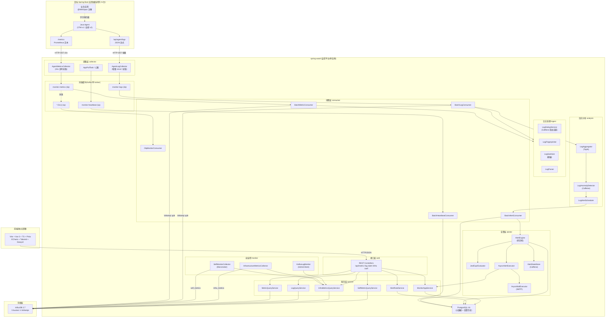
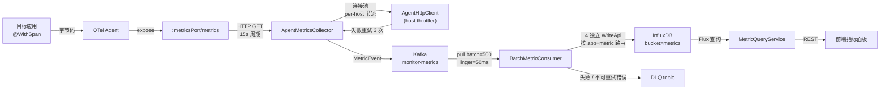
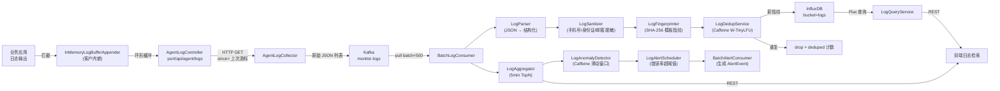
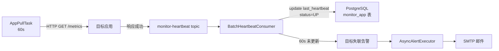
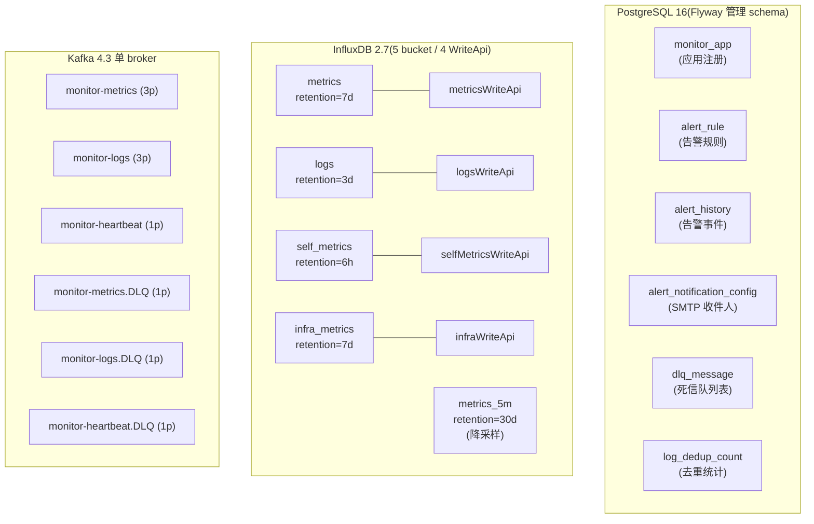
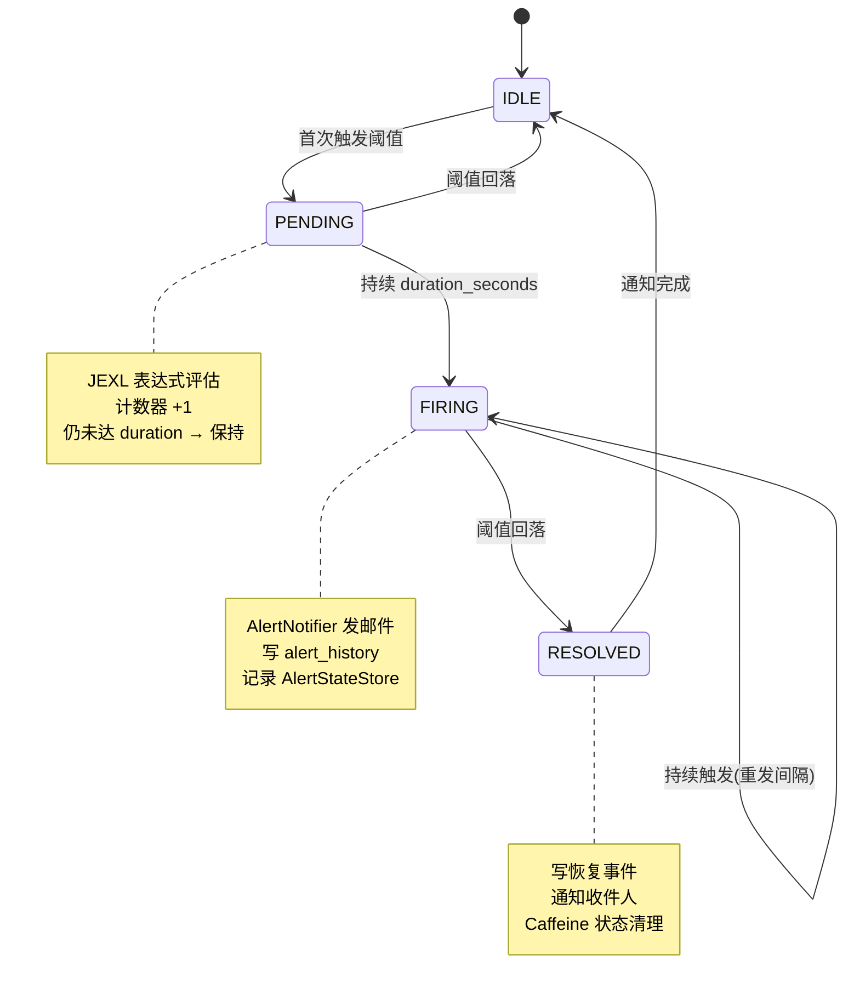
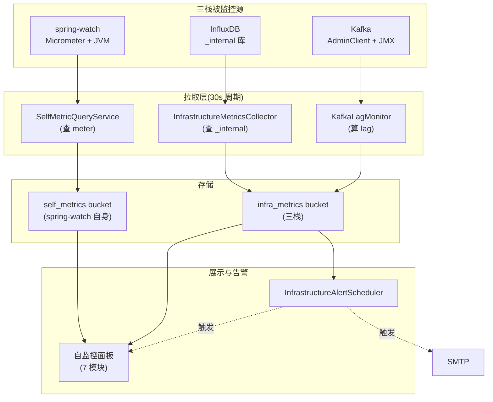
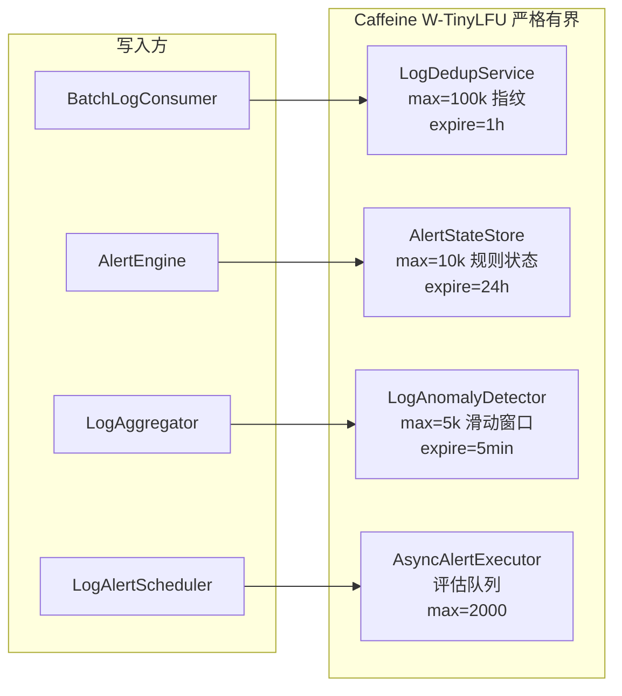
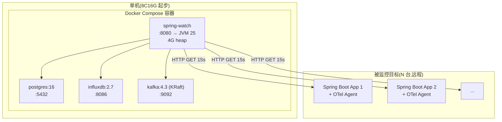

# spring-watch 架构图

> 覆盖范围:目标应用接入 → 平台采集 → 消息缓冲 → 入库存储 → 告警/自监控 → 前端可视化全链路。
> 部署形态:单机全栈单实例,`docker compose up -d` 5 分钟拉起。

---

## 一、总体架构图(Top-Level)

**关键设计点**:
- **拉模型**:平台主动 HTTP GET 目标,目标永不推送(`白皮书 0.5 约束 1`)
- **5 桶分桶 + 4 WriteApi**:`metrics` / `logs` / `self_metrics` / `metrics_5m` / `infra_metrics`,各走独立 buffer
- **Kafka 单 broker + Caffeine 替代 Redis**:v1.5/1.6 收敛,零外置状态依赖
- **三栈可观测**:spring-watch 自身 + InfluxDB + Kafka 全部经 30s 周期拉取进 `infra_metrics` 桶

---

## 二、数据流分层图(按链路展开)

### 2.1 指标链路(Metrics)

### 2.2 日志链路(Logs)

### 2.3 心跳链路(Heartbeat)

---

## 三、存储层架构

**WriteApi 分桶原因**(`白皮书 0.5 M-WriteApiSplit`):
- 各 WriteApi 独立 buffer / batch / flush 节奏
- 业务 metric 写爆不会拖死 self_metrics 写入
- 单批体积 5x,减少 InfluxDB HTTP 握手次数

---

## 四、告警引擎状态机

**规则类型**:
| ruleType | 数据源 | 评估周期 | 评估器 |
|---|---|---|---|
| `METRIC` | `metrics` bucket | 15s | `JexlExprEvaluator` |
| `LOG` | 日志错误率 | 1min | `LogAlertScheduler` |
| `INFRA` | `infra_metrics` bucket | 30s | `JexlExprEvaluator` |
| `HEARTBEAT` | `monitor_app.last_heartbeat` | 60s | `BatchHeartbeatConsumer` |

---

## 五、自监控 + 基础设施可观测(三栈)

**自监控七大模块**:
1. 总览 — JVM 堆 / 进程 CPU / 启动时长
2. 采集 — HTTP 成功/失败/超时 / 重投队列
3. JVM — G1 Eden/Old/Survivor / 线程 / 类加载
4. 进程 — RSS / CPU / FD
5. 指标库 — InfluxDB 写吞吐 / WriteApi 内部队列
6. InfluxDB — Go 堆 / TSM 缓存 / 活跃查询
7. Kafka — 消费 lag(per topic)/ 生产速率 / rebalance

---

## 六、本地缓存层(Caffeine 替代 Redis)

**v1.6 收敛原因**(`白皮书 0.6.3`):单实例部署下 Redis 是多余依赖,Caffeine 单机性能优于 Redis 网络往返。

---

## 七、部署拓扑(Docker Compose)

**资源基线**(`白皮书 0.4`):
| 组件 | CPU | 内存 |
|---|---|---|
| spring-watch JVM | 2~4 核 | 3~4 GB heap |
| InfluxDB | 1~2 核 | 1~2 GB |
| Kafka | 0.5 核 | 512 MB |
| PostgreSQL | 0.5 核 | 512 MB |
| **合计** | **4~7 核** | **5~7 GB** |

---

## 八、关键设计决策速查

| 决策 | 选择 | 备选 | 理由 |
|---|---|---|---|
| 拉 vs 推 | 拉 | 推(OTLP) | `白皮书 0.5 约束 1` 不可违反 |
| 存储 | InfluxDB 2.7 | Prometheus + Loki | 单技术栈,运维成本低 |
| 本地缓存 | Caffeine | Redis | 单实例下 Redis 是冗余依赖 |
| Kafka 分区 | 3/3/1/1 | 12/6/3/3 | `白皮书 0.5` 实测多分区无收益 |
| WriteApi | 4 桶分桶 | 1 个共享 | 单批体积 5x,故障隔离 |
| 告警表达式 | JEXL | 自研 DSL | 复用开源,表达式灵活 |
| 字节码 | OTel v1 / 自研 v2 | Spring AOP | 必须 Agent 拦截,AOP 失效 |
| 自监控栈 | 复用 InfluxDB | 引 Prometheus | 零外依赖,统一技术栈 |

---

## 九、演进路线

| 版本 | 目标 | 关键变更 |
|---|---|---|
| **v1.0~1.1** | MVP 跑通 | OTel Agent + Kafka + InfluxDB 基础链路 |
| **v1.2** | 接入简化 | `@WithSpan` 替代 `@SpringWatch` 注解 |
| **v1.3** | 高可用打磨 | WriteApi 分桶、CONCURRENTLY 死锁修复 |
| **v1.4** | 写入并发压榨 | M-WriteApiSplit 落地(4 WriteApi) |
| **v1.5** | 资源收敛 | Kafka partition 12→3/3/1/1 |
| **v1.6** | 零外状态依赖 | Caffeine 替代 Redis(`LogDedup` / `AlertState` / `Anomaly`) |
| **v2(目标)** | 自研 Agent | `-javaagent` 1 参数接入,0 annotation jar |

---

## 十、术语表

| 术语 | 含义 |
|---|---|
| **拉模型** | 平台主动 HTTP GET 目标,目标永不推送 |
| **WriteApi** | InfluxDB Java SDK 的异步批量写入客户端 |
| **DLQ** | Dead Letter Queue,死信队列,消费失败消息兜底 |
| **JEXL** | Java Expression Language,告警阈值表达式 |
| **Caffeine W-TinyLFU** | 高命中率 + 低内存的本地缓存算法 |
| **降采样** | 5min 窗口聚合指标,降低长期存储成本 |
| **Flyway** | 数据库 schema 迁移工具 |
| **OTel Agent** | OpenTelemetry Java Agent,字节码拦截器 |
| **自研 Agent(v2)** | 项目自研的 Java Agent,统一日志+方法级+SQL 监控 |
