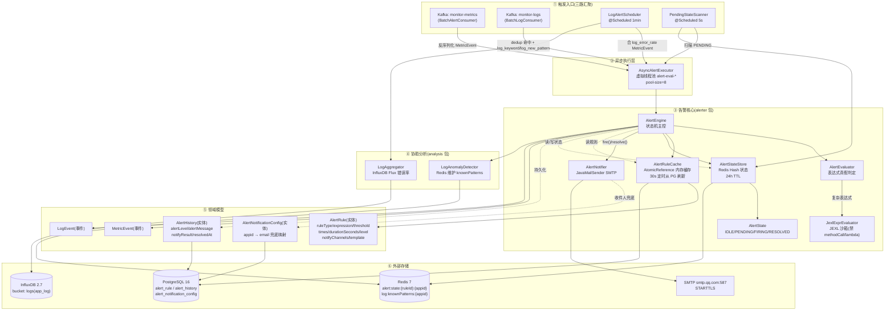
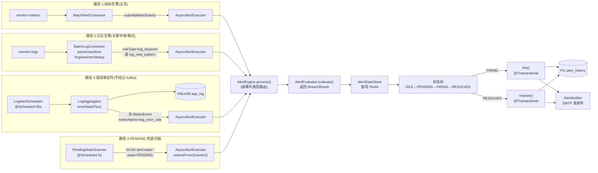
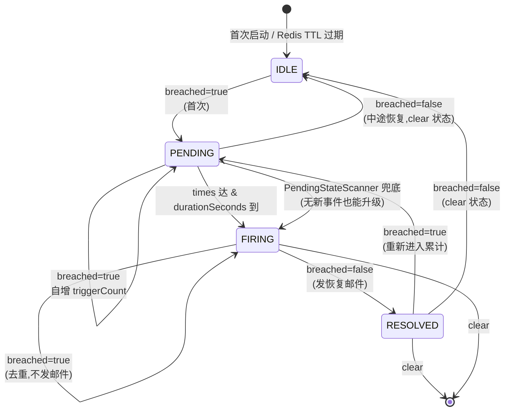
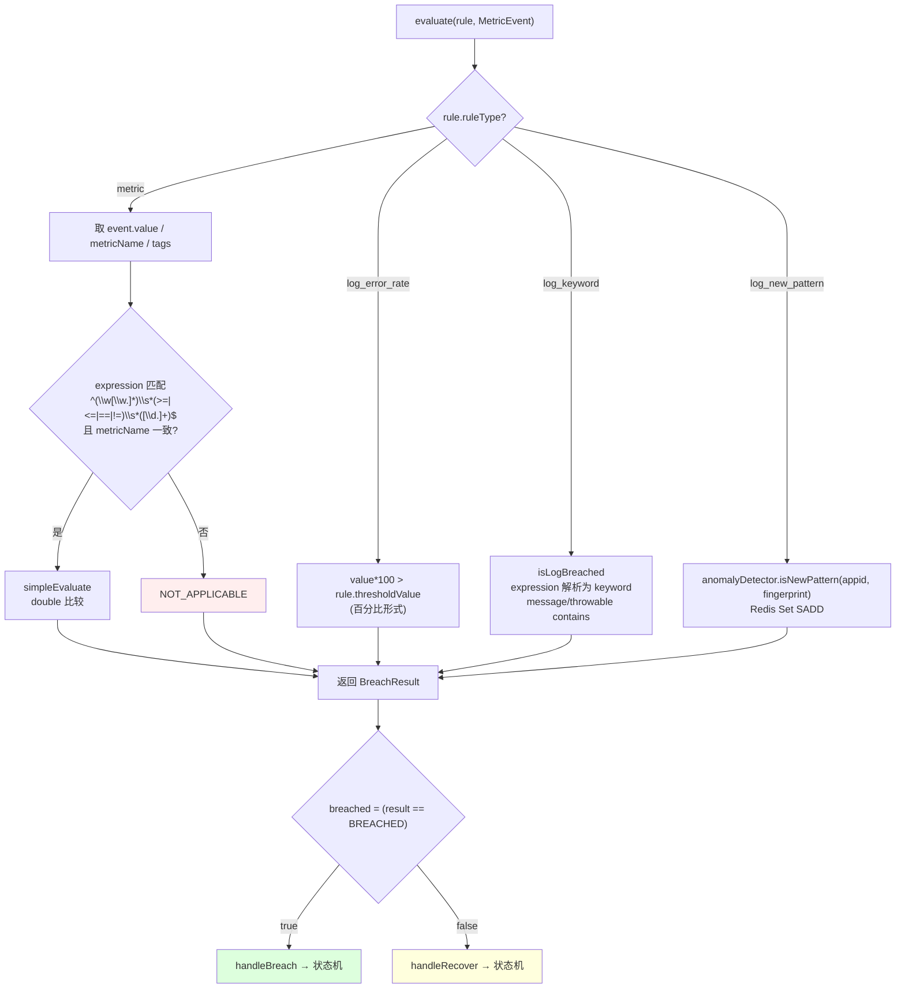
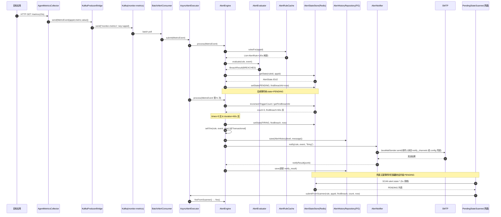
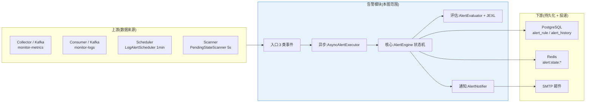

# 告警模块架构图

> 范围:`com.springwatch.alerter.*` + 与告警强相关的 `analysis.*` / `consumer.*` / `service.*` 子集。
> 基于当前代码(9 个告警核心类、3 条触发路径、4 态状态机)绘制。

---

## 1. 告警模块全景架构(组件图)

---

## 2. 告警数据流(三种触发路径 + 状态机)

---

## 3. 状态机详解(借鉴 HertzBeat PeriodicAlertRuleScheduler)

**触发条件细则:**

| 当前态 | 条件 | 动作 |
|---|---|---|
| IDLE | breached | 写 PENDING,记 firstBreachAt,清 triggerCount |
| IDLE | 未 breached | 保持 IDLE |
| PENDING | breached | 自增 triggerCount;若 `count >= times` 且 `elapsed >= durationSeconds × 1000ms` → FIRING + `fire()` |
| PENDING | 未 breached | `stateStore.clear()` 回 IDLE |
| FIRING | breached | 跳过(去重,不重发邮件) |
| FIRING | 未 breached | 写 RESOLVED + `resolve()` + 发恢复邮件 + clear |
| RESOLVED | breached | 重新进入 PENDING,清 triggerCount |
| RESOLVED | 未 breached | clear |

> **PENDING 兜底设计**:若 `times > 1`,事件流稀疏时(例如 10s 才来一个事件)可能永远凑不够 `times`,所以 `PendingStateScanner` 每 5s 扫一次,只要 durationSeconds 到了且 triggerCount 累计数够了就强制升级到 FIRING。

---

## 4. 评估内部流程(`AlertEvaluator` 分支)

> **JEXL 沙箱**(`JexlConfig`):`Uberspect(null, sandbox, false)`,关闭 `methodCallExecutor / lambdaExecutor / setMutableLoops / newInstanceExecutor`,防止规则表达式 RCE。
> 上下文变量:`value / metric / __app__ / __count__ / event.tags.*`。

---

## 5. 关键类职责(告警域)

| 类 | 文件 | 职责 |
|---|---|---|
| `AlertEngine` | `alerter/AlertEngine.java` | 状态机主控,处理 MetricEvent/LogEvent/扫描器事件三类入口 |
| `AlertEvaluator` | `alerter/AlertEvaluator.java` | 表达式真假判定,简单正则 + JEXL 委派,返回 `BreachResult` |
| `JexlExprEvaluator` | `alerter/JexlExprEvaluator.java` | JEXL 沙箱执行,context 注入 value/metric/tags |
| `AlertRuleCache` | `alerter/AlertRuleCache.java` | `AtomicReference<Map<Long, List<AlertRule>>>`,30s 定时从 PG 刷新 |
| `AlertStateStore` | `alerter/AlertStateStore.java` | Redis Hash 持久化状态,key=`alert:state:{ruleId}:{appid}`,24h TTL |
| `AlertState` | `alerter/AlertState.java` | 4 态枚举 `IDLE / PENDING / FIRING / RESOLVED` |
| `AsyncAlertExecutor` | `alerter/AsyncAlertExecutor.java` | 虚拟线程池(默认 8),统一调度 metric/log/scanner 三类任务 |
| `AlertNotifier` | `alerter/AlertNotifier.java` | SMTP 邮件发送,8 个占位符模板,支持规则 → 配置表 → null 三级回退 |
| `PendingStateScanner` | `alerter/PendingStateScanner.java` | `@Scheduled(fixedDelay=5000)`,兜底 PENDING 升级 |
| `LogAlertScheduler` | `analysis/LogAlertScheduler.java` | `@Scheduled(fixedRate=60000)`,合成 `log_error_rate` MetricEvent |
| `LogAnomalyDetector` | `analysis/LogAnomalyDetector.java` | Redis 维护 `log:knownPatterns:{appid}`,判断新模式 |
| `LogAggregator` | `analysis/LogAggregator.java` | InfluxDB Flux 聚合,提供 `errorRate` |
| `BatchAlertConsumer` | `consumer/BatchAlertConsumer.java` | 监听 `monitor-metrics`,转交 `AsyncAlertExecutor` |
| `BatchLogConsumer` | `consumer/BatchLogConsumer.java` | 监听 `monitor-logs`,dedup 后把 log_keyword/log_new_pattern 投评估 |
| `AlertRuleService` | `service/AlertRuleService.java` | 规则 CRUD(目前无 HTTP Controller 入口) |
| `JexlConfig` | `config/JexlConfig.java` | 沙箱化 `JexlEngine` 装配 |
| `MailConfig` | `config/MailConfig.java` | `JavaMailSender` 装配,SMTP 587 + STARTTLS |

---

## 6. 数据模型

### 6.1 AlertRule(`alert_rule` 表)

| 字段 | 类型 | 必填 | 含义 |
|---|---|---|---|
| `id` | bigint | 是 | 主键 |
| `appid` | bigint (FK→monitor_app) | 是 | 所属应用 |
| `rule_name` | varchar | 是 | 规则名 |
| `rule_type` | varchar | 是 | `metric` / `log_error_rate` / `log_keyword` / `log_new_pattern` |
| `expression` | text | 是 | 表达式或关键字 |
| `threshold_value` | numeric | 否 | 数值阈值(`log_error_rate` 用) |
| `duration_seconds` | int | 是,默认 60 | 持续多少秒后从 PENDING → FIRING |
| `times` | int | 是,默认 1 | 窗口内累计触发次数达标才升级到 FIRING |
| `notify_channels` | jsonb | 否 | 形如 `{"email":"ops@example.com"}` |
| `template` | text | 否 | 邮件正文模板,8 占位符 |
| `level` | varchar | 是,默认 `warning` | 告警等级 |
| `status` | varchar | 是,默认 `enabled` | `enabled` 才被 `AlertRuleCache` 加载 |

### 6.2 AlertHistory(`alert_history` 表)

| 字段 | 类型 | 含义 |
|---|---|---|
| `id` | bigint | 主键 |
| `rule_id` | bigint (FK) | 触发的规则 |
| `appid` | bigint (FK) | 应用 |
| `alert_level` | varchar | 等级(从规则继承) |
| `alert_message` | text | 告警描述 |
| `notify_result` | jsonb | 通知结果回写(收件人/状态/错误) |
| `created_at` | timestamp | 触发时间 |
| `resolved_at` | timestamp | 恢复时间(未恢复为 null) |

### 6.3 邮件模板占位符

| 占位符 | 替换值 |
|---|---|
| `{{level}}` | `rule.level` |
| `{{type}}` | firing / resolved |
| `{{app}}` | app.appName |
| `{{appid}}` | event.appid |
| `{{metric}}` | event.metricName |
| `{{value}}` | event.value |
| `{{threshold}}` | rule.thresholdValue |
| `{{rule}}` | rule.ruleName |
| `{{time}}` | Instant.now() |
| `{{expression}}` | rule.expression |

---

## 7. 外部依赖

| 依赖 | 用途 | 关键配置 |
|---|---|---|
| **PostgreSQL 16** | 规则 / 历史 / 通知配置 | `db/migration/V1..V10` |
| **Redis 7** | 告警状态 + 已知模式 + 错误率 | key 前缀 `alert:state:*` / `log:knownPatterns:*` |
| **InfluxDB 2.7** | 错误率查询(供 LogAlertScheduler) | bucket `logs`,measurement `app_log` |
| **Apache Kafka 4.3** | 事件流(`monitor-metrics` / `monitor-logs`) | 12 分区 |
| **SMTP** | 邮件发送 | `smtp.qq.com:587`,STARTTLS |
| **commons-jexl3 3.4.0** | 表达式求值 | JEXL 沙箱配置 |
| **spring-boot-starter-mail** | 邮件客户端 | — |
| **spring-boot-starter-data-jpa** | PG 仓储 | — |
| **spring-boot-starter-data-redis** | Redis 客户端 | — |
| **spring-kafka** | Kafka 消费 | — |

---

## 8. 时序图(指标告警完整链路)

---

## 9. 已知缺陷与"生产可用"差距

> 来源:`docs/监控体系完备性检查_采集存储告警日志.md` + 代码核查

| 级别 | 缺陷 | 位置 |
|---|---|---|
| P0-1 | 无 `AlertController` HTTP 入口,规则只能手工 SQL | `service/AlertRuleService` 无 Controller |
| P0-2 | `AlertRuleService.createRule` 签名缺 `level/times/template` 字段 | `service/AlertRuleService.java` |
| P0-3 | `AlertRuleCache` 无 `invalidate()`,新规则要等 30s 自动刷新 | `alerter/AlertRuleCache.java` |
| P0-4 | 通知仅支持 SMTP 邮件,Webhook/钉钉/飞书未实现 | `alerter/AlertNotifier.java` |
| P0-5 | SMTP 密码明文写在 `application.yml` | `application.yml:57` |
| P0-6 | `spring-watch.alert.enabled=true` 无 `@ConditionalOnProperty` 校验 | 全局 |
| P0-7 | `log_keyword` 走偏:dedup 丢弃的 error 日志不参与告警 | `consumer/BatchLogConsumer.java` |
| P1-9 | 告警抑制(静默/inhibit/维护期)缺失 | `alerter/` |
| P1-10 | 告警去重/合并缺失,同 rule 触发 5 次写 5 条 history | `alerter/AlertEngine.fire()` |
| P1-12 | 恢复通知无节流,抖动型故障会刷屏 | `alerter/AlertEngine.resolve()` |
| P2-1 | `alert_history` 无主动清理,数据无限增长 | — |

---

## 10. 与上下游的边界

