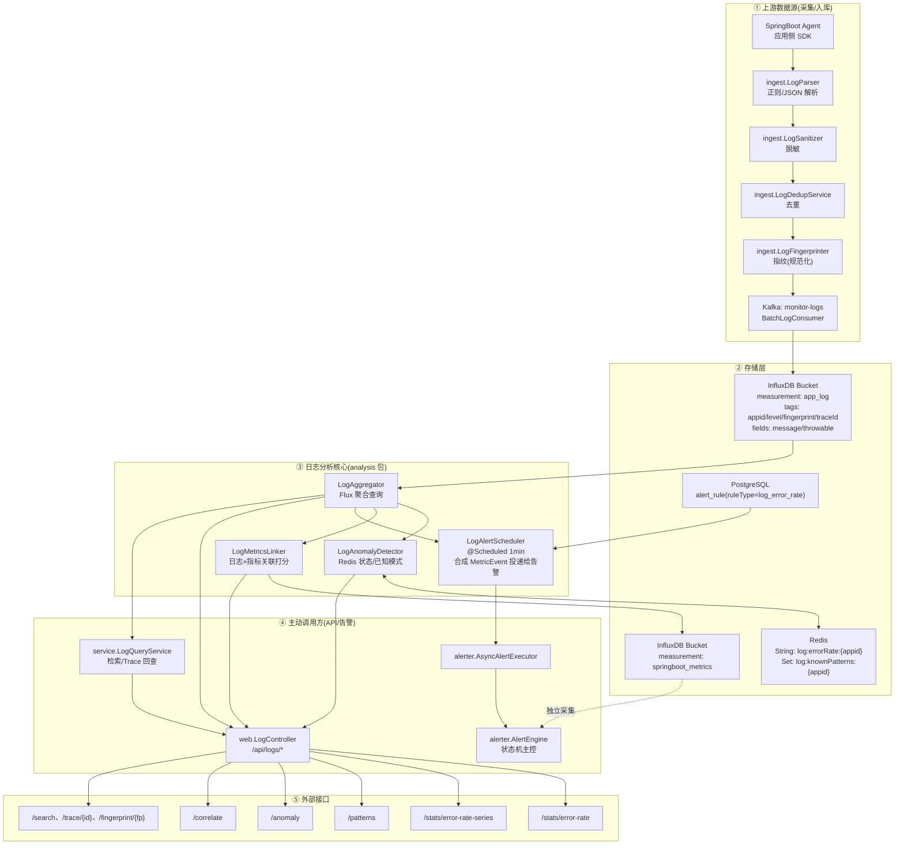
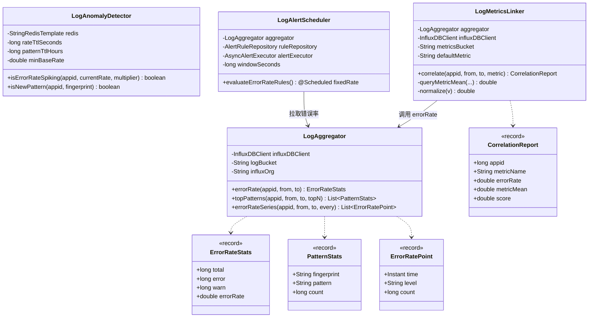
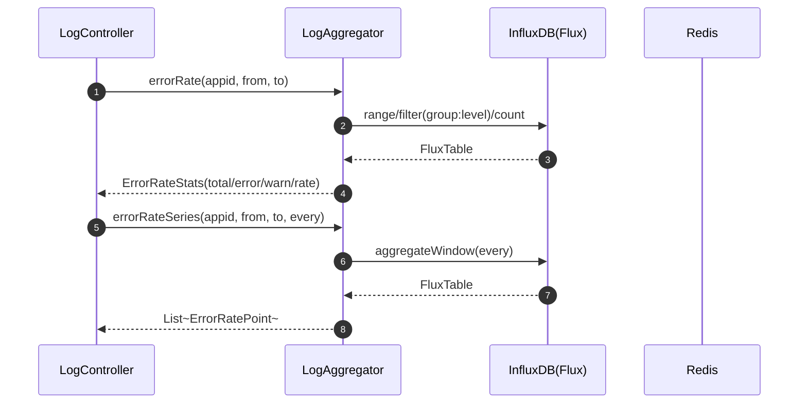
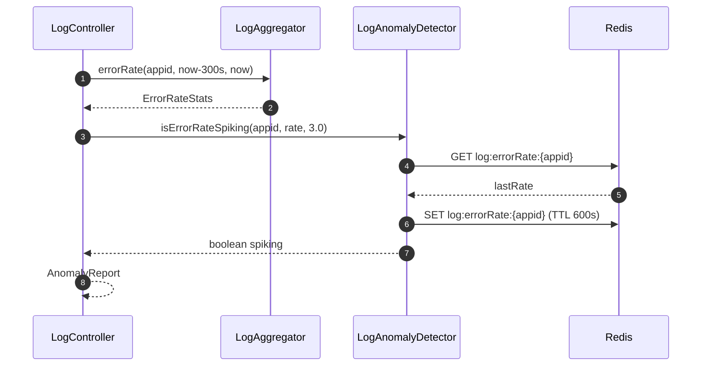
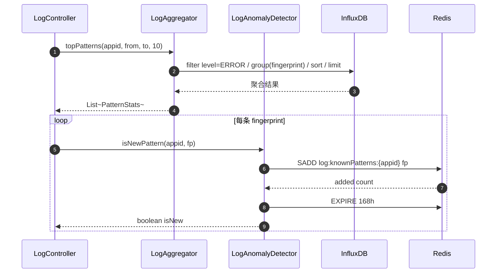
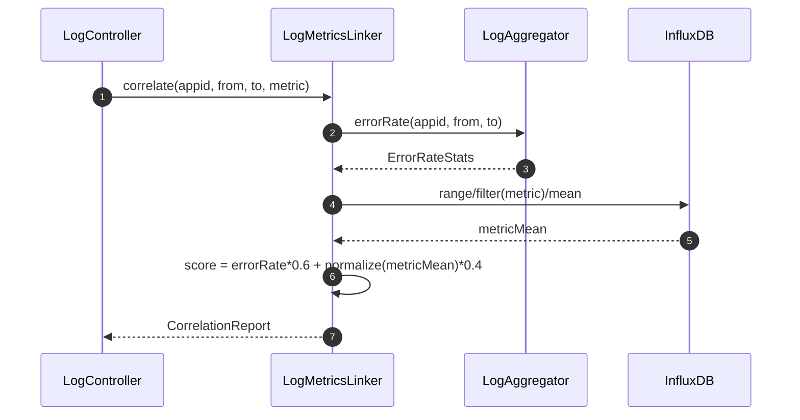
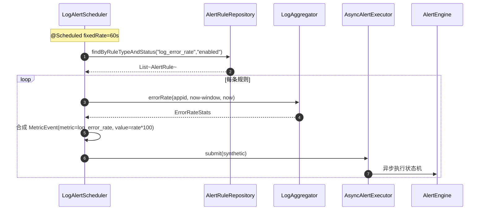
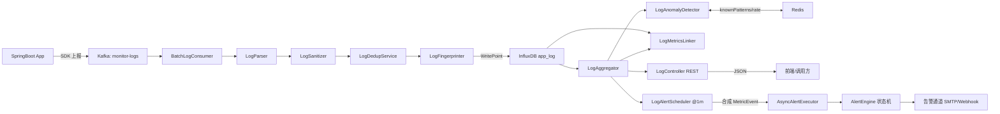

# 日志分析模块架构图

> 范围:`com.springwatch.analysis.*` (4 个核心类) + 直接调用方 + 上游数据源 + 下游消费者。
> 基于当前代码(聚合/异常检测/关联/调度四类职责)绘制。

---

## 1. 日志分析模块全景架构(组件图)

---

## 2. 类级别静态结构(类图)

---

## 3. 核心调用链路(时序图)

### 3.1 错误率查询链路

### 3.2 异常突增检测链路

### 3.3 TopN 异常模式 + 新模式发现

### 3.4 日志×指标关联打分

### 3.5 错误率告警调度(定时投递给告警引擎)

---

## 4. 数据流总览(端到端)

---

## 5. 关键设计要点

| 维度 | 设计 | 落点 |
|------|------|------|
| 查询引擎 | InfluxDB Flux + group/count/sort/limit | `LogAggregator` |
| 状态持久化 | Redis TTL 控制窗口记忆 | `LogAnomalyDetector` |
| 关联算法 | 线性加权 score = err*0.6 + norm(metric)*0.4 | `LogMetricsLinker#correlate` |
| 调度策略 | `fixedRate` 而非 `fixedDelay`,避免执行慢导致窗口间隙 | `LogAlertScheduler` |
| 告警对接 | 错误率转 `MetricEvent` 复用指标告警通道 | `LogAlertScheduler#submit` |
| API 边界 | 只读聚合/异常/关联,落库由 ingest/consumer 负责 | `LogController` |
