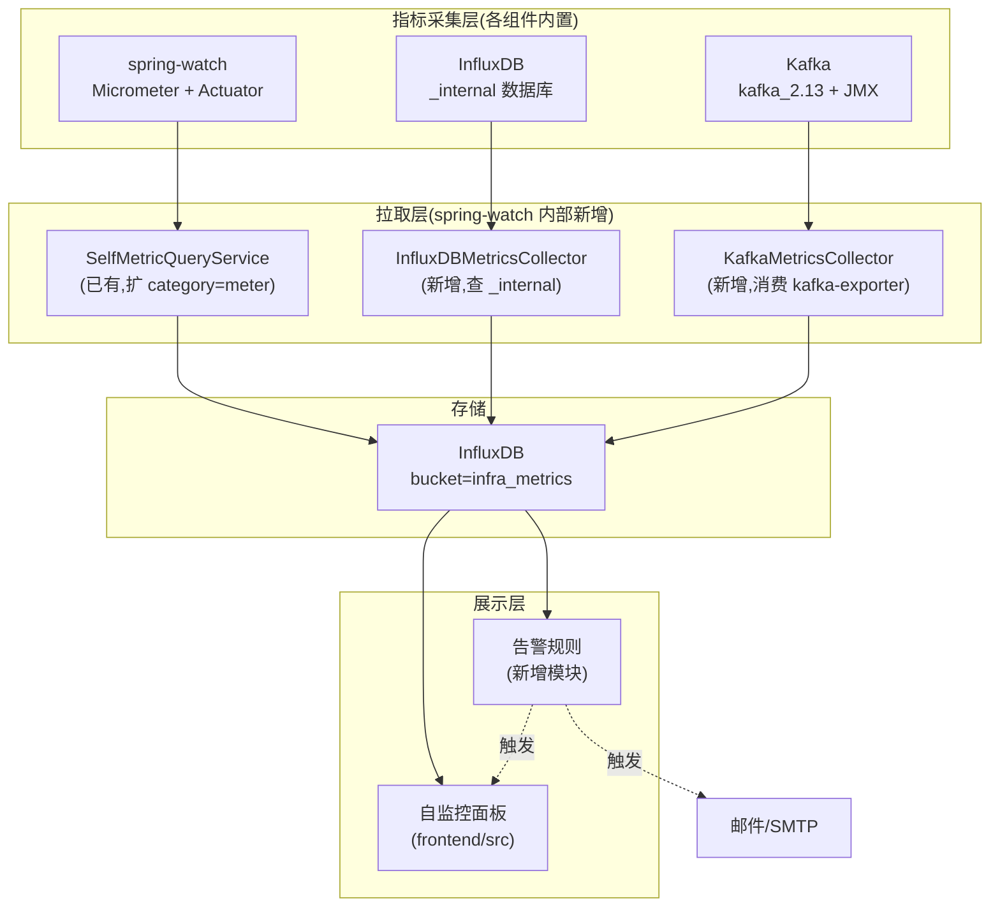

# spring-watch 平台可观测性规划(自监控 + InfluxDB + Kafka)

> 目标:把目前"只能事后看自监控面板"升级为**"三栈全链路实时观测 + 主动告警"**。
> 范围:spring-watch 自身、InfluxDB、Kafka 三套组件的关键指标采集、存储、展示、告警全链路。

---

## 一、总体架构



**关键设计**:
- **零外部依赖**:不引 Prometheus/Grafana,复用现有 InfluxDB + 自监控面板
- **统一存储**:三栈指标都进 `infra_metrics` bucket,共用前端展示
- **拉模型一致**:与 spring-watch 监控目标应用同款 Pull 思路

---

## 二、监控指标清单

### A. spring-watch 自身(已有,需补全)

#### A.1 JVM 运行时(已部分有,补 G1 分代)

| 指标 | 类型 | 来源 | 阈值告警 |
|---|---|---|---|
| `jvm_memory_used_bytes{area="heap"}` | Gauge | Micrometer | >70% 黄,>85% 红 |
| `jvm_memory_used_bytes{area="nonheap"}` | Gauge | Micrometer | >256MB 告警 |
| `jvm_memory_max_bytes{area="heap"}` | Gauge | Micrometer | - |
| `jvm_gc_pause_seconds_count` | Counter | Micrometer | rate > 0.1/s 告警 |
| `jvm_gc_pause_seconds_sum` | Counter | Micrometer | 单次 > 500ms 告警 |
| `jvm_threads_states_threads` | Gauge | Micrometer(补) | >500 告警 |
| `jvm_classes_loaded_classes` | Gauge | Micrometer(补) | 单调递增监控 |
| `process_cpu_usage` | Gauge | Micrometer(补) | >80% 持续 5m 告警 |
| `process_memory_rss_bytes` | Gauge | Micrometer(已有) | >2GB 告警 |
| **G1 Eden Space used** | Gauge | **新增** | >80% 触发 Young GC 频繁 |
| **G1 Old Gen used** | Gauge | **新增** | >70% 黄,>85% 红 |
| **G1 Survivor used** | Gauge | **新增** | - |

#### A.2 业务指标(已有,需补全)

| 指标 | 类型 | 用途 | 告警 |
|---|---|---|---|
| `spring.watch.collector.http.success` | Counter | HTTP 拉取成功 | - |
| `spring.watch.collector.http.failure` | Counter | HTTP 拉取失败 | rate > 0.5/s 告警 |
| `spring.watch.collector.http.timeout` | Counter | HTTP 超时 | >10/min 告警 |
| `spring.watch.collector.http.active` | Gauge | 活跃 HTTP 抓取 | >100 告警 |
| `spring.watch.collector.kafka.fallback.size` | Gauge | Kafka 兜底队列 | >5000 告警,>8000 红 |
| `spring.watch.collector.retry.queue.size` | Gauge | 重投队列 | >500 告警 |
| `spring.watch.collector.host_throttler.active` | Gauge | 限流主机数 | - |
| `spring.watch.consumer.metric.received` | Counter | 指标消费条数 | - |
| `spring.watch.consumer.metric.kept` | Counter | 指标写入成功 | - |
| `spring.watch.consumer.metric.write_fail` | Counter | 指标写失败 | rate > 0.1/s 告警 |
| `spring.watch.consumer.log.received` | Counter | 日志消费条数 | - |
| `spring.watch.consumer.log.deduped` | Counter | 日志去重 | - |
| `spring.watch.consumer.log.write_fail` | Counter | 日志写失败 | rate > 0.1/s 告警 |
| `spring.watch.consumer.heartbeat.lag_ms` | Gauge | **新增**心跳延迟 | >30s 告警 |
| `spring.watch.kafka.consumer.lag` | Gauge | **新增**各 topic 消费 lag | >10000 告警 |
| `spring.watch.ingest.log.dedup.keep` | Counter | 日志去重保留 | - |
| `spring.watch.ingest.log.dedup.drop` | Counter | 日志去重丢弃 | - |
| `spring.watch.alert.history.total_rows` | Gauge | 告警历史表行数 | - |
| `spring.watch.alert.history.purged` | Counter | 告警历史清理 | - |
| `spring.watch.alert.engine.queue.size` | Gauge | **新增**告警评估队列 | - |
| `spring.watch.self.monitor.ring.size` | Gauge | 自监控 ring | - |
| `spring.watch.self.monitor.persist.fail` | Counter | 自监控写 InfluxDB 失败 | rate > 0.1/s 告警 |

#### A.3 新增写入 InfluxDB 客户端健康(本次重点)

| 指标 | 类型 | 用途 |
|---|---|---|
| **InfluxDB WriteApi 内部队列大小** | Gauge(反射) | 检测写入堆积 |
| **InfluxDB QueryApi 连接池** | Gauge(JMX) | 检测连接泄漏 |
| **InfluxDB HTTP 失败重试次数** | Counter(从 OkHttp metrics) | 失败率 |

#### A.4 应用层(被监控的 1 个 mock)

| 指标 | 已有? | 备注 |
|---|---|---|
| `monitor_app.status` (PG `monitor_app.status`) | DB | 拉模型拉取后入库 |
| `monitor_app.last_heartbeat` | DB | 过期 >60s 告警"目标失联" |
| `monitor_app.pull_total` | Counter(补) | 累计拉取次数 |
| `monitor_app.pull_fail` | Counter(补) | 拉取失败次数 |
| `monitor_app.collect_lag_seconds` | Gauge(补) | 当前时间 - 最后成功拉取时间 |

### B. InfluxDB 监控(本次重点,新模块)

**数据源**:InfluxDB 自己的 `_internal` 数据库(默认开启)

#### B.1 进程级

| 指标 | 字段 | 单位 | 来源 |
|---|---|---|---|
| Go 堆使用 | `go_memstats_heap_inuse_bytes` | bytes | `_internal"."monitor"` |
| Go 堆分配 | `go_memstats_heap_alloc_bytes` | bytes | 同上 |
| Go 协程数 | `go_goroutines` | count | 同上 |
| GC 次数 | `go_gc_duration_seconds_count` | count | 同上 |
| GC 耗时 | `go_gc_duration_seconds_sum` | seconds | 同上 |
| 进程内存 RSS | `process_resident_memory_bytes` | bytes | 同上 |
| 进程虚拟内存 | `process_virtual_memory_bytes` | bytes | 同上 |
| 打开 FD 数 | `process_open_fds` | count | 同上 |

#### B.2 HTTP API

| 指标 | 字段 | 单位 |
|---|---|---|
| HTTP 请求总数 | `http_request_duration_seconds_count` | count |
| HTTP 写请求总数 | `write_request_bytes` (or `influxdb_write_request_bytes`) | count |
| HTTP 写请求字节 | `http_write_request_bytes` | bytes |
| HTTP 读查询请求 | `query_request_bytes` | count |
| HTTP 失败请求 | `http_request_duration_seconds_bucket{status=~"5.."}` | count |
| HTTP 活跃连接 | `influxdb_httpd_active_connections` | count |

#### B.3 存储引擎(本次重点,这次挂掉的真凶)

| 指标 | 字段 | 告警 |
|---|---|---|
| **TSM 块缓存使用** | `storage_engine_cache_size_bytes` 或 `influxdb_tsm_cache_size_bytes` | >200MB 告警(我们设的上限 256MB) |
| **TSM 块缓存命中率** | `storage_engine_cache_compactions` | - |
| **TSI 索引内存** | `storage_engine_index_inuse_bytes` | - |
| 当前打开 shard 数 | `storage_engine_shards` | - |
| 活跃 series 数 | `storage_engine_series` | - |
| **WAL 大小** | `storage_engine_wal_size_bytes` | >1GB 告警 |
| **待压缩文件数** | `storage_engine_compactions_pending` | >50 告警 |
| **compaction 耗时** | `tsm_compaction_duration_seconds_sum` | - |
| 写入吞吐量 | `write_ok` | rate 监控 |

#### B.4 Flux 查询引擎

| 指标 | 字段 | 告警 |
|---|---|---|
| **活跃查询数** | `influxdb_queryExecutor_activeQueries` | >20 告警 |
| **查询被内存限制拒绝** | `query_control_request` 或 `query_control_compact` | rate > 0 立即告警 |
| 平均查询耗时 | `query_request_duration_seconds_sum / count` | >5s 告警 |
| **downsample task 失败** | `tasks` 中的 `lastError` | 失败立即告警 |

#### B.5 自身任务(我们创建的两个 downsample)

| 指标 | 来源 |
|---|---|
| `tasks{spring-watch-downsample-metrics}.lastSuccess` | 查 tasks API |
| `tasks{spring-watch-downsample-metrics}.lastError` | 查 tasks API |
| 任务下次执行时间 | 查 tasks API |

#### B.6 健康检查(简单但关键)

```
# 已有
GET /health
GET /metrics

# 自定义
GET /debug/vars
GET /debug/pprof  (可选,生产慎用)
```

### C. Kafka 监控(本次重点,新模块)

**数据源**:Kafka 内置 metrics 通过 JMX 暴露,kafka-exporter 转 Prometheus 格式,然后我们拉。

#### C.1 Broker 进程

| 指标 | 字段 | 告警 |
|---|---|---|
| 活跃 controller 数 | `kafka_controller_active_count` | !=1 告警(cluster 异常) |
| **Broker 进程 CPU** | `process_cpu_seconds_total` | >80% 告警 |
| **Broker 进程内存** | `process_resident_memory_bytes` | >2GB 告警 |
| **磁盘使用率** | `disk_usage_bytes` | >80% 告警 |
| **磁盘剩余空间** | `disk_free_bytes` | <10GB 告警 |
| 网络吞吐 | `network_io_bytes` | - |

#### C.2 Topic / Partition

| 指标 | 字段 | 告警 |
|---|---|---|
| **Topic 列表** | `kafka_topic_partition_count` | - |
| **各 topic 消息总数** | `kafka_topic_partition_current_offset` | - |
| **Log size** | `kafka_log_size_bytes` | >10GB 告警 |
| **Log segment 数** | `kafka_log_num_log_segments` | 持续上涨告警 |
| **消息 in/out 速率** | `kafka_server_broker_topic_metrics_total` | - |

#### C.3 消费者(spring-watch 自己)

| 指标 | 字段 | 告警 |
|---|---|---|
| **每个 topic 消费 lag** | `kafka_consumergroup_lag{topic="monitor-metrics"}` | >10000 黄,>50000 红 |
| **lag 时间(秒)** | `kafka_consumergroup_lag_time_ms` | >30s 黄,>120s 红 |
| 消费速率 | `kafka_consumergroup_records_consumed_rate` | rate=0 持续 1m 告警 |
| 提交 offset 速率 | `kafka_consumergroup_offset_commits_rate` | - |
| rebalance 次数 | `kafka_consumer_rebalance_total` | 频繁 rebalance 告警 |

#### C.4 生产者(spring-watch 自己)

| 指标 | 字段 | 告警 |
|---|---|---|
| **生产速率** | `kafka_producer_record_send_rate` | - |
| **生产失败** | `kafka_producer_record_error_total` | rate > 0.1/s 告警 |
| **重试次数** | `kafka_producer_record_retry_total` | rate > 0.5/s 告警 |
| **队列堆积** | `kafka_producer_record_queue_time_avg` | >100ms 告警 |
| **buffer 使用** | `kafka_producer_buffer_available_bytes` | <1MB 告警 |
| **网络 idle** | `kafka_producer_network_idle` | <20% 告警 |

#### C.5 主题特定监控

```
monitor-metrics     12 partition
monitor-logs         6 partition
monitor-heartbeat    3 partition
monitor-metrics.DLQ  3 partition
monitor-logs.DLQ     3 partition
monitor-heartbeat.DLQ 3 partition
```

每个 topic 都应监控:
- 消息数
- 字节数
- 消费 lag
- 生产者错误数

---

## 三、采集实现方案

### 3.1 新增 `InfrastructureMetricsCollector`(核心)

**文件**:`src/main/java/com/springwatch/monitor/InfrastructureMetricsCollector.java`

**职责**:
- 拉 InfluxDB `_internal` 指标 → 写 InfluxDB `infra_metrics` 桶
- 拉 Kafka JMX/Exporter 指标 → 写 InfluxDB `infra_metrics` 桶
- 拉 spring-watch 自身 JMX 指标(补 G1 分代)→ 写 `infra_metrics` 桶

**关键设计**:
- 30s 周期拉取(避免频繁)
- 复用 `SelfMonitorCollector` 的 InfluxDB WriteApi
- 复用 Micrometer `MeterRegistry` 暴露给前端

### 3.2 新增 `KafkaMetricsExporter`

**文件**:`src/main/java/com/springwatch/monitor/KafkaMetricsExporter.java`

**方式**:
- 不引入额外组件
- 用 AdminClient 查 Kafka offsets
- 算 lag = current_offset - committed_offset

```java
AdminClient admin = AdminClient.create(props);
Map<TopicPartition, OffsetAndMetadata> committed = admin.listConsumerGroupOffsets(groupId)
    .partitionsToOffsetAndMetadata().get();
Map<TopicPartition, ListOffsetsResult.ListOffsetsResultInfo> endOffsets = 
    admin.listOffsets(topicPartitions.stream()
        .map(tp -> new OffsetSpec.LatestSpec().toBuilder().topicPartition(tp).build())
        .collect(toList())).all().get();
for (tp : endOffsets) {
    long lag = endOffsets.get(tp).offset() - committed.get(tp).offset();
}
```

### 3.3 InfluxDB 自身

**方式 A(简单)**:用 InfluxDB Java client 查 `_internal` 桶

```java
String flux = """
    from(bucket: "_internal")
      |> range(start: -1m)
      |> filter(fn: (r) => r._measurement == "go_memstats" or r._measurement == "storage_engine")
    """;
List<FluxTable> tables = queryApi.query(flux, "_internal");
```

**方式 B(更全)**:起个 `influxdb-client` 进程,定期 `influx query` → 解析 → 写回

**推荐**:方式 A,简单足够。

### 3.4 spring-watch 自身新增指标实现位置

| 指标 | 位置 | 改动 |
|---|---|---|
| G1 Eden/Old Gen 内存 | `SelfMonitorCollector.java` | 新增 3 个 Gauge |
| InfluxDB WriteApi 内部队列 | `SelfMonitorCollector.java` | 反射注入 |
| 消费者 lag | `BatchMetricConsumer` / `BatchLogConsumer` | 通过 `KafkaListener` 的 `Consumer<?,?>` 拿 |
| 告警评估队列 | `AsyncAlertExecutor` | 注入 `queue.size()` |

### 3.5 告警规则模块

**文件**:`src/main/java/com/springwatch/alerter/InfrastructureAlertRules.java`

**核心思想**:复用现有告警引擎,新增一类规则类型 `infra_alert`,数据源是 `infra_metrics` 桶,指标名是 `heap_used_pct` 之类。

**预置规则**(代码中写死,可配置):

```yaml
infra_alerts:
  - name: influxdb_heap_high
    metric: storage_engine_cache_size_bytes
    threshold: 230
    op: ">"
    duration_seconds: 300
    level: warning
  - name: kafka_lag_high
    metric: kafka_consumer_lag
    topic: monitor-metrics
    threshold: 10000
    duration_seconds: 60
    level: warning
  - name: jvm_old_gen_high
    metric: jvm_g1_old_gen_used_pct
    threshold: 85
    duration_seconds: 300
    level: critical
```

---

## 四、存储与展示

### 4.1 bucket 划分

| bucket | 保留 | 内容 |
|---|---|---|
| `metrics` | 7 天 | 目标应用指标(已有) |
| `logs` | 3 天 | 目标应用日志(已有) |
| `self_metrics` | 6h | spring-watch 自身 JVM/process/meter(已有) |
| `metrics_5m` | 30 天 | 降采样指标(已有) |
| **`infra_metrics`** | **7 天** | **三栈基础设施指标(新增)** |
| `dlq_messages` | - | DLQ 表(已有) |

### 4.2 前端自监控面板扩展

**现有面板**(`docs/img/3.png`):
- JVM 堆 / 进程内存 / CPU
- 启动时长
- 活跃 HTTP 抓取

**新增卡片**(规划):

| 区域 | 卡片 |
|---|---|
| **JVM 详细** | G1 Old Gen / G1 Eden / Metaspace / 线程数 / 类加载数 |
| **GC 详细** | Young GC 频率 / Full GC 频率 / GC 总暂停 / 最大单次暂停 |
| **采集层** | HTTP 成功/失败/超时 / 重投队列大小 / 限流主机数 |
| **消费层** | 指标/日志消费速率 / 写 InfluxDB 失败率 / Kafka 兜底队列 |
| **告警** | 评估队列 / 状态机分布 / 历史表行数 |
| **InfluxDB** | Go 堆 / 协程数 / TSM 缓存 / TSI 索引 / 活跃查询 / 写入吞吐 |
| **Kafka** | 消费 lag(per topic) / 生产速率 / 重试次数 / rebalance 次数 |
| **本次事故相关** | InfluxDB WriteApi 内部队列 / G1 老年代占比 |

### 4.3 告警通道

| 级别 | 通道 |
|---|---|
| critical | 邮件 + 短信(后续接入) |
| warning | 邮件 + 自监控面板红条 |
| info | 自监控面板黄条 |

---

## 五、新增/修改文件清单

### 新增文件

| 文件 | 作用 |
|---|---|
| `src/main/java/com/springwatch/monitor/InfrastructureMetricsCollector.java` | 拉 InfluxDB + Kafka + JVM 详细指标 |
| `src/main/java/com/springwatch/monitor/KafkaLagMonitor.java` | 用 AdminClient 算消费 lag |
| `src/main/java/com/springwatch/alerter/InfrastructureAlertRules.java` | 基础设施告警规则定义 |
| `src/main/java/com/springwatch/service/InfraMetricsQueryService.java` | 查 `infra_metrics` 桶供前端用 |
| `src/main/java/com/springwatch/web/InfraController.java` | `/api/infra/*` 前端接口 |
| `src/main/java/com/springwatch/config/InfraMetricsBucketInitializer.java` | 创建 `infra_metrics` bucket |
| `frontend/src/views/InfraDashboard.vue` | 三栈基础设施仪表盘(可选,先复用自监控面板) |
| `docs/observability-plan.md` | 本文档 |

### 修改文件

| 文件 | 改动 |
|---|---|
| `src/main/java/com/springwatch/monitor/SelfMonitorCollector.java` | 加 G1 分代 / 写 API 队列 / 协程监控 |
| `src/main/java/com/springwatch/consumer/BatchMetricConsumer.java` | 暴露 consumer lag |
| `src/main/java/com/springwatch/consumer/BatchLogConsumer.java` | 暴露 consumer lag |
| `src/main/java/com/springwatch/alerter/AsyncAlertExecutor.java` | 暴露评估队列大小 |
| `src/main/resources/application.yml` | 新增 `influxdb.infra-bucket` / `kafka.lag.*` 配置 |
| `docker-compose.yml` | Kafka 加 `KAFKA_JMX_PORT=9999` / `KAFKA_JMX_HOSTNAME=localhost` |

---

## 六、实施步骤(按优先级)

### Phase 1:JVM 详细监控(2 小时)
1. 在 `SelfMonitorCollector` 加 G1 Eden/Old Gen/Survivor 三个 Gauge
2. 在 `SelfMonitorCollector` 加线程数/类加载/协程数 Gauge
3. 在前端自监控面板加"G1 分代"卡片
4. 验证:重启后能看到 G1 Old Gen 曲线

### Phase 2:InfluxDB 自身监控(3 小时)
1. 创建 `InfraMetricsBucketInitializer`,创建 `infra_metrics` 桶
2. 创建 `InfrastructureMetricsCollector`,30s 周期查 `_internal` 桶
3. 写 InfluxDB `infra_metrics` 桶
4. 前端加"InfluxDB 健康"卡片:Go 堆 / TSM 缓存 / 活跃查询
5. 验证:InfluxDB 自身指标能在自监控面板看到

### Phase 3:Kafka 监控(3 小时)
1. docker-compose 给 Kafka 加 JMX 暴露
2. 创建 `KafkaLagMonitor`,30s 周期算 lag
3. 写 `infra_metrics` 桶
4. 前端加"Kafka 健康"卡片:消费 lag / 生产速率
5. 验证:每个 topic 都能看到 lag

### Phase 4:基础设施告警(2 小时)
1. 创建 `InfrastructureAlertRules`,预置规则
2. 复用现有 `AsyncAlertExecutor` + `AlertEngine`
3. 邮件通道已有,直接用
4. 验证:压测触发"InfluxDB TSM 缓存 > 200MB"能收到告警邮件

### Phase 5:InfluxDB WriteApi 内部状态(1 小时)
1. 在 `SelfMonitorCollector` 加反射 Gauge 暴露 WriteApi 队列
2. 前端加"WriteApi 队列"卡片
3. 验证:InfluxDB 挂时能看到队列堆积

**总工作量**:~11 小时,可分 2-3 天完成。

---

## 七、关键设计决策

### 决策 1:不引入 Prometheus,继续用 InfluxDB

**理由**:
- 平台已经用 InfluxDB,引入 Prometheus = 两套存储
- InfluxDB 2.7 的 `_internal` 数据库已经能覆盖大部分需求
- 统一技术栈,运维成本低

**代价**:
- Kafka JMX 需要自己解析(没有 Kafka exporter 转 Prometheus)
- 部分指标可能不如 Prometheus 完整

### 决策 2:复用现有告警引擎

**理由**:
- 已有 `AlertEngine` + `JexlExprEvaluator` + `AsyncMailExecutor`
- 加一类规则类型 `infra_alert` 即可
- 不需要新写一套告警

**实现**:
- `AlertRule.ruleType` 新增枚举值 `INFRA`
- `BatchAlertConsumer` 已订阅 `monitor-metrics` topic,新增 `InfrastructureAlertConsumer` 订阅 `infra_metrics` 转 MetricEvent 即可

### 决策 3:30s 拉取周期

**理由**:
- 比 10s 自监控慢,避免给 InfluxDB 增加压力
- 比 1min 告警更实时
- 自监控面板的 5s 轮询可以容忍 30s 数据延迟

### 决策 4:基础设施指标与业务指标同桶存储

**理由**:
- 简化架构
- 前端一个面板看全

**替代方案**:`infra_metrics` 单独 bucket,可独立配置 retention。**推荐**。

---

## 八、验证清单

- [ ] Phase 1 完成后,自监控面板能看 G1 分代
- [ ] Phase 2 完成后,自监控面板能看 InfluxDB Go 堆、TSM 缓存
- [ ] Phase 3 完成后,自监控面板能看 Kafka 消费 lag
- [ ] Phase 4 完成后,模拟"TSM 缓存 > 200MB"能触发邮件告警
- [ ] Phase 5 完成后,InfluxDB 停掉能看 WriteApi 队列堆积
- [ ] 所有阶段完成后,自监控面板能形成完整"三栈健康总览"
- [ ] 跑 24h 压测,无 OOM,所有指标正常采集

---

## 九、一句话总结

> **本次自监控升级核心:复用现有 InfluxDB + 告警引擎,通过 30s 周期拉取把 InfluxDB `_internal` 指标和 Kafka 消费 lag 写入新增的 `infra_metrics` 桶,前端自监控面板新增 4 类卡片(JVM 详细 / InfluxDB 健康 / Kafka 健康 / WriteApi 内部状态),11 小时工作量分 5 个 Phase 实施,彻底告别"只能事后看自监控"的事后模式。**
