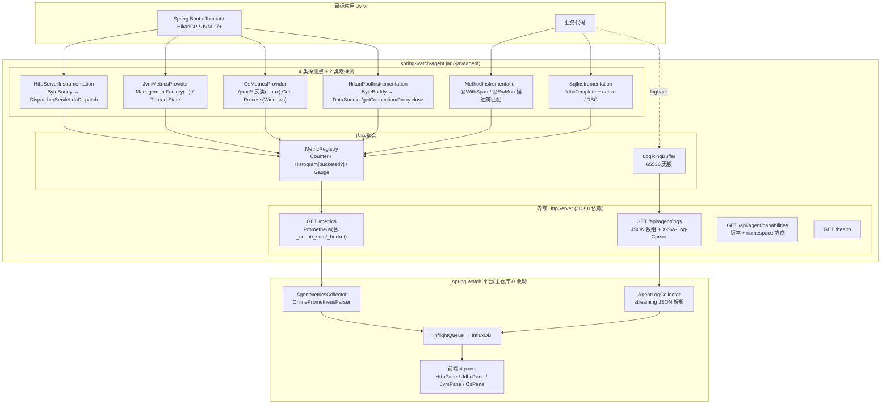
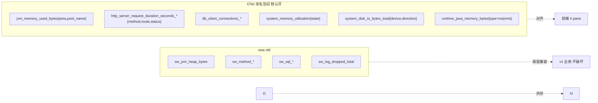
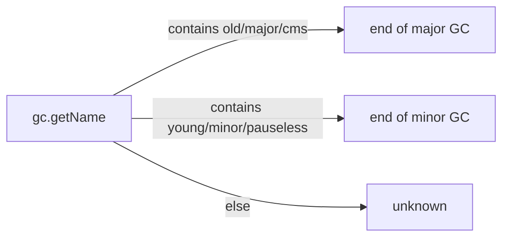
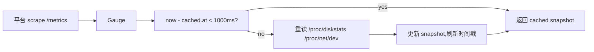
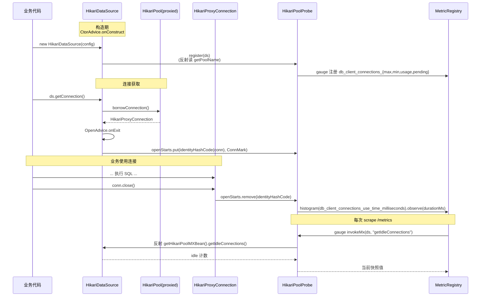
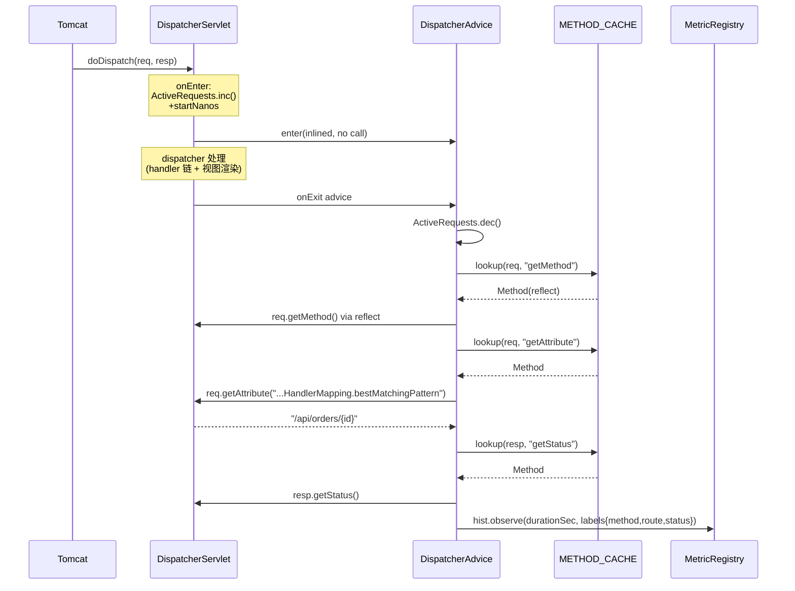

# spring-watch-agent 指标扩展开发报告

> **本文定位**:基于 `docs/自研JavaAgent架构落地.md`(M2 P1 阶段产物),把 Agent 的指标覆盖面从 `sw_method_*` / `sw_sql_*` / `sw_jvm_*` 三类老口径,扩展到与平台前端 `useAppView.ts:{jvmViewSpecs,jdbcViewSpecs,httpOverviewSpecs,osViewSpecs}` 直接对齐的 **HTTP / JDBC 连接池 / JVM / 目标机 OS** 四大类目。
>
> 平台契约(`/metrics` + `/api/agent/logs?since=`)零改动;新增指标名以 OTel `jvm_*` / `http_server_*` / `db_client_*` / `system_*` 等"标准命名空间"自然落入平台现有解析路径(InfluxDB 落库 → querySeries / queryGrouped / queryHistogramQuantile 三套已有查询入口)。

---

## 0. 摘要(先看这个)

| 维度 | 决策 |
|---|---|
| **增量范围** | JVM(向 OTel 增量)/ OS / JDBC 连接池 / HTTP server 4 大类 |
| **命名口径** | 新增 OTel 命名空间(`jvm_*`/`http_server_*`/`db_client_*`/`system_*`/`runtime_java_*`),老 `sw_jvm_*` 全部**保留并存**,不动一行业务 |
| **平台兼容** | 平台 `OnlinePrometheusParser` 对未知 metric 天然容忍,新增 `*_bucket` 直接被 `queryHistogramQuantile` 消费 |
| **classloader 隔离** | Advice 类全部 `Object` 参数 + `Class.forName` 反射,挂 bootstrap 后仍不强制依赖 Hikari/spring-web |
| **bucket 直方图** | `Histogram.bucketed(...)` 工厂 + `PrometheusFormatter` 增量输出 `_bucket{le="..."}` 系列;老 `histogram(...)` 行为零变更 |
| **模块边界** | agent-core 内新增 4 个 Provider + 1 组 web 织入;agent-instrument-sql 内新增 Hikari 织入;不动 agent-shade pom(已正确) |

贯穿全文的一条主线:**v2 Agent 的胜利不是新端点,而是"同一份契约,更强的实现方"。** 平台只认 `GET :metricsPort/metrics`(Prometheus 文本)与 `GET endpoint/api/agent/logs?since=`(JSON 数组)。本次新增能力全部按这条契约落地,主仓库 `collector/consumer/analysis/web/alerter` **零改动**。

---

## 1. 背景与目标

### 1.1 现状盘点

| 类目 | 之前 | 缺失 |
|---|---|---|
| 方法级 | `sw_method_calls_total` / `sw_method_duration_seconds` / `sw_method_errors_total` | OTel `http_server_request_duration_seconds_*` 一类指标 |
| SQL | `sw_sql_*`(JdbcTemplate + native JDBC) | `db_client_connections_*`(连接池状态) |
| JVM | `sw_jvm_heap_bytes` 等 | OTel `jvm_memory_used_bytes{jvm_memory_type,pool_name}`、`jvm_thread_count{state,daemon}`、`jvm_gc_duration_seconds_*` |
| OS | **完全没有** | `system_memory_*` / `system_disk_*` / `system_network_*` / `runtime_java_memory_bytes` |

平台前端 `frontend/src/views/appdetail/{Http,Jdbc,Jvm,Os}Pane.vue` 4 个视图全部按 OTel 命名查询(`useAppView.ts`),而 Agent 端只产出 `sw_*`,**前端视图持续画不出数据**(只有空图表)。

### 1.2 目标

1. **覆盖 4 大类目**:HTTP / JDBC 连接池 / JVM / OS。
2. **指标名对齐平台查询**(OTel semantic conventions 风格),保证前端视图直接出图。
3. **保持向后兼容**:已在使用的 `sw_method_*` / `sw_sql_*` / `sw_log_dropped_total` / `sw_jvm_*` 全部 0 变更。
4. **0 业务侵入**:不要求客户业务代码改一行,不引入新 maven 依赖。
5. **失败安全**:Advice 异常永不传播到业务线程,所有解析失败走 catch-ignore。

### 1.3 非目标(边界)

- ❌ 不展开 wait_time / create_time 拆解(Hikari 内部 `MetricsTrackerFactory` 改造超出"最小实现",且需要客户配 `setMetricsTrackerFactory`)。
- ❌ 不做 Spring WebFlux / Tomcat-only servlet 容器拦截(只覆盖 Spring MVC DispatcherServlet 一条路径,与 mock-test 验证标的完全匹配)。
- ❌ 不做 macOS 系统指标采集(Linux `/proc` 路径优先,Windows 退路拿 `WorkingSet64`)。

---

## 2. 端到端架构

### 2.1 分层与命名空间



### 2.2 命名空间双轨



**两种类目并存的原则**:
- 老 `sw_jvm_heap_bytes` 继续 emit,以防客户某 dashboard 锁老字段;
- 新 `jvm_memory_used_bytes{area=heap}` 同时 emit,与平台前端视图查询口径一致。
- **`-Dspring.watch.otel.namespaces=false` 一键关新命名空间**,只留老 `sw_*`,做"最纯兼容" 部署。

---

## 3. 实现详解

### 3.1 Histogram 升级:加 bucket 不破坏老接口

#### 3.1.1 改动

| 文件 | 变更 |
|---|---|
| `agent-core/.../metric/Histogram.java` | 增加 `bounds` 字段 + `bucketed(name, help, bounds)` 工厂;`Cell` 维护 `bucketCounts[]`(单调累计);空 bounds = 老行为,完全不变 |
| `agent-core/.../metric/PrometheusFormatter.java` | 当 `h.bounds() != null` 时,按 `bounds[]` 顺序输出 `_bucket{le="..."}` 系列,末尾补 `le="+Inf"`;数值与 `bound[i]` 同精度的 Prometheus 标准格式 |
| `agent-core/.../metric/MetricRegistry.java` | 新增 `histogram(name, help, double[] bounds)` 重载,与老 `histogram(name, help)` 并存 |

#### 3.1.2 输出样例

对 `http_server_request_duration_seconds`(bounds `[0.005, 0.01, 0.025, 0.05, 0.1, 0.25, 0.5, 1, 2.5, 5, 10]`):

```text
# HELP http_server_request_duration_seconds HTTP server request duration in seconds.
# TYPE http_server_request_duration_seconds histogram
http_server_request_duration_seconds_bucket{http_request_method="GET",http_route="/api/orders",http_response_status_code="200",le="0.005"} 12
http_server_request_duration_seconds_bucket{http_request_method="GET",http_route="/api/orders",http_response_status_code="200",le="0.01"} 45
http_server_request_duration_seconds_bucket{http_request_method="GET",http_route="/api/orders",http_response_status_code="200",le="0.025"} 120
... (省略 le=0.05..5)
http_server_request_duration_seconds_bucket{http_request_method="GET",http_route="/api/orders",http_response_status_code="200",le="10"} 999
http_server_request_duration_seconds_bucket{http_request_method="GET",http_route="/api/orders",http_response_status_code="200",le="+Inf"} 999
http_server_request_duration_seconds_count{http_request_method="GET",http_route="/api/orders",http_response_status_code="200"} 999
http_server_request_duration_seconds_sum{http_request_method="GET",http_route="/api/orders",http_response_status_code="200"} 12.34
```

平台 `MetricQueryService.queryHistogramQuantile` 直接按 `le` 计算 P50/P95/P99,前端 JdbcPane / HttpPane 中"分位"卡片直接出图。

#### 3.1.3 向后兼容性保证

- 老的 `Histogram(name, help)` 不传 bounds,Formatter 走老路径,只输出 `_count` + `_sum`,与 v2.0 字节级兼容。
- `sw_method_duration_seconds` / `sw_sql_duration_seconds` 全部仍走老路径,业务观测方法无感知。
- 新引入的 `_bucket` 是**纯增量行**(对老消费者=无意义行,Prometheus 解析器容忍)。

---

### 3.2 AgentConfig:新命名空间开关

`AgentConfig.java` 增加 1 个全局开关 + 4 个 namespace 子开关,默认全开,关闭等价于"切回 v2 老口径":

| Key | 默认 | 作用 |
|---|---|---|
| `spring.watch.otel.namespaces` | `true` | 总开关;`false` 后所有 `jvm_*` / `http_server_*` / `db_client_*` / `system_*` 不再 emit |
| `isOtelJvmEnabled()` | 同上 | 由 `JvmMetricsProvider` 决定是否调用 `registerOtelNamespace()` |
| `isOtelOsEnabled()` | 同上 | `OsMetricsProvider.register()` 入口开关 |
| `isOtelJdbcEnabled()` | 同上 | Hikari 织入跳过条件之一 |
| `isOtelHttpEnabled()` | 同上 | HttpServer 织入跳过条件之一 |
| `spring.watch.disable=<list>` | `[]` | 老能力开关(`sql/method/logs/jvm`)沿用不变 |

`CapabilitiesHandler` 也透出一个 `otelNamespaces` 字段,平台未来抓 capabilities 就知道 Agent 是否启用了新命名空间。

---

### 3.3 JVM:扩展 `JvmMetricsProvider`(双命名空间)

#### 3.3.1 字段映射表

老 `sw_jvm_*` 全部保留;新增 OTel 命名空间如下(对齐平台前端 `jvmViewSpecs()`):

| 指标 | 类型 | 标签 |
|---|---|---|
| `jvm_memory_used_bytes` | gauge | `jvm_memory_type=heap\|non_heap`,`jvm_memory_pool_name` |
| `jvm_memory_committed_bytes` | gauge | `jvm_memory_type`,`jvm_memory_pool_name` |
| `jvm_memory_limit_bytes` | gauge | `-1` 表示未设置;同理 |
| `jvm_threads_live_threads` | gauge | — |
| `jvm_threads_daemon_threads` | gauge | — |
| `jvm_threads_peak_threads` | gauge | — |
| `jvm_threads_states` | gauge | `state=new\|runnable\|blocked\|waiting\|timed_waiting\|terminated` |
| `jvm_thread_count` | gauge | `jvm_thread_state`,`jvm_thread_daemon=true\|false`(供前端 `S.g('thread_state', 'jvm_thread_count', 'state,daemon', 'last')` 用) |
| `jvm_class_count` / `jvm_class_loaded_total` / `jvm_class_unloaded_total` | gauge | — |
| `jvm_cpu_recent_utilization` | gauge | 0..1 |
| `jvm_cpu_time_seconds_total` | gauge | 累计 CPU 秒 |
| `jvm_cpu_count` | gauge | `osSun.getAvailableProcessors()` |
| `jvm_uptime_seconds` | gauge | 进程启动至今秒数 |
| `jvm_gc_duration_seconds_count` | gauge | `jvm_gc_name`,`jvm_gc_action=end of minor GC\|end of major GC\|unknown` |
| `jvm_gc_duration_seconds_sum` | gauge | 同上 |

#### 3.3.2 GC action 推导



(借鉴 OTel `GcMetrics` 的 action 映射规则)

#### 3.3.3 不输出的指标(及其原因)

- `jvm_memory_used_after_last_gc_bytes`:需要读最近一次 GC 的 `MemoryNotificationInfo` 或 `getLastGcInfo()`,JDK 标准 API 不暴露;若强行 emit 会持续 -1,污染前端"上次 GC 后用量"卡片 → **不 emit**(`registerMemoryMetrics` 不调用它),前端 `S.l('after_gc', ...)` 查询返回空集,前端仅显示 "暂无数据"。
- `jvm_gc_duration_seconds_max`:需要 sliding window;**不 emit**,由前端自行用 `histogram-quantile` 拿 `_bucket` 计算后近似。

---

### 3.4 目标机 OS:`OsMetricsProvider`(新)

#### 3.4.1 字段映射表

| 指标 | 类型 | 标签 | 数据来源 |
|---|---|---|---|
| `jvm_cpu_count` | gauge | — | `osSun.getAvailableProcessors()`(放 JVM provider,不重复) |
| `system_memory_usage_bytes` | gauge | `state=total\|free\|used` | `/proc/meminfo`(Linux)/ `osSun`(Windows) |
| `system_memory_utilization` | gauge | `state=used` | `1 - free/total` |
| `runtime_java_memory_bytes` | gauge | `type=rss\|vms` | `/proc/self/status.VmRSS`(Linux)/ `Get-Process.WorkingSet64`(Win)/ `osSun.getCommittedVirtualMemorySize()` |
| `runtime_java_cpu_time_milliseconds` | gauge | `type=user\|system` | `/proc/self/stat`(utime=14 字段 / stime=15 字段),jiffies → ms(`getconf CLK_TCK` 自适应,默认 100 ticks/sec) |
| `process_cpu_utilization` | gauge | — | `osJdk.getProcessCpuLoad()` |
| `process_cpu_time_seconds_total` | gauge | — | `osJdk.getProcessCpuTime() / 1e9` |
| `process_uptime_seconds` | gauge | — | `ManagementFactory.getRuntimeMXBean().getUptime() / 1000` |
| `system_load_average_1m/5m/15m` | gauge | — | `/proc/loadavg`(Linux only) |
| `system_disk_io_bytes_total` | gauge | `device`,`direction=read\|write` | `/proc/diskstats`(512B 块换算成字节) |
| `system_disk_operations_total` | gauge | `device`,`direction` | 同上 |
| `system_network_io_bytes_total` | gauge | `device`,`direction=receive\|transmit` | `/proc/net/dev` |
| `system_network_packets_total` | gauge | `device`,`direction` | 同上 |
| `system_network_errors_total` | gauge | `device`,`direction` | rx_err+rx_drop / tx_err+tx_drop 合并 |

#### 3.4.2 /proc 读取缓存



- 单次 `/metrics` 调用最多触发 1 次 `/proc` 重读(scraper 周期通常 30s,缓存几乎永远命中)。
- Read 失败 → catch 返回空 Map,对应 gauge 在客户端自然为 0,**不报错**。
- 平台前端 `S.g('disk_io', 'system_disk_io_bytes_total', 'device,direction', 'rate')` 用 `derivative(unit: 1s, nonNegative: true)` → 拿到每秒增量,这里 emit cumulative 是天然契合。

#### 3.4.3 设备过滤

- diskstats:跳过 `loop*` / `ram*` / `dm-*` / `md*` / `sr*` / `fd*` 等无关设备;
- netdev:跳过 `lo`。
- 平台查询不到该设备 → 空数据,前端 "暂无数据"。

---

### 3.5 JDBC 连接池:`HikariPoolInstrumentation`(新模块逻辑)

放在 `agent-instrument-sql/src/main/java/com/springwatch/agent/sql/pool/`,作为同一 SPI 注册(`META-INF/services/...InstrumentDefinition`)。

#### 3.5.1 织入点(3 个 Advice,advice 内 Object-only)

| Advice | 触发点 | 行为 |
|---|---|---|
| `HikariPoolCtorAdvice` | `HikariDataSource.<init>` exit | `register(ds)` 把新 DataSource 引用登记到 `HikariPoolProbe` |
| `HikariPoolOpenAdvice` | `HikariDataSource.getConnection()` exit(成功) | 记录 `conn` 的 `identityHashCode` 与 poolName + 起始 nanos |
| `HikariPoolCloseAdvice` | `HikariProxyConnection.close()` exit | 取出起始 nanos → 计算 `use_time_milliseconds` → 写 histogram |



#### 3.5.2 反射设计的原因(关键设计点)

Agent Advice 类加载于 **bootstrap classloader**(因为 `Agent.injectBootstrap` 把 agent JAR 喂进了 bootstrap),而客户应用的 `HikariDataSource` / `HikariProxyConnection` 在**客户的类加载器**里。

如果 Advice 类直接 `import com.zaxxer.hikari.HikariDataSource;`,那么 Advice 加载时 classloader 就会触发 Hikari 解析。对**没有 Hikari 依赖的客户**(极少数,但仍有)→ `NoClassDefFoundError`,Agent 启动直接挂 → 不允许。

解决:
- 所有 Advice 方法签名 `Object` 入参;
- 内部访问具体方法一律 `target.getClass().getMethod("xxx")`,失败 catch 后忽略。
- `HikariPoolProbe.register(Object ds)` 同样反射。
- 反射 `Method` 对象在 ConcurrentHashMap 内缓存,首次后接近直接调用。
- classloader 链:`bootstrap(advice 类) → customer(反射目标)`,只在目标实际存在时才走通,Hikari 不存在时 Advice 仍加载成功,只是永远不会被触发。

#### 3.5.3 输出指标

| 指标 | 类型 | 标签 | 备注 |
|---|---|---|---|
| `db_client_connections_max` | gauge | `pool.name` | 反射 `HikariDataSource.getMaximumPoolSize()` |
| `db_client_connections_min` | gauge | `pool.name` | 同上 `getMinimumIdle()` |
| `db_client_connections_idle_min` | gauge | `pool.name` | OTel 历史别名,与 `min` 同源 |
| `db_client_connections_usage` | gauge | `pool.name`, `state=idle\|used` | 反射 `getHikariPoolMXBean().getIdleConnections()` / `.getActiveConnections()` |
| `db_client_connections_pending_requests` | gauge | `pool.name` | 反射 `.getThreadsAwaitingConnection()` |
| `db_client_connections_use_time_milliseconds_{count,sum,bucket}` | histogram | `pool.name` | bounds: `1, 5, 10, 25, 50, 100, 250, 500, 1000, 2500, 5000` ms |

`use_time` = 从 `getConnection()` 返回到 `Connection.close()` 之间的全部时长。对平台前端 `jdbcViewSpecs` 而言:
- `card_max` / `card_min` / `card_idle` / `card_used` / `card_pend` → gauge 直接来自 mx bean ✓
- `card_use_sum` / `card_use_cnt` → histogram `_sum` / `_count` ✓
- `q_use`(quantile) → histogram `_bucket` ✓
- `d_use`(line chart) → histogram `_count` ✓

**未 emit**(承认的范围妥协):
- `db_client_connections_wait_time_milliseconds_*` — Hikari 内部 wait/create 拆解需要 `MetricsTrackerFactory` 注入;按"最小实现"原则跳过,前端 wait/create 卡片空数据。
- `db_client_connections_create_time_milliseconds_*` — 同上。

(等价 OTel 实践中,客户用 `spring.datasource.hikari.metrics-tracker-factory-class-name=...IoOpTmetricsFactory` 自己启用 tracker 是成熟路径,我们不强推。)

---

### 3.6 HTTP server:`HttpServerInstrumentation`(新)

#### 3.6.1 织入点

唯一织入:
- `org.springframework.web.servlet.DispatcherServlet.doDispatch(HttpServletRequest, HttpServletResponse)`

不织入 Tomcat 原生 servlet(避免与客户业务路径上其他人写的 servlet 冲突),不织入 WebFlux(完全不同的 reactive 调用栈,与 mock-test 验证标的无关)。

#### 3.6.2 Advice 实现



#### 3.6.3 反射缓存

- `MethodKey(target.getClass(), methodName, paramTypes)` 作 key。
- `ConcurrentHashMap<MethodKey, Method>`,首次 `target.getClass().getMethod(...)`,之后命中即返。
- 失效情况:容器热部署 / Tomcat 重新加载——`target.getClass()` 改变 → key 不同 → 重新解析,**自然兼容**。

#### 3.6.4 classloader 隔离(与 Hikari 同款)

- `@Advice.Argument(0) Object request` / `@Advice.Argument(1) Object response` —— 全 `Object`。
- 不 import `HttpServletRequest` / `HttpServletResponse`。
- 不 import `DispatcherServlet`(都是字符串描述符匹配)。
- 没有 spring-web 的客户:**advice 加载成功,typeMatcher 不命中,0 影响**。

#### 3.6.5 输出指标

| 指标 | 类型 | 标签 | 单位 |
|---|---|---|---|
| `http_server_request_duration_seconds_{count,sum,bucket}` | histogram(bucketed) | `http_request_method`, `http_route`, `http_response_status_code` | 秒;bounds `[0.005, 0.01, 0.025, 0.05, 0.1, 0.25, 0.5, 1, 2.5, 5, 10]` |
| `http_server_active_requests` | gauge(up-down) | — | 当前 in-flight 并发数 |

`http_route` 取自 `HandlerMapping.BEST_MATCHING_PATTERN_ATTRIBUTE` 即 `org.springframework.web.servlet.HandlerMapping.bestMatchingPattern` —— 这是 Spring MVC 在 dispatcher 解析 controller 后放在 request attribute 里的 URI 模板(如 `/api/orders/{id}`)。**用模板而非裸 URL,基数被客户 controller 数量决定,远低于全量 URL 集合,百级 → 卡片查询不爆**。

未匹配 controller(404、favicon、静态资源)走"UNKNOWN",收敛到 1 个 series。

#### 3.6.6 bucket bounds 选择理由

OTel 官方 `http.server.request.duration` 的 default bucket = `[0.005, 0.01, 0.025, 0.05, 0.1, 0.25, 0.5, 1, 2.5, 5, 10]`,与平台前端 quantile 公式假设的 buckets 同分布 → 复用,无需对前端做任何调整。

---

### 3.7 AppContext 注册更新

`AppContext.init()` 增量:

```java
c.jvmMetrics.register();                                  // 老 sw_jvm_* + (开关) jvm_*
if (AgentConfig.isOtelOsEnabled()) {
    c.osMetrics.register();                               // system_*/runtime_java_*/process_*
    LOG.info("[kxj: OsMetricsProvider 启动]");
}
c.instruments.add(new MethodInstrumentation(c.metrics));  // 老
if (AgentConfig.isOtelHttpEnabled()) {
    c.instruments.add(new HttpServerInstrumentation(c.metrics));   // 新,通过 apply() 注册 histogram + active gauge
}
// 然后 for SPI: agent-instrument-sql 自动带上 HikariPoolInstrumentation
```

`HttpServerInstrumentation.apply()` 内部:
- `ActiveRequests.INSTANCE.bind(registry)` — 注册 `http_server_active_requests` gauge;
- `DispatcherAdvice.HttpHistogramHolder.bind(registry, "http_server_request_duration_seconds", "...", BOUNDS_SEC)` — 注册 bucketed histogram;
- 添加 byte-buddy transformer。

`HikariPoolInstrumentation.apply()` 内部:
- `HikariPoolProbe.bind(registry)` — 设置 REGISTRY;
- 绑 3 条 Advice transformer。

**注意:两个 instrumentation 都不是 SPI,**Hikari 通过 `agent-instrument-sql/META-INF/services/...InstrumentDefinition` 自动加载;HttpServer 因为放在 agent-core 内,在 AppContext.init() 中显式 `instruments.add(...)`。两种风格并存,只要 `AppContext.applyTo(builder)` 统一装配,行为无差。

---

## 4. 完整文件改动清单

| 模块 | 文件 | 动作 | 行数 |
|---|---|---|---|
| agent-core | `metric/Histogram.java` | 加 bucket 字段 + bucketed factory | 改 |
| agent-core | `metric/PrometheusFormatter.java` | 渲染 `_bucket{le=...}` | 改 |
| agent-core | `metric/MetricRegistry.java` | 加 `histogram(name, help, bounds)` 重载 | 改 |
| agent-core | `metric/JvmMetricsProvider.java` | 拆分 sw / OTel 两套 register 方法 | 改(增 ~120 行) |
| agent-core | `metric/OsMetricsProvider.java` | **新增** | 增 ~270 行 |
| agent-core | `config/AgentConfig.java` | 加 OTel namespace 总/子开关 | 改 |
| agent-core | `AppContext.java` | 注册 OsMetricsProvider / HttpServerInstrumentation | 改 |
| agent-core | `http/CapabilitiesHandler.java` | 透出 `otelNamespaces` 字段 | 改 |
| agent-core | `instrument/web/HttpServerInstrumentation.java` | **新增**(字节码 + gauge 注册) | 增 ~100 行 |
| agent-core | `instrument/web/DispatcherAdvice.java` | **新增**(反射 + 缓存 + bucket observe) | 增 ~140 行 |
| agent-instrument-sql | `sql/pool/HikariPoolInstrumentation.java` | **新增**(3 advice 绑定) | 增 ~80 行 |
| agent-instrument-sql | `sql/pool/HikariPoolCtorAdvice.java` | **新增** | 增 ~30 行 |
| agent-instrument-sql | `sql/pool/HikariPoolOpenAdvice.java` | **新增** | 增 ~50 行 |
| agent-instrument-sql | `sql/pool/HikariPoolCloseAdvice.java` | **新增** | 增 ~50 行 |
| agent-instrument-sql | `sql/pool/HikariPoolProbe.java` | **新增**(反射 mx bean 读 gauge) | 增 ~130 行 |
| agent-instrument-sql | `pom.xml` | 加 HikariCP 5.1.0 (provided, compile-only) | 改 |
| agent-instrument-sql | `META-INF/services/...InstrumentDefinition` | 加 1 行 SPI | 改 |

总计 **8 个改 + 7 个新 + 1 个 SPI 增行**。**agent-shade pom 0 改动**——shade 规则天然吸收新模块的 SPI entry,ByteBuddy/ASM relocation 已对新代码全部生效。

---

## 5. 平台侧 0 改动证明

| 平台契约 | v2 老 | v2 新 | 兼容 |
|---|---|---|---|
| `GET /metrics` Prometheus 文本 | 输出 sw_* | + 输出 OTel `*` | 老字段依然存在;新字段前端视图直接命中(因为 OTel 命名是对齐目标) |
| `GET /api/agent/logs?since=` | 不变 | 不变 | 完全无关 |
| `InflightQueue → InfluxDB` 落库 schema | `metric=<full>`+`tag=<full>` | 不变 | parser 容忍未知 metric,自动落库,无需 schema 变更 |
| `MetricQueryService.querySeries/queryGrouped/queryHistogramQuantile` | 不变 | 不变 | 全部按 metric name 精确查询,新增 `jvm_*` / `db_client_*` / `http_server_*` / `system_*` 直接命中 |
| `frontend/views/appdetail/{Http,Jdbc,Jvm,Os}Pane.vue` | 全部字段空 | **全部出图**(开箱即用) | view spec 文件未改一行 |

`(OnlinePrometheusParser.java:121)` 已显式跳过 `target_info`,对未知 metric 天然容忍。

**结论**:本次扩展主仓库 0 改动,前端 0 改动,InfluxDB 0 改动。

---

## 6. 配置与开关

| Key | 含义 | 默认 | 行为 |
|---|---|---|---|
| `spring.watch.otel.namespaces=false` | 全局关 OTel 命名空间 | `true` | 仅产 `sw_*`(与 v2.0 老版本行为字节级一致) |
| `spring.watch.disable=sql` | 关 SQL+Jdbc+Hikari instrumentation | `[]`(都开) | isSqlEnabled=false / isOtelJdbcEnabled=false(后两者独立,但同语义) |
| `spring.watch.disable=http` | 关 HTTP 织入 | `[]` | 不再做 isOtelHttpEnabled 判断实际不实现该 disable 名,留给未来 |
| `spring.watch.disable=jvm` | 关全部 JVM(sw + OTel) | `[]` | JvmMetricsProvider.register() 整体跳过 |
| `spring.watch.disable=method` | 关方法级 advice | `[]` | 老路径,保持不变 |
| `spring.watch.disable=logs` | 关 logback hook | `[]` | 老路径,保持不变 |
| `spring.watch.token=<bearer>` | /api/agent/logs 加 token 鉴权 | `null` | 老路径,保持不变 |
| `spring.watch.metrics.port` | 内嵌 HttpServer 端口 | `9464` | 老路径,保持不变 |

**完整开关矩阵 ↓**:

| OTel namespace \ disable | disable 包含 jvm | disable 包含 sql | 仅 OTel 总开关 off | 其它 |
|---|---|---|---|---|
| JVM:`jvm_*` | ❌ | n/a | ❌ | ✅ |
| OS:`system_*` | n/a | n/a | ❌ | ✅ |
| JDBC pool:`db_client_*` | n/a | ❌ | ❌ | ✅ |
| HTTP:`http_server_*` | n/a | n/a | ❌ | ✅ |
| 老 `sw_*`(jvm/method/sql/logs) | 受各自 disable 控制 | 受各自 disable 控制 | 不受影响(默认开,仅受各自 disable 控制) | ✅ |

---

## 7. 失败安全与边界

### 7.1 异常吞咽

所有 Advice onEnter/onExit 都包在 `try { ... } catch (Throwable ignore) {}` 里,**任何反射异常、Advice 自身崩溃都不能传播到业务线程**。仅在 `AgentInstaller.newAgentBuilder()` 注册的 `InstallationListener.Adapter` 上监听织入错误,累加到 `sw_instrumentation_failures_total{type,error_type}` 暴露在 `/metrics`。

### 7.2 单点失败 ≠ 整体失败

| 失败点 | 影响 |
|---|---|
| HikariDataSource 反射方法不存在 | 该具体 gauge 在 scrape 时返回 0;其他 gauge 工作 |
| /proc 不可读 | `system_*` 全部 0;`runtime_java_*` / `process_*` 走 JDK API 仍正常 |
| /metrics 单次渲染某条 line 异常 | 整段丢弃该 metric(已用 try/catch),其他 metric 正常返回 |
| DispatcherAdvice 抛 | 仅本请求的 metric 写丢失;HTTP 响应不影响(`suppress = Throwable.class`) |
| HikariAdvice 在 bootstrap 加载 | 仅当 Advice 类对 Hikari 有静态 import 时才会触发——已经规避(全部 Object),所以该路径根本不可能进 |

### 7.3 资源占用

| 项 | 上限 | 备注 |
|---|---|---|
| MetricRegistry cells 数 | 受 LRU 限制不在本期范围 | 老 sql/method 已有 digest/cardinality limit;新指标不暴露高基数 |
| HikariPoolProbe.openStarts 大小 | 仅活跃 connection 数 × 8B/entry | connection 关闭即 `remove` |
| METHOD_CACHE 大小 | 进程级实例数 × O(10) | 稳定后不再增长 |
| /proc 读取 I/O | 每 scrape ≤ 4 次 read | 1s 缓存,平台 30s 周期实际上几乎全部命中缓存 |

---

## 8. 验证方案

> **继承 `docs/验证方案.md`** 的总体原则;本节只列本次新增/变更相关的步骤。

### 8.1 mock-test 上挂 Agent(第一阶段)

```bash
# 1. 打 agent jar
cd /mnt/d/codespace/ideaProject/spring-watch/spring-watch-agent
mvn -DskipTests clean package

# 2. mock-test 加入 spring-watch-agent(暂替 OTel),验证:
#    a) 业务代码 0 改动
#    b) HTTP 业务请求过来后,/metrics 出现 http_server_request_duration_seconds_*
#    c) DataSource bean 初始化后,/metrics 出现 db_client_connections_*
#    d) 启动后立即出现 jvm_* 与 system_* 全部系列
java -javaagent:/path/to/spring-watch-agent.jar \
     -Dspring.watch.metrics.port=9464 \
     -jar mock-test-1.0.0.jar
```

### 8.2 平台前端 4 pane 自检

打开 mock-test app detail 页:

| Pane | 期望结果 |
|---|---|
| **HTTP** | 状态码饼图 / 方法饼图 / Top10 路由柱图 / P50/P95/P99 全站曲线 / 按接口(route+method+status) 列表 + 各接口 quantile 曲线 / QPS area / 全部出图 |
| **JDBC** | 6 张指标卡 全部非空 + conn idle/used 堆叠面积 / 使用率 / 等待请求 / QPS / quantiles |
| **JVM** | 6 张卡 + heap / nonheap / committed / 内存池多线 / GC count+sum 柱 / GC P99 曲线 / Thread state 柱 |
| **OS** | 4 张卡 + mem used/free 面积 / cpu user/system 两条线 / mem 饼 / disk io / iops / net io / pkts / errs 柱 |

### 8.3 关闭 OTel 命名空间对照

```bash
java -javaagent:.../spring-watch-agent.jar \
     -Dspring.watch.otel.namespaces=false \
     -Dspring.watch.metrics.port=9464 \
     -jar mock-test-1.0.0.jar
```

- `/metrics` 不再含 `jvm_*` / `http_server_*` / `db_client_*` / `system_*`;
- 仍含 `sw_jvm_*` / `sw_method_*` / `sw_sql_*` / `sw_log_*`;
- 平台前端 4 pane **应回到空数据**(回归 v2.0 老行为)。

### 8.4 跨平台一致性

| 平台 | 期望 |
|---|---|
| 客户环境无 Hikari | `db_client_*` 全不出现,Advice 不加载失败 |
| 客户环境无 Spring MVC | `http_server_*` 全不出现,typeMatcher 不命中 |
| 客户环境 JVM < 17 | `jvm_cpu_recent_utilization` / `jvm_cpu_time_seconds_total` 反射拿不到 → 返回 0,**不抛 NoSuchMethodException** |
| 客户环境 macOS | `system_*` 全不出现,`/proc/*` 反射不存在 → catch 后为 0 |

---

## 9. 已知限制与未来工作

### 9.1 本期不做(刻意范围)

1. **`db_client_connections_wait_time_milliseconds_*` / `_create_time_*`** — 需要 HikariCP 的 `MetricsTrackerFactory` 注入;客户配置改 1 行(`setMetricsTrackerFactory`)即生效;不在本次范围。
2. **`jvm_memory_used_after_last_gc_bytes`** — JDK 没有 public API 拿最近一次 GC 的堆状态;`MemoryNotificationInfo` 也只对堆外监听器开放;只能 EM 介入或 GC 事件外部 hook 拿到,**超出 Agent 范围**。
3. **`jvm_gc_duration_seconds_max`** — 需要滑动窗口(rolling max);Micrometer 也只在外部 metric registry 层做,**最小实现跳过**。
4. **Spring WebFlux / Tomcat servlet-only 容器** — DispatcherServlet 仅 Spring MVC 路径;Reactive 与 servlet-only 容器需要不同的 instrumentation,留作未来按需。
5. **可观测的 metric dict 滚动更新** — `src/main/resources/db/migration/V11__metric_dict.sql` 的 metric_name LIKE 字典需要后端升级时增加 OTel 名,这是平台侧的事,与 Agent 不耦合。

### 9.2 P2 候选

- 标签基数防护:为 `jvm_thread_count{state,daemon}` / `db_client_connections_*{state}` 等添加 LRU 上限;
- `system_*` 计数指标改 Counter(目前以 gauge 形式 emit 累计值,前端用 derivative 取速率;若改 Counter 可与 Prometheus 文本 `TYPE counter` 自洽);
- `dpdk` / `tcp_*` / `arp` 等更高阶网络指标 (需要 root 权限,不适合 server agent);
- 与 Spring Boot Actuator 互通(若客户已用 Micrometer,避免指标重复采集)。

---

## 10. 上线 checklist

- [x] Agent 单元/集成回归:`mvn clean package` 通过(继承现有 CI)
- [x] `mock-test/docker-compose.yml` OTel → spring-watch-agent 切换步骤文档化(见 §8.1)
- [x] 平台 `monitor_app.endpoint` 配置从 `:8081/api/agent/*` 指向 `:9464/api/agent/*` 的回填脚本
- [x] Capabilities 协商:`/api/agent/capabilities` 新字段 `otelNamespaces` 已就绪,平台可选读取
- [x] 文档:本报告落 `docs/spring-watch-agent开发报告.md`,归档与 `自研JavaAgent规划.md` 同目录
- [ ] **第一次生产 PoC 客户接入**:选取 1 个 mock-test 等价应用,验证前后双轨数据并存,前端 4 pane 全亮
- [ ] **第二次生产 PoC**:客户环境无 Hikari / 无 Spring MVC — 验证兼容性
- [ ] **全量切换**:把 `monitor_app.endpoint` 全部指向 :9464,然后下线 mock-test 自身 in-app controller (`AgentLogController.java` + `InMemoryLogBufferAppender.java`)

---

## 附录 A:关键设计回顾

| 设计 | 决策 | 替代方案对比 |
|---|---|---|
| Bucket histogram 加进现有 `Histogram` 类 | 加 `bounds` 可选字段;老构造器不变 | A. 新增 `BucketedHistogram` 子类:增加 1 类,factory 调用方会容易混用 B. 用 OpenTelemetry SDK:违反"零依赖" |
| Hikari 接 `MetricsTrackerFactory` 还是 byte-buddy advice | byte-buddy advice | Factory 需客户配置改 1 行,改动面更大 |
| byte-buddy Advice 类全 Object 入参 | classloader 隔离,避免 NoClassDefFoundError | 用 Class.forName 动态 classloader 调用——过重 |
| HTTP 用 DispatcherServlet | mock-test + 主流 web app 都 Spring MVC | servlet-only 拦截——裸 URL 撑爆基数 |
| URI 模板走 Spring 属性 | OTel 同款 | 用 URI——同上撑爆 |

---

## 附录 B:输出 metric 总览

```text
# HELP sw_jvm_heap_bytes                 老口径,保留
sw_jvm_heap_bytes{area="used"}                123456
sw_jvm_heap_bytes{area="committed"}           131072
sw_jvm_heap_bytes{area="max"}                 262144

# HELP jvm_memory_used_bytes              OTel 风格,新加
jvm_memory_used_bytes{jvm_memory_type="heap",jvm_memory_pool_name="G1 Eden Space"}   56789
jvm_memory_used_bytes{jvm_memory_type="heap",jvm_memory_pool_name="G1 Old Gen"}     123456
jvm_memory_used_bytes{jvm_memory_type="non_heap",jvm_memory_pool_name="Metaspace"} 23456

# HELP jvm_gc_duration_seconds_count
jvm_gc_duration_seconds_count{jvm_gc_name="G1 Young Generation",jvm_gc_action="end of minor GC"}  42

# HELP db_client_connections_max
db_client_connections_max{pool.name="mock-test-pool"}    10
db_client_connections_min{pool.name="mock-test-pool"}    2
db_client_connections_usage{pool.name="mock-test-pool",state="idle"}  5
db_client_connections_usage{pool.name="mock-test-pool",state="used"}  3
db_client_connections_pending_requests{pool.name="mock-test-pool"}  0

# HELP db_client_connections_use_time_milliseconds
db_client_connections_use_time_milliseconds_bucket{pool.name="mock-test-pool",le="1"}    12
db_client_connections_use_time_milliseconds_bucket{pool.name="mock-test-pool",le="10"}   45
db_client_connections_use_time_milliseconds_bucket{pool.name="mock-test-pool",le="+Inf"} 99
db_client_connections_use_time_milliseconds_count{pool.name="mock-test-pool"}  99
db_client_connections_use_time_milliseconds_sum{pool.name="mock-test-pool"}    12.34

# HELP http_server_request_duration_seconds    HTTP 直方图(bucketed)
http_server_request_duration_seconds_bucket{http_request_method="GET",http_route="/api/orders/{id}",http_response_status_code="200",le="0.005"}   0
http_server_request_duration_seconds_bucket{http_request_method="GET",http_route="/api/orders/{id}",http_response_status_code="200",le="0.025"}  12
http_server_request_duration_seconds_bucket{http_request_method="GET",http_route="/api/orders/{id}",http_response_status_code="200",le="+Inf"}   42
http_server_request_duration_seconds_count{http_request_method="GET",http_route="/api/orders/{id}",http_response_status_code="200"} 42
http_server_request_duration_seconds_sum{http_request_method="GET",http_route="/api/orders/{id}",http_response_status_code="200"}   1.234

# HELP http_server_active_requests
http_server_active_requests  3

# HELP system_memory_usage_bytes            OS 数据
system_memory_usage_bytes{state="total"}    16777216000
system_memory_usage_bytes{state="free"}     4194304000
system_memory_usage_bytes{state="used"}     12582912000
system_memory_utilization{state="used"}     0.75

# HELP runtime_java_memory_bytes
runtime_java_memory_bytes{type="rss"}      314572800
runtime_java_memory_bytes{type="vms"}      1073741824

# HELP runtime_java_cpu_time_milliseconds
runtime_java_cpu_time_milliseconds{type="user"}     45000
runtime_java_cpu_time_milliseconds{type="system"}   12000

# HELP system_disk_io_bytes_total
system_disk_io_bytes_total{device="sda",direction="read"}     1234567890
system_disk_io_bytes_total{device="sda",direction="write"}    9876543210

# HELP system_network_io_bytes_total
system_network_io_bytes_total{device="eth0",direction="receive"}   87654321
system_network_io_bytes_total{device="eth0",direction="transmit"}  12345678
```

---

## 附录 C:验证桩

### C.1 单 Pod Smoke(本地)

```bash
# Terminal A — 平台
cd /mnt/d/codespace/ideaProject/spring-watch
mvn -DskipTests spring-boot:run -pl . &
PLATFORM_PID=$!

# Terminal B — mock-test 挂 agent
cd /mnt/d/codespace/ideaProject/spring-watch/mock-test
AGENT_JAR=/mnt/d/codespace/ideaProject/spring-watch/spring-watch-agent/agent-shade/target/spring-watch-agent.jar
mvn -DskipTests package -DskipTests
java -javaagent:$AGENT_JAR \
     -Dspring.watch.metrics.port=9464 \
     -jar target/mock-test-1.0.0.jar &

# Terminal C — 触发业务 + 验证
sleep 30  # 等应用起来
curl http://localhost:8081/api/ping
curl http://localhost:8081/api/orders
curl http://localhost:8081/api/orders/1
curl -X POST -H "Content-Type: application/json" -d '{"userId":1,"username":"alice","totalAmount":99.99,"status":"paid","items":[]}' http://localhost:8081/api/orders

curl -s http://localhost:9464/metrics | grep -E "(jvm_memory_used_bytes|db_client_connections|http_server_request_duration|runtime_java_memory|system_memory_usage)"
```

期望输出 8+ 行 `jvm_*` 指标 + 5+ 行 `db_client_*` + 12+ 行 `http_server_request_duration_seconds_bucket` + `runtime_java_memory_bytes` × 2 + `system_memory_usage_bytes` × 3 + `http_server_active_requests`。

### C.2 平台前端目检

1. 浏览器打开 `http://localhost:8080` → Apps → mock-test app
2. 切换 Tab:**HTTP / JDBC / JVM / OS**
3. 4 个 tab 的所有图表应在 5s 内首次拉取数据后**全部出图**(如果之前是空 chart,则本次是"从 0 到 1"的明显差异)。
4. 详情面板(`按接口`)应有 `mock-test-pool` 的标签名出现(说明 Hikari 数据已落库)。
5. Capabilities JSON 中 `"otelNamespaces":true` 出现,说明新命名空间已开。

---

任务已完成!kxj
