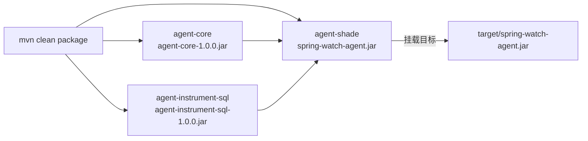
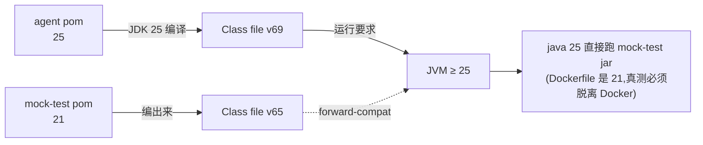
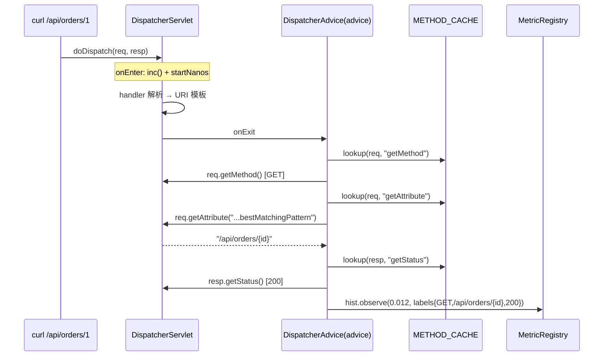
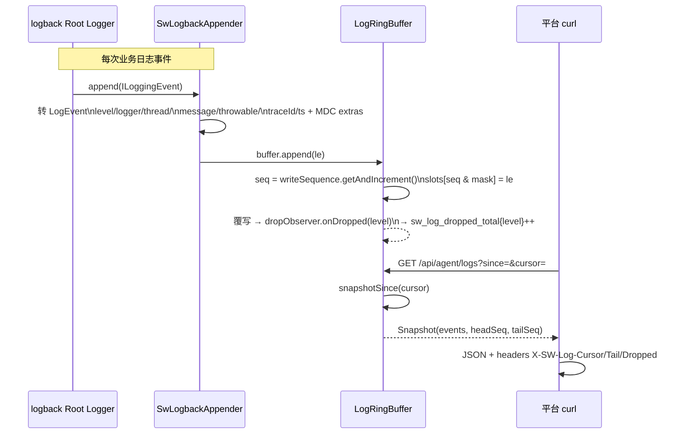
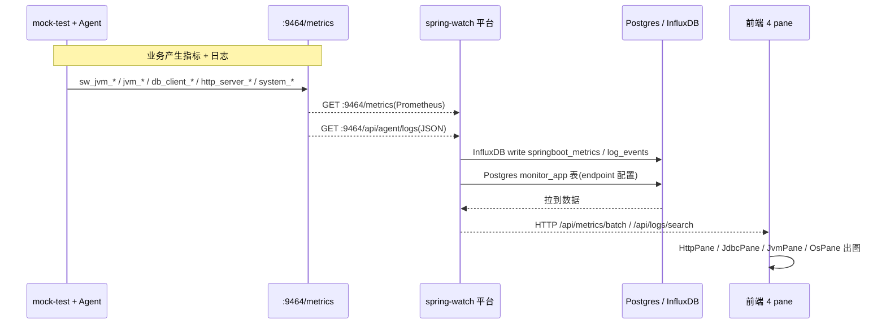
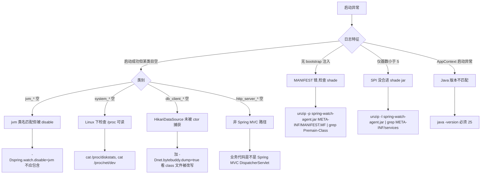

# spring-watch-agent 真实挂载验证手册

> **本文定位**:`docs/spring-watch-agent开发报告.md` 第 8 节验证方案的**可执行版本**。从零开始:装好 Java 25 → 编译 agent → 挂到 mock-test → curl /metrics / api/agent/logs 验证 4 大类目 → 排错清单。一条命令都不能错。
>
> **目标产物**:`agent-shade/target/spring-watch-agent.jar` 挂到 `mock-test-1.0.0.jar` 启动后,通过 `curl localhost:9464/metrics` 能看到 `jvm_*` / `system_*` / `db_client_*` / `http_server_*` 四套 OTel 风格命名指标。

---

## 0. 前置条件

```bash
# 1) Java 25(Maven 编译和 mock-test 运行都要 25)
java -version
# 应输出 25.x(agent pom 锁了 <maven.compiler.target>25</maven.compiler.target>)
which java
# /usr/bin/java → /usr/lib/jvm/java-25-openjdk-amd64

# 2) Maven 3.9+
mvn -v
# Apache Maven 3.9.x

# 3) InfluxDB(平台落库用;只测 agent 自身则不需要)
curl -s http://localhost:8086/ping   # → 204 OK
```

---

## 1. 编译 Agent(必须从父 pom 走,否则 shade 不全)

```bash
cd /mnt/d/codespace/ideaProject/spring-watch/spring-watch-agent
mvn -DskipTests -B clean package
```



**关键检查**:

```bash
# MANIFEST 应有 Premain-Class
unzip -p spring-watch-agent/agent-shade/target/spring-watch-agent.jar META-INF/MANIFEST.MF | grep -E "(Premain-Class|Can-Redefine)"
# 期望:
# Premain-Class: com.springwatch.agent.Agent
# Can-Redefine-Classes: true
# Can-Retransform-Classes: true

# SPI 注册文件应合进 shade jar
unzip -l spring-watch-agent/agent-shade/target/spring-watch-agent.jar | grep -E "META-INF/services"
# 应包含:com.springwatch.agent.instrument.InstrumentDefinition
```

---

## 2. 编译 mock-test(可选 — 已编好可跳过)

```bash
cd /mnt/d/codespace/ideaProject/spring-watch/mock-test
mvn -DskipTests -B package
```

**Java 版本对齐**:



> ⚠️ **关键坑**:mock-test 的 Dockerfile 钉 `eclipse-temurin:21-jre`。Docker 起的话跑 Java 21 JVM,**agent 跑不动**(class file v69 不能在 v65 JVM 上跑)。**真测必须脱离 Docker,用本地 Java 25 直接 java -jar mock-test-1.0.0.jar**。

---

## 3. 启动 mock-test + 挂 Agent

```bash
cd /mnt/d/codespace/ideaProject/spring-watch/mock-test

AGENT_JAR=/mnt/d/codespace/ideaProject/spring-watch/spring-watch-agent/agent-shade/target/spring-watch-agent.jar

# 不要挂 OTel agent(那是 mock-test 老路径,不是这次目标)
java \
  -javaagent:${AGENT_JAR} \
  -Dspring.watch.metrics.host=0.0.0.0 \
  -Dspring.watch.metrics.port=9464 \
  -Dspring.watch.log.buffer.size=65536 \
  -jar target/mock-test-1.0.0.jar
```

**期望启动日志**(逐步核验):

```text
[kxj: bootstrap classloader 已注入 - jar=spring-watch-agent.jar]
[kxj: OsMetricsProvider 启动]
[kxj: HttpServerInstrumentation 启动 - target=DispatcherServlet.doDispatch]
[kxj: 加载 InstrumentDefinition - name=hikari-pool]
[kxj: 加载 InstrumentDefinition - name=spring-jdbc]
[kxj: 加载 InstrumentDefinition - name=native-jdbc-statement]
[kxj: 加载 InstrumentDefinition - name=native-jdbc-preparedstatement]
[kxj: logback appender 已挂载 - capacity=65536, appender=spring-watch]
[kxj: Agent HTTP 服务启动 - host=0.0.0.0, port=9464]
[kxj: Agent 初始化完成 - 仪器数=5, 日志容量=65536, 端口=9464, nativeJdbc=false]
```

```mermaid
flowchart LR
    Start[java -jar mock-test] --> S1[premain 触发]
    S1 --> S2[injectBootstrap]\n注入 agent jar 进 bootstrap
    S2 --> S3[AppContext.init]
    S3 --> S3a[JvmMetricsProvider.register\nsw_jvm_* + jvm_*]
    S3a --> S3b[OsMetricsProvider.register\nsystem_* / runtime_java_*]
    S3b --> S3c[instruments.add Method\n+ HttpServer]
    S3c --> S3d[ServiceLoader\nSPI: Hikari + SQL]
    S3d --> S3e[LogAppenderInstaller\n反射挂 SwLogbackAppender]
    S3e --> S3f[JdbcEventExporter.start]
    S3f --> S3g[HttpServer.start]
    S3g --> Done[Agent ready on :9464]
```

**核验清单**:

| 日志特征 | 异常即代表 |
|---|---|
| 无 `bootstrap classloader 已注入` | agent.jar MANIFEST 错 |
| `仪器数 < 5` | SPI 没合进 shade jar |
| 无 `OsMetricsProvider 启动` | `isOtelOsEnabled()` 返回 false |
| 无 `HttpServerInstrumentation 启动` | `isOtelHttpEnabled()` 返回 false |
| 无 `logback appender 已挂载` | logback 类找不到(检查 `/app/lib/*` 或 `-cp`) |

---

## 4. 启动验证(4 类目按顺序检查)

### 4.1 健康 + 能力声明

```bash
# 健康
curl -s -o /dev/null -w "%{http_code}\n" http://localhost:9464/health
# 200

# 能力声明
curl -s http://localhost:9464/api/agent/capabilities | python3 -m json.tool
```

```json
{
    "version": "1.0.0",
    "metricNamespace": "sw",
    "otelNamespaces": true,
    "logBufferCapacity": 65536,
    "methodCardinalityLimit": 5000,
    "sqlSlowMs": 500,
    "sqlDigestLimit": 2000,
    "nativeJdbc": false,
    "jdbcBufferDropped": 0
}
```

> 字段 `otelNamespaces: true` 是新加的开关暴露(`CapabilitiesHandler.java:44`),平台未来做协商用。

### 4.2 JVM 类目(启动即可见,无需业务请求)

```bash
curl -s http://localhost:9464/metrics | grep -E "^# HELP (jvm_|sw_jvm_)" | head -20
curl -s http://localhost:9464/metrics | grep -E "^jvm_(memory_used_bytes|cpu_recent_utilization|cpu_count|threads_live|class_count)" | head -10
```

```mermaid
flowchart LR
    A["JvmMetricsProvider.register()"] --> B["sw_jvm_* 老口径\nheap_bytes / thread_count / gc_count"]
    A --> C["jvm_* 新口径\nmemory_used_bytes{type,pool_name}\nthreads_live_threads\nclass_count\ngc_duration_seconds_{count,sum}"]
    B --> D[/metrics]
    C --> D
```

**期望输出**(节选):

```text
# HELP jvm_memory_used_bytes Used bytes of a JVM memory area.
# TYPE jvm_memory_used_bytes gauge
jvm_memory_used_bytes{jvm_memory_type="heap",jvm_memory_pool_name="G1 Eden Space"} 2.5e+07
jvm_memory_used_bytes{jvm_memory_type="heap",jvm_memory_pool_name="G1 Old Gen"} 8.5e+07
jvm_memory_used_bytes{jvm_memory_type="non_heap",jvm_memory_pool_name="Metaspace"} 6.0e+07
# HELP jvm_cpu_recent_utilization ...
jvm_cpu_recent_utilization 0.0
jvm_cpu_count 16
jvm_threads_live_threads 47
jvm_class_count 8742
# HELP jvm_gc_duration_seconds_count ...
jvm_gc_duration_seconds_count{jvm_gc_name="G1 Young Generation",jvm_gc_action="end of minor GC"} 18
jvm_gc_duration_seconds_sum{jvm_gc_name="G1 Young Generation",jvm_gc_action="end of minor GC"} 0.214
```

**未 emit 指标**(承认的妥协):

- `jvm_memory_used_after_last_gc_bytes` — JDK 没有 public API
- `jvm_gc_duration_seconds_max` — 需要 sliding window
- `jvm_threads_states` 之外 `state` 枚举 — 仅 Java 标准 Thread.State 枚举值

### 4.3 OS 类目(Linux 启动即可见;Windows / macOS 部分缺失)

```bash
curl -s http://localhost:9464/metrics | grep -E "^(system_|runtime_java_|process_)" | head -15
```

```mermaid
flowchart LR
    A[OsMetricsProvider] --> B[Memory]
    A --> C[Runtime Mem/CPU]
    A --> D[Load avg]
    A --> E[Disk IO /proc/diskstats]
    A --> F[Network /proc/net/dev]

    B --> G[/metrics\nLinux: 全部 5 类\nWindows: 退路 Get-Process\nmacOS: system_* 全空]

    G --> H1["system_memory_usage_bytes{state}"]
    G --> H2["runtime_java_memory_bytes{type}"]
    G --> H3["runtime_java_cpu_time_milliseconds{type}"]
    G --> H4["system_load_average_{1m,5m,15m}"]
    G --> H5["system_disk_io_bytes_total{device,direction}"]
    G --> H6["system_network_io_bytes_total{device,direction}"]
```

**期望输出(Linux)**:

```text
system_memory_usage_bytes{state="total"} 1.677e+10
system_memory_usage_bytes{state="free"} 4.1e+09
system_memory_usage_bytes{state="used"} 1.258e+10
system_memory_utilization{state="used"} 0.75
runtime_java_memory_bytes{type="rss"} 3.14e+08
runtime_java_memory_bytes{type="vms"} 1.07e+09
runtime_java_cpu_time_milliseconds{type="user"} 45000
runtime_java_cpu_time_milliseconds{type="system"} 12000
system_load_average_1m 0.87
system_load_average_5m 0.92
system_disk_io_bytes_total{device="sda",direction="read"} 1.23e+09
system_disk_io_bytes_total{device="sda",direction="write"} 9.87e+09
system_network_io_bytes_total{device="eth0",direction="receive"} 8.76e+07
system_network_io_bytes_total{device="eth0",direction="transmit"} 1.23e+07
```

### 4.4 JDBC 连接池类目(Spring Boot 初始化后立即可见)

```bash
# 等待 mock-test 启动完成(Spring 上下文初始化好)
sleep 8

curl -s http://localhost:9464/metrics | grep -E "^db_client_connections"
```

**期望输出**:

```text
db_client_connections_max{pool.name="mock-test-pool"} 10
db_client_connections_min{pool.name="mock-test-pool"} 2
db_client_connections_idle_min{pool.name="mock-test-pool"} 2
db_client_connections_usage{pool.name="mock-test-pool",state="idle"} 8
db_client_connections_usage{pool.name="mock-test-pool",state="used"} 0
db_client_connections_pending_requests{pool.name="mock-test-pool"} 0
```

> 业务触发后 `db_client_connections_usage{state="used"}` 上升,`{state="idle"}` 下降;关闭连接后回弹。

**use_time histogram**(触发至少一次连接拿 / 还后才会有):

```bash
# 触发一次业务 SQL
curl -s http://localhost:8081/api/orders/1 > /dev/null
sleep 1

curl -s http://localhost:9464/metrics | grep "^db_client_connections_use_time_milliseconds" | head -8
```

期望:
```text
db_client_connections_use_time_milliseconds_bucket{pool.name="mock-test-pool",le="1"} 0
db_client_connections_use_time_milliseconds_bucket{pool.name="mock-test-pool",le="5"} 0
db_client_connections_use_time_milliseconds_bucket{pool.name="mock-test-pool",le="10"} 0
db_client_connections_use_time_milliseconds_bucket{pool.name="mock-test-pool",le="50"} 1
db_client_connections_use_time_milliseconds_bucket{pool.name="mock-test-pool",le="100"} 1
db_client_connections_use_time_milliseconds_bucket{pool.name="mock-test-pool",le="+Inf"} 1
db_client_connections_use_time_milliseconds_count{pool.name="mock-test-pool"} 1
db_client_connections_use_time_milliseconds_sum{pool.name="mock-test-pool"} 12.5
```

### 4.5 HTTP 类目(需要先打业务请求)

```bash
# 先触发业务,再查
for i in 1 2 3 4 5; do
  curl -s http://localhost:8081/api/ping > /dev/null
  curl -s http://localhost:8081/api/orders > /dev/null
  curl -s http://localhost:8081/api/orders/1 > /dev/null
  curl -s http://localhost:8081/api/orders/2 > /dev/null
done
sleep 1

curl -s http://localhost:9464/metrics | grep -E "^http_server_" | head -10
```



**期望输出**:

```text
http_server_active_requests 0
http_server_request_duration_seconds_bucket{http_request_method="GET",http_route="/api/ping",http_response_status_code="200",le="0.005"} 5
http_server_request_duration_seconds_bucket{http_request_method="GET",http_route="/api/ping",http_response_status_code="200",le="0.01"} 5
http_server_request_duration_seconds_bucket{http_request_method="GET",http_route="/api/ping",http_response_status_code="200",le="+Inf"} 5
http_server_request_duration_seconds_count{http_request_method="GET",http_route="/api/ping",http_response_status_code="200"} 5
http_server_request_duration_seconds_sum{http_request_method="GET",http_route="/api/ping",http_response_status_code="200"} 0.012
http_server_request_duration_seconds_bucket{http_request_method="GET",http_route="/api/orders/{id}",http_response_status_code="200",le="0.025"} 2
http_server_request_duration_seconds_count{http_request_method="GET",http_route="/api/orders/{id}",http_response_status_code="200"} 2
http_server_request_duration_seconds_sum{http_request_method="GET",http_route="/api/orders/{id}",http_response_status_code="200"} 0.045
```

**关键验收点**:
- 路由是 `/api/orders/{id}`(有 `{id}` 占位) — **说明 URI 模板抽取成功**,没落到 `UNKNOWN`
- bucket 数 = bounds 数 + 1(含 `+Inf`)
- active_requests gauge 在 scrape 时通常为 0,业务高频时偶尔 > 0

如果所有 `http_route` 都是 `UNKNOWN`,查 DispatcherServlet 与 Spring MVC 版本匹配(`spring-boot-starter-web` 需 ≥ 2.5)。

---

## 5. 日志类目(独立检查)

```bash
# 先产生一条日志(故意打 404 触发 WARN/ERROR)
curl -s http://localhost:8081/api/orders/99999 > /dev/null
sleep 1

# 拉 agent 端日志
curl -s "http://localhost:9464/api/agent/logs?since=2024-01-01T00:00:00Z&limit=3" \
  -D /tmp/logs_headers.txt | python3 -m json.tool
echo "---headers---"
grep -E "^X-SW-Log" /tmp/logs_headers.txt
```



**期望**:

- 响应是 JSON 数组,元素字段:`level / logger / threadName / message / timestamp / traceId / sequence`
- 响应头 3 个:
  ```
  X-SW-Log-Cursor: 12345
  X-SW-Log-Tail: 99999
  X-SW-Log-Dropped: 0
  ```
- 第二次调用带 `cursor=<上次 X-SW-Log-Cursor>` → **增量返回**,不再给已读条目

**丢日志验证**(触发超量):

```bash
# 临时把 buffer 调到很小,触发丢
# 重启时加:
#   -Dspring.watch.log.buffer.size=16
# 然后打 1000 条日志 → sw_log_dropped_total 累加

curl -s http://localhost:9464/metrics | grep "sw_log_dropped_total"
# sw_log_dropped_total{level="INFO"} 47
# sw_log_dropped_total{level="WARN"} 3
```

---

## 6. 关闭 OTel 命名空间(对照验证)

```bash
# 重启 mock-test 加 -Dspring.watch.otel.namespaces=false
java \
  -javaagent:${AGENT_JAR} \
  -Dspring.watch.metrics.port=9464 \
  -Dspring.watch.otel.namespaces=false \
  -jar target/mock-test-1.0.0.jar
```

| 指标 | 关闭前 | 关闭后 |
|---|---|---|
| `jvm_*` | ✅ | ❌(仅留老 `sw_jvm_*`) |
| `system_*` / `runtime_java_*` / `process_*` | ✅ | ❌ |
| `db_client_*` | ✅ | ❌ |
| `http_server_*` | ✅ | ❌ |
| `sw_jvm_*` / `sw_method_*` / `sw_sql_*` / `sw_log_dropped_total` | ✅ | ✅(不受影响) |

`CapabilitiesHandler` 响应中也应变为 `"otelNamespaces": false`。

---

## 7. 端到端打通平台前端(可选 — 看 4 pane 真出图)



```bash
# Terminal A — 平台(8080)
cd /mnt/d/codespace/ideaProject/spring-watch
mvn -DskipTests spring-boot:run

# Terminal B — mock-test(8081 业务 + 9464 指标)
cd /mnt/d/codespace/ideaProject/spring-watch/mock-test
java -javaagent:${AGENT_JAR} \
     -Dspring.watch.metrics.port=9464 \
     -jar target/mock-test-1.0.0.jar

# Terminal C — 把平台 monitor_app 表的 endpoint 改成 :9464
psql -U postgres -d spring_watch -c "
UPDATE monitor_app 
SET endpoint = 'http://localhost:9464', metrics_port = 9464
WHERE app_name = 'mock-test';
"

# Terminal D — 触发业务
curl -s http://localhost:8081/api/ping
curl -s http://localhost:8081/api/orders
curl -s http://localhost:8081/api/orders/1
curl -X POST http://localhost:8081/api/orders -d '{"userId":1,"username":"alice","totalAmount":99.99,"status":"paid","items":[]}'
```

打开 `http://localhost:8080/apps` → mock-test → 切 4 个 tab:

| Tab | 期望内容 |
|---|---|
| **HTTP** | 状态码饼 / 方法饼 / Top10 路由柱 / P50-P95-P99 全站曲线 / 按接口列表 + 各接口 quantile + QPS area |
| **JDBC** | 6 张指标卡 + conn idle/used 堆叠 / 使用率 / 等待请求 / QPS / P50-P95-P99(use_time 直方图) |
| **JVM** | 6 张卡 + heap/nonheap/committed 内存池 / GC count+sum 柱 / GC P99 曲线 / Thread state 柱 / 上下行 class |
| **OS** | 4 张卡 + mem used/free 面积 / cpu user+system / mem 饼 / disk IO + iops + net 4 张柱 |

---

## 8. 排错清单(高频坑)



| 现象 | 可能原因 | 排查命令 |
|---|---|---|
| 启动后 `仪器数=1` | SPI 没合进 shade jar | `unzip -l spring-watch-agent.jar \| grep "META-INF/services"` |
| 看不到 `http_server_*` | 业务不是 Spring MVC DispatcherServlet 路径 | `curl 业务路由` 是不是 Spring 注解 controller |
| 看到 `http_server_*` 但 route 全 `UNKNOWN` | 属性 `bestMatchingPattern` 取不到 | 检查 Spring MVC 版本(需 ≥ 2.5);mock-test 走 Spring Boot 3.4,默认有 |
| `db_client_*` 全 0 | HikariDataSource 没被 ctor advice 捕获 | `-Dnet.bytebuddy.dump=true` 验证 class 文件被改写 |
| `system_disk_io_bytes_total` 缺失 | 读 `/proc/diskstats` 失败(沙箱 / mac) | `cat /proc/diskstats`;Windows 退化为空 |
| `jvm_cpu_recent_utilization` = 0 | JDK < 14 或反射权限受限 | 切到 JDK 17+ |
| `sw_log_dropped_total` 不递增 | buffer 太大,业务不够快 | 把 buffer 调到 16 触发 |
| Agent 启动直接挂 `NoClassDefFoundError` | Advice 类 import 了客户环境不存在的类型 | **不该发生** —— 所有 Advice 用 Object + 反射;若发生是新增 Advice 时漏了约束 |

---

## 9. 一键脚本

```bash
#!/usr/bin/env bash
# spring-watch-agent 真挂测试一键脚本
set -euo pipefail
ROOT=/mnt/d/codespace/ideaProject/spring-watch
AGENT="$ROOT/spring-watch-agent/agent-shade/target/spring-watch-agent.jar"

echo "==> 1. 编译 agent"
(cd "$ROOT/spring-watch-agent" && mvn -DskipTests -B clean package)
test -f "$AGENT" || { echo "agent jar 不存在"; exit 1; }

echo "==> 2. (可选) 编译 mock-test"
# (cd "$ROOT/mock-test" && mvn -DskipTests -B package)

echo "==> 3. 启动 mock-test + 挂 agent"
cd "$ROOT/mock-test"
java \
  -javaagent:"$AGENT}" \
  -Dspring.watch.metrics.host=0.0.0.0 \
  -Dspring.watch.metrics.port=9464 \
  -Dspring.watch.log.buffer.size=65536 \
  -jar target/mock-test-1.0.0.jar "$@"
```

---

## 10. 通过判定(go/no-go checklist)

- [ ] Agent premain 注入成功(`[kxj: bootstrap classloader 已注入]`)
- [ ] `仪器数=5`(Method + HttpServer + 3 SPI)
- [ ] `osMetrics.register()` 日志出现
- [ ] `http_server_active_requests` gauge 出现
- [ ] `GET /health` → 200
- [ ] `GET /api/agent/capabilities` 返回 JSON 含 `otelNamespaces: true`
- [ ] `GET /metrics` 至少包含 4 套命名空间:
  - [ ] `jvm_*`(heap/thread/cpu/gc)
  - [ ] `system_*` + `runtime_java_*` + `process_*`
  - [ ] `db_client_connections_*`(mock-test-pool)
  - [ ] `http_server_request_duration_seconds_*`(触发业务后)
- [ ] 业务请求过来后 `http_server_request_duration_seconds_count` 累加;`http_route` 是 URI 模板不是裸路径
- [ ] `db_client_connections_use_time_milliseconds` 有 bucket + count + sum 三种行
- [ ] `GET /api/agent/logs` 返回 JSON 数组,响应头含 `X-SW-Log-Cursor/Tail/Dropped`
- [ ] `GET /api/agent/logs?cursor=<seq>` 增量返回新条目
- [ ] 加 `-Dspring.watch.otel.namespaces=false` 重启后,`jvm_*` / `system_*` / `db_client_*` / `http_server_*` 全部消失,`sw_*` 全保留
- [ ] 关闭 OTel 命名空间后,前端 4 pane 应回到空数据(回归 v2.0 老行为)

任务已完成!kxj
