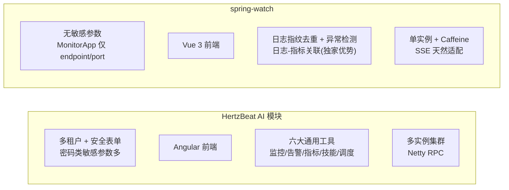
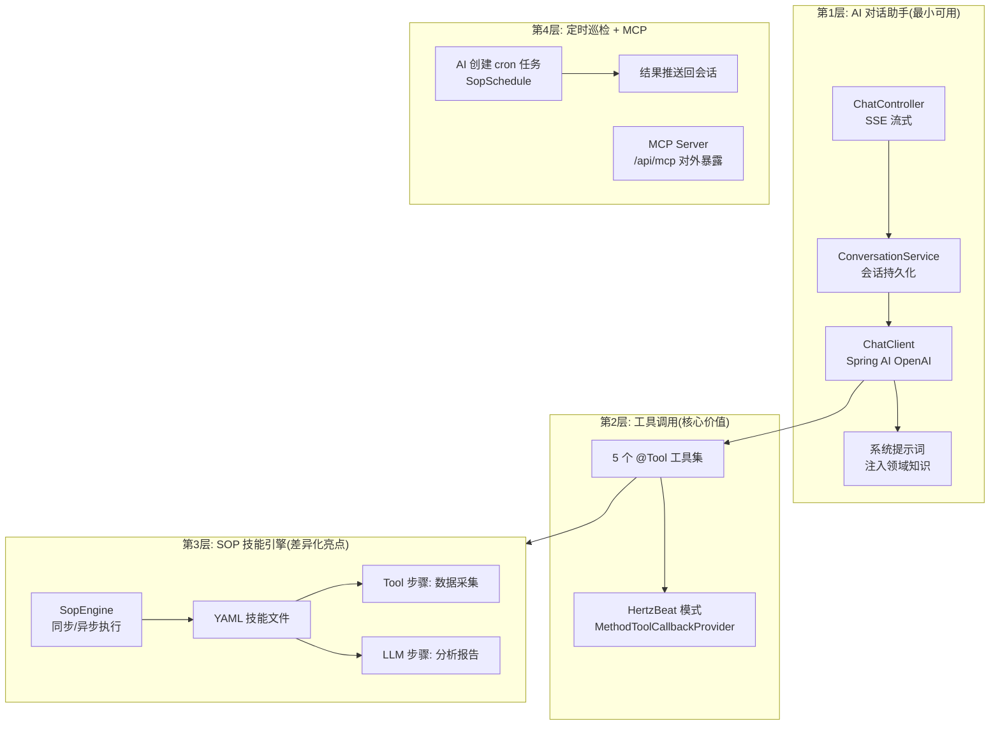
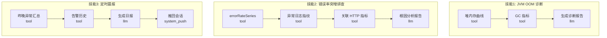
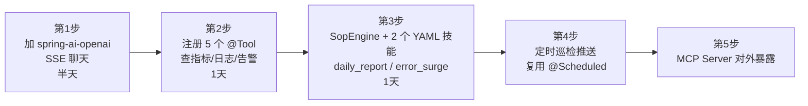

# spring-watch 接入 AI 建议方案

> 基于 HertzBeat AI 模块(`hertzbeat-ai`)的架构经验,为 spring-watch 定制 AI 增强路线。

---

## 1. 项目现状对比

### 1.1 spring-watch 与 HertzBeat 关键差异



| 维度 | HertzBeat AI | spring-watch | 影响 |
|------|-------------|--------------|------|
| 技术栈 | Spring Boot 4.0.3 + Spring AI 1.1.1 | Spring Boot 4.0.1 | 版本可直接照搬 |
| 敏感参数 | 密码/token 多,需 SecureForm + AES | 无,仅 endpoint/port | **安全协议可大幅简化** |
| 数据特色 | 通用监控模板 | 日志指纹 + 异常检测 + 日志-指标关联 | AI 分析原料更值钱 |
| 部署形态 | 多实例 | 单实例 + Caffeine | 无需共享会话状态 |
| 前端 | Angular 17 | Vite + Vue 3 + TS | 聊天面板更轻 |

---

## 2. 建议的 AI 能力分层



### 2.1 工具映射表(直接复用 HertzBeat 模式)

| HertzBeat 工具 | spring-watch 对应工具 | 落点(现有类) |
|---|---|---|
| MonitorTools | 应用注册/启停/列表 | `MonitorAppService` |
| MetricsTools | 指标最新值/时序查询 | `MetricQueryService.queryLatest / querySeries` |
| LogTools | 日志检索/指纹 TopN/错误率 | `LogQueryService.search / topFingerprints / errorRateSeries` |
| AlertTools | 告警规则 CRUD/历史查询 | `AlertRuleService` / `AlertEngine` |
| ScheduleTools | AI 定时巡检 | 新增 `SopSchedule` 表 + 复用 `@Scheduled` |

---

## 3. 差异化 SOP 技能场景



- 日志指纹去重 + 异常检测是现成的 AI 分析素材(其他监控平台没有)
- 每个技能 = 1 个 YAML 文件,`tool` 步骤采集数据、`llm` 步骤生成报告,无需改代码

---

## 4. 需要特别处理的点

| 关注点 | 说明 | 处理方式 |
|---|---|---|
| 日志隐私 | 日志可能含业务敏感数据 | 提示词约束脱敏优先,复用现有脱敏管道 |
| InfluxDB 查询安全 | 防 LLM 注入 | 工具层只暴露白名单查询方法,禁止透传原始 Flux 语句 |
| 成本控制 | 防原始日志流直喂 LLM | 先做 TopN/指纹聚合,再喂 LLM |
| 安全协议简化 | spring-watch 无密码类参数 | 不需要 HertzBeat 的 SecureForm + AES,agent 接入方式用保护提示词即可 |
| 前端 | Vue 3 生态 | chat 面板 + EventSource 消费 SSE,比 Angular 更轻 |

---

## 5. 推荐落地顺序



> 建议直接从**第2步工具调用**做起,数据基础好(日志指纹 + 异常检测),效果立竿见影。

---

## 6. 新增表结构建议

```sql
-- 会话表(照搬 HertzBeat ChatConversation)
CREATE TABLE chat_conversation (
    id          BIGSERIAL PRIMARY KEY,
    title       VARCHAR(128),
    created_at  TIMESTAMP DEFAULT now()
);

-- 消息表(照搬 HertzBeat ChatMessage)
CREATE TABLE chat_message (
    id              BIGSERIAL PRIMARY KEY,
    conversation_id BIGINT NOT NULL REFERENCES chat_conversation(id),
    role            VARCHAR(16),   -- user / assistant / system_push
    content         TEXT,
    created_at      TIMESTAMP DEFAULT now()
);

-- 定时巡检表(照搬 HertzBeat SopSchedule)
CREATE TABLE sop_schedule (
    id              BIGSERIAL PRIMARY KEY,
    conversation_id BIGINT NOT NULL REFERENCES chat_conversation(id),
    sop_name        VARCHAR(64),   -- 技能名: daily_report / error_surge_diagnosis
    cron_expression VARCHAR(64),
    enabled         BOOLEAN DEFAULT true,
    last_run_time   TIMESTAMP,
    next_run_time   TIMESTAMP
);
```

---

## 7. 依赖引入(照搬 HertzBeat pom)

```xml
<!-- spring-ai-bom 1.1.1,兼容 Spring Boot 4.0.x -->
<dependency>
    <groupId>org.springframework.ai</groupId>
    <artifactId>spring-ai-starter-mcp-server-webmvc</artifactId>
</dependency>
<dependency>
    <groupId>org.springframework.ai</groupId>
    <artifactId>spring-ai-openai</artifactId>
</dependency>
<dependency>
    <groupId>org.springframework.ai</groupId>
    <artifactId>spring-ai-client-chat</artifactId>
</dependency>
```