# spring-watch 架构总览

> 一个面向 Spring Boot 微服务的轻量级监控平台,自研实现指标/日志采集、告警评估、日志分析、可观测性。
> 借鉴 HertzBeat 的多协议采集思路,补强采集层的可观测性、存储层的生命周期管理、告警层的可关闭开关。

---

## 1. 全局架构

### 1.1 4 大模块 + 1 个自监控层

```mermaid
flowchart TB
    subgraph 外部["被监控应用 (Spring Boot)"]
        APP1[app-a]
        APP2[app-b]
        APPN[app-n]
    end

    subgraph 采集层["采集层 (Collector)"]
        POOL[共享 HTTP 池]
        AGENT[AgentMetricsCollector / AgentLogCollector]
        PULL[AppPullTask / HostThrottler / PullRetryQueue]
        KAFKA_FALLBACK[KafkaFallbackQueue]
    end

    subgraph 消息总线["消息总线"]
        KAFKA[(Kafka<br/>3 topics + DLQ)]
    end

    subgraph 摄入与存储["摄入 + 存储层"]
        CONSUMER[BatchMetricConsumer<br/>BatchLogConsumer<br/>BatchHeartbeatConsumer<br/>DlqMonitorConsumer]
        INGEST[LogParser<br/>LogFingerprinter<br/>LogSanitizer<br/>LogDedupService]
        INFLUX[(InfluxDB<br/>metrics / logs + 5m downsample)]
        PG[(PostgreSQL<br/>规则 / 历史 / DLQ / 监控对象)]
        REDIS[(Redis<br/>状态 / 计数 / 缓存 / dedup 窗口)]
    end

    subgraph 告警层["告警层 (Alerter)"]
        ENGINE[AlertEngine<br/>PENDING→FIRING 状态机]
        EVAL[AlertEvaluator<br/>JEXL / 简单表达式]
        NOTIFIER[AlertNotifier<br/>SMTP]
        SCANNER[PendingStateScanner<br/>@Scheduled 5s]
        RULECACHE[AlertRuleCache<br/>@Scheduled 30s]
        STATESTORE[AlertStateStore<br/>Redis]
    end

    subgraph 日志分析层["日志分析层 (Analysis)"]
        AGG[LogAggregator<br/>错误率 / TopN / 时序]
        ANOM[LogAnomalyDetector<br/>突增检测 / 新模式]
        LINK[LogMetricsLinker<br/>日志-指标关联]
        SCHED[LogAlertScheduler<br/>@Scheduled 1m]
    end

    subgraph 接入层["接入层 (Web)"]
        CTRL[MonitorAppController<br/>LogController<br/>MetricController]
    end

    subgraph 自监控["平台自监控 (Micrometer)"]
        METER[MeterRegistry]
        GRAFANA[(后续接 Prometheus/Grafana)]
    end

    APP1 & APP2 & APPN -- /metrics /api/agent/logs --> POOL
    POOL --> AGENT
    AGENT --> PULL
    PULL -- 失败/限流 --> KAFKA_FALLBACK
    AGENT & PULL -- Kafka send --> KAFKA

    KAFKA --> CONSUMER
    CONSUMER --> INGEST
    INGEST -- 写原始 --> INFLUX
    INGEST -- 写 dedup 计数 --> REDIS
    CONSUMER -- DLQ 落库 --> PG

    KAFKA -- heartbeat --> CONSUMER
    CONSUMER -- 写库 --> PG

    INFLUX -.5m downsample Task.-> INFLUX

    AGG & ANOM & LINK -- Flux 查询 --> INFLUX
    AGG & ANOM -- Redis --> REDIS
    SCHED -- 错误率事件 --> ENGINE
    CONSUMER -- 指标/日志事件 --> ENGINE

    ENGINE --> EVAL
    ENGINE <--> STATESTORE
    RULECACHE -- 规则 --> PG
    RULECACHE -- 缓存 --> ENGINE
    SCANNER <--> STATESTORE
    SCANNER --> ENGINE
    ENGINE --> NOTIFIER
    ENGINE -- 持久化告警历史 --> PG

    CTRL -- 查询 --> AGG
    CTRL -- 查询 --> PG
    CTRL -- 查询 --> INFLUX
    CTRL -- 管理规则 --> PG

    AGENT & PULL & CONSUMER & AGG & SCANNER & ENGINE --> METER
    METER -. 后续 .-> GRAFANA
```

### 1.2 进程内模块划分

| Package | 职责 | 关键类 |
|---|---|---|
| `collector` | agent 拉取 + Kafka 生产 | `AppPullTask` / `AgentMetricsCollector` / `AgentLogCollector` / `AgentHttpClient` / `KafkaFallbackQueue` |
| `collector.schedule` | 调度 + 限流 + 重投 | `CollectScheduleRegistry` / `HostThrottler` / `PullRetryQueue` / `AppScheduleProperties` |
| `consumer` | Kafka 消费 + 写存储 | `BatchMetricConsumer` / `BatchLogConsumer` / `BatchHeartbeatConsumer` / `DlqMonitorConsumer` |
| `ingest` | 日志字段补全/脱敏/指纹/去重 | `LogParser` / `LogSanitizer` / `LogFingerprinter` / `LogDedupService` |
| `config` | 配置类 | `InfluxDBConfig` / `InfluxDBBucketInitializer` / `KafkaConfig` / `FlywayConfig` / `MetricsConfig` |
| `alerter` | 告警状态机 + 规则评估 + 通知 | `AlertEngine` / `AlertEvaluator` / `AlertNotifier` / `AlertStateStore` / `AlertRuleCache` / `PendingStateScanner` / `AsyncAlertExecutor` / `JexlExprEvaluator` |
| `analysis` | 日志聚合/异常/关联 | `LogAggregator` / `LogAnomalyDetector` / `LogMetricsLinker` / `LogAlertScheduler` |
| `service` | 业务服务 | `AlertRuleService` / `LogQueryService` / `MetricQueryService` / `MonitorAppService` |
| `web` | REST 接入 | `LogController` / `MetricController` / `MonitorAppController` |
| `model` | 实体/DTO/event | `entity/*` / `dto/ApiResponse` / `event/{MetricEvent,LogEvent,HeartbeatEvent}` |
| `repository` | JPA Repository | `AlertRuleRepository` / `AlertHistoryRepository` / `MonitorAppRepository` / `LogDedupCountRepository` / `DlqMessageRepository` |
| `annotation` | AOP 切面 | `SpringWatch` / `SpringWatchAspect` (业务自定义指标埋点) |
| `util` | 工具 | `SnowFlakeIdGenerator` |

---

## 2. 采集层 — 数据入口

### 2.1 拉取链路

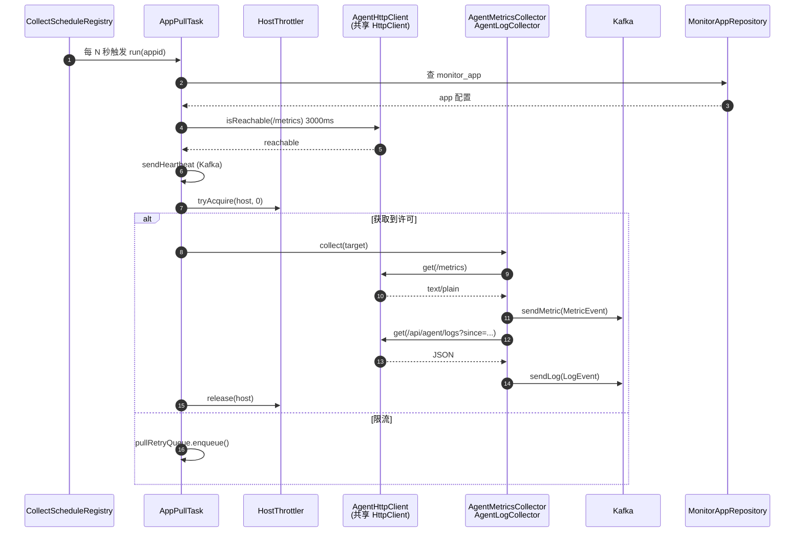

### 2.2 关键组件

#### `AgentHttpClient` (共享 HTTP 池)
- 替换原 3 处 `new HttpURLConnection`,改用 JDK 11+ `java.net.http.HttpClient`
- 内置虚拟线程池 (`virtualThread-per-task executor`)
- 时间统一:connect 3s / read 10s(可达性探测 3s)
- Micrometer 埋点:`request` Timer、`success/failure/timeout/non2xx` Counter、`active` Gauge

#### `PullRetryQueue` (有界重投)
- `PriorityBlockingQueue` + `AtomicInteger queueSize` + `maxQueueSize=1000`
- 队列满 → 拒绝入队 + 监控计数,不无限堆
- 2 个 drainer 虚拟线程,指数退避 `base * 2^attempt`,max shift=6
- 内部 `scheduler.schedule()` 延迟重投

#### `HostThrottler` (按 host 信号量限流)
- `ConcurrentHashMap<host, Semaphore>`,默认 4 并发/host
- 防止单 host 阻塞整个采集池

#### `KafkaFallbackQueue` (Kafka 降级)
- 容量 50000 有界队列,Kafka 不可用时落本地
- 单线程 ScheduledExecutor 周期性重投,3 次重试仍失败的消息丢弃告警

### 2.3 Kafka 拓扑

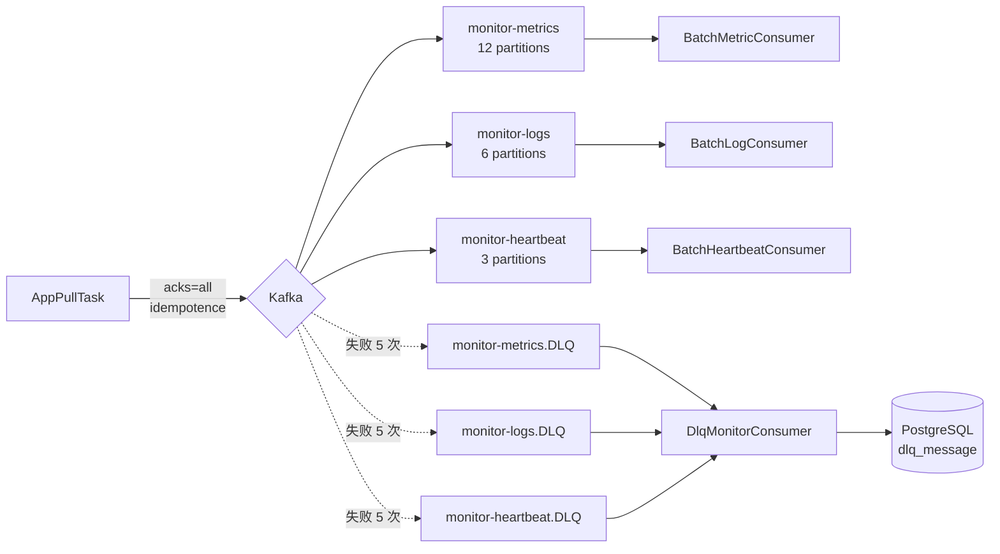

---

## 3. 摄入与存储层

### 3.1 日志摄入管道

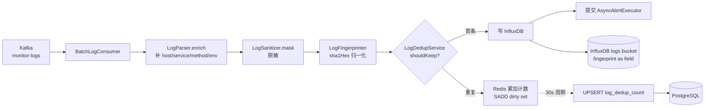

#### 关键设计
- `fingerprint` 放 **field** 不放 tag,避免 sha1Hex 撑爆 TSI 索引
- `appid/level/logger/threadName` 放 tag,走倒排索引
- `message/throwable/host/service/method/env/pattern/traceId` 放 field
- 去重:Redis `SETNX` 窗口 60s,窗口内只保留首条样本,其余累加到 `log:dedup:count:` + 标记 dirty
- **双写**:30s 周期把 dirty 集合里的 (appid, fingerprint) → PostgreSQL `log_dedup_count` 表,`ON CONFLICT DO UPDATE` 累加

### 3.2 InfluxDB 生命周期

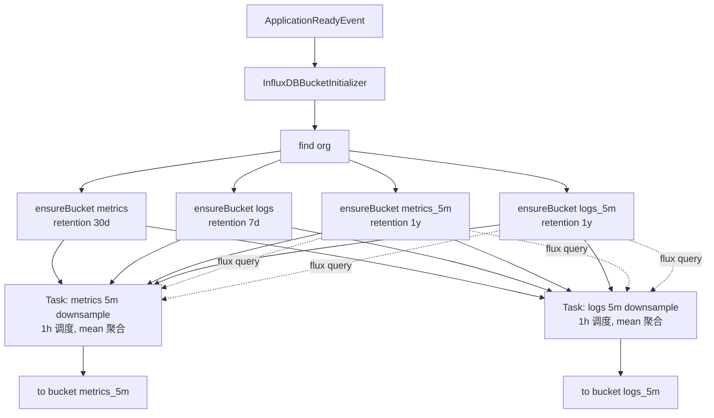

#### InfluxDB Client 生命周期
- `@Bean(destroyMethod = "close")` 显式声明,容器关闭时关闭 OkHttp 连接池
- `QueryApi` 改单例共享(原 3 处 `getQueryApi()` 重复调用)

### 3.3 存储选型与定位

| 数据 | 存储 | 理由 |
|---|---|---|
| 指标/日志原始 | InfluxDB | 时序场景,TSI 倒排索引,downsample 友好 |
| 指标/日志 5m 降采样 | InfluxDB `*_5m` bucket | 长周期查询,数据量小 |
| 告警规则 / 告警历史 | PostgreSQL | 强事务 + JSONB 字段,关系查询 |
| 监控对象 `monitor_app` | PostgreSQL | 业务实体,需要事务一致性 |
| DLQ 消息 | PostgreSQL `dlq_message` | 持久化便于查询/重投 |
| 去重计数 | Redis + PostgreSQL | 实时去重用 Redis,历史用 PG 双写 |
| 告警状态机 | Redis | CAS 抢占,TTL 自动清理 |
| dedup 缓存 / 查询缓存 | Redis | 短 TTL 结果缓存 |
| 限流 / 调度 | 内存 Semaphore + 队列 | 进程内即可,无需持久化 |

---

## 4. 告警层

### 4.1 状态机

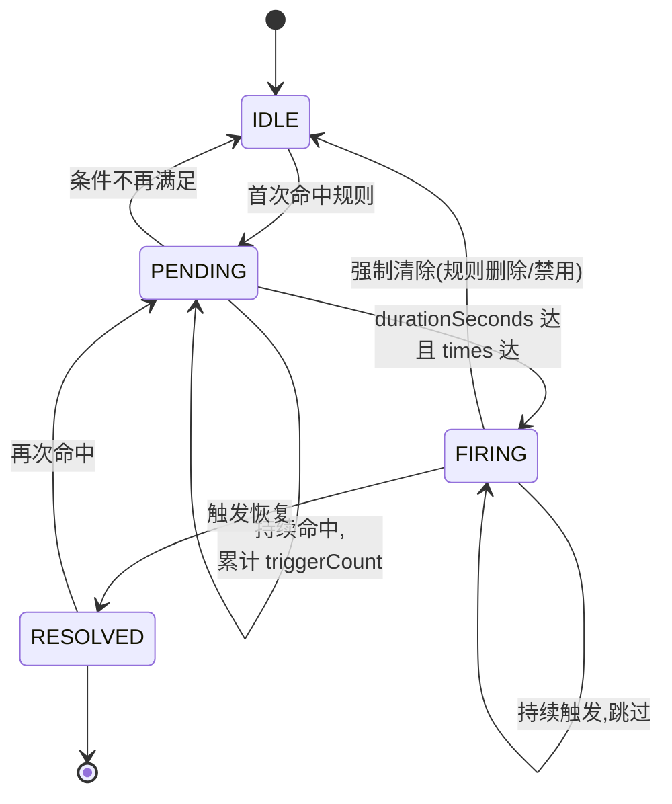

### 4.2 评估链路

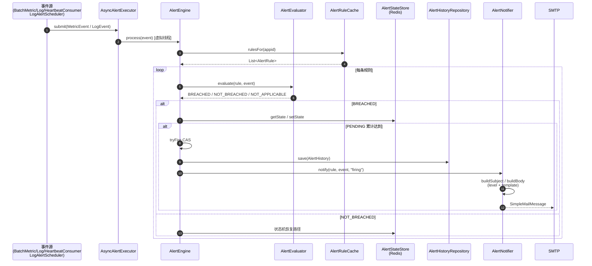

### 4.3 关键设计

- **PENDING 扫描器**(`PendingStateScanner`):`@Scheduled(5s)` 扫 Redis 中 PENDING 状态,二次校验 `times/duration` 满足后 CAS 抢占 FIRING,避免实时事件漏判
- **JEXL 沙箱化**(`JexlExprEvaluator`):禁 `loops/lambda/methodCall/newInstance/annotation/pragma/register`,表达式只能做简单比较
- **告警级别**:`AlertRule.level` ∈ {INFO / WARNING / CRITICAL},V6 migration;邮件主题前缀 `[CRITICAL] xxx` / `[WARNING] xxx` / `[INFO] xxx`
- **times / duration**:`AlertRule.times` + `durationSeconds` 控制升级抖动,V7 migration
- **模板**:`AlertRule.template` 支持 `{{level}} {{app}} {{metric}} {{value}} {{threshold}} {{rule}} {{time}} {{expression}}` 占位符,V7
- **告警上下文**:仅当"触发告警的同一个 metric"再次出现且条件不满足时,才算真正恢复;否则路过的任意 metric 会误触发 resolve(AlertEngine.handleRecover 临时补丁)

### 4.4 软禁用开关

```mermaid
flowchart LR
    PROP[application.yml<br/>spring-watch.alert.enabled]
    PROP -->|true| ON[正常运行]
    PROP -->|false| OFF[软禁用]
    ON --> PSS[PendingStateScanner<br/>@Scheduled 正常跑]
    ON --> ENG[AlertEngine.process<br/>正常评估]
    ON --> NOT[AlertNotifier.notify<br/>正常发邮件]
    OFF --> PSS_OFF[PendingStateScanner<br/>@ConditionalOnProperty<br/>bean 不创建 → 定时任务不注册]
    OFF --> ENG_OFF[AlertEngine.process<br/>开头检查 alertEnabled=false<br/>log trace + return]
    OFF --> NOT_OFF[AlertNotifier.notify<br/>返回 {status:skipped,reason:alert_disabled}]
    OFF -.数据流继续.-> CONSUMER[Batch*Consumer 继续消费<br/>LogAlertScheduler 继续跑]
```

设计:**软禁用而非硬禁用**——`@ConditionalOnProperty` 只放在 `PendingStateScanner`(有 @Scheduled 的那个),`AlertEngine` / `AlertNotifier` 走运行时 `alertEnabled` 标志。这样 `alert.enabled=false` 时:
- 数据消费继续(BatchLogConsumer / BatchMetricConsumer 不受影响)
- 规则评估跳过(AlertEngine.process 直接 return)
- 邮件不发送(AlertNotifier.notify 返回 skipped)
- 定时扫描不启动(PendingStateScanner bean 不创建,@Scheduled 不会注册)
- Admin 接口可用(AlertRuleService 仍可 CRUD,用于演练/灾备)

---

## 5. 日志分析层

### 5.1 分析能力矩阵

| 能力 | 入口 | 存储 | 实时性 |
|---|---|---|---|
| 关键字检索 `messages`/`throwable` | `LogController.search` | InfluxDB | 缓存 15s |
| 错误率聚合 | `LogController.stats/error-rate` | InfluxDB Flux | 实时 |
| 错误率时序 | `LogController.stats/error-rate-series` | InfluxDB Flux | 实时 |
| TopN 异常模式 | `LogController.patterns` | InfluxDB Flux | 实时 |
| 突增异常报告 | `LogController.anomaly` | InfluxDB Flux + Redis 状态 | 实时 |
| Trace 串联 | `LogController.trace/{traceId}` | InfluxDB | 缓存 15s |
| 同模式样本 | `LogController.fingerprint/{fp}` | InfluxDB | 缓存 15s |
| **上下文查询** `±N 秒` | `LogController.context` | InfluxDB | 不缓存 |
| 指标-日志关联 | `LogController.correlate` | InfluxDB | 实时 |
| Dedup 计数 Top | `LogController.dedup/top` | PostgreSQL | 30s 周期 |

### 5.2 日志分析数据流

```mermaid
flowchart LR
    INF[(InfluxDB logs)] --> AGG[LogAggregator]
    INF --> LINK[LogMetricsLinker]
    AGG -->|errorRate| SCHED[LogAlertScheduler<br/>@Scheduled 1m]
    AGG -->|errorRate / TopN / 时序| CTRL[LogController]
    LINK -->|correlate| CTRL
    ANOM[LogAnomalyDetector<br/>Redis 状态] --> CTRL
    SCHED -- 合成 MetricEvent --> EXEC[AsyncAlertExecutor]
    INF -- Trace 维度 --> TRACE[findByTraceId]
    INF -- 时间锚点 + 维度 --> CTX[getContext]
    TRACE --> CTRL
    CTX --> CTRL
```

### 5.3 关键设计 — 日志查询缓存

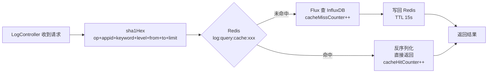

`LogQueryService.search/findByTraceId/findByFingerprint` 三个方法都走此缓存模式。`getContext` 故意不缓存(上下文查询 QPS 极低且时间窗口短,缓存价值低)。

### 5.4 上下文查询

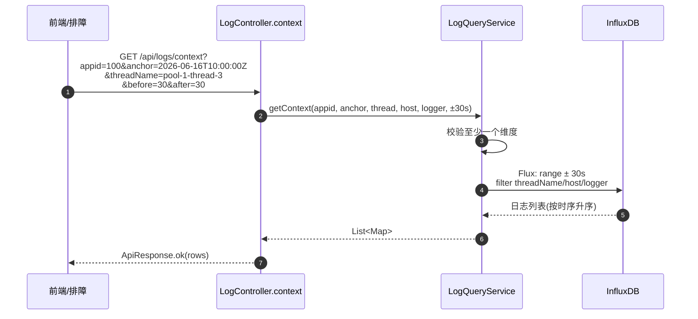

---

## 6. 数据模型

### 6.1 PostgreSQL 表关系

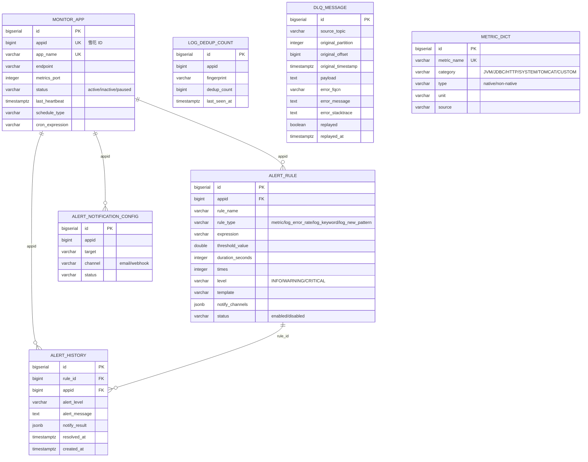

### 6.2 Flyway 迁移版本

| 版本 | 主题 | 主要变更 |
|---|---|---|
| V1 | 初始 schema | monitor_app / alert_rule / alert_history / app_logs 分区表 |
| V2 | agent_pull_schema | agent 拉取相关表 |
| V3 | drop app_logs | 删除 app_logs,日志改存 InfluxDB |
| V4 | appid to monitor_app | monitor_app 加 appid 列 |
| V5 | schedule fields | schedule_type / cron_expression |
| V6 | alert_rule.level | 加 level 列 |
| V7 | alert_rule.times / template | 加 times / template 列 |
| V8 | alert_rule fix missing | 补缺列 |
| V9 | alert_notification_config | 通知配置表 |
| V10 | alert_fk_to_appid | 外键从 id 改为 appid |
| V11 | metric_dict | 指标字典表 |
| **V12** | composite index + dlq | alert_history 复合索引 + dlq_message 表 |
| **V13** | log_dedup_count | dedup 双写表 |

### 6.3 InfluxDB 测量(measurement)

| measurement | 用途 | tags | fields |
|---|---|---|---|
| `springboot_metrics` | JVM 指标 + 业务自定义 | appid / metric / method | value / count / tags* |
| `app_log` | 应用日志 | appid / level / logger / threadName | message / throwable / fingerprint / traceId / host / service / method / env / pattern |

> `fingerprint` 放 field 而非 tag,避免 sha1Hex 撑爆 TSI 倒排索引。

### 6.4 Kafka Topic

| Topic | Partition | 用途 | 保留 |
|---|---|---|---|
| monitor-metrics | 12 | 指标事件 | 1d |
| monitor-logs | 6 | 日志事件 | 1d |
| monitor-heartbeat | 3 | 心跳事件 | 1d |
| monitor-metrics.DLQ | 12 | 指标消费失败 | 由 consumer 落库 |
| monitor-logs.DLQ | 6 | 日志消费失败 | 由 consumer 落库 |
| monitor-heartbeat.DLQ | 3 | 心跳消费失败 | 由 consumer 落库 |

---

## 7. 自监控(Micrometer)

### 7.1 埋点全景

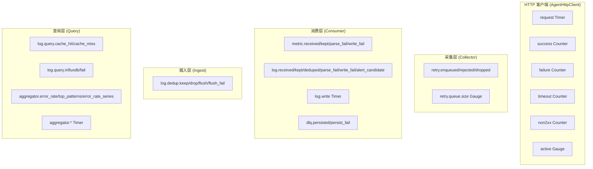

### 7.2 指标命名规范

```
spring.watch.{模块}.{功能}.{指标}
```

| 前缀 | 含义 |
|---|---|
| `spring.watch.collector.http.*` | HTTP 客户端 |
| `spring.watch.collector.retry.*` | 重投队列 |
| `spring.watch.consumer.{metric,log,dlq}.*` | Kafka 消费 |
| `spring.watch.ingest.log.dedup.*` | dedup 双写 |
| `spring.watch.aggregator.log.*` | 日志聚合查询 |
| `spring.watch.log.query.*` | 日志查询缓存 |

后续接 Prometheus:`micrometer-registry-prometheus` + actuator → `/actuator/prometheus` → Prometheus 抓取 → Grafana 看板 → AlertManager 告警。

---

## 8. 部署拓扑

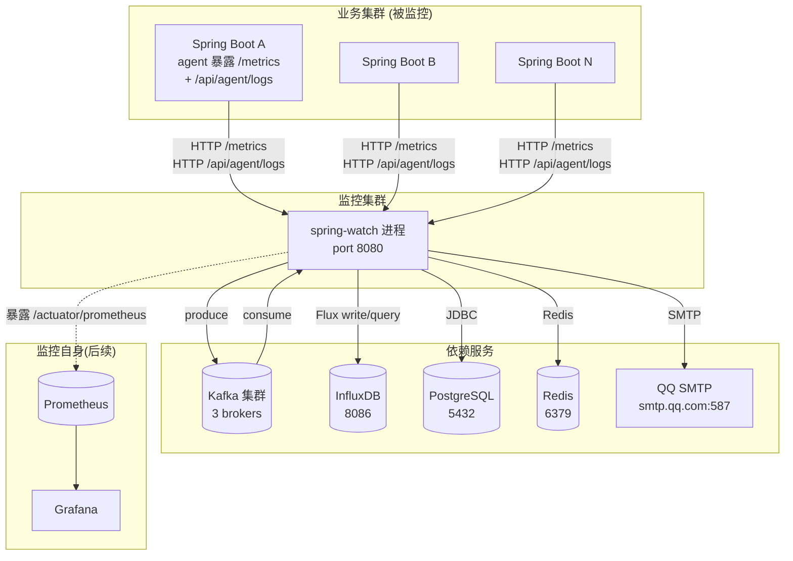

### docker-compose 视角(参考)

```yaml
services:
  spring-watch:
    image: spring-watch:1.0.0
    ports: ["8080:8080"]
    environment:
      - MAIL_AUTH_CODE=xxx       # 修复 P0-#8 SMTP 部署链路
      - INFLUXDB_URL=http://influxdb:8086
      - SPRING_KAFKA_BOOTSTRAP_SERVERS=kafka:9092
      - SPRING_DATASOURCE_URL=jdbc:postgresql://postgres:5432/spring_collector
      - SPRING_DATA_REDIS_HOST=redis
      - SPRING_WATCH_ALERT_ENABLED=true
    depends_on: [kafka, influxdb, postgres, redis]
```

---

## 9. 失败模式与容错

| 失败点 | 影响 | 兜底 |
|---|---|---|
| Agent HTTP 不可达 | 采集失败 | `AppPullTask.markInactive` + `AgentHttpClient.timeout/failure` 计数 |
| 单 host 慢 | 阻塞采集池 | `HostThrottler` 限流 + 慢的入重投队列 |
| Agent 全挂 | retry 任务堆 | `PullRetryQueue.maxQueueSize=1000` 上限保护 |
| Kafka 不可用 | 采集数据丢失 | `KafkaFallbackQueue` 5w 容量本地降级 + 重投 |
| InfluxDB 写失败 | 日志/指标丢失 | `BatchLogConsumer` 改 log + drop(不重投避免死循环)+ `writeFailCounter` |
| InfluxDB 长时间累积 | 磁盘爆 | `BucketRetentionRules` 自动过期 + downsample Task |
| InfluxDB 高基数 tag | TSI OOM | `fingerprint` 放 field 不放 tag |
| DLQ 消息丢失 | 无法回查 | `DlqMonitorConsumer` 消费 `.DLQ` 写 `dlq_message` 表 |
| Dedup 计数丢 | Redis 重启计数归零 | 30s 周期双写到 `log_dedup_count` 表 |
| 告警风暴 | 邮箱/IM 被打爆 | 状态机抑制(已有 FIRING 不重复发)+ 未来加 alert 去重/合并 |
| 告警误触发 | 收到不相关 metric | `AlertEngine.handleRecover` 校验 lastMetric 一致 |
| 告警需临时关 | 业务希望"全静默" | `spring-watch.alert.enabled=false` 软禁用 |
| 业务重启 spring-watch | 内存状态全失 | 告警状态在 Redis(TTL 24h),规则在 PG(冷启重载) |
| 时区/时间错乱 | 告警窗口/时间锚点异常 | 全部用 `Instant.now()` + `Clock.systemUTC()`,InfluxDB 时间戳用 NS 精度 |
| 慢查询 | dashboard 卡 | `LogQueryService` 短 TTL Redis 缓存(15s) + Micrometer 监控 cache_hit |
| 误删规则 | 评估引用了不存在的规则 | `AlertRuleCache` 校验 `enabled` + `PendingStateScanner` 跳过已删 |

---

## 10. 启动流程与生命周期

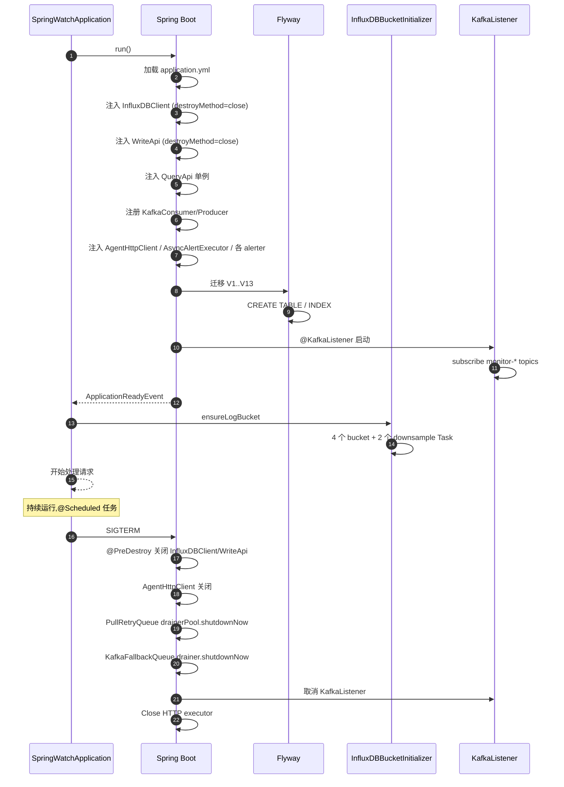

---

## 11. 关键配置项速查(`application.yml`)

```yaml
spring-watch:
  collector:
    pool-size: 32              # 采集池大小
    per-host-concurrent: 4     # 单 host 信号量
    http:
      connect-timeout-ms: 3000
      read-timeout-ms: 10000
    retry:
      drainer-count: 2
      max-attempts: 5
      max-queue-size: 1000     # 有界上限
  agent:
    prometheus-host: 0.0.0.0
  alert:
    enabled: true              # 软禁用开关
    mail:
      from: 2787901285@qq.com
      from-name: spring-watch
    state-store:
      ttl-hours: 24
    rule-cache:
      refresh-interval-ms: 30000
    executor:
      pool-size: 8
    scan:
      enabled: true
      interval-ms: 5000
      batch-size: 200
  log:
    env: dev
    dedup:
      window-seconds: 60
      count-ttl-seconds: 3600
      flush-interval-ms: 30000  # 周期双写 DB
    query:
      cache-enabled: true
      cache-ttl-seconds: 15
    anomaly:
      rate-ttl-seconds: 600
      pattern-ttl-hours: 168
    alert:
      error-rate-window-seconds: 60
      error-rate-interval-ms: 60000
    linker:
      default-metric: jvm_memory_used_bytes

influxdb:
  url: http://localhost:8086
  org: spring-watch
  metrics-bucket: metrics
  log-bucket: logs
  metrics-downsample-bucket: metrics_5m
  log-downsample-bucket: logs_5m
  retention:
    metrics-seconds: 2592000   # 30d
    log-seconds: 604800        # 7d
    downsample-seconds: 31536000  # 1y
  downsample:
    enabled: true
    every: 5m
    window: 5m
    task-every: 1h
```

---

## 12. P0/P1 修复总览(本轮落地)

| 层级 | 编号 | 问题 | 修复 |
|---|---|---|---|
| 采集 | #1 | HTTP 连接池缺失 | `AgentHttpClient` 共享 HttpClient(virtualThread) |
| 采集 | #2 | PullRetryQueue 无界 | `maxQueueSize=1000` + 拒绝策略 + 监控 |
| 存储 | #3 | InfluxDB 无 retention | `InfluxDBBucketInitializer` 加 `BucketRetentionRules` |
| 存储 | #4 | 无 downsample | 自动创建 5m downsample Task + 1h 调度 |
| 存储 | #5 | PostgreSQL 缺复合索引 | V12 加 `(appid, created_at DESC)` + `(status, last_heartbeat)` |
| 存储 | #6 | InfluxDB 高基数 tag | `BatchLogConsumer` fingerprint 由 tag 改 field |
| 存储 | #15 | InfluxDBClient 无 close | `@Bean(destroyMethod="close")` |
| 存储 | #16 | BatchLogConsumer 写失败回滚 | 去 `throw` 改 log + 丢本批 + 计数 |
| 存储 | #17 | queryApi 不池化 | 共享单例 `QueryApi` Bean |
| 存储 | #19 | DLQ 消息未落库 | V12 `dlq_message` + `DlqMonitorConsumer` 落库 |
| 告警 | #7 | AlertRuleService 缺字段 | 加 `level/times/template` 3 个参数 |
| 告警 | #20 | @ConditionalOnProperty | `PendingStateScanner` 硬禁用 + `AlertEngine/Notifier` 软禁用 |
| 日志 | (旧) | dedup 计数未双写 | V13 `log_dedup_count` + 30s 周期 flush |
| 日志 | (旧) | search 慢 | LogQueryService 加 Redis 结果缓存(15s TTL) |
| 日志 | (旧) | 无上下文查询 | `getContext(±N秒, thread/host/logger)` + `/api/logs/context` |
| 平台 | #13 | 采集层无 Micrometer | 引入 `spring-boot-starter-micrometer-metrics` + Counter/Timer/Gauge |

---

## 13. 后续可演进点(P1/P2)

| 优先级 | 演进方向 | 备注 |
|---|---|---|
| P1 | log_keyword 走偏(精确 vs 模糊) | AlertEvaluator 已用 `strings.containsStr` |
| P1 | 告警抑制(同一 rule/app 短窗口不重发) | 状态机有 FIRING 抑制,需扩展到多规则场景 |
| P1 | 告警去重/合并(同主题聚合) | 需新增 AlertGroupingService |
| P1 | 模板 if/for(条件分支/循环) | 当前是简单替换,可升级到 Pebble/FreeMarker |
| P1 | 恢复节流(恢复通知也加 times 校验) | 现状恢复是 1 次 |
| P1 | 日志多维聚合(组合维度) | 需扩 LogAggregator 接口 |
| P1 | 时序对比(同比/环比) | 需扩 LogAggregator 接口 |
| P1 | 季节性检测 | 用 STL/Holt-Winters,引入依赖较大 |
| P1 | 业务化(业务事件接入) | 需扩 entity/event |
| P2 | Prometheus 端点暴露 | 加 `micrometer-registry-prometheus` + actuator |
| P2 | alert_history 分区表 | 数据量大时按月分区 |
| P2 | InfluxDB Task 自动恢复 | 检测 Task 失败自动重建 |
| P2 | metric_dict 死代码 | V11 migration 建表后未消费,需评估保留/删除 |
| P2 | 规则版本化(灰度发布) | 加 alert_rule_version 表 |
| P2 | Controller 完善 | 当前只有 MonitorAppController / LogController / MetricController,缺 AlertController / DlqController / MonitorController |

---

## 14. 一句话总结

> **spring-watch = 共享 HTTP 池 + 有界重投队列 + InfluxDB 生命周期管理 + 软禁用告警 + 日志分析缓存/上下文/双写,全程可观测。**

定位:**轻量级、零依赖外部搜索引擎(纯 InfluxDB + PG + Redis + Kafka)、可关闭的告警、可观测自身**。
