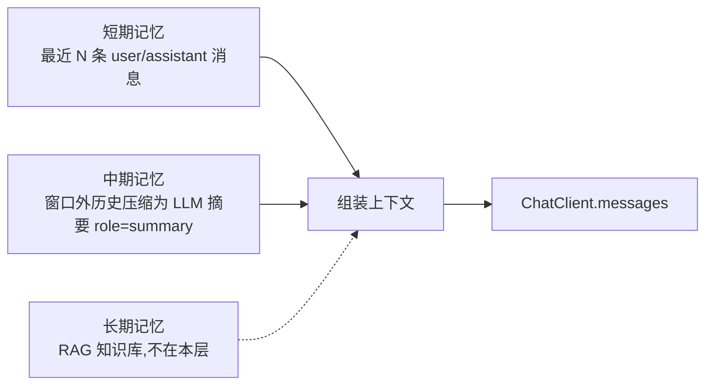
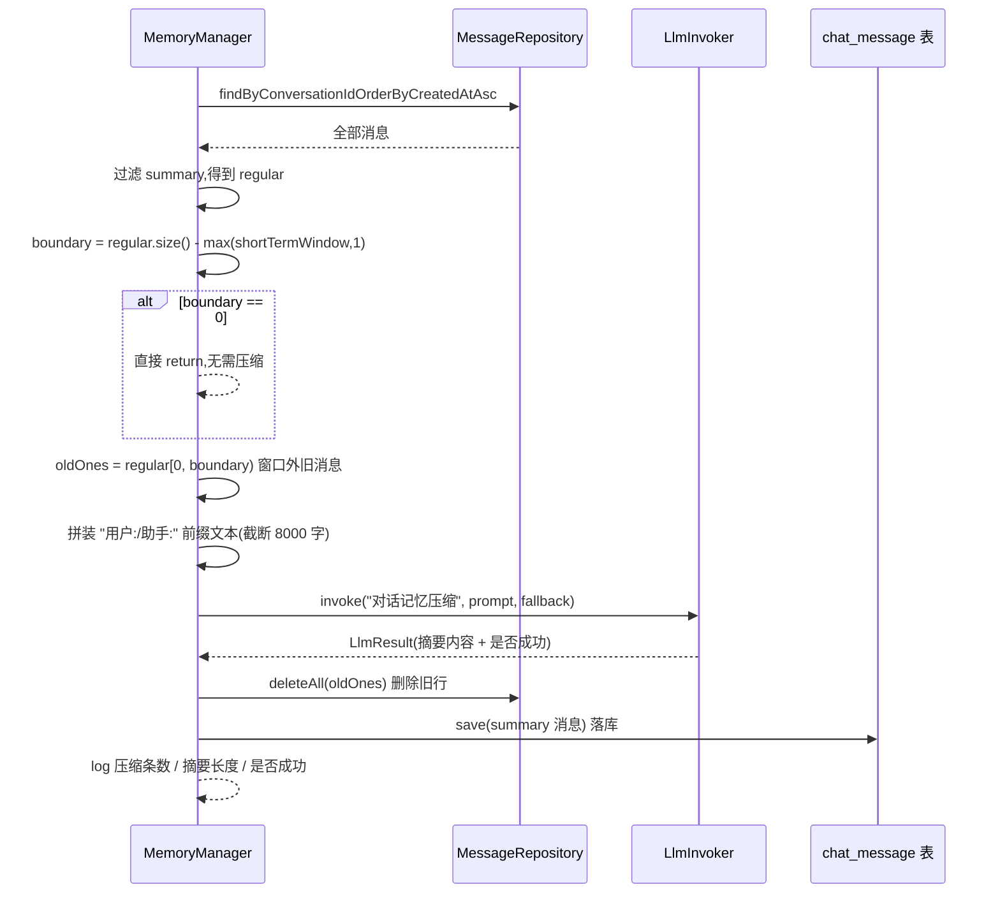
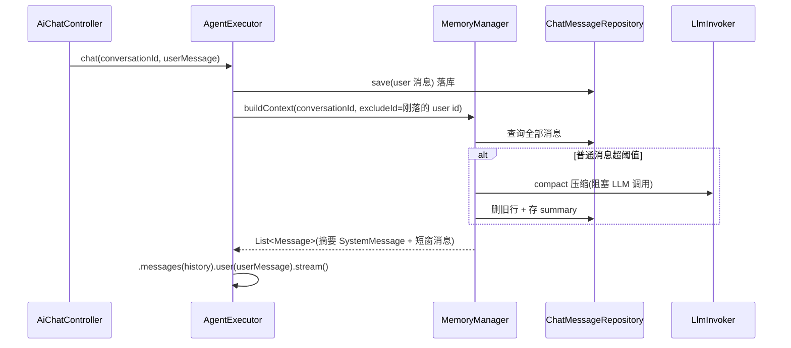

# MemoryManager 分层记忆上下文构建详解

> 源码:`src/main/java/com/springwatch/ai/agent/MemoryManager.java`

## 一、定位与职责

MemoryManager 是 AI Agent 编排层的**分层记忆管理器**,承担短期与中期两层记忆的组装:



- **短期记忆**:最近 `short-term-window`(默认 12)条 user/assistant 消息,直接透传。
- **中期记忆**:窗口外的早期历史被压缩为一条 `role=summary` 的摘要消息,以 `SystemMessage` 形式注入。
- **长期记忆**:由 RAG 知识库承接(本层不处理)。

## 二、核心配置

| 配置项 | 默认值 | 含义 |
| --- | --- | --- |
| `ai.agent.short-term-window` | 12 | 短期窗口:上下文中保留的普通消息条数 |
| `ai.agent.compact-threshold` | 24 | 压缩阈值:普通消息超过该值触发压缩 |

> 两者取大:`Math.max(compactThreshold, shortTermWindow * 2)` 作为真正触发压缩的门槛。

## 三、数据模型

`chat_message` 表的 `role` 字段有三种取值:

| role | 说明 | 进入上下文的方式 |
| --- | --- | --- |
| `user` | 用户消息 | `UserMessage` |
| `assistant` | AI 回复 | `AssistantMessage` |
| `summary` | 压缩摘要(中期记忆) | `SystemMessage`(前缀"【早期对话记忆摘要】") |

消息按 `createdAt` 升序查询(`findByConversationIdOrderByCreatedAtAsc`),顺序即对话先后顺序。

## 四、buildContext 执行流程

```mermaid
flowchart TD
    A[输入 conversationId, excludeMessageId] --> B[按时间升序查询全部消息]
    B --> C[过滤 excludeMessageId<br/>得到 history]
    C --> D{history 为空?}
    D -- 是 --> E[返回空列表]
    D -- 否 --> F[统计普通消息数 regularCount]
    F --> G{regularCount > max<br/>compactThreshold, 2*shortTermWindow?}
    G -- 是 --> H[compact 压缩窗口外历史]
    H --> I[重新查询数据库<br/>再次过滤 excludeMessageId]
    I --> J
    G -- 否 --> J[从后往前找最近的 summary 消息]
    J --> K[构造输出 out]
    K --> L{存在 latestSummary?}
    L -- 是 --> M[注入 SystemMessage 摘要]
    L -- 否 --> N[跳过摘要]
    M --> O[过滤出全部普通消息 regular]
    N --> O
    O --> P[截取最近 max(shortTermWindow,1) 条]
    P --> Q[逐条转 UserMessage / AssistantMessage]
    Q --> R[返回组装好的 List<Message>]
```

### 4.1 排除刚落库的当前消息

```java
history = all.stream()
    .filter(m -> !m.getId().equals(excludeMessageId))
    .toList();
```

调用方(`AgentExecutor.chat`)刚把当前这条 user 消息落库,并用 `.user(userMessage)` **单独发送**,因此从历史里排除,避免重复。

### 4.2 触发压缩判定

```java
long regularCount = history.stream().filter(m -> !SUMMARY_ROLE.equals(m.getRole())).count();
if (regularCount > Math.max(compactThreshold, shortTermWindow * 2)) {
    compact(conversationId, history);
    // 压缩会删库 + 落 summary,必须重新查库
    history = ...重新查询并过滤...;
}
```

- 只统计 `user`/`assistant`(普通消息),`summary` 不计数。
- 压缩是**一次性**的:触发后重查数据库,后续 `regularCount` 必然回落到窗口内,不会再触发。
- 压缩在**读路径**上同步执行(阻塞 LLM 调用),是代价较高的一步,因此阈值取了两者较大的值避免频繁触发。

### 4.3 提取最近摘要

```java
for (int i = history.size() - 1; i >= 0; i--) {
    if (SUMMARY_ROLE.equals(history.get(i).getRole())) { latestSummary = ...; break; }
}
```

倒序遍历找**最近一条** `summary`(summary 不参与压缩删除,只会新增,故取最新一条保证记忆不回溯)。

### 4.4 组装输出

```java
// 1) 中期记忆:摘要 → SystemMessage
out.add(new SystemMessage("【早期对话记忆摘要】\n" + latestSummary.getContent()));

// 2) 短期记忆:最近 max(shortTermWindow,1) 条普通消息
int from = Math.max(0, regular.size() - Math.max(shortTermWindow, 1));
for (int i = from; i < regular.size(); i++) { ... UserMessage / AssistantMessage ... }
```

最终消息顺序:**摘要在前,短窗消息在后**,符合 LLM 上下文组织习惯。

## 五、compact 压缩流程



### 5.1 边界计算

```java
int boundary = Math.max(0, regular.size() - Math.max(shortTermWindow, 1));
```

- `boundary` = 需压缩的旧消息条数(窗口外的部分)。
- 示例:`regular.size()=30, shortTermWindow=12` → `boundary=18`,压缩前 18 条,保留最近 12 条。
- 若 `boundary==0`(即还没超过窗口)直接返回。

### 5.2 压缩 Prompt

```text
请将以下历史对话压缩为简明记忆摘要(200字内),保留关键事实:
问题现象、根因结论、处置结果:

用户: ...
助手: ...
```

- 输入截断到 **8000 字**(`truncate(text, 8000)`)。
- `fallback` 使用同一段文本截断到 **1500 字**,LLM 不可用时降级为原文摘要(防止压缩流程把历史弄丢)。

### 5.3 落库策略

```java
messageRepository.deleteAll(oldOnes);                      // 先删旧行,防膨胀
messageRepository.save(ChatMessage.builder()               // 再落一条 summary
    .role(SUMMARY_ROLE).content(r.content()).build());
```

**先删后存**保证每个会话只保留一条(或少数几条)summary,避免历史无限增长。

## 六、调用链



## 七、边界条件与注意事项

1. **excludeMessageId 去重**:当前 user 消息已落库,必须排除,否则重复出现。
2. **压缩触发用 `regularCount`**:`summary` 不参与计数,避免摘要消息把阈值"撑爆"。
3. **压缩后必须重查数据库**:`deleteAll` + `save` 后,内存中的 `history` 已过期。
4. **`shortTermWindow` 最小为 1**:`Math.max(shortTermWindow, 1)` 防止配置为 0 导致上下文为空。
5. **压缩是同步阻塞 LLM 调用**:频控由阈值兜底;若需要可改为异步,但会引入"压缩期间上下文不一致"的问题。
6. **fallback 降级**:LLM 失败时摘要退化为原文截断,保证记忆不丢失。
7. **role 为 null 的兜底**:`switch (m.getRole() == null ? "" : m.getRole())` 防御脏数据。