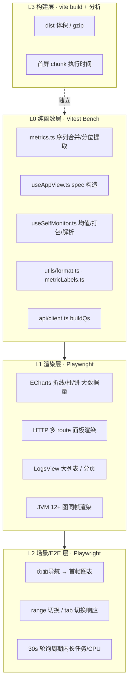
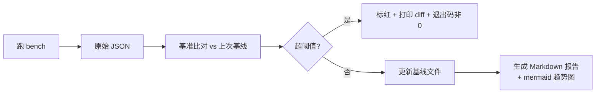
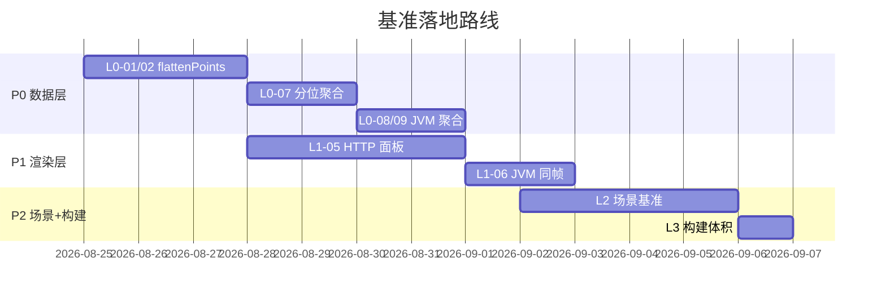

# spring-watch 前端基准测试设计方案

> 范围:`frontend/`(Vue 3 + TypeScript + Pinia + ECharts)
> 目标:给**渲染层性能**建立可量化、可回归、可持续观测的基准,防止图表/列表/数据转换在迭代中退化。
> 说明:本方案是"设计文档",基准用例给出目标函数、输入规模、指标与阈值;落地时按 P0/P1/P2 分批实现。

## 1. 背景与目标

前端是纯展示型 SPA,性能瓶颈集中在三处:

1. **数据转换**(纯函数):`metrics.ts` / `useAppView.ts` / `useSelfMonitor.ts` 里的序列合并、分位聚合、多维矩阵组装、正则解析等,数据量随 `range` 与路由数放大;
2. **图表渲染**:ECharts 折线/柱状/饼图,高点数(24h@30s ≈ 2880 点/series)、多 route 面板(HTTP 页按 route 拆 N 个面板,每面板 2 图)时首帧与交互帧率;
3. **首屏与构建**:打包体积、首屏 JS 执行、TTI。

与后端"上游拉取性能"等报告不同,前端基准关注**浏览器端**指标。目标:

- 数据转换纯函数:建立 op/s 与耗时基线,防 O(n²) 回归(如 `flattenPoints` 合并去重);
- 渲染:建立"进入页面 → 首帧图表"与"刷新 → 画面稳定"的耗时基线;
- 构建:跟踪 dist 体积与 gzip,防依赖膨胀;
- 全部指标输出 JSON + Markdown 报告,可进 CI 做趋势与阈值校验。

## 2. 基准分层



## 3. 工具选型

| 层 | 工具 | 理由 |
|---|---|---|
| L0 | Vitest + `vitest bench`(内置 Tinybench) | 与 TS/`@` 别名无缝,自带 bench 断言(如 `expect(ops).toBeGreaterThan(...)`),CI 可跑;无需新框架 |
| L1/L2 | Playwright(Chromium headless) | 能拿 `performance.now`/User Timing/Long Task/`performance.metrics`,可 mock 后端(route 拦截)保证输入可控 |
| L3 | `vite build` + `rollup-plugin-visualizer` | 现有构建体系零改造,输出 chunk 体积与 gzip |
| 报告 | 自定义 runner 脚本 | 汇总 JSON + 生成 Markdown 表格与 mermaid 趋势图 |

> 依赖新增:`vitest`、`@vitest/ui`(可选)、`@playwright/test`、`rollup-plugin-visualizer`(devDependencies,不影响产物)。

## 4. 数据造数(输入可控)

基准最忌"依赖真实后端抖动"。统一造数模块 `bench/fixtures/data.ts`:

- 用**种子随机数**(mulberry32)生成与真实 API 响应同构的 fixture:
  - `SeriesResp`:N series × M points(`{t,v}` 时间戳递增);
  - `GroupedResp` / `QuantileResp`:带 tags 的分组 / 分位点;
  - `AppViewBatchResponse`:按 `useAppView.ts` 各 view spec 的 key 形状组装;
- 规模档位与 range 对齐:

| 档位 | 说明 | 每 series 点数 |
|---|---|---|
| S(5m) | every 30s | 10 |
| M(15m) | every 30s | 30 |
| L(6h) | every 30s | 720 |
| XL(24h) | every 30s | 2880 |

- L1/L2 用 Playwright `page.route('**/api/**')` 拦截注入 fixture,后端可完全不启动。

## 5. L0 纯函数基准用例

基准统一指标:`ops/s`、单次耗时 p50/p95、内存分配量(可选)。用例清单:

| ID | 被测函数(位置) | 输入规模 | 关注指标 | 建议基线(仅示例,落地后以首跑为准) |
|---|---|---|---|---|
| L0-01 | `flattenPoints`(`composables/metrics.ts:103`) | 单 series 2880 点 | 耗时 | 24h 数据 < 10ms |
| L0-02 | `flattenPoints` 多 series 去重合并 | 10 series × 2880 点(时间戳错位) | 耗时/O(n) 验证 | < 50ms,且 2× 数据耗时 < 2× |
| L0-03 | `pickRowValue`(`metrics.ts:86`) | rows 10 万行 × 100 次 | ops/s | 仅防退化 |
| L0-04 | `extractTagValue`(`metrics.ts:119`) | series 名 1 万条 × 100 次 | ops/s | 仅防退化 |
| L0-05 | `useAppView.ts` spec 构造 | `jdbcViewSpecs()` 21 specs / `jvmViewSpecs()` / `osViewSpecs()` | 耗时 | 单次 < 1ms |
| L0-06 | `httpRouteSpecs(routes)` 放大 | 200 routes → 800 specs | 耗时 | 构造 < 10ms |
| L0-07 | HttpPane 全站分位聚合(`HttpPane.vue:118`) | 30 route × 3 分位 × 2880 点 | 耗时 | < 100ms |
| L0-08 | `renderMultiDimBar`(`JvmPane.vue:56`) | 50 gc_name × 2 action | 耗时 | < 10ms |
| L0-09 | GC 分位按 name×action 分组(`JvmPane.vue:191`) | 10 组合 × 3 分位 × 2880 点 | 耗时 | < 50ms |
| L0-10 | `parseTags`(`InflightPane.vue:45`) | series 名(带 4 tag)× 1 万条 | ops/s | 仅防退化 |
| L0-11 | `meanRate` / `buildQpsBar`(`useSelfMonitor.ts:127/139`) | 12 类 × 2880 点 | 耗时 | < 20ms |
| L0-12 | `formatNumber` 千分位(`format.ts:15`) | 10 万次 | ops/s | 防正则退化 |
| L0-13 | `escapeHtml`(`format.ts:36`) | 10 万次 | ops/s | 仅防退化 |
| L0-14 | `shortJson`(`format.ts:60`) | 1 万次 JSON.parse | ops/s | 仅防退化 |
| L0-15 | `labelOf`(`utils/metricLabels.ts:371`) | 命中主表 / 兜底后缀 / 未命中 各 1 万次 | ops/s | 防长表线性退化 |

> 阈值写法示例:`bench('L0-02 flattenPoints 10×2880', ..., { time: 100 })` 后接
> `expect(() => flattenPoints(seriesList)).toRunUnder(50)`(Tinybench 断言,限制单次 < 50ms)。

## 6. L1 渲染层基准用例

Playwright 固定视口 1440×900,`route` 注入 fixture,记录:
`FCP`、`图表首帧时间(第一个 echarts canvas 出现)`、`整页稳定时间(无新增节点)`、`主线程长任务数/时长`、`帧率采样`。

| ID | 场景 | 输入 | 关注指标 | 基线建议 |
|---|---|---|---|---|
| L1-01 | 折线图 1 series × 2880 点 | ECharts `LineChart` | 渲染耗时 | < 500ms |
| L1-02 | 折线图 5 series × 2880 点(堆叠 area) | JVM heap 场景放大 | 渲染耗时 | < 800ms |
| L1-03 | 柱状图 100 categories × 2 series | TopN 放大 | 渲染耗时 | < 400ms |
| L1-04 | 饼图 100 扇区 | status/method 分布放大 | 渲染耗时 | < 300ms |
| L1-05 | HTTP 页 100 route 面板(200 图同帧) | `HttpPane` 全量 | 首帧 + 稳定时间 | 首帧 < 3s |
| L1-06 | JVM 页 12 图同帧 | `JvmPane` 全量 | 首帧 + 稳定时间 | 首帧 < 2s |
| L1-07 | LogsView 搜索列表 5000 行 | `searchResults` | 首渲染 + 滚动帧率 | 首渲染 < 1s |
| L1-08 | AppsView 应用列表 2000 项 | `AppsView` | 渲染耗时 | < 500ms |

> 用 `performance.getEntriesByType('longtask')` 统计长任务;ECharts 渲染耗时通过 `echarts.getInstanceByDom` + `renderFinished` 事件或 `requestAnimationFrame` 打点测量。

## 7. L2 场景 / E2E 层基准用例

走真实 SPA 路由(不 mock 页面内 js,仅 mock `/api`):

| ID | 场景 | 步骤 | 指标 |
|---|---|---|---|
| L2-01 | 应用列表首屏 | `goto /` → 应用列表可见 | 导航→首内容、TTI |
| L2-02 | 进入 JDBC tab 首帧 | `goto /apps/:id?tab=jdbc` → 首图出现 | 导航→首帧 |
| L2-03 | range 切换 5m→24h | 点击 `24h` → 图表数据刷新完成 | 交互→刷新稳定 |
| L2-04 | tab 切换 jdbc→http | 点击 HTTP | 切换→HTTP 首帧 |
| L2-05 | 轮询周期负载 | 挂载 HTTP 页 30s,统计长任务与 CPU 峰值 | 长任务总时长 < 500ms |
| L2-06 | 自监控 InflightPane 15s 轮询 | 挂载 60s | 长任务总时长、图表帧率 |

## 8. L3 构建层基准

| ID | 指标 | 采集方式 | 关注点 |
|---|---|---|---|
| L3-01 | dist 总大小 / gzip | `vite build` + visualizer JSON | 防依赖膨胀 |
| L3-02 | 首屏 chunk 体积 | visualizer `assets` 表 | 首屏 JS 体积 |
| L3-03 | 首屏 JS 执行时间 | Playwright 加载 dist 产物,`performance` | 解析/执行 |

## 9. 报告与趋势



- 基线文件:`bench/.baseline.json`(按用例 ID 存 p50/p95/ops);
- 报告输出:`docs/bench-reports/{date}.md`,含:
  - 汇总表(用例、本次值、基线值、diff、判定);
  - mermaid 折线趋势图(取近 N 次 p50);
- 判定规则:单用例 p95 超基线 +30% 或连续 3 次超 +20% 判失败;
- 性能抖动处理:每个用例 warmup + 多次采样取中位数,CI 跑两遍取最低。

## 10. 目录结构与运行方式

```
frontend/
├── bench/
│   ├── fixtures/data.ts          # 种子造数(mulberry32)
│   ├── pure/*.bench.ts           # L0: metrics/useAppView/format/labels…
│   ├── e2e/*.spec.ts             # L1/L2: Playwright 渲染与场景
│   ├── runner/report.ts          # 汇总 JSON → Markdown + 阈值判定
│   ├── .baseline.json            # 基线
│   └── playwright.config.ts
└── package.json 新增 scripts
```

```jsonc
// package.json scripts 追加
{
  "bench": "npm run bench:pure && npm run bench:e2e && npm run bench:report",
  "bench:pure": "vitest bench",
  "bench:e2e": "playwright test --config bench/playwright.config.ts",
  "bench:report": "node bench/runner/report.ts",
  "bench:build": "vite build --mode report && npx rollup-plugin-visualizer --sourcemap false"
}
```

## 11. 优先实现路线



- **P0**(必做):L0 数据转换 + 基线文件 + 报告脚本,先锁住纯函数性能;
- **P1**:L1 渲染层,HTTP/JVM 两个最重页面;
- **P2**:L2 场景 + L3 构建,接入 CI(如可用)。

## 12. 风险与局限

- **基准天然有方差**:浏览器 GC、OS 调度都会抖动,需 warmup + 多采样取中位数,阈值放宽到 +30% 避免误报;
- **ECharts 渲染测量口径**:不同版本 resize/autoresize 行为不同,测量需固定视口与动画关闭(`animation:false`)保证可比;
- **mock 与真实差异**:L1/L2 用 route 拦截 mock 后端,网络层耗时被排除,测的是纯前端;真实端到端延迟不在本基准范围;
- **未覆盖**:内存泄漏回归(可后续加 `--heap` 快照对比)、旧版 iframe 页面(已废弃);
- **依赖新增属 devDependencies**,不影响 `vite build` 产物;若不想引入 Playwright 全家桶,可用 Chromium 的 `--remote-debugging` + Puppeteer 替代(不推荐,维护成本高)。

任务已完成!kxj
