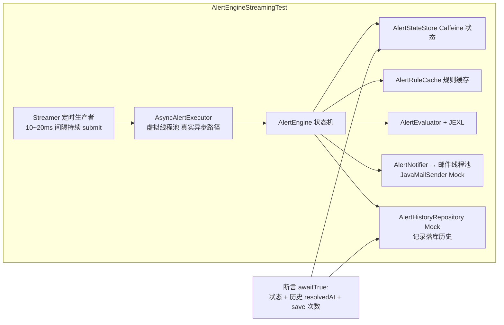
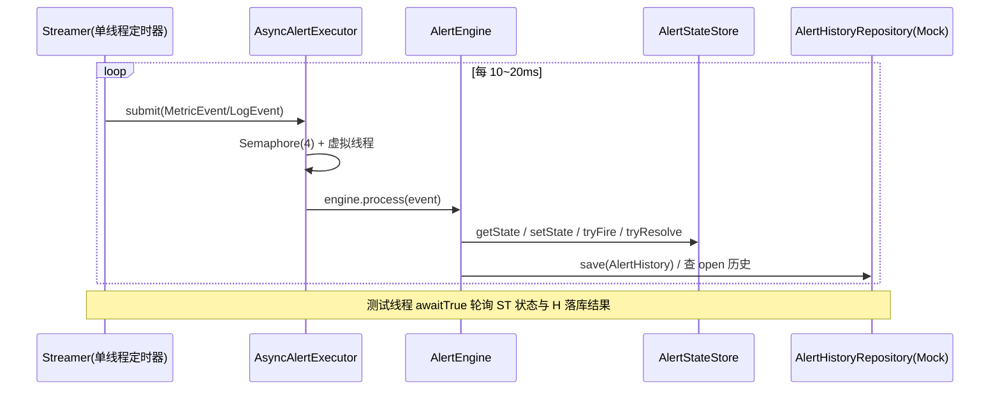

# 告警引擎流式单测方案说明

> 对应代码:`src/test/java/com/springwatch/alerter/AlertEngineStreamingTest.java`
> 目标:不停向告警引擎灌数据,观察状态机流转与历史落库行为,验证 P0/P1 修复点。

## 1. 为什么要"流式"测

告警引擎是**事件驱动状态机**(IDLE → PENDING → FIRING → RESOLVED),单次调用 `process()` 只能验证一步。真实故障场景是**持续上报**的数据流:

- 阈值持续超限 → PENDING 保持 → 满足 duration/times → FIRING
- 日志告警触发后,大量普通日志混入 → 不能闪断
- 数据停止上报 → 告警要能兜底恢复

所以测试用一个定时生产者(Streamer)像上游采集一样**周期性灌事件**,断言用轮询等待(awaitTrue)观察最终状态,而不是同步等待单次调用结果。

## 2. 测试架构



## 3. 为什么不启动 Spring 上下文

- 告警引擎依赖注入的 Beans(JexlEngine、MeterRegistry 等)可以**手工 new**,成本低
- 不需要 DB/InfluxDB/SMTP,Repository 和 MailSender 用 Mockito 打桩
- 测试更可控:能注入"save 第一次抛异常"这类故障场景
- 启动快,CI 友好

## 4. 装配要点(踩过的坑)

| 坑 | 处理 |
|---|---|
| `@Value` 字段默认值不生效(alertEnabled=false、poolSize=0、ttlHours=0) | `ReflectionTestUtils.setField()` 显式赋值后再调 `init()` |
| `init()` 包私有、跨包不可访问 | `LogAnomalyDetector.init()` 改为 `public`;其余组件与测试同包(`com.springwatch.alerter`)可直接调用 |
| `AlertEngine.self` 是 final 字段,无法构造注入 | 反射 `setAccessible(true)` 把 `self` 指向引擎自身(单测无事务代理,self 直接调用即可) |
| `AlertRuleCache` 依赖 `findByStatus("enabled")` 全量加载 | Mockito 打桩返回 `activeRules` 列表,每场景 `add` 规则后调 `ruleCache.refresh()` 重建缓存 |
| `fire()` 落库 2 次 + `resolve()` 落库 1 次 | save 打桩返回入参并记录 `lastHistory` + `saveCalls` 计数器 |
| `AlertHistoryRepository` 的 open 历史查询 | 打桩返回 `lastHistory` 中未 resolved 的那条 |

装配顺序(关键):先建全部 Bean → `setField` 填 `@Value` → 逐个调 `init()` → 反射注入 `self` → 最后建 `AsyncAlertExecutor`(它构造时需要 engine)。

## 5. 流式发数机制



`Streamer` 实现:单线程 `ScheduledExecutorService` + `AtomicBoolean` 开关,`stop()` 后立即停发,保证场景切换时数据流干净。

## 6. 五个场景与验证点

| # | 场景 | 灌数据 | 验证点(断言) | 对应修复 |
|---|---|---|---|---|
| 1 | metric 规则触发+恢复 | cpu_usage=90 持续 → 改灌 10 | FIRING + 历史落库;恢复后 IDLE + resolvedAt | 状态机完整流转 |
| 2 | log_keyword 防闪断 | OOM 日志与普通日志 20ms 交替 → 只灌普通日志 | 混流 1.5s 不闪断;无命中 > grace(5s) 才恢复 | P0-2 |
| 3 | JEXL 多指标不误恢复 | a=90 触发 → 灌 b=10 → 灌 a=10 | b 事件 1.2s 不误恢复;同 metric 低值才恢复 | P0-3 |
| 4 | 数据停止上报兜底恢复 | 触发 FIRING 后调 `resolveFromScanner` | 状态清除 + 历史关闭 | P0-4 |
| 5 | fire 失败回退重试 | save 首次抛异常后继续灌 | 状态回退 PENDING → 重试成功 FIRING | P0-1 |

断言工具:`awaitTrue(描述, 条件, 超时)` 每 25ms 轮询,超时 `fail()`。避免用固定 `sleep` 等结果(易抖动)。

## 7. 运行方式

```bash
mvn test -Dtest=AlertEngineStreamingTest
```

预期:5 个用例全绿,单次跑约 25~35 秒(场景 2 需等 grace 窗口、场景 1/5 需等 duration 1s)。

## 8. 局限与后续

- 未覆盖 `PendingStateScanner` 定时扫描线程本身(用直接调用 `resolveFromScanner`/`fireFromScanner` 模拟)
- 未覆盖 `LogAlertScheduler`(error_rate 合成事件链路,依赖 InfluxDB 查询,建议在 mock-test 集成环境验证)
- 未覆盖高并发竞争(可后续用多 Streamer 并发灌同一规则验证 CAS 只触发一次)
- 邮件实际发送未验证(JavaMailSender Mock),SMTP 链路建议用 EmailConfig 页"测试邮件"功能人工验证