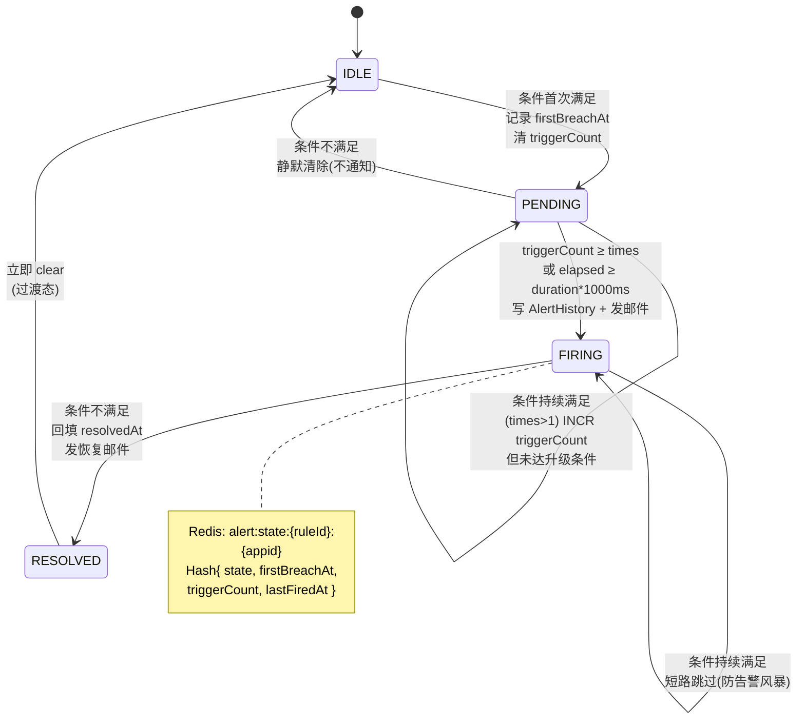
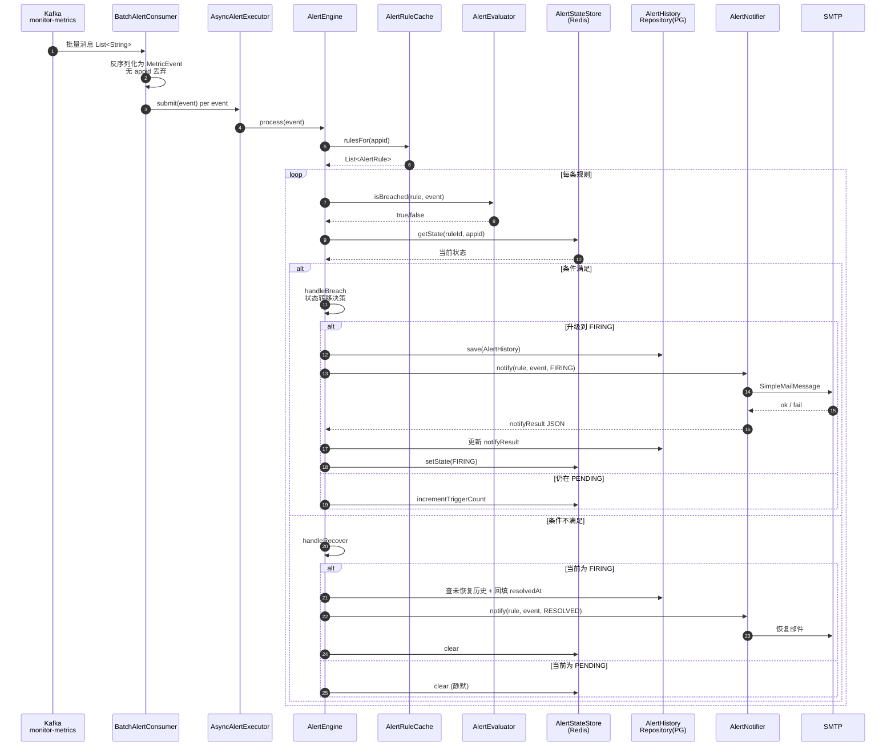

# spring-watch 告警模块实现分析报告

> 范围：仅告警(Alerter)模块，无关组件已省略
> 项目路径：`D:\codespace\ideaProject\spring-watch`
> 报告时间：2026-06-14

---

## 一、模块概览

告警模块基于 **事件驱动 + 状态机** 设计，核心特征：

- 数据源：仅消费 Kafka `monitor-metrics` 主题中的 `MetricEvent`（指标流），不消费日志/心跳
- 评估时机：纯事件驱动，无独立定时扫描器
- 状态机：`IDLE → PENDING → FIRING → RESOLVED` 四态
- 表达式：简单正则（向后兼容）+ JEXL（沙箱化复杂条件）双引擎
- 规则缓存：30s 内存缓存，避免每条 event 查 DB
- 状态存储：Redis Hash（key=`alert:state:{ruleId}:{appid}`），TTL 24h
- 通知：当前**仅 SMTP 邮件**一种渠道
- 异步：虚拟线程池（默认 8 线程）评估

---

## 二、架构图

### 2.1 告警模块整体架构

```mermaid
flowchart TB
    subgraph SRC["数据源（仅指标）"]
        K[("Kafka<br/>monitor-metrics<br/>P=12")]
    end

    subgraph INGRESS["接入层"]
        BC["BatchAlertConsumer<br/>@KafkaListener<br/>groupId=spring-watch-alert-evaluator<br/>batchFactory concurrency=3"]
        AE["AsyncAlertExecutor<br/>虚拟线程池<br/>pool-size=8"]
    end

    subgraph CORE["告警引擎核心"]
        ENG["AlertEngine<br/>状态机驱动 + 持久化 + 通知编排"]
        EVA["AlertEvaluator<br/>简单正则 / JEXL 分流"]
        JEX["JexlExprEvaluator<br/>沙箱化复杂表达式"]
        RC["AlertRuleCache<br/>30s 刷新内存缓存"]
        SS["AlertStateStore<br/>状态机存储"]
    end

    subgraph STORAGE["存储层"]
        PG[("PostgreSQL<br/>alert_rule<br/>alert_history")]
        RD[("Redis Hash<br/>alert:state:{ruleId}:{appid}<br/>TTL 24h")]
    end

    subgraph NOTIFY["通知层"]
        NF["AlertNotifier<br/>邮件通知 + 模板渲染"]
        SMTP[("SMTP<br/>JavaMailSender")]
    end

    subgraph MGMT["规则管理（未暴露 REST）"]
        SVC["AlertRuleService<br/>CRUD 已实现"]
        REPO1["AlertRuleRepository"]
        REPO2["AlertHistoryRepository"]
    end

    K -->|批量拉取 max.poll.records=500| BC
    BC -->|MetricEvent| AE
    AE -->|submit task| ENG

    ENG -->|查规则| RC
    RC -.->|@PostConstruct + @Scheduled 30s| REPO1
    REPO1 --> PG

    ENG -->|评估| EVA
    EVA -->|复杂表达式| JEX

    ENG -->|读/写状态| SS
    SS --> RD

    ENG -->|FIRING/RESOLVED 落库| REPO2
    REPO2 --> PG

    ENG -->|发通知| NF
    NF -->|SMTP STARTTLS| SMTP
    NF -.->|notifyResult JSON 写回| REPO2

    SVC --> REPO1
    SVC --> REPO2

    style CORE fill:#fff3cd,stroke:#856404
    style STORAGE fill:#d1ecf1,stroke:#0c5460
    style NOTIFY fill:#d4edda,stroke:#155724
    style MGMT fill:#f8d7da,stroke:#721c24,stroke-dasharray: 5 5
```

### 2.2 状态机流转图



### 2.3 触发链路时序图



---

## 三、目录结构

| 路径 | 作用 |
|---|---|
| `src/main/java/com/springwatch/alerter/AlertEngine.java` | 状态机引擎（核心） |
| `src/main/java/com/springwatch/alerter/AlertEvaluator.java` | 表达式评估（正则 + JEXL 分流） |
| `src/main/java/com/springwatch/alerter/JexlExprEvaluator.java` | JEXL 沙箱化表达式引擎 |
| `src/main/java/com/springwatch/alerter/AlertNotifier.java` | 邮件通知实现 |
| `src/main/java/com/springwatch/alerter/AlertRuleCache.java` | 规则缓存（30s 刷新） |
| `src/main/java/com/springwatch/alerter/AlertState.java` | 状态机枚举 |
| `src/main/java/com/springwatch/alerter/AlertStateStore.java` | 状态 Redis 存储 |
| `src/main/java/com/springwatch/alerter/AsyncAlertExecutor.java` | 异步评估线程池（虚拟线程） |
| `src/main/java/com/springwatch/consumer/BatchAlertConsumer.java` | Kafka 告警消费入口 |
| `src/main/java/com/springwatch/service/AlertRuleService.java` | 规则 CRUD（未暴露 REST） |
| `src/main/java/com/springwatch/model/entity/AlertRule.java` | 规则实体 |
| `src/main/java/com/springwatch/model/entity/AlertHistory.java` | 告警历史实体 |
| `src/main/java/com/springwatch/repository/AlertRuleRepository.java` | 规则 JPA 仓库 |
| `src/main/java/com/springwatch/repository/AlertHistoryRepository.java` | 历史 JPA 仓库 |
| `src/main/java/com/springwatch/config/MailConfig.java` | 邮件 JavaMailSender 配置 |
| `src/main/java/com/springwatch/config/JexlConfig.java` | JEXL 沙箱化配置 |
| `src/main/resources/db/migration/V1__init_schema.sql` | 初始表 DDL |
| `src/main/resources/db/migration/V6__alert_rule_level.sql` | 加 level 列 |
| `src/main/resources/db/migration/V7__alert_rule_times_template.sql` | 加 times + template 列 |

---

## 四、核心实体

### 4.1 AlertRule（规则）

文件：`src/main/java/com/springwatch/model/entity/AlertRule.java:8`

| 字段 | 类型 | 说明 |
|---|---|---|
| `id` | `Long` | 主键 |
| `app` | `MonitorApp` LAZY | 关联应用，appid 来源 |
| `ruleName` | `String(256)` | 规则名，模板 `{{rule}}` |
| `ruleType` | `String(32)` | **当前只支持 `"metric"`** |
| `expression` | `String(512)` | 触发表达式 |
| `thresholdValue` | `Double` | 阈值，模板 `{{threshold}}` |
| `durationSeconds` | `Integer` (60) | PENDING 持续时长 |
| `notifyChannels` | `String` jsonb | 通知渠道，当前**仅识别 `email` 键** |
| `status` | `String(16)` | `enabled` / `disabled` |
| `level` (V6) | `String(16)` | `warning` / `critical` / `info` |
| `times` (V7) | `Integer` (1) | 触发次数阈值 |
| `template` (V7) | `String(1024)` | 邮件正文模板 |

### 4.2 AlertHistory（历史）

文件：`src/main/java/com/springwatch/model/entity/AlertHistory.java:8`

| 字段 | 类型 | 说明 |
|---|---|---|
| `id` | `Long` | 主键 |
| `rule` / `app` | 关联实体 | LAZY 引用 |
| `alertLevel` | `String(16)` | 触发时 level 快照 |
| `alertMessage` | `TEXT` | 通知内容快照 |
| `notifyResult` | `String` jsonb | 通知结果 `{status, channel, to/error}` |
| `resolvedAt` | `Instant` | 恢复时间 |
| `createdAt` | `Instant` | `@PrePersist` 自动 |

---

## 五、状态机行为详解

文件：`src/main/java/com/springwatch/alerter/AlertEngine.java`

| From | Event | To | 行为 | 代码位置 |
|---|---|---|---|---|
| IDLE / RESOLVED | breached | PENDING | `setState(PENDING, firstBreachAt=now)`，清 triggerCount | `AlertEngine.java:67-73` |
| PENDING | breached & 未达 | PENDING | `incrementTriggerCount`（仅 times>1 时） | `AlertEngine.java:75-90` |
| PENDING | breached & 达标 | FIRING | `times` 达到 **或** `elapsed ≥ duration*1000ms`，`fire()` 写历史 + 邮件 | `AlertEngine.java:91-104` |
| PENDING | recovered | IDLE | `clear` **静默**（不通知） | `AlertEngine.java:112-116` |
| FIRING | breached | FIRING | 短路跳过，防告警风暴 | `AlertEngine.java:62-65` |
| FIRING | recovered | RESOLVED→IDLE | 回填 `resolvedAt` + 恢复邮件 + `clear` | `AlertEngine.java:118-123` |

**关键设计：**

1. **FIRING 期间不重发**：避免风暴
2. **PENDING→FIRING 双闸**：`times` 或 `duration` 任一达标即可升级
3. **RESOLVED 是过渡态**：写完邮件立即 clear 回 IDLE，不在 Redis 长期保留
4. **PENDING→IDLE 静默**：未达升级条件就恢复的不发通知，减少噪音

---

## 六、表达式引擎

文件：`src/main/java/com/springwatch/alerter/AlertEvaluator.java:22`

### 6.1 分流策略

```
expression ─┬─ 匹配 ^(\w[\w.]*)\s*(>=|<=|>|<|==|!=)\s*([\d.]+)$
            │      └─ simpleEvaluate（向后兼容快速路径）
            └─ 否则 → JexlExprEvaluator（复杂多条件）
```

### 6.2 简单格式

支持 6 个操作符：`> >= < <= == !=`
示例：`response_time > 500`、`error_rate >= 0.05`

### 6.3 JEXL 格式

文件：`src/main/java/com/springwatch/alerter/JexlExprEvaluator.java:20`

可访问变量：

- `value` / `metric` / `__app__` / `__count__`
- `tags.*`（动态 tag 访问）

示例：`value > 80 && value < 95`、`metric == 'cpu' && value > tags.threshold`

### 6.4 JEXL 沙箱

文件：`src/main/java/com/springwatch/config/JexlConfig.java:18`

禁用项（测试覆盖 4 个用例）：

- `methodCall` — 禁止调用任意方法
- `newInstance` — 禁止 `new` 对象
- `lambda` — 禁止 lambda
- `loops` — 禁止循环

---

## 七、通知实现

文件：`src/main/java/com/springwatch/alerter/AlertNotifier.java:31`

### 7.1 当前能力

| 项 | 现状 |
|---|---|
| 邮件 SMTP | **已实现**（JavaMailSender） |
| Webhook | 设计文档规划，**代码未实现** |
| 钉钉 / 飞书 | 设计文档规划，**代码未实现** |
| 多收件人 | 逗号分隔（`a@x.com,b@x.com`） |

`notifyChannels` JSONB **只识别 `email` 键**，其他键被忽略并返回 `{"status":"skipped","reason":"no_email"}`。

### 7.2 模板占位符

`AlertNotifier.renderTemplate` (`AlertNotifier.java:120`)：

| 占位符 | 含义 |
|---|---|
| `{{level}}` | 等级（warning/critical/info） |
| `{{type}}` | firing / resolved |
| `{{app}}` | 应用名 |
| `{{appid}}` | appid |
| `{{metric}}` | 指标名 |
| `{{value}}` | 当前值 |
| `{{threshold}}` | 规则阈值 |
| `{{rule}}` | 规则名 |
| `{{time}}` | 时间戳 |
| `{{expression}}` | 表达式 |

### 7.3 邮件主题前缀

- `firing` → 由 level 决定：`[CRITICAL]` / `[WARNING]` / `[INFO]` / `[ALERT]`
- `resolved` → 统一 `[RESOLVED]`

---

## 八、配置项

文件：`src/main/resources/application.yml`

```yaml
spring-watch:
  alert:
    enabled: true                       # 总开关（代码未读取，形同虚设）
    mail:
      from: 2787901285@qq.com
      from-name: spring-watch
    state-store:
      ttl-hours: 24                     # Redis TTL
    rule-cache:
      refresh-interval-ms: 30000        # 缓存刷新周期
    executor:
      pool-size: 8                      # 虚拟线程池大小

spring:
  mail:
    host: smtp.qq.com
    port: 587
    username: 2787901285@qq.com
    password: ******                    # 明文，生产应改 secrets
    properties:
      mail.smtp.auth: true
      mail.smtp.starttls.enable: true
      mail.smtp.starttls.required: true
      mail.smtp.connectiontimeout: 5000
      mail.smtp.timeout: 5000
      mail.smtp.writetimeout: 5000
```

---

## 九、数据库

### 9.1 alert_rule 表

```sql
-- V1 初始
CREATE TABLE IF NOT EXISTS alert_rule (
    id BIGSERIAL PRIMARY KEY,
    app_id BIGINT,
    rule_name VARCHAR(256),
    rule_type VARCHAR(32),
    expression VARCHAR(512),
    threshold_value DOUBLE PRECISION,
    duration_seconds INTEGER DEFAULT 60,
    notify_channels JSONB,
    status VARCHAR(16) DEFAULT 'enabled',
    created_at TIMESTAMPTZ,
    CONSTRAINT fk_alert_rule_app FOREIGN KEY (app_id) REFERENCES monitor_app(id)
);

-- V6 增量
ALTER TABLE alert_rule ADD COLUMN level VARCHAR(16) NOT NULL DEFAULT 'warning';

-- V7 增量
ALTER TABLE alert_rule ADD COLUMN times INTEGER NOT NULL DEFAULT 1;
ALTER TABLE alert_rule ADD COLUMN template VARCHAR(1024);
```

### 9.2 alert_history 表

```sql
CREATE TABLE IF NOT EXISTS alert_history (
    id BIGSERIAL PRIMARY KEY,
    rule_id BIGINT,
    app_id BIGINT,
    alert_level VARCHAR(16),
    alert_message TEXT,
    notify_result JSONB,
    resolved_at TIMESTAMPTZ,
    created_at TIMESTAMPTZ,
    CONSTRAINT fk_alert_history_rule FOREIGN KEY (rule_id) REFERENCES alert_rule(id),
    CONSTRAINT fk_alert_history_app FOREIGN KEY (app_id) REFERENCES monitor_app(id)
);
```

---

## 十、关键缺口与改进建议

| 缺口 | 现状 | 优先级 |
|---|---|---|
| **REST 接口** | `AlertController` 不存在，`AlertRuleService` 完整但无 HTTP 入口，规则只能手工 SQL 维护 | 高 |
| **多通知渠道** | 仅 email，Webhook/钉钉/飞书在设计文档规划但代码未实现 | 高 |
| **告警抑制 (silence/inhibit)** | 未实现，设计列为 P3 | 中 |
| **`spring-watch.alert.enabled` 总开关** | 配置项存在但代码未读取 | 低 |
| **SMTP 密码明文** | `application.yml` 中明文，生产需改 secrets | 高 |
| **规则去重/降级** | 同应用同指标多规则可能重复告警 | 中 |

---

## 十一、测试覆盖

`src/test/java/com/springwatch/alerter/` 共 **48 个用例全绿**：

| 测试类 | 用例数 | 覆盖点 |
|---|---|---|
| `AlertEvaluatorTest` | 15 | 6 操作符、边界值、null、非 metric 类型、小数阈值、metric 名带点 |
| `JexlExprEvaluatorTest` | 17 | 单条件/AND/OR、metric 匹配、null、**沙箱拒绝 4 用例**、非法表达式、tags 访问 |
| `AlertNotifierTest` | 16 | 3 level 前缀、resolved 前缀、**8 模板占位符**、渠道跳过、多收件人、from 地址、SMTP 失败 |

---

## 十二、依赖清单（仅告警相关）

| 依赖 | 用途 |
|---|---|
| `spring-boot-starter-mail` | JavaMailSender SMTP |
| `commons-jexl3:3.4.0` | 复杂表达式评估 |
| `spring-boot-starter-data-jpa` | 规则/历史持久化 |
| `spring-boot-starter-data-redis` | 状态机 Hash 存储 |
| `spring-kafka` | 告警事件流入 |
| `tools.jackson` (Spring Boot 4.0) | JSON 序列化 `MetricEvent` / `notifyChannels` |
| `lombok` | `@RequiredArgsConstructor` + `@Slf4j` |

---

## 附：核心代码定位速查

| 关注点 | 位置 |
|---|---|
| 告警入口 | `BatchAlertConsumer.onBatch` — `BatchAlertConsumer.java:29` |
| 状态机驱动 | `AlertEngine.process` — `AlertEngine.java:27` |
| 升级到 FIRING | `AlertEngine.handleBreach` — `AlertEngine.java:75-104` |
| 恢复处理 | `AlertEngine.handleRecover` — `AlertEngine.java:107` |
| 发火/恢复 | `AlertEngine.fire` / `resolve` — `AlertEngine.java:125 / 145` |
| 表达式分流 | `AlertEvaluator.isBreached` — `AlertEvaluator.java:22` |
| JEXL 沙箱 | `JexlConfig` — `JexlConfig.java:18` |
| Redis 状态 | `AlertStateStore.setState` — `AlertStateStore.java:30` |
| 邮件发送 | `AlertNotifier.sendEmail` — `AlertNotifier.java:55` |
| 模板渲染 | `AlertNotifier.renderTemplate` — `AlertNotifier.java:120` |
| 缓存刷新 | `AlertRuleCache.refresh` `@Scheduled` — `AlertRuleCache.java:36` |
