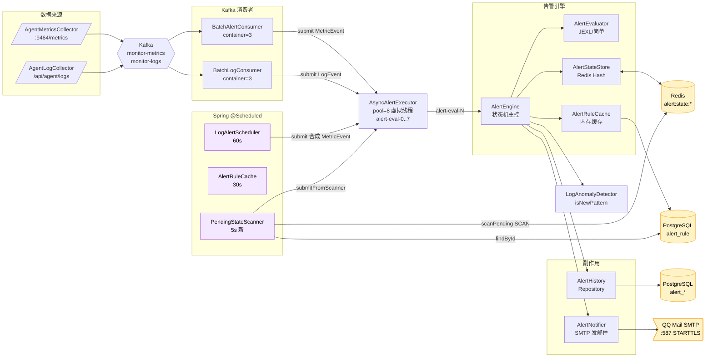
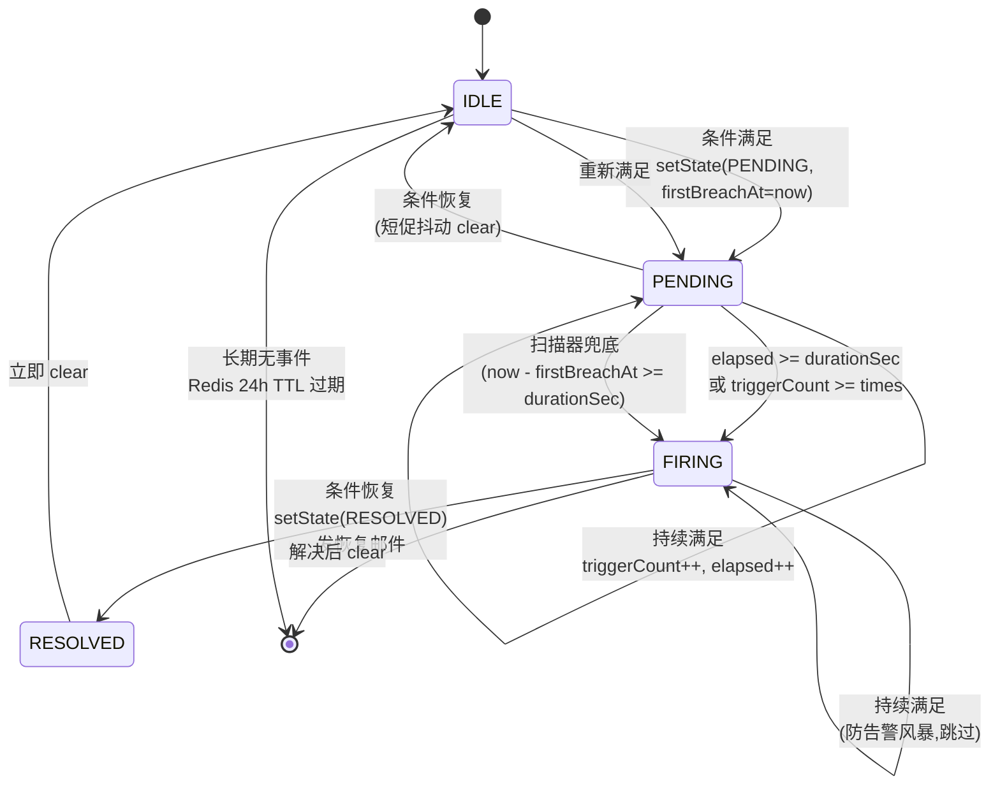
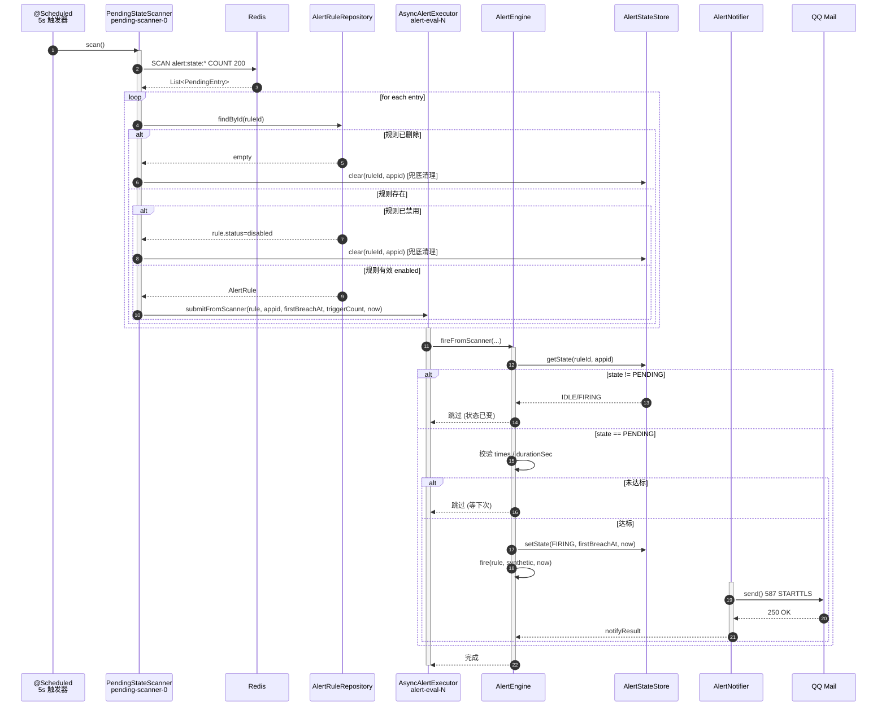
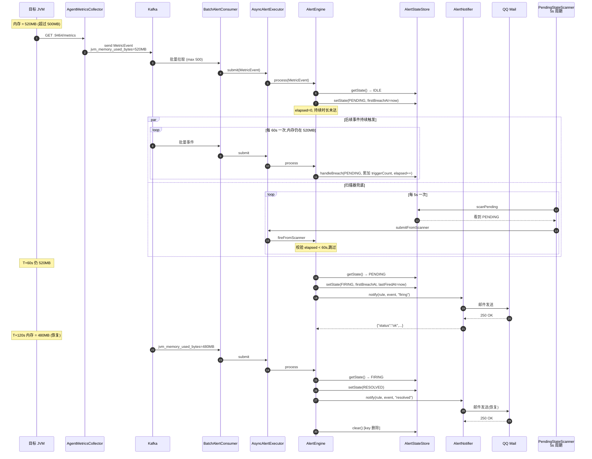
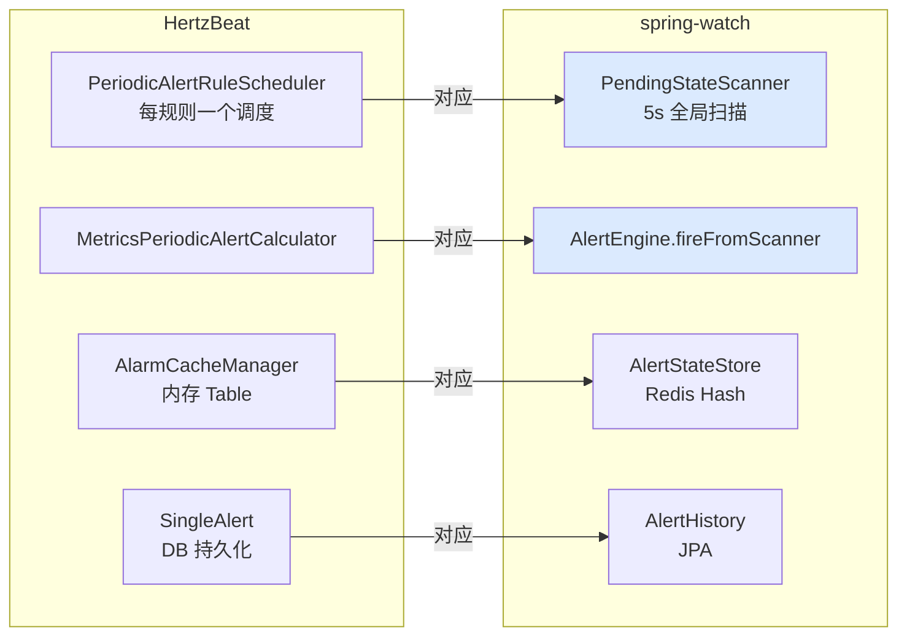

# spring-watch 告警模块架构图(Mermaid)

> 调研时间:2026-06-16
> 状态:**生产可用**,含 PENDING 扫描器(借鉴 HertzBeat)

---

## 一、整体架构总览



---

## 二、状态机详解



---

## 三、两条触发路径对比(事件 vs 扫描器)

```mermaid
flowchart TB
    subgraph PATH_A[事件路径 - 高频]
        A1[Kafka 消费者线程] -->|submit MetricEvent| A2[AsyncAlertExecutor]
        A2 -->|alert-eval-N| A3[AlertEngine.process]
        A3 --> A4{handleBreach/Recover}
        A4 -->|满足且持续| A5[fire]
        A4 -->|恢复| A6[resolve/clear]
    end

    subgraph PATH_B[扫描器路径 - 兜底 借鉴 HertzBeat]
        B1[@Scheduled 5s] --> B2[PendingStateScanner]
        B2 -->|scanPending SCAN| B3[Redis]
        B3 --> B4[PendingEntry list]
        B4 -->|submitFromScanner| B5[AsyncAlertExecutor]
        B5 -->|alert-eval-N| B6[AlertEngine.fireFromScanner]
        B6 --> B7{state==PENDING<br/>且 elapsed >= durationSec?}
        B7 -->|是| B8[fire]
        B7 -->|否| B9[跳过]
    end

    A5 --> COMMON
    B8 --> COMMON

    COMMON[fire: historyRepository.save + notifier.notify] --> END[(PostgreSQL<br/>+ QQ Mail)]

    style PATH_B fill:#dbeafe
    style B2 fill:#dbeafe
    style B6 fill:#dbeafe
    style B8 fill:#dbeafe
```

---

## 四、扫描器工作流时序图



---

## 五、典型调用时序(JVM 堆内存 > 500MB 持续 60s)



---

## 六、线程模型

```mermaid
flowchart TB
    subgraph TRIG[触发线程]
        direction TB
        K[Kafka Consumer 线程池<br/>concurrency=3 × 5 topic]
        S1[LogAlertScheduler<br/>scheduling-1]
        S2[AlertRuleCache<br/>scheduling-1]
        S3[PendingStateScanner<br/>pending-scanner-0]
    end

    POOL[AsyncAlertExecutor<br/>Executors.newFixedThreadPool<br/>pool=8<br/>Thread.ofVirtual factory<br/>线程名: alert-eval-0..7]

    subgraph WORK[告警执行]
        direction TB
        EV[AlertEvaluator<br/>JEXL 解析]
        ST[AlertStateStore<br/>Redis IO]
        FR[fire/resolve<br/>@Transactional]
    end

    subgraph EXT[外部调用 - 同步阻塞]
        direction TB
        PG[(PostgreSQL<br/>JDBC 写)]
        SMTP[JavaMailSender<br/>SMTP 同步发送<br/>最坏 5s]
    end

    K -->|submit| POOL
    S1 -->|submit| POOL
    S2 -->|refresh| CACHE
    S3 -->|submitFromScanner| POOL

    POOL -->|alert-eval-N| EV
    POOL -->|alert-eval-N| ST
    POOL -->|alert-eval-N| FR

    FR --> PG
    FR --> SMTP

    style TRIG fill:#f3e8ff
    style POOL fill:#fef3c7
    style SMTP fill:#fee2e2
```

---

## 七、组件清单

| 文件 | 职责 | 关键方法/字段 |
|---|---|---|
| `alerter/AlertEngine` | 状态机主控 | `process(MetricEvent/LogEvent)`, `handleBreach/Recover`, `fire/resolve`, `fireFromScanner` |
| `alerter/AlertEvaluator` | 表达式求值 | `evaluate(rule, event) → BreachResult`, `simpleEvaluate`(正则), `JexlExprEvaluator`(复杂), `isLogBreached` |
| `alerter/AlertStateStore` | Redis 状态存取 | `getState/setState/clear`, `scanPending`(游标 SCAN) |
| `alerter/AlertRuleCache` | 规则内存缓存 | `rulesFor(appid)`, `@Scheduled 30s` 刷新 |
| `alerter/AlertNotifier` | SMTP 通知 | `notify(rule, event, type)`, `resolveEmail`, `sendEmail` |
| `alerter/AsyncAlertExecutor` | 异步线程池 | `submit(MetricEvent/LogEvent)`, `submitFromScanner`,虚拟线程池 8 |
| `alerter/PendingStateScanner` | **PENDING 扫描器(借鉴 HertzBeat)** | `@Scheduled 5s` 扫,过滤 PENDING,提交 fire |
| `alerter/AlertState` | 状态枚举 | `IDLE / PENDING / FIRING / RESOLVED` |
| `alerter/JexlExprEvaluator` | JEXL 引擎封装 | Apache Commons JEXL,sandbox |
| `analysis/LogAnomalyDetector` | 日志新模式检测 | `isNewPattern(appid, fingerprint)`, Redis 滑动窗口 |
| `analysis/LogAlertScheduler` | log_error_rate 定时器 | `@Scheduled 60s` 合成 MetricEvent 走 process() |

---

## 八、外部依赖

```mermaid
flowchart LR
    SW[spring-watch]

    SW <-->|jdbc| PG[(PostgreSQL:5432<br/>alert_rule<br/>alert_history<br/>alert_notification_config)]
    SW <-->|lettuce| REDIS[(Redis:6379<br/>alert:state:{ruleId}:{appid}<br/>Hash 24h TTL)]
    SW -->|587 STARTTLS| MAIL[QQ Mail SMTP<br/>smtp.qq.com]

    classDef db fill:#fef3c7,stroke:#f59e0b
    class PG,REDIS db
```

---

## 九、与 HertzBeat 的对应关系



**关键差异**:spring-watch 用**事件 + 扫描器双轨**驱动,HertzBeat 是**纯周期**。事件路径适合低延迟(实时反映),扫描器适合兜底(事件停流入也能告警)。两者结合比 HertzBeat 更稳。
