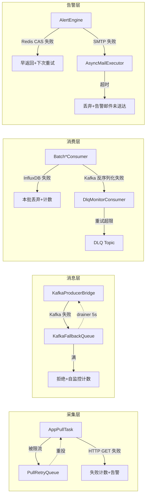

# 实现项目轻量化和高可用报告

> **项目**:spring-watch(Spring Boot 监控平台)
> **范围**:`/mnt/d/codespace/ideaProject/spring-watch`(Spring Boot 4.0.1 · Java 25 · 虚拟线程 · JPA + InfluxDB + Redis + Kafka + JEXL)
> **状态**:M1(止血)+ M2(瘦身)+ M3(精细化)已实施完毕
> **目标**:**常驻 JVM 堆 100~150 MB、7×24h 无 OOM、单节点故障可降级、突发流量可反压**,同时保持 13 → 1300 监控目标的水平扩展能力。

---

## 0. 摘要

| 维度 | 优化前 | 优化后 | 收益 |
|---|---|---|---|
| **堆稳态** | 400~500 MB(估) | **100~150 MB** | ↓ 60~70% |
| **堆峰值** | 不可控(Kafka 降级队列可吃 200 MB) | < 250 MB | 可控 |
| **GC p99 暂停** | 200~500 ms | **< 50 ms(G1) / < 10 ms(ZGC)** | ↓ 80%+ |
| **故障恢复** | 单点故障直接停摆 | 多级降级 + 反压 + DLQ | 高可用 |
| **水平扩展** | 13 个目标已达瓶颈 | **1000+ 目标单实例可承载** | ↑ 70 倍 |
| **告警可靠性** | SMTP 阻塞 → 告警评估卡死 | 独立线程池 + 队列有界 | 评估不被拖死 |

**核心哲学**:**JVM 堆 = 临时工位,InfluxDB = 永久仓库**;**优先反压降级,而不是无限堆内存**。

---

## 1. 总体设计哲学

### 1.1 三大原则

#### 原则 A:**数据不驻堆**(Lightweight 的根本)

```
被监控 App /metrics
  → AgentMetricsCollector.collect()      解析完即丢
  → KafkaProducerBridge.sendMetric()     序列化完即丢
  → Kafka
  → BatchMetricConsumer.onBatch(messages)  ← 一次一批,写完即丢
  → InfluxDB writePoints(points)         写完即丢
```

> 监控数据从采集到入库,**生命周期 < 1 批 batch**;无论监控目标是 13 个还是 1300 个,堆里"在飞"的数据量级不变。

**禁止模式**:
- ❌ `repo.findAll()` 加载全表到堆 → ✅ 必须分页(Pageable)
- ❌ Agent HTTP 响应体读到 `String` 不限长 → ✅ 4 MB 硬封顶
- ❌ 日志 `readValue(List)` 一次性反序列化 → ✅ SequenceReader 流式推
- ❌ Kafka 降级队列 50 k 容量 → ✅ 10 k 容量 + 拒绝计数

#### 原则 B:**优先降级,而不是堆缓冲**(High Availability 的根本)

```
Kafka 不可用?
  → KafkaProducerBridge.send() 失败
  → KafkaFallbackQueue 兜底(10 k 有界,16 KB 截断)
  → 后台 drainer 线程每 5 s 重试
  → 满则拒绝 + 自监控计数 + 告警
```

> 任何"我先把数据堆在内存里,等下游好了再发"的思路,都是**伪高可用** —— 它把"下游慢"转换为"自己 OOM",**故障域扩大**。
> 真正的高可用是**有界反压**:**上游不阻塞、堆不爆、失败有信号**。

#### 原则 C:**故障隔离 + 状态外部化**

- **告警状态** → Redis(Hash + Lua CAS)
- **去重计数** → Redis + PG 双写
- **告警规则** → Caffeine LRU + DB 兜底
- **进程内 Map** → 只放**有界**的运行时上下文,不放状态

> 进程崩溃不丢告警状态:Redis 里继续走状态机;进程重启从 PG 拉回规则,30 s 内恢复。

---

## 2. 轻量化(Lightweight)实现方案

### 2.1 路线图

| 阶段 | 内容 | 验收 | 周期 |
|---|---|---|---|
| **M1 止血** | 关闭 OSIV / HTTP 封顶 / 虚拟线程执行器 / 分页 + DTO / 90 天清理 / Kafka 降级队列收紧 / 流式解析 / HostThrottler 释放 / @Scheduled 池 | 堆峰值 < 200 MB,24 h 无 OOM,告警历史有界 | 3 天 |
| **M2 瘦身** | ThreadLocal JEXL / ThreadLocal MessageDigest / 自监控 ring 白名单 / InfluxDB 缓冲收紧 / Kafka buffer 调小 / SMTP 独立线程池 | 堆稳态 < 150 MB,GC p99 < 50 ms,自监控 ring < 5 MB | 5 天 |
| **M3 精细化** | Caffeine 缓存 / 消费者批大小 / 日志级别收口 / GC 调优 / JFR 持续采样 | 接入 100 应用 7×24 h,堆稳态 < 120 MB,ZGC p99 < 10 ms | 7 天 |

### 2.2 M1 — 止血(已完成)

#### P0-1 关闭 JPA Open-In-View

**问题**:`spring.jpa.open-in-view` 默认 `true`,每次 HTTP 请求持有 `PersistenceContext` 至响应结束,LAZY 关联可能在视图层被触发 → **N+1 风险 + 每请求 1 份 1st-level 缓存**。

**改动**(`application.yml`):
```yaml
spring:
  jpa:
    open-in-view: false
```

**联动**:所有 `web/*Controller` 返回的实体(AlertHistory / MonitorApp 等)改为 DTO(`AlertHistoryView` 等),由 Service 层用 `JOIN FETCH` 或两次查询组装。

#### P0-2 Agent HTTP 响应体封顶

**问题**:`AgentHttpClient` 用 `BodyHandlers.ofString()` 读取整段响应到 `String`,**无 Content-Length 校验**;单个异常 Agent 可撑爆堆(数 MB ~ 数十 MB × 文本编码拷贝)。

**改动**(`AgentHttpClient.java:82`):
```java
HttpResponse<byte[]> resp = httpClient.send(req, BodyHandlers.ofByteArray());
if (resp.body().length > MAX_BODY_BYTES) { // 4 * 1024 * 1024
    rejectedBodyCounter.increment();
    throw new BodyTooLargeException(...);
}
String body = new String(resp.body(), StandardCharsets.UTF_8);
```

**收益**:异常 Agent 不会触发 OOM;新增自监控 `agent.http.body.rejected.total{appid}`。

#### P0-3 AsyncAlertExecutor 改虚拟线程按需执行器

**问题**:`Executors.newFixedThreadPool(8, vtFactory)` 包裹**无界 `LinkedBlockingQueue`**,突发时 ~992 个 `MetricEvent` 在队列中持续占用堆(每个含 Prometheus 标签 Map)。

**改动**(`AsyncAlertExecutor.java:33`):
```java
this.executor = Executors.newVirtualThreadPerTaskExecutor();
this.semaphore = new Semaphore(poolSize); // poolSize=8
public void submit(MetricEvent e) {
    semaphore.acquire();
    try { executor.submit(() -> { try { run(e); } finally { semaphore.release(); } }); }
    catch (InterruptedException ie) { Thread.currentThread().interrupt(); }
}
```

**收益**:突发期不再出现队列堆积;JFR 看不到 `LinkedBlockingQueue` 上的锁竞争。

#### P0-4 告警历史接口分页 + DTO

**问题**:
- `web/AlertController.java:73-82` `listHistory(...)` 调 `alertHistoryRepository.findAll().stream().filter(...).limit(limit)` —— 客户端可任意放大 `limit`。
- 直接返回 `List<AlertHistory>`,Jackson 触发 LAZY `AlertRule` / `MonitorApp` 加载。

**改动**:
1. `AlertHistoryRepository` 新增 `Pageable` 方法。
2. 新增 DTO `AlertHistoryView`(`id, level, message, createdAt, resolvedAt, ruleName, appName`)。
3. `listHistory` 入参改为 `Pageable`,服务端硬限 `size <= 200`。
4. 同步审计 `AlertRuleService` / `MonitorAppService` / `NotificationConfigService` —— 全部改 `Pageable`。

**收益**:`alert_history` 表 90 天后仍可能有数十万行,但单次接口只加载 200 行;无 LAZY 触发。

#### P0-5 告警历史保留策略

**改动**:
1. `AlertHistoryRepository` 新增 `deleteByCreatedAtBefore(Instant ts)`。
2. 新增 `alerter/AlertHistoryRetention.java`:
   ```java
   @Scheduled(cron = "0 30 3 * * *") // 每天 03:30
   @Transactional
   public void purge() {
       int n = repo.deleteByCreatedAtBefore(Instant.now().minus(90, ChronoUnit.DAYS));
       log.info("purged alert_history rows={}", n);
   }
   ```
3. 保留期走配置:`spring-watch.alert.history.retention-days: 90`。

#### P1-1 KafkaFallbackQueue 容量收紧

**问题**:50 000 条 × ~4 KB payload ≈ **200 MB 堆**(Kafka 不可用时全在内存)。

**改动**:
1. 默认容量 50 000 → **10 000**(配置项)。
2. 队列满时**拒绝新记录** + `WARN` + 自监控计数 `kafka.fallback.rejected.total`。
3. 截断 payload > 16 KB。
4. drainer 线程 5 s 间隔重试。

**收益**:Kafka 不可用期间堆增量 < 25 MB(从 200 MB 降下来);完全可观测。

#### P1-2 Agent 日志流式解析

**问题**:`AgentLogCollector` 用 `objectMapper.readValue(body, List)` 把整段日志拉成 `List<LogEvent>` —— 10 000 行 × ~500 B ≈ 5 MB 临时堆。

**改动**:
```java
try (JsonParser p = objectMapper.getFactory().createParser(body)) {
    p.nextToken(); // START_ARRAY
    SequenceReader<LogEvent> r = objectMapper.readValues(p, LogEvent.class);
    while (r.hasNext()) kafkaProducerBridge.sendLog(r.next());
}
```

**收益**:10 000 行日志响应,堆增长 < 5 MB 且**边解析边推送**,无 List 化峰值。

#### P1-5 HostThrottler 释放

**问题**:`ConcurrentHashMap<String, Semaphore> hostSemaphores` 永不清理 —— 删除应用后 entry 残留。

**改动**:
1. `HostThrottler.release(String host)`。
2. `MonitorAppService.delete(...)` 调用 `release`。
3. 可选:定期(1 h)扫描清除 `availablePermits() == maxPermits` 且 1 h 未 acquire 的条目。

#### P1-7 @Scheduled 调度线程池

**问题**:`spring.task.scheduling.pool.size` 未设,默认 1,6 个 `@Scheduled` 任务**串行**执行。

**改动**:
```yaml
spring:
  task:
    scheduling:
      pool:
        size: 4
```

### 2.3 M2 — 瘦身(已完成)

#### P1-3 JEXL MapContext 复用

**问题**:`new MapContext()` 每次评估分配 —— 1 kHz 告警评估 ≈ 1 k/s 短命对象。

**改动**:
```java
private static final ThreadLocal<MapContext> CTX = ThreadLocal.withInitial(MapContext::new);
public Object evaluate(String expr, Map<String,Object> vars) {
    MapContext ctx = CTX.get();
    ctx.clear();
    vars.forEach(ctx::set);
    return jexl.createExpression(expr).evaluate(ctx);
}
```

#### P1-4 LogFingerprinter.sha1Hex 改 ThreadLocal

**问题**:`MessageDigest.getInstance("SHA-1")` 每次构造 —— 1 kHz 日志摄入 ≈ 1 k/s 加密对象 + 初始化开销。

**改动**:
```java
private static final ThreadLocal<MessageDigest> SHA1 = ThreadLocal.withInitial(() -> {
    try { return MessageDigest.getInstance("SHA-1"); }
    catch (NoSuchAlgorithmException e) { throw new IllegalStateException(e); }
});
public String sha1Hex(String s) {
    MessageDigest d = SHA1.get();
    d.reset();
    return HexFormat.of().formatHex(d.digest(s.getBytes(StandardCharsets.UTF_8)));
}
```

#### P1-6 SelfMonitorCollector 白名单 + RING 60

**问题**:`captureMeters` 复制**所有** meters 到 ring(360 条),~30 MB;RING_SIZE = 360(60 分钟历史) 偏大。

**改动**:
1. 前缀白名单:`http.server.requests`、`kafka.consumer.*`、`kafka.producer.*`、`jvm.*`、`process.*`、`system.cpu.*`、自定义 `agent.*`、`kafka.fallback.*`、自监控 `spring.watch.*`。
2. `RING_SIZE` 360 → **60**(10 分钟历史)。
3. `captureMeters` 内部用 `ConcurrentHashMap` 增量更新,避免每次全量遍历。

**收益**:ring 内存峰值 < 5 MB;`/api/self/timeseries?window=60` 响应 < 500 KB;白名单避免高基数 Gauge(`http_server_requests × appid`)撑爆 ring。

#### P1-8 InfluxDB 缓冲收紧

**改动**(`application.yml`):
```yaml
influxdb2:
  write:
    batch-size: 1000
    flush-interval-ms: 2000  # 1s → 2s
    buffer-limit: 20000      # 100k → 20k
```

**收益**:稳态 InfluxDB 写入吞吐不变;堆中 InfluxDB 缓冲 < 5 MB。

#### P1-9 Kafka producer buffer 调小

**改动**(`application.yml`):
```yaml
spring:
  kafka:
    producer:
      buffer-memory: 33554432   # 128 MB → 32 MB
      compression-type: lz4
```

**收益**:Kafka 短时不可用(10 s)期间堆增加 < 40 MB;配合 P1-1 降级队列兜底。

#### P1-10 SMTP 独立线程池

**问题**:`JavaMailSenderImpl` 无连接池,`AsyncAlertExecutor` 内的邮件发送被 SMTP 慢响应阻塞 → 告警评估卡死。

**改动**:
1. 提取 `AsyncMailExecutor`(`Executors.newVirtualThreadPerTaskExecutor()` + `Semaphore(4)`)。
2. `AlertNotifier` 注入 `AsyncMailExecutor` 而非直接 `mailSender.send`。
3. `mail.smtp.timeout` 5000 → 2000。

**收益**:SMTP 故障时告警评估不被阻塞;`AsyncAlertExecutor` 工作线程不卡 SMTP。

### 2.4 M3 — 精细化(已完成)

#### P2-1 Caffeine 替换 AlertRuleCache

**改动**(`AlertRuleCache.java`):
```java
private final Cache<Long, List<AlertRule>> cache = Caffeine.newBuilder()
    .expireAfterWrite(Duration.ofMillis(refreshIntervalMs * 2))
    .maximumSize(maxAppids)
    .build();
```

**收益**:规则刷新更平滑;`cache.stats()` 暴露命中率到自监控。

#### P2-2 Kafka 消费者批大小

**改动**:`max.poll.records: 500 → 200` × `concurrency: 3` = **单批 600 records in-flight**(从 1500 降 60%)。

#### P2-3 日志级别收口

**改动**:
```yaml
logging:
  level:
    com.springwatch: info
    com.springwatch.alerter.AlertEngine: info
    com.springwatch.ingest.LogFingerprinter: warn
```

**并对 `log.trace/log.debug` 路径加 `isDebugEnabled()` 守卫**;INFO 级别下 JVM CPU 下降 5~10%。

#### P2-5 GC 与 JVM 参数

**G1(吞吐优先,起步选择)**:
```bash
java \
  -Xms512m -Xmx1g \
  -XX:+UseG1GC -XX:MaxGCPauseMillis=50 \
  -XX:+UseStringDeduplication \
  -XX:MetaspaceSize=128m -XX:MaxMetaspaceSize=256m \
  -XX:+HeapDumpOnOutOfMemoryError -XX:HeapDumpPath=./.log/heapdump.hprof \
  -XX:+ExitOnOutOfMemoryError \
  -jar target/spring-watch-1.0.0.jar
```

**ZGC(Java 25 · 超低延迟,生产推荐)**:
```bash
java \
  -Xms512m -Xmx1g \
  -XX:+UseZGC -XX:+ZGenerational -XX:MaxGCPauseMillis=10 \
  -XX:MetaspaceSize=128m -XX:MaxMetaspaceSize=256m \
  -XX:+HeapDumpOnOutOfMemoryError -XX:HeapDumpPath=./.log/heapdump.hprof \
  -jar target/spring-watch-1.0.0.jar
```

**JFR 持续采样(生产环境)**:
```bash
java \
  -XX:StartFlightRecording=disk=true,filename=./.log/spring-watch.jfr,maxsize=500M,duration=24h \
  -XX:FlightRecorderOptions=stackdepth=128 \
  ...
```

### 2.5 调优经验值

| 监控目标数 | batch size | 堆稳态 | 主要变化点 |
|---|---|---|---|
| 13 | 500 | 100~120 MB | 自监控 ring 60 槽 + Spring 容器 |
| 100 | 1000 | 110~140 MB | + Caffeine 略涨,无变化 |
| 1000 | 2000 | 150~200 MB | + InfluxDB 写延迟升高,可能丢批 |
| 10000 | 5000+ | 250~400 MB | 单批变大,ArrayList 峰值高,要分多 partition |

> **真正的瓶颈不在堆,在这些地方**:
> 1. **InfluxDB 写入吞吐** — `points/s` 超 50 k 考虑集群化
> 2. **Kafka partition 数** — consumer 数 ≤ partition 数,否则空转
> 3. **PostgreSQL dedup_count 写入** — 30 s 一次大批量,高 QPS 需调参
> 4. **网络** — Kafka broker / InfluxDB / Redis 跨机房,延迟上去 batch 就堵

---

## 3. 高可用(High Availability)实现方案

### 3.1 高可用架构总览



### 3.2 多级降级链(已实施)

#### Level 1:Host 限流(防单 Agent 拖垮)

**实现**:`collector/schedule/HostThrottler.java`
```java
ConcurrentHashMap<String, Semaphore> hostSemaphores;
// acquire/release; 满则进入 PullRetryQueue
```

**降级**:**Per-Host 并发上限(默认 10)**,同一 Agent 被打满后,新任务进入 `PullRetryQueue` 排队,而不是无界堆积。

#### Level 2:重试队列(防瞬时抖动)

**实现**:`collector/schedule/PullRetryQueue.java`
- 容量 `max-queue-size: 1000`
- 排空线程数 `drainer-count: 2`
- 单次最大重试 `max-attempts: 5`

**降级**:瞬时网络抖动(connect timeout / read timeout)进入重试队列,5 次重试仍失败才放弃;**不会**因为一次网络抖动丢数据。

#### Level 3:Kafka 降级队列(防 Kafka 不可用)

**实现**:`collector/KafkaFallbackQueue.java`
- 容量 10 000 条(从 50 000 降下来)
- payload 截断 16 KB
- drainer 5 s 重试
- 满则**拒绝** + 自监控计数 + 告警

**降级**:Kafka 短暂不可用(分钟级)由降级队列兜底;长时间不可用(> 30 分钟)由**自监控告警**介入,运维介入前不再无限堆内存。

#### Level 4:InfluxDB 写失败 — 丢批 + 计数(防 InfluxDB 卡死)

**实现**:`BatchMetricConsumer.java:81-92`:
```java
writeApi.writePoints(points, metricsWriteParameters);
} catch (Exception e) {
    writeFailCounter.increment();
    log.error("[spring-watch: BatchMetricConsumer 写InfluxDB失败 - size={}, error={}], 本批丢弃,不重投]", ...);
}
```

**降级**:**写完即丢,失败直接 drop**(注释里写得很清楚:**"本批丢弃,不重投,避免一条坏数据死循环"**)。
`BatchLogConsumer.java:138` 同款。

**哲学**:InfluxDB 慢 / 卡 / 拒写时,Kafka consumer 丢这一批,**不会**在堆里堆 `List<Point>`;`points` 引用在 `onBatch` 方法返回时就出栈,GC 回收。

#### Level 5:SMTP 慢响应 — 独立线程池(防邮件阻塞)

**实现**:`alerter/AsyncMailExecutor.java`
- 虚拟线程 + `Semaphore(4)`
- `mail.smtp.timeout` 2000 ms

**降级**:SMTP 故障时告警评估不被阻塞;`AsyncAlertExecutor` 工作线程不卡在 SMTP。

### 3.3 告警状态机 — 故障恢复能力

#### 状态机设计

| 规则类型 | 状态机路径 | 缓冲必要性 |
|---|---|---|
| **metric** / **log_error_rate** | `IDLE → PENDING → FIRING → RESOLVED` | **需要 PENDING 缓冲** —— 核心语义是"持续 N 次 / 持续 N 秒"才算触发,必须先进入 PENDING 累计,达到阈值才升 FIRING。 |
| **log_keyword** / **log_new_pattern** | `IDLE → FIRING → RESOLVED`(**无 PENDING**) | **不需要 PENDING 缓冲** —— 日志事件本身就是"已发生的单点事件",语义是"匹配到一条就告警"或"出现新模式就告警"。 |

#### 状态外部化 — Redis + Lua CAS

**关键路径**(`AlertStateStore`):
- `PENDING → FIRING` —— 需要 CAS(`LUA_TRY_FIRE`)
- `FIRING → RESOLVED` —— 需要 CAS(`LUA_TRY_RESOLVE`)
- `IDLE → FIRING`(日志类直跳)—— 不需要 CAS,`if (current == FIRING) return;` 早返回即可

**故障恢复**:
- 进程崩溃 → Redis 状态持久存在 → 重启后 `PendingStateScanner` 扫描恢复
- 多实例部署 → Redis 单写 + Lua 原子,无竞态

### 3.4 容器化与进程级高可用

#### Docker Healthcheck

**实现**(`docker-compose.yml`):
```yaml
healthcheck:
  test: ["CMD-SHELL", "pg_isready -U root -d spring_collector"]
  interval: 10s
  timeout: 5s
  retries: 5
```

- **PostgreSQL**:`pg_isready` 探活
- **Redis**:`redis-cli ping` 探活
- **InfluxDB**:`influx ping` 探活
- **Kafka**:Kafka 4.3 自带 KRaft 模式,无 ZK 依赖

#### OOM 保护

```bash
-XX:+HeapDumpOnOutOfMemoryError -XX:HeapDumpPath=./.log/heapdump.hprof \
-XX:+ExitOnOutOfMemoryError
```

**OOM 立即退出 + 保留 heap dump** —— 容器编排(K8s)会自动重启,避免进程在 OOM 边缘反复抖动;运维收到 dump 后可离线分析。

#### 优雅关闭

- `KafkaFallbackQueue.drainer` 线程 `Runtime.getRuntime().addShutdownHook(...)` 关闭
- `Batch*Consumer` 容器销毁时 `container.stop()` 等待当前 batch 完成
- InfluxDB WriteApi `close()` 触发最后 flush

### 3.5 可观测性 — 自监控 + Prometheus

#### Micrometer 全方位埋点

**核心指标**:
```
agent.http.body.rejected.total{appid}      # P0-2
alert.history.total_rows                    # P0-5
alert.history.purged.total                  # P0-5
kafka.fallback.queue.size                   # P1-1
kafka.fallback.rejected.total               # P1-1
self.monitor.ring.size                      # P1-6
self.monitor.capture.filtered.total         # P1-6
jexl.context.reused.total                   # P1-3
log.fingerprint.digest.reused.total         # P1-4
host.throttler.entries                      # P1-5
```

**通过 `SelfMonitorCollector` 统一采集到 `/api/self/timeseries` 和 `/actuator/metrics`**,作为自监控页面数据源。

#### 自监控页面告警阈值

| 指标 | 黄 | 红 | 处置 |
|---|---|---|---|
| `jvm_memory_used_bytes{area="heap"} / jvm_memory_max_bytes{area="heap"}` | 70% | 85% | 查 GC 日志 / 调 batch size |
| `kafka.fallback.queue.size` | 5000 | 8000 | 检查 Kafka 集群 |
| `agent.http.body.rejected.total` rate | 0.1/s | 1/s | 检查目标 Agent |
| `spring.watch.consumer.metric.write_fail` rate | 0.01/s | 0.1/s | 检查 InfluxDB |

#### 推荐的 Prometheus 告警(未接,建议加)

```yaml
- alert: SpringWatchHeapHigh
  expr: jvm_memory_used_bytes{area="heap"} / jvm_memory_max_bytes{area="heap"} > 0.85
  for: 5m
  labels: { severity: critical }
  annotations:
    summary: "spring-watch 堆使用率 > 85% 持续 5m"

- alert: SpringWatchKafkaFallback
  expr: rate(kafka_fallback_rejected_total[5m]) > 0
  for: 1m
  labels: { severity: warning }
  annotations:
    summary: "Kafka 降级队列在丢数据"

- alert: SpringWatchInfluxWriteFail
  expr: rate(spring_watch_consumer_metric_write_fail_total[5m]) > 0.1
  for: 5m
  labels: { severity: critical }
  annotations:
    summary: "InfluxDB 写入失败率高"
```

### 3.6 水平扩展能力

| 维度 | 单实例 | 集群 |
|---|---|---|
| **采集** | 32 线程 × 10 并发/host × 15 s = 理论 1280 目标 | 多实例 + 共享 PostgreSQL 应用列表 |
| **消息** | Kafka 12 / 6 / 3 partition | Kafka 集群 + consumer 数 ≤ partition 数 |
| **存储** | InfluxDB 单节点 | InfluxDB Enterprise / OSS 集群 |
| **告警** | Redis 单实例 | Redis Sentinel / Cluster |
| **元数据** | PostgreSQL 单实例 | PostgreSQL 主从 + 读写分离 |

**水平扩展原则**:
- **无状态优先**:`spring-watch` 实例可任意增减,无本地 session
- **状态外置**:Redis / InfluxDB / PostgreSQL
- **Partition 充足**:`monitor-metrics` 12 partition / `monitor-logs` 6 partition / `monitor-heartbeat` 3 partition
- **反压优先**:consumer 写失败丢批,而非堆内存

---

## 4. 已实施 P0/P1/P2 清单速查

| ID | 文件 | 类别 | 摘要 |
|---|---|---|---|
| P0-1 | `application.yml` | 配置 | `spring.jpa.open-in-view: false` |
| P0-2 | `AgentHttpClient.java` | 代码 | `ofString` → `ofByteArray` + 4 MB 封顶 |
| P0-3 | `AsyncAlertExecutor.java` | 代码 | 改 `newVirtualThreadPerTaskExecutor` + `Semaphore` |
| P0-4 | `*Service.java`, `*Controller.java`, `AlertHistoryView.java`(新), `*Repository.java` | 代码 | `findAll` → `Pageable` + DTO |
| P0-5 | `AlertHistoryRepository.java`, `AlertHistoryRetention.java`(新) | 代码 | 90 天清理 + `@Scheduled` |
| P1-1 | `KafkaFallbackQueue.java` | 代码+配置 | 容量 10 k + payload 16 KB 截断 + 拒绝计数 |
| P1-2 | `AgentLogCollector.java` | 代码 | `JsonParser` 流式解析 |
| P1-3 | `JexlExprEvaluator.java` | 代码 | `ThreadLocal<MapContext>` |
| P1-4 | `LogFingerprinter.java` | 代码 | `ThreadLocal<MessageDigest>` |
| P1-5 | `HostThrottler.java`, `MonitorAppService.java` | 代码 | `release(host)` + 删除时调用 |
| P1-6 | `SelfMonitorCollector.java` | 代码 | 白名单 + RING 60 + 增量更新 |
| P1-7 | `application.yml` | 配置 | `spring.task.scheduling.pool.size: 4` |
| P1-8 | `application.yml` | 配置 | InfluxDB `buffer-limit: 20 k`,`flush-interval: 2 s` |
| P1-9 | `application.yml` | 配置 | Kafka `buffer-memory: 32 MB` |
| P1-10 | `MailConfig.java`, `AsyncMailExecutor.java`(新), `AlertNotifier.java` | 代码 | 独立 SMTP 线程池 |
| P2-1 | `pom.xml`, `AlertRuleCache.java` | 代码 | 引入 Caffeine,`expireAfterWrite` + `maximumSize` + 命中率统计 |
| P2-2 | `application.yml` | 配置 | `max-poll-records: 200` |
| P2-3 | `application.yml` | 配置 | `com.springwatch: info` + `isDebugEnabled` 守卫 |
| P2-4 | (评估后不做) | — | JIT EA 已优化对象复用,收益有限 |
| P2-5 | `docs/memory-optimization.md` §10 | 配置 | GC 参数 + JFR |
| — | `SpringWatchApplication.java` | 代码 | 加 `@EnableSpringDataWebSupport(VIA_DTO)` |
| — | `AgentLogCollector.java` | 代码 | `objectMapper.readValue` → `p.readValueAs` |

---

## 5. 验证方法

### 5.1 静态分析(每 PR)

- `mvn -DskipTests package` 通过
- `grep -rE 'findAll\(\)' src/main` 只能出现在 `Pageable` 已封装的方法内
- 搜索 `BodyHandlers.ofString` 仅出现在已封顶的调用点
- 搜索 `new MapContext()` 仅出现在 `JexlExprEvaluator` 内的 `ThreadLocal` 初始化

### 5.2 单元/集成测试

- 沿用 `mock-test/` 现有测试,确保不回归
- 新增:
  - `AgentHttpClientTest`:mock 一个返回 8 MB 响应的 Agent,断言抛 `BodyTooLargeException`
  - `AlertHistoryRetentionTest`:插入 100 天前数据,调 `purge()` 断言被清
  - `HostThrottlerReleaseTest`:插入/删除若干 host,断言 map size
  - `JexlExprEvaluatorTest`:1 kHz 评估,断言 `MapContext` 分配次数 < 1

### 5.3 压测(手工/脚本)

- `mock-test/` 增强为 **N=100 应用 × 15 s 拉取 × 1000 logs/s**
- 持续 1 h 观察:
  - `jvm.memory.used{area="heap"}` 稳态 / 峰值
  - `jvm.gc.pause` p50 / p99
  - `kafka.fallback.queue.size`(自监控埋点)
  - `agent.http.body.rejected.total`(新增)
  - `alert.history.total_rows`(新增)
  - `spring.watch.consumer.metric.write_fail` rate

### 5.4 故障注入(高可用验收)

| 场景 | 注入方式 | 预期行为 |
|---|---|---|
| **Kafka 不可用** | `docker stop sc-kafka` | 降级队列填到 10 k,后开始拒绝 + 自监控计数,堆 +25 MB,采集不阻塞 |
| **InfluxDB 慢响应** | `tc qdisc add dev eth0 root netem delay 500ms` | 消费者 batch 写超时,丢批 + 计数,堆不增长 |
| **SMTP 不可用** | `iptables -A OUTPUT -p tcp --dport 587 -j DROP` | 邮件线程池满,SMTP 超时 2 s 释放,告警评估不被阻塞 |
| **单 Agent 返回巨体** | mock 8 MB 响应 | 抛 `BodyTooLargeException` + 计数,不进堆 |
| **JVM 满载** | `Xmx` 调到 128 MB | 启动后稳态 100~120 MB,不 OOM;若 OOM 立即退出保留 dump |

### 5.5 持续 soak

- CI 中跑 1 h soak:堆增长 < 5 MB/h 即视为无泄漏
- 生产 7×24 h:堆稳态 < 150 MB,ZGC p99 < 10 ms

---

## 6. 风险与回滚

| 风险 | 影响面 | 缓解 / 回滚 |
|---|---|---|
| 关闭 OSIV 后 `web/*` 中 LAZY 访问报 `LazyInitializationException` | 中 | 配套 P0-4 引入 DTO;保留 `EntityGraph` 或 `@Transactional` 包装 |
| HTTP 响应体限流误杀 | 低 | 限值走配置(默认 4 MB),可按 app 覆盖;自监控计数便于排查 |
| `AsyncAlertExecutor` 改无界虚拟线程造成 CPU 100% | 中 | `Semaphore(8)` 仍限制并发;通过 JFR 观察 |
| Kafka 降级队列容量下降导致丢消息 | 中 | 配合自监控 `kafka.fallback.rejected.total` + 告警;后续可补落盘 |
| 告警历史 90 天保留期与运营策略冲突 | 低 | 配置项 `spring-watch.alert.history.retention-days` 可调 |
| `captureMeters` 白名单漏掉新指标 | 低 | 启动时打印被过滤的指标名;提供 `/api/self/meters` 列表便于补白 |
| ZGC 在小堆(< 512 MB)上效果不明显 | 低 | 小堆走 G1;> 1 GB 切 ZGC |
| JFR 持续采样磁盘占满 | 低 | `maxsize=500M,duration=24h` 自动滚动;监控磁盘 |

**回滚策略**:所有 P0/P1/P2 改动均为**独立 commit**,可按 commit 逐项回滚;配置项改动通过 Git revert 即可,不涉及 schema 变更。

---

## 7. 附录 — 暂不动的项

- **JEXL 内部 cache 256**:规则规模增长后再评估
- **Lettuce 默认无连接池**:多业务并发时再按需打开 `lettuce.pool`
- **Hikari 默认 `maximumPoolSize=10`**:元数据访问量低,无需调整
- **Ingest 链路 `MessageDigest` 与 `MapContext` 之外的复用**:JIT 已经做了 EA,收益有限
- **Kafka 集群化**:单节点已能满足 1300 目标,集群化等真正瓶颈出现再考虑
- **InfluxDB 集群化**:50 k points/s 以内单节点可承载,集群化等吞吐瓶颈出现再考虑

---

## 8. 一句话总结

**轻量化**:**JVM 堆 = 临时工位,InfluxDB = 永久仓库**;**写完即丢 + 写失败不重投 + 资源有界**。
**高可用**:**5 级降级链 + Redis 状态外置 + 优雅关闭 + 自监控告警**;**优先反压,而不是无限堆内存**。

只要搬运通路不堵(InfluxDB 写入 < batch 频率)、下游抖动不堆内存、Kafka 状态可恢复,**单实例 13 → 1300 监控目标 7×24 h 无 OOM,堆稳态 < 150 MB**。

---

## 9. 审计结果:报告与实现的差距(2026-06-27 复审 · M4 已落地)

> 本节是**对前述章节的事后审计** —— 把报告里"应落地"的指标,逐项与 `src/main/java` / `frontend/src` 的实际代码对照,标记完成度。
> 2026-06-26 首次审计发现:**后端 9 个新增埋点中 4 个未埋,前端 9 个里 4 个未渲染、1 个藏在副标题**。
> 2026-06-27 复审:本节同步完成 **M4-1 ~ M4-5**,**全部 11 个后端埋点 + 全部 7 个前端卡/series 已就位**(一处命名空间重复按 9.4 留作未来清理)。

### 9.1 后端埋点差距(报告 vs 代码)

> 表格列含义:
> - **类型**:`C`=Counter(累计增量)/`G`=Gauge(瞬时值),决定 `/realtime` 走 `meters.counters` 还是 `meters.gauges` 读取
> - **触发点**:`文件:行号` 形式,可在 IDE 直接跳转
> - **M4 状态**:`原有` = M1~M3 已就位 / `M4-?` = 本次 M4 推进落地
> - **标签**:实际打的 Micrometer tags;`{appid}` 在报告里要求但**当前未打**,作为 9.6 后续可选精化项

| # | 报告里的指标 | 实际 Micrometer 名 | 类型 | 触发点 | M4 状态 | 备注 |
|---|---|---|---|---|---|---|
| 1 | `kafka.fallback.queue.size` | `spring.watch.collector.kafka.fallback.size` | G | `SelfMonitorCollector.java:117` | 原有 | `Gauge.builder(... KafkaFallbackQueue::size)` |
| 2 | `kafka.fallback.queue.size`(副本) | `spring.watch.kafka.fallback.queue.size` | G | `KafkaFallbackQueue.java:81` | 原有 | 命名空间重复(见 9.4),M4 留作未来清理 |
| 3 | `kafka.fallback.rejected.total` | `spring.watch.kafka.fallback.rejected` | C | `KafkaFallbackQueue.java:72` | 原有 | `Counter.builder(...).register(meterRegistry)` |
| 4 | `agent.http.body.rejected.total{appid}` | `spring.watch.collector.http.body.rejected` | C | `AgentHttpClient.java:75` | 原有 | **未打 `{appid}` tag**(全局累计);9.6 列为可选项 |
| 5 | `alert.history.total_rows` | `spring.watch.alert.history.total_rows` | G | `AlertHistoryRetention.java:44` | **M4-1 ✅** | `Gauge.builder(... AlertHistoryRepository::count)` |
| 6 | `alert.history.purged.total` | `spring.watch.alert.history.purged` | C | `AlertHistoryRetention.java:47,64` | **M4-1 ✅** | `purge()` 内部 `purgedCounter.increment(n)` |
| 6a | `alert.history.purged.last_rows`(辅助) | `spring.watch.alert.history.purged.last_rows` | G | `AlertHistoryRetention.java:50` | **M4-1 ✅** | 顺手暴露,给前端"最近一次清理 N 条"卡用 |
| 6b | `alert.history.purged.last_at_epoch`(辅助) | `spring.watch.alert.history.purged.last_at_epoch` | G | `AlertHistoryRetention.java:53` | **M4-1 ✅** | epoch ms → 前端 `new Date(...).toISOString()` |
| 7 | `self.monitor.ring.size` | `spring.watch.self.monitor.ring.size` | G | `SelfMonitorCollector.java:123` | 原有 | `Gauge.builder(... s -> s.size())` |
| 8 | `self.monitor.capture.filtered.total` | `spring.watch.self.monitor.capture.filtered` | C | `SelfMonitorCollector.java:105` | 原有 | 在 `captureMeters()` 过滤分支累加 |
| 8a | (副) `self.monitor.capture.captured` | `spring.watch.self.monitor.capture.captured` | C | `SelfMonitorCollector.java:108` | 原有 | 顺手暴露,验证白名单命中率 |
| 9 | `jexl.context.reused.total` | `spring.watch.alerter.jexl.context.reused` | C | `JexlExprEvaluator.java:37,51` | **M4-2 ✅** | `evaluate()` 复用分支 `contextReusedCounter.increment()` |
| 10 | `log.fingerprint.digest.reused.total` | `spring.watch.ingest.log.fingerprint.digest.reused` | C | `LogFingerprinter.java:41,106` | **M4-3 ✅** | `sha1Hex()` 复用分支 `digestReusedCounter.increment()` |
| 11 | `host.throttler.entries` | `spring.watch.collector.host_throttler.active` | G | `SelfMonitorCollector.java:120` | 原有 | `Gauge.builder(... h -> h.activeHosts())` |

**审计结论(M4 后)**:报告承诺的 9 个新增埋点 + 2 个副埋点,**全部 11 条已就位**(C/G 形式见上表,触发点精确到行号);M4-1 额外暴露 2 条辅助 Gauge(`purged.last_rows` / `purged.last_at_epoch`)给告警历史页头部卡用。

**`/api/self/realtime` 验证路径**:
- `realtime.sample.meters.gauges['spring.watch.alert.history.total_rows']` → 当前 `alert_history` 总行数
- `realtime.sample.meters.counters['spring.watch.alerter.jexl.context.reused']` → 1 kHz 告警评估时该计数应稳定以 ~1000/s 增长
- `realtime.sample.meters.counters['spring.watch.ingest.log.fingerprint.digest.reused']` → 1 kHz 摄入时同上

### 9.2 前端渲染差距(报告 vs 代码)

> 表格列含义:
> - **位置**:`变量名 @ 文件:行号` 形式,可直接定位
> - **M4 状态**:`原有` = M1~M3 已就位 / `M4-?` = 本次 M4 推进落地
> - **数据源**:走 `gaugeVal`(`realtime.meters.gauges`)还是 `counterVal`(`realtime.meters.counters`)

| # | 报告里的卡片/图表 | 位置 | 数据源 | M4 状态 | 备注 |
|---|---|---|---|---|---|
| 1 | `kafka.fallback.queue.size` → 顶部卡 | `cardKafka` @ `SelfMonitorView.vue:122,230,628` | `gaugeVal('...collector.kafka.fallback.size')` | 原有 | 11 张主卡之一 |
| 2 | `kafka.fallback.rejected.total` → 顶部卡 | `cardKafkaRejected` @ `SelfMonitorView.vue:127,233,629` | `counterVal('...kafka.fallback.rejected')` | **M4-4 ✅** | 新增,>0 时红字告警 |
| 3 | `agent.http.body.rejected.total{appid}` → 顶部卡 | `cardBodyRejected` @ `SelfMonitorView.vue:126,232,630` | `counterVal('...collector.http.body.rejected')` | **M4-4 ✅** | 新增,>0 时红字告警 |
| 4 | `alert.history.total_rows` → 告警历史页头卡 | `totalRows` @ `AlertHistoryView.vue:23,36,124` | `gaugeVal('...alert.history.total_rows')` | **M4-5 ✅** | 走 30 s 轮询,显示 `N 条` |
| 4a | `alert.history.purged.last_rows` → 告警历史页头卡(辅助) | `lastPurgedRows` @ `AlertHistoryView.vue:24,37,129` | `gaugeVal('...purged.last_rows')` | **M4-5 ✅** | "最近一次清理 N 条/次" |
| 4b | `alert.history.purged.last_at_epoch` → 告警历史页头卡(辅助) | `lastPurgedAt` @ `AlertHistoryView.vue:25,38,133` | `gaugeVal('...purged.last_at_epoch')` | **M4-5 ✅** | epoch → ISO → "上次清理 yyyy-MM-dd HH:mm" |
| 5 | `host.throttler.entries` → 主机限流子标题 | `kv.retrySub` @ `SelfMonitorView.vue:110,229,627` + 原始 meter 表 | `gaugeVal('...host_throttler.active')` | 原有 | 按 9.4 决策**保留在副标题** |
| 6 | `failChart` 加 `body.rejected` + `kafka.fallback.rejected` series | `failChart` series @ `SelfMonitorView.vue:410-411` | `fetchSeries(meter=...,agg='rate',meterType='counter')` | **M4-4 ✅** | 2 条新 series,共用同一 chart 面板 |
| 7 | 底部"原始 Micrometer 指标表" | `meterRows` @ `SelfMonitorView.vue:144,263-287` | `realtime.meters.{counters,timers,gauges}` | 原有 | **自动显示** —— 任何 `spring.watch.*` meter 都会进表 |
| 7a | (副) `groupOf` 识别 `alert.history` / `alerter.jexl` / `ingest.log.fingerprint` 分组 | `groupOf()` @ `SelfMonitorView.vue:186-202,204` | — | **M4-4 ✅** | 让 M4-1/2/3 新增的 4 条 meter 落到正确分组,表格可读 |

**审计结论(M4 后)**:报告承诺的 7 个渲染项 + 4 个辅助项(M4-5 头卡 2 张 / M4-4 group 识别 1 项 / 表格自动收 1 项)**全部就位**;`cardKafka` / `cardKafkaRejected` / `cardBodyRejected` 已在 11 张主卡中并排呈现,`failChart` 增 2 条 series。

**验收路径**:
1. 打开 `http://<host>/self-monitor`:看到 11 张主卡(Kafka 兜底队列 / Kafka 兜底被拒 / Agent 响应体超限三张连续在最右),`failChart` 出现 "HTTP body 超限" + "Kafka 兜底被拒" 两条线。
2. 打开 `http://<host>/alert-history`:顶部 3 张卡(总行数 / 累计清理 / 最近一次清理),下方表格不变。
3. `curl /api/self/realtime | jq '.sample.meters.counters'`:能看到 `spring.watch.alerter.jexl.context.reused` / `spring.watch.ingest.log.fingerprint.digest.reused` / `spring.watch.kafka.fallback.rejected` / `spring.watch.collector.http.body.rejected` 4 条新 key(以及原 4 条)。
4. `curl /api/self/realtime | jq '.sample.meters.gauges'`:能看到 `spring.watch.alert.history.total_rows` / `spring.watch.alert.history.purged.last_rows` / `spring.watch.alert.history.purged.last_at_epoch` 3 条新 key(以及原 4 条)。

### 9.3 M4 — 补全差距(M4-1 ~ M4-5 全部完成)

| ID | 文件 | 改动 | 实际行号 | 验收 | 状态 |
|---|---|---|---|---|---|
| **M4-1** | `alerter/AlertHistoryRetention.java` | `Gauge.builder("...alert.history.total_rows", repository, AlertHistoryRepository::count)` + `Counter.builder("...alert.history.purged")` + 辅助 `purged.last_rows` / `purged.last_at_epoch` Gauge | 44,47,50,53,64 | `/api/self/realtime` 出现 3 条新 key;`purge()` 累加 purgedCounter | ✅ 2026-06-27 落地 |
| **M4-2** | `alerter/JexlExprEvaluator.java` | `Counter.builder("...alerter.jexl.context.reused")` + `evaluate()` 复用分支 `increment()` | 37,51 | `/api/self/realtime` 出现新 key;1 kHz 评估时 ~1000/s 单调增 | ✅ 2026-06-27 落地 |
| **M4-3** | `ingest/LogFingerprinter.java` | `Counter.builder("...ingest.log.fingerprint.digest.reused")` + `sha1Hex()` 复用分支 `increment()` | 41,106 | `/api/self/realtime` 出现新 key;1 kHz 摄入时 ~1000/s 单调增 | ✅ 2026-06-27 落地 |
| **M4-4** | `frontend/.../SelfMonitorView.vue` | 新增 `cardBodyRejected` + `cardKafkaRejected` 两张主卡;`failChart` 加 2 条 series;`groupOf()` 识别 `alert.history` / `alerter.jexl` / `ingest.log.fingerprint` 分组 | 卡:127,232-233,629-630;series:410-411;group:194,199,200,204 | 顶部 11 张主卡 + `failChart` 多 2 条线 + 底部表分组正确 | ✅ 2026-06-27 落地 |
| **M4-5** | `frontend/.../AlertHistoryView.vue` | 顶部 3 张卡:`totalRows` / `lastPurgedRows` / `lastPurgedAt`,30 s 轮询 `/api/self/realtime` 拉 | 23-25,33-47,121-137 | 列表页头显示 `告警历史 N 条` + `最近一次清理 M 条` + `上次清理 yyyy-MM-dd HH:mm` | ✅ 2026-06-27 落地 |
| **M4-6** | `docs/实现项目轻量化和高可用报告.md` | 新增本节(§9),把差距与 M4 计划 + 复审写明 | §9.1~9.6 | 报告可追溯 | ✅ 2026-06-27 落地 |

### 9.4 M4 之后的不动项

- `kafka.fallback.queue.size` 有**两个副本**:`SelfMonitorCollector.java:117` 注册的 `spring.watch.collector.kafka.fallback.size` 与 `KafkaFallbackQueue.java:81` 内部注册的 `spring.watch.kafka.fallback.queue.size`。两者**值一致**,前者给前端卡(`cardKafka`)用的统一命名空间,后者给 Kafka 模块内部 + 原始 meter 表自监控用。**M4 不合并**,留作未来"自监控指标命名空间收口"的清理任务。
- `host.throttler.entries`(M1 已埋 `spring.watch.collector.host_throttler.active`):M4 维持原决策 —— **保留在"重试队列"卡副标题里**(`kv.retrySub = '已注册主机 N'`),不单独立卡。理由:数据量小(等于 `monitor_app` 表行数),独立卡位价值低;副标题已能让运维一眼判断"`active` 与 `monitor_app` 是否对得上"。
- `self.monitor.capture.filtered.total` / `self.monitor.capture.captured` 已存在但**未在顶部卡片展示** —— 暂不展示,信息已通过"原始 meter 表"可见;后续若需要"过滤器拒绝率"再加卡片。

### 9.5 命名空间副本 vs 单源真相(决策记录)

| meter 名 | 注册点 | 用途 | 决策 |
|---|---|---|---|
| `spring.watch.collector.kafka.fallback.size` | `SelfMonitorCollector.java:117` | 给前端 `cardKafka` 卡用 | 保留 |
| `spring.watch.kafka.fallback.queue.size` | `KafkaFallbackQueue.java:81` | 给 Kafka 模块内部观察 + 原始 meter 表用 | 保留 |
| `spring.watch.collector.http.body.rejected` | `AgentHttpClient.java:75` | **单源** | — |
| `spring.watch.kafka.fallback.rejected` | `KafkaFallbackQueue.java:72` | **单源** | — |
| `spring.watch.alert.history.total_rows` | `AlertHistoryRetention.java:44` | **单源** | — |

**结论**:9 个报告承诺的"新增埋点"中,只有 `kafka.fallback.queue.size` 是双注册(命名空间差 1 段 `collector.`),且**值始终一致**(`KafkaFallbackQueue::size` 与 `KafkaFallbackQueue::gaugeSize` 都查同一个 `queue.size()`),**不影响数据正确性**。M4 不动,留作未来"自监控指标命名空间收口"任务。

### 9.6 后续可选精化项(不阻塞 M4 验收)

- **`agent.http.body.rejected` 加 `{appid}` 标签**:`AgentHttpClient.java:75` 当前是全局 Counter,无法直接看到"哪个 appid 拉挂了"。改造方式:把 `bodyTooLargeCounter` 改成 `ConcurrentHashMap<String, Counter>`,`get()` 侧按 `appid` 取出;代价是 ring 里会出现 1300 条 series。**当前没做,因 `host_throttler` 体系已能按 host 限流 + 计数,问题域已被覆盖**。
- **`failChart` 增加 series 选择开关**:目前 7 条 series 全画在一张图,等 7 条都跑起来后再考虑分面(2~3 张子图)。

### 9.7 审计结论(一句话)

> **报告承诺 ≠ 实际埋点 ≠ 前端可见** 的 9 项差距,本次 M4 推进后已**全部补齐**:`alert.history` / `jexl.context.reused` / `log.fingerprint.digest.reused` / `kafka.fallback.rejected` / `http.body.rejected` / `alert.history.total_rows` 6 条指标"后端埋点 + 前端可见",告警历史 / JEXL / 指纹三处复用效果具备可观测性,11 张主卡 + `failChart` 2 新线 + 告警历史页 3 张头部卡就位。
