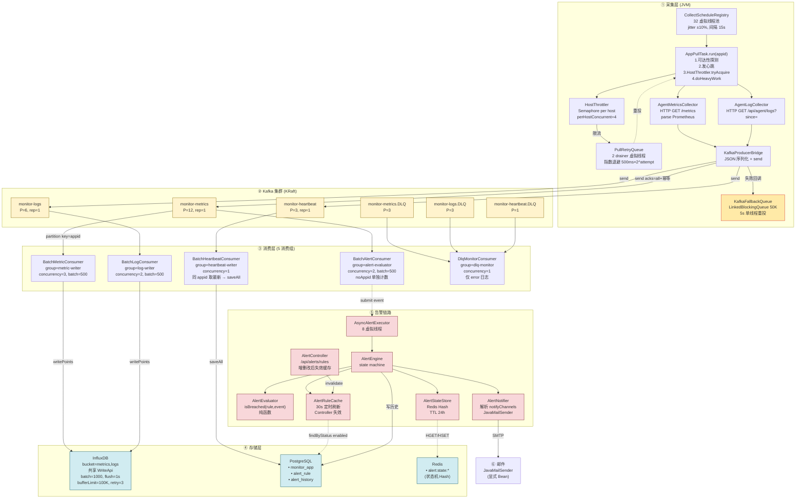
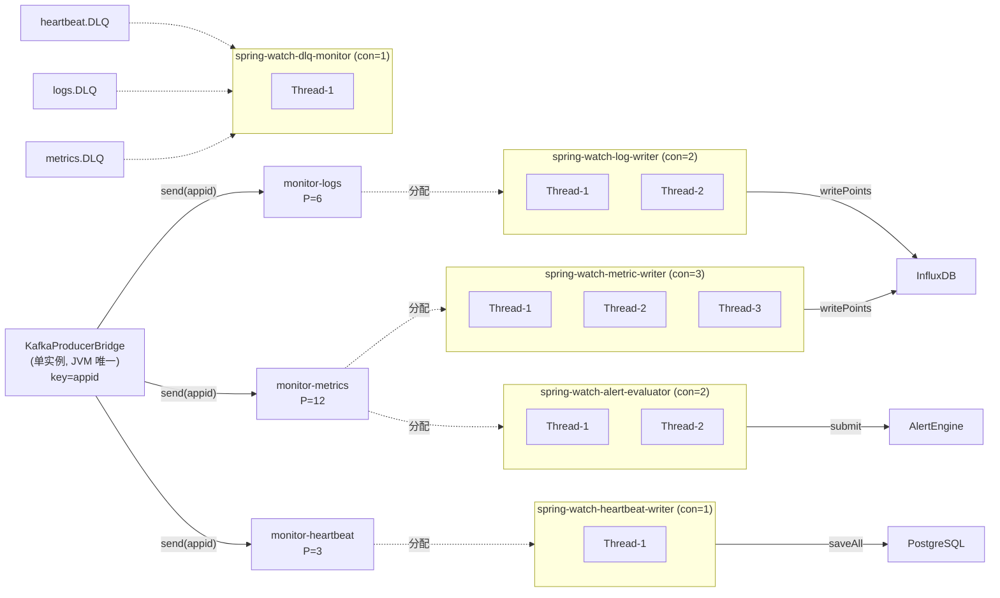
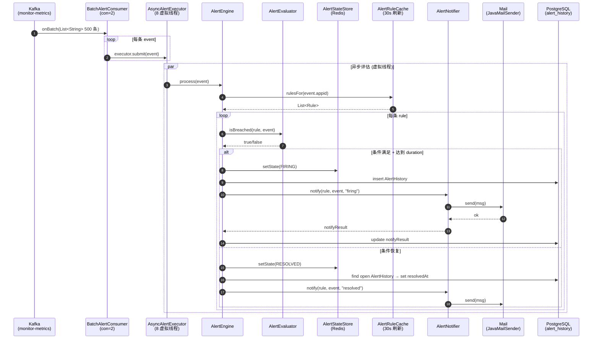
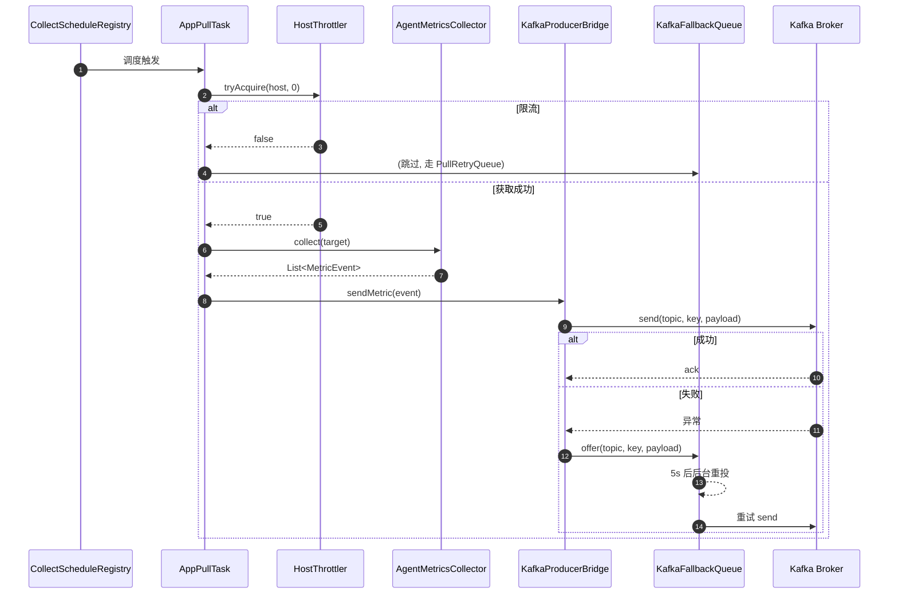
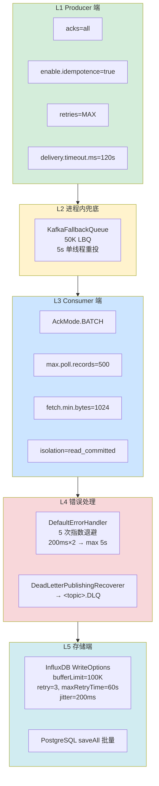
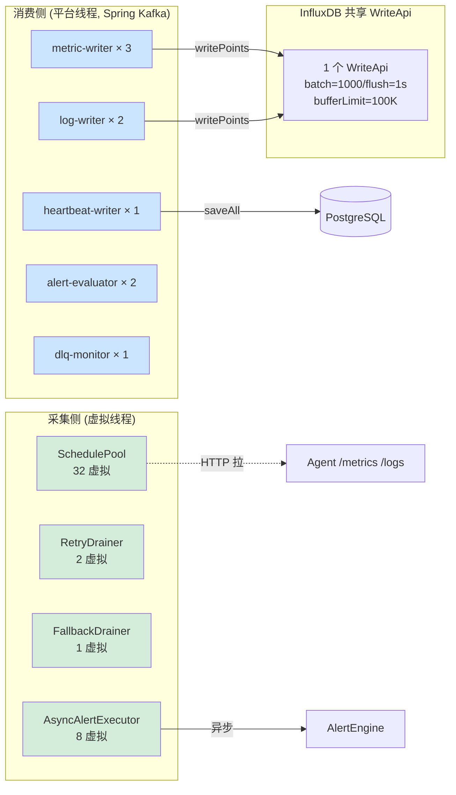

# spring-watch 当前架构图 (Mermaid 版)

> 用 Mermaid 语法重画,支持 GitHub / VSCode / Typora 直接渲染
> 截止落地完成: 新生产消费架构 + 邮件告警 + InfluxDB buffer 调优

---

## 一、全景架构图



---

## 二、Kafka 消费组拓扑



---

## 三、告警状态机

```mermaid
stateDiagram-v2
    [*] --> IDLE
    
    IDLE --> PENDING : 条件首次满足<br/>(记录 firstBreachAt)
    RESOLVED --> PENDING : 条件再次满足
    
    PENDING --> FIRING : 持续 ≥ duration 秒<br/>发邮件 + 写 AlertHistory
    PENDING --> IDLE : 条件恢复<br/>(静默, 不通知)
    
    FIRING --> RESOLVED : 条件恢复<br/>发恢复邮件 + 填充 resolvedAt
    FIRING --> FIRING : 条件持续<br/>(不重发, 幂等)
    
    RESOLVED --> IDLE : 清除 Redis 状态
    
    note right of PENDING : 防瞬时抖动
    note right of FIRING : 幂等:<br/>不重复发邮件
    note right of RESOLVED : 标记恢复时间
```

---

## 四、告警触发时序图



---

## 五、采集层降级时序图



---

## 六、可靠性保障层级图



---

## 七、并发模型对比图


