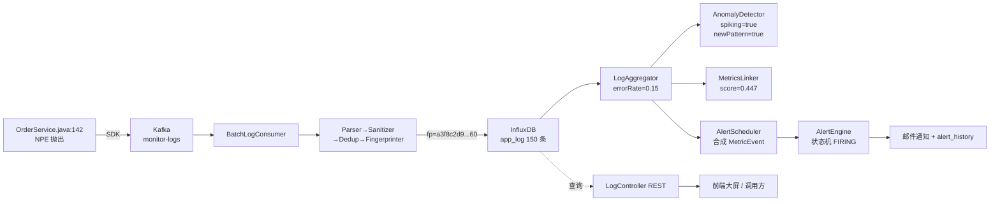

# 日志分析模块 · 一条日志的完整数据流

> 场景:某 SpringBoot 应用 `appid=10001`,在 `10:23:00` 集中抛出 NullPointerException。
> 跟踪同一条 ERROR 日志从 SDK 上报到分析/告警的每一步,所有字段值与代码逻辑均与 `analysis.*` 一一对应。

---

## 1. 原始日志(应用侧)

```
2026-06-16T10:23:01.234Z  ERROR [http-nio-8080-exec-7] c.s.order.OrderService - 订单 8848 处理失败
java.lang.NullPointerException: Cannot invoke "User.getId()" because "u" is null
    at com.spring.order.OrderService.handle(OrderService.java:142)
    at com.spring.order.OrderController.create(OrderController.java:58)
traceId=7c4f2a8b9d1e4f5a8b6c7d8e9f0a1b2c
```

`BatchLogConsumer` 一批拉取 50 条类似日志(含其他正常 INFO/WARN),开始处理这一批。

---

## 2. 入口:解析 → 脱敏 → 去重 → 指纹

### 2.1 LogParser → `LogEvent`

| 字段 | 值 |
|------|----|
| appid | 10001 |
| level | ERROR |
| logger | `com.spring.order.OrderService` |
| message | `订单 8848 处理失败` |
| throwable | `java.lang.NullPointerException: Cannot invoke "User.getId()" because "u" is null` |
| traceId | `7c4f2a8b9d1e4f5a8b6c7d8e9f0a1b2c` |
| timestamp | `2026-06-16T10:23:01.234Z` |

### 2.2 LogSanitizer 脱敏
> 假设原始 message 含手机号 `13800001234` → 被替换为 `138****1234`。
> 本条无敏感字段,原样。

### 2.3 LogDedupService 去重
> 同一 `appid + fingerprint + contentHash` 5 分钟内只写一次。
> 本条首次出现 → 放行。

### 2.4 LogFingerprinter 指纹(关键)

拼接 `level|logger|message\nthrowable首行`:

```
ERROR|com.spring.order.OrderService|订单 8848 处理失败
java.lang.NullPointerException: Cannot invoke "User.getId()" because "u" is null
```

归一化替换(`<TS>/<UUID>/<HEX>/<N>`):

```
ERROR|com.spring.order.OrderService|订单 <N> 处理失败
java.lang.NullPointerException: Cannot invoke "User.getId()" because "u" is null
```

SHA-1 截断(伪值):

```
fingerprint = "a3f8c2d91b4e7f60"
```

### 2.5 写入 InfluxDB

`measurement=app_log`,`tags={appid:10001, level:ERROR, fingerprint:a3f8c2d91b4e7f60, traceId:7c4f2a...}`,`fields={message, throwable}`。

假设这一分钟窗口内 `appid=10001` 共写入了:

| level | 数量 |
|-------|------|
| INFO  | 800  |
| WARN  | 50   |
| ERROR | 150  |
| **total** | **1000** |

---

## 3. 聚合分析:LogAggregator(由 10:24:00 的调度/API 触发)

### 3.1 错误率聚合 `errorRate(appid=10001, from=10:23:00, to=10:24:00)`

Flux:

```flux
from(bucket:"app_log")
  |> range(start:2026-06-16T10:23:00Z, stop:2026-06-16T10:24:00Z)
  |> filter(fn:(r) => r._measurement == "app_log")
  |> filter(fn:(r) => r.appid == "10001")
  |> filter(fn:(r) => r._field == "message")
  |> group(columns:["level"])
  |> count()
```

结果回写到 `LogAggregator.ErrorRateStats`:

```
ErrorRateStats(total=1000, error=150, warn=50, errorRate=0.15)
```

### 3.2 TopN 异常模式 `topPatterns(appid=10001, ..., topN=10)`

按 `fingerprint` group + sort desc + limit。结果中第一名正是本条:

```
[
  PatternStats(fingerprint="a3f8c2d91b4e7f60",
               pattern="订单 8848 处理失败 | java.lang.NullPointerException: ...",
               count=120),
  PatternStats(fingerprint="b7e2...", count=18),
  ...
]
```

### 3.3 错误率时序 `errorRateSeries(appid=10001, ..., every=1m)`

`aggregateWindow(every=1m)` 输出 60 个点,本分钟这一段:

```
10:23:00 INFO=200 WARN=12 ERROR=2
10:24:00 INFO=800 WARN=50 ERROR=150   ← 异常突增点
10:25:00 INFO=750 WARN=45 ERROR=140
```

---

## 4. 异常检测:LogAnomalyDetector

### 4.1 错误率突增 `isErrorRateSpiking(10001, 0.15, 3.0)`

1. `GET log:errorRate:10001` → 上一窗口 `0.02`(基线)
2. `SET log:errorRate:10001 = 0.15 (TTL 600s)` 更新记忆
3. 比值 `0.15 / 0.02 = 7.5 >= 3.0` → **突增**
4. 输出 `AnomalyReport(appid=10001, stats=..., spiking=true, multiplier=3.0)`

### 4.2 新模式发现 `isNewPattern(10001, "a3f8c2d91b4e7f60")`

1. `SADD log:knownPatterns:10001 a3f8c2d91b4e7f60` → 返回 1
2. `EXPIRE 168h`
3. 输出 `isNew=true` → 触发"新故障模式"事件

---

## 5. 指标-日志关联:LogMetricsLinker

`correlate(appid=10001, from=10:23:00, to=10:24:00, metric="jvm_memory_used_bytes")`:

```
logStats  = errorRate()              → 0.15
metricAvg = mean(jvm_memory_used_bytes) → 850000000(约 811MB)
normalize(850000000) = min(1.0, log10(8.5e8)/10) = min(1.0, 0.893) = 0.893
score = 0.15 * 0.6 + 0.893 * 0.4     = 0.09 + 0.357 = 0.447
```

输出 `CorrelationReport(appid=10001, metric=jvm_memory_used_bytes, errorRate=0.15, metricMean=8.5e8, score=0.447)`。

→ 提示值班:错误率与 JVM 内存同步飙高,疑似 OOM 前的级联故障。

---

## 6. 告警调度:LogAlertScheduler

`@Scheduled fixedRate=60s`,10:24:00 触发:

1. `findByRuleTypeAndStatus("log_error_rate","enabled")` → 命中规则 R1(`appid=10001`,`thresholdValue=5.0`)
2. `aggregator.errorRate(10001, 10:23:00, 10:24:00)` → rate=0.15
3. `percent = 0.15 * 100 = 15.0`
4. 合成事件:
   ```java
   MetricEvent.builder()
       .appid(10001)
       .metricName("log_error_rate")
       .value(15.0)
       .timestamp(2026-06-16T10:24:00Z)
       .build();
   ```
5. `alertExecutor.submit(synthetic)` → `AlertEngine` 走 IDLE→PENDING→FIRING 状态机
6. 命中阈值 `15.0 > 5.0` → 邮件/SMTP 通知 + 写入 `alert_history`

---

## 7. 数据流时间线(同一故障)

```
10:23:00 ┄┄┄┄┄┄┄┄┄┄┄┄┄┄┄┄┄ 上一窗口错误率 2%,基线
10:23:01 ──► Agent 上报 → Kafka → Consumer → Ingest → InfluxDB
10:23:01..60 ──► 150 条 ERROR 持续写入(同 fingerprint=...60)
10:24:00 ──► LogAlertScheduler 调度,错误率=15%,触发告警
10:24:00 ──► /api/logs/patterns → Top1 命中本指纹,count=120
10:24:00 ──► /api/logs/anomaly → spiking=true
10:24:01 ──► AlertEngine 发送邮件 "log_error_rate 15% > 5%"
10:24:30 ──► /api/logs/correlate → score=0.447,关联 jvm_memory_used_bytes
10:25:00 ──► 新窗口错误率回落至 2.5%,告警进入 RESOLVED
```

---

## 8. 一图总结(本条日志触达的所有节点)


