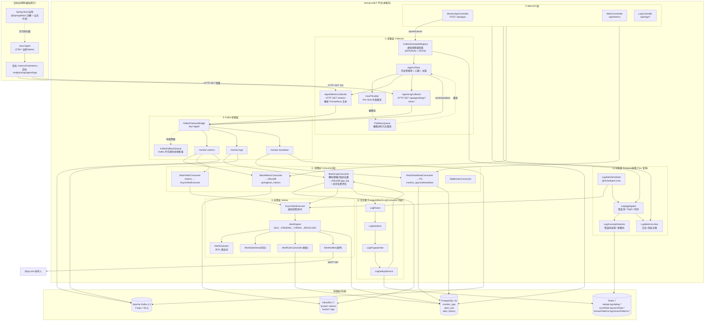
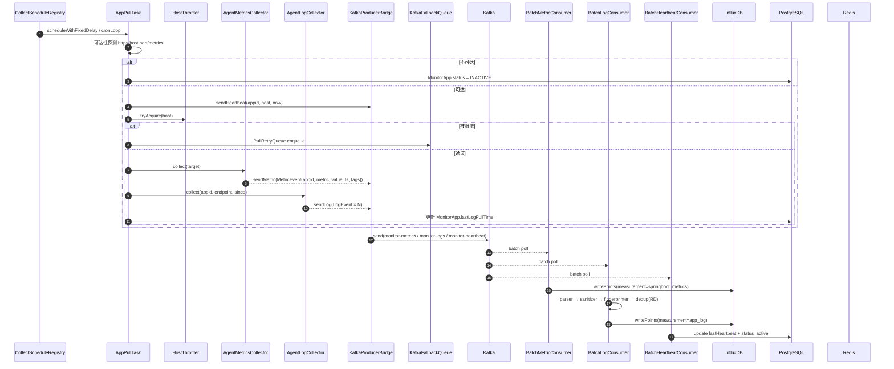
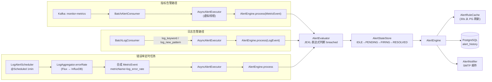
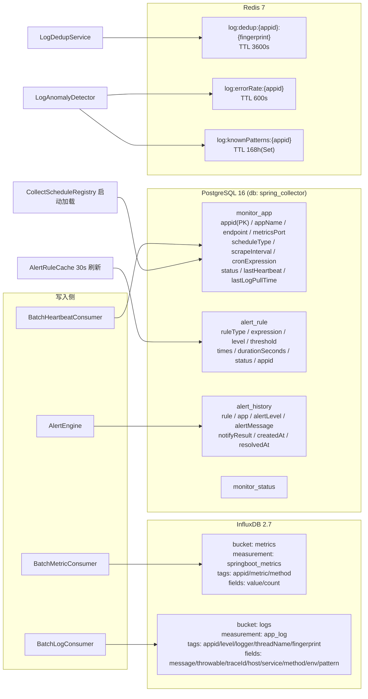
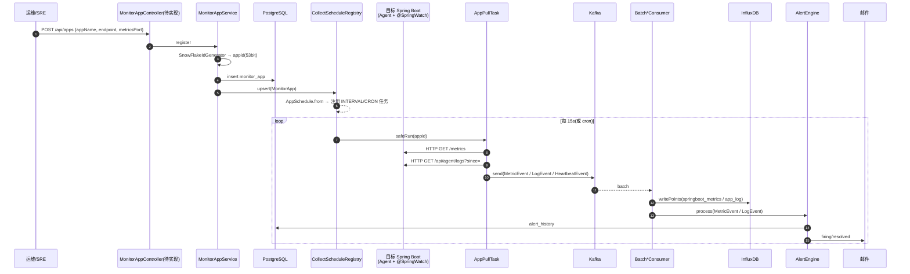

# spring-watch 架构图

> 基于当前代码(`src/main/java` 18 个包、`docker-compose.yml`、`application.yml`、`白皮书.md`)绘制的运行时架构。
> 拉取模型:`spring-watch ──HTTP GET──> 目标应用`;目标不主动推送,Java Agent 暴露指标/日志端点。

---

## 1. 总体架构(分层鸟瞰)

---

## 2. 采集数据流(指标 + 日志 + 心跳)

---

## 3. 告警评估流(指标 + 日志 + 错误率定时)

**状态机(IDLE → PENDING → FIRING → RESOLVED):**

| 当前状态 | 条件 breached | 条件未 breached |
|---|---|---|
| IDLE | 进入 PENDING,记录 firstBreachAt | 保持 IDLE |
| PENDING | `times` 触发 或 `durationSeconds` 到期 → FIRING + 通知 | 恢复,清状态 |
| FIRING | 持续触发,跳过(去重) | 进入 RESOLVED,关闭 history,发恢复通知 |
| RESOLVED | 重新进入 PENDING | 清状态 |

---

## 4. 存储拓扑

---

## 5. Web API 端点清单(基于 `@RequestMapping`)

| Controller | 路径 | 方法 | 服务 | 备注 |
|---|---|---|---|---|
| `MonitorAppController` | `/api/apps` | (空) | `MonitorAppService` | 占位,待实现 |
| `MetricController` | `/api/metrics` | (空) | `MetricQueryService` | 占位,待实现 |
| `LogController` | `/api/logs/search` | GET | `LogQueryService.search` | 关键字 + 级别 + 时间窗 |
| `LogController` | `/api/logs/stats/error-rate` | GET | `LogAggregator.errorRate` | 窗口聚合 total/error/warn |
| `LogController` | `/api/logs/stats/error-rate-series` | GET | `LogAggregator.errorRateSeries` | 趋势曲线 |
| `LogController` | `/api/logs/patterns` | GET | `LogAggregator.topPatterns` | TopN 异常模式 |
| `LogController` | `/api/logs/anomaly` | GET | `LogAnomalyDetector.isErrorRateSpiking` | 突增报告 |
| `LogController` | `/api/logs/trace/{traceId}` | GET | `LogQueryService.findByTraceId` | Trace 串联 |
| `LogController` | `/api/logs/fingerprint/{fp}` | GET | `LogQueryService.findByFingerprint` | 同模式样本 |
| `LogController` | `/api/logs/correlate` | GET | `LogMetricsLinker.correlate` | 日志+指标关联得分 |

---

## 6. 关键模块清单(代码包到职责)

| 包 | 核心类 | 职责 |
|---|---|---|
| `annotation` | `SpringWatch`, `SpringWatchAspect` | 目标应用侧注解(可被复制到客户项目) |
| `collector` | `AgentMetricsCollector`, `AgentLogCollector`, `AppPullTask`, `KafkaProducerBridge`, `KafkaFallbackQueue`, `OtelConfigGenerator` | 拉取与 Kafka 桥接 |
| `collector.schedule` | `CollectScheduleRegistry`, `AppSchedule`, `HostThrottler`, `PullRetryQueue` | 虚拟线程调度 + 限流 + 重投 |
| `consumer` | `BatchMetricConsumer`, `BatchLogConsumer`, `BatchHeartbeatConsumer`, `BatchAlertConsumer`, `DlqMonitorConsumer` | 批量消费写库 |
| `ingest` | `LogParser`, `LogSanitizer`, `LogFingerprinter`, `LogDedupService` | 日志清洗与去重 |
| `alerter` | `AlertEngine`, `AlertEvaluator`, `JexlExprEvaluator`, `AlertRuleCache`, `AlertStateStore`, `AlertState`, `AsyncAlertExecutor`, `AlertNotifier` | 告警状态机 + 评估 + 通知 |
| `analysis` | `LogAggregator`, `LogAnomalyDetector`, `LogMetricsLinker`, `LogAlertScheduler` | 按需 Flux 查询与定时聚合 |
| `service` | `MonitorAppService`, `MetricQueryService`, `LogQueryService`, `AlertRuleService` | 业务门面 |
| `web` | `MonitorAppController`, `MetricController`, `LogController` | REST 入口 |
| `repository` | `MonitorAppRepository`, `AlertRuleRepository`, `AlertHistoryRepository` | JPA 仓储 |
| `model.entity` | `MonitorApp`, `MonitorStatus`, `AlertRule`, `AlertHistory` | PG 实体 |
| `model.event` | `MetricEvent`, `LogEvent`, `HeartbeatEvent` | Kafka 消息 |
| `model.dto` | `ApiResponse`, `AppRegisterRequest` | API DTO |
| `config` | `InfluxDBConfig`, `KafkaConfig`, `KafkaTopicConfig`, `RedisConfig`, `JexlConfig`, `MailConfig`, `FlywayConfig`, `InfluxDBBucketInitializer` | Bean 装配 |
| `util` | `SnowFlakeIdGenerator` | 53 bit 雪花 appid |

---

## 7. 外部依赖(docker-compose)

| 服务 | 镜像 | 端口 | 用途 |
|---|---|---|---|
| postgresql | `postgres:16` | 5432 | 元数据(monitor_app / alert_rule / alert_history) |
| redis | `redis:7-alpine` | 6379 | dedup / errorRate / knownPatterns |
| influxdb | `influxdb:2.7` | 8086 | 时序指标 + 日志 |
| kafka | `apache/kafka:4.3.0` | 9092/9093 | 消息解耦(topic: monitor-metrics / monitor-logs / monitor-heartbeat) |

---

## 8. 接入端到端时序(注册 → 采集 → 消费 → 告警)

---

> **设计原则回顾(摘自 `白皮书.md`):**
> - 拉取模型:目标**不主动**推送,spring-watch 主动 HTTP GET
> - 平台形态:多应用配置驱动,非单点工具
> - 仅限 Spring Boot 目标应用
> - 指标源头 = Java Agent(不依赖 Actuator / Micrometer)
> - 方法级监控 = `@SpringWatch` 注解驱动
