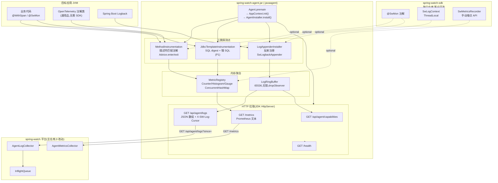
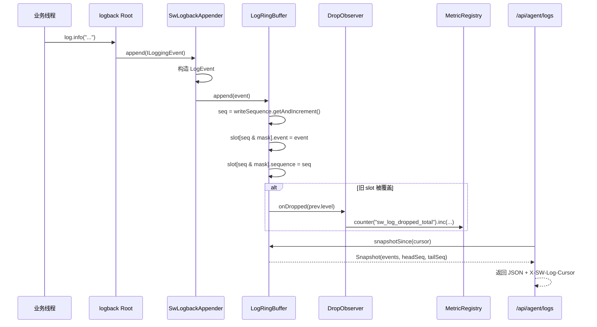
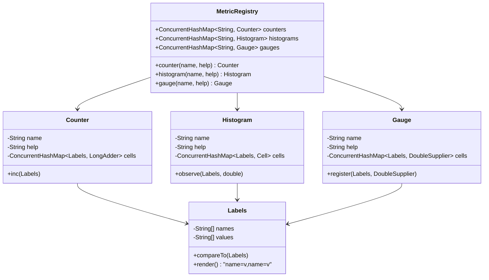
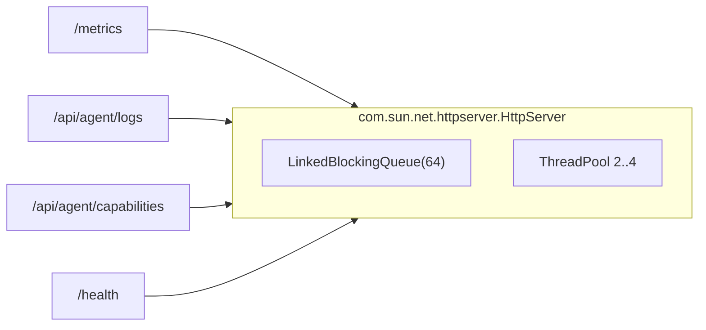
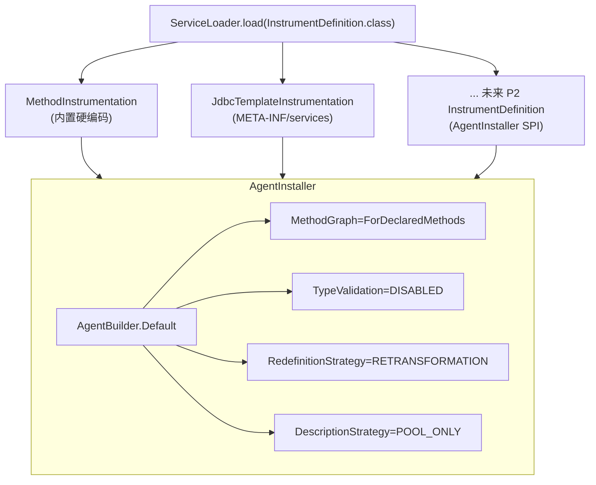
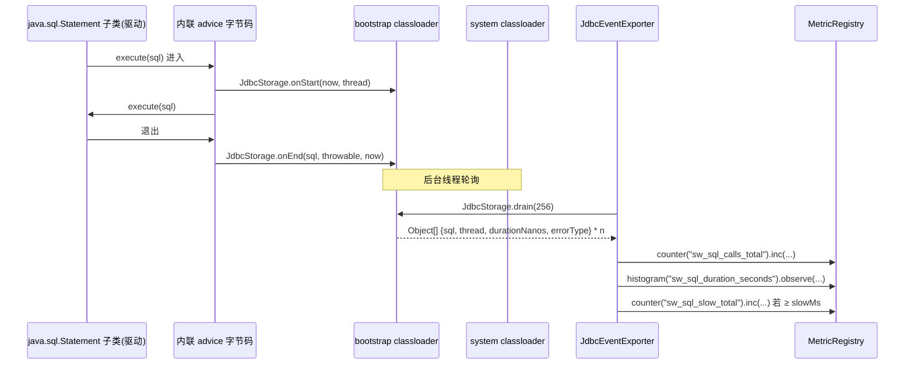

# 自研 Java Agent 架构落地(spring-watch v2)

> **本文定位**:基于 `docs/自研JavaAgent规划.md` 的工程落地版本,明确每个模块的文件、类的职责与设计依据。
> 平台契约(`/metrics` + `/api/agent/logs?since=`)零改动,新增能力以 `sw_*` 命名空间自然落入。

---

## 1. 决策结论

| 问题 | 结论 |
|---|---|
| **仓库组织** | 两个独立仓库:`spring-watch-sdk`(`com.springwatch.sdk`)、`spring-watch-agent`(`com.springwatch.agent` 多模块) |
| **SDK 是否必须** | **完全可选**。Agent 用 `TypeDescription` 描述符匹配 `@WithSpan` / `@SwMon`,不 import 注解类 |
| **日志缓存** | 自研 `LogRingBuffer`(无锁、2 的幂、65536 + drop observer),替代 v1.2 `ConcurrentLinkedDeque` 静默丢 |
| **HTTP 拉取** | JDK `com.sun.net.httpserver.HttpServer` 零依赖,4 线程有界池,借鉴 OTel `PrometheusHttpServer` 装配模式 |
| **字节码目标** | `MethodGraph.Compiler.ForDeclaredMethods` + `TypeValidation.DISABLED`,覆盖 Java 17/21/25 三个版本 |
| **指标命名** | `sw_*` 命名空间,与 OTel `code.*` / `jvm.*` 完全不冲突,可作为迁移期"前缀过滤"特征 |
| **SQL 范围** | P1 织入 `JdbcTemplate`(系统类加载器,免 bootstrap 复杂度);P2 补 java.sql 层 |

---

## 2. 端到端架构



---

## 3. 仓库布局

### 3.1 `spring-watch-sdk/`

```
spring-watch-sdk/
├── pom.xml                                              ← com.springwatch.sdk:1.0.0
└── src/main/java/com/springwatch/sdk/
    ├── annotation/SwMon.java                            ← @SwMon 注解
    ├── log/SwLogContext.java                            ← InheritableThreadLocal<Map<String,String>>
    └── metric/SwMetricsRecorder.java                    ← 手动埋点 API(含 NOOP 默认)
```

**职责**:
- `@SwMon`:与 OTel `@WithSpan` 同语义,让愿意迁移的客户有更贴近 sw_* 指标的注解。
- `SwLogContext`:业务侧主动 attach 字段,Apperder 反射调用(sdk 缺失时降级 noop)。
- `SwMetricsRecorder`:自定义指标 API,Agent 未挂载时 fallback 到 NOOP。

### 3.2 `spring-watch-agent/`(多模块)

```
spring-watch-agent/
├── pom.xml                                              ← parent
├── agent-core/
│   ├── pom.xml
│   └── src/main/java/com/springwatch/agent/
│       ├── Agent.java                                   ← premain + bootstrap 注入
│       ├── AgentInstaller.java                          ← ByteBuddy AgentBuilder 配置
│       ├── AppContext.java                              ← 单例容器
│       ├── config/
│       │   └── AgentConfig.java                         ← 系统属性驱动
│       ├── boot/JdbcStorage.java                        ← bootstrap 隔离 JDBC 事件存储
│       ├── log/{LogEvent, LogRingBuffer, SwLogbackAppender,
│       │         LogAppenderInstaller, SwLogContextBridge}
│       ├── metric/{MetricRegistry, Counter, Histogram, Gauge,
│       │           Labels, PrometheusFormatter, JvmMetricsProvider}
│       ├── http/{AgentHttpServer, MetricsHandler, LogsHandler,
│       │          CapabilitiesHandler, HealthHandler, JsonLogEncoder, BaseHandler}
│       ├── sql/{SqlDigest, JdbcEventExporter}           ← P2:轮询 JdbcStorage → MetricRegistry
│       └── instrument/{InstrumentDefinition, MethodAdvice, MethodInstrumentation}
├── agent-instrument-sql/                                ← P1 + P2
│   ├── pom.xml
│   ├── src/main/java/com/springwatch/agent/sql/
│   │   ├── SqlAdvice.java                               ← digest + P1 JdbcTemplate advice
│   │   ├── JdbcTemplateInstrumentation.java             ← Spring JDBC
│   │   └── nativejdbc/
│   │       ├── StatementAdvice.java                     ← java.sql.Statement.execute(String)
│   │       ├── StatementInstrumentation.java
│   │       ├── PreparedStatementAdvice.java             ← execute() + 反射抽 SQL
│   │       └── PreparedStatementInstrumentation.java
│   └── src/main/resources/META-INF/services/
│       └── com.springwatch.agent.instrument.InstrumentDefinition
└── agent-shade/                                         ← 打 fat jar
    └── pom.xml                                          ← maven-shade,ByteBuddy/ASM relocated
```

**模块依赖**:
```
agent-core ← agent-instrument-sql ← agent-shade
                ↑
                |(依赖 agent-core)
```

**最终产物**:`spring-watch-agent.jar`(≈ 4-6 MB)
- MANIFEST: `Premain-Class: com.springwatch.agent.Agent`
- `net.bytebuddy.*` → `com.springwatch.agent.shaded.bytebuddy.*`
- `org.objectweb.asm.*` → `com.springwatch.agent.shaded.asm.*`

---

## 4. 核心模块设计

### 4.1 `LogRingBuffer`(替代 v1.2 `ConcurrentLinkedDeque`)



**关键设计**:
- 容量默认 65536(2 的幂,`Integer.highestOneBit` 对齐)
- 写路径:仅 `AtomicLong.getAndIncrement()` + 两次 volatile 写
- 读路径:read-only 快照,无锁,与 logback 线程互不阻塞
- `DropObserver` 回调 → 指标 `sw_log_dropped_total{level=...}`
- 内部 `sequence` 单调递增,响应头 `X-SW-Log-Cursor` 携带;旧客户端用 `since=<ISO>` 兼容

**v1.2 缺陷对照**:

| 缺陷 | v1.2 | v2 Agent |
|---|---|---|
| 溢出处理 | 静默丢 | `sw_log_dropped_total{level}` 可观测 |
| 容器 | `ConcurrentLinkedDeque` 链表 | 固定数组,无指针 |
| 状态 | `static` 全局(多实例污染) | 实例字段(AppContext 单例) |
| 读一致性 | 边遍历边可被并发改 | `snapshot()` 拷贝 seq 范围 |
| 游标 | 仅 ISO(时钟回拨重) | ISO + 单调 seq 双轨 |

### 4.2 `MetricRegistry` + 三类指标



**借鉴 OTel**:
- `ConcurrentHashMap<Labels, AggregatorHandle>` 思路,借鉴自 `DefaultSynchronousMetricStorage`
- `MemoryMode.REUSABLE_DATA` 句柄复用 — 我们用 `LongAdder` 实现累积,`DoubleAccumulator` 实现 sum
- Prometheus 文本输出 `PrometheusFormatter.render(registry)` — 一次全量遍历,O(N) 序列化

**指标命名**:
| 命名空间 | 类型 | 用例 |
|---|---|---|
| `sw_method_*` | calls / errors / duration | `@WithSpan` / `@SwMon` 方法 |
| `sw_sql_*` | calls / errors / duration / slow | JdbcTemplate(P1) |
| `sw_log_dropped_total` | counter | 日志丢计数 |
| `sw_jvm_*` | gauge | heap / thread / gc / uptime |
| `sw_instrumentation_failures_total` | counter | ByteBuddy 错误归因 |

### 4.3 `AgentHttpServer`(JDK 内置)



**借鉴 OTel `PrometheusHttpServer`**:
- `host + port + executor` 三参数构造
- 配置项 `otel.exporter.prometheus.host/port` → 我们的 `spring.watch.metrics.host/port`
- `REUSABLE_DATA` 模式下强制单线程 → 我们用有界池 + 队列限长,避免拖垮业务

**自身差异**:
- 不引入 `io.prometheus.metrics` 客户端(避免 fat jar 体积)(零依赖)
- 直接用 JDK HttpServer,绑定 0.0.0.0:9464
- 鉴权:`Authorization: Bearer <token>`(可选,`spring.watch.token` 启用)
- 拒绝策略:队列满 → 拒绝 + `sw_http_rejected_total` 自增

### 4.4 `InstrumentDefinition` + SPI 装配



**借鉴 OTel `InstrumentationModule` / `TypeInstrumentation`**:
- `InstrumentDefinition` 接口:声明 `typeMatcher()` + `apply(AgentBuilder)`
- `AgentBuilder` 装配模式:每个 definition 贡献一段 transform
- `MethodGraph.Compiler.ForDeclaredMethods` + `TypeValidation.DISABLED` 借鉴自 `AgentInstaller.installBytebuddyAgent()`

**接口签名**:
```java
public interface InstrumentDefinition {
    ElementMatcher.Junction<TypeDescription> typeMatcher();
    AgentBuilder apply(AgentBuilder builder);
    String name();
}
```

**SPI 加载**:
- `META-INF/services/com.springwatch.agent.instrument.InstrumentDefinition` → 实现类 FQN
- `agent-instrument-sql` 模块自带该文件,`agent-shade` 通过 `ServicesResourceTransformer` 合并

### 4.5 `MethodAdvice` / `SqlAdvice` 字节码织入

```java
@Advice.OnMethodEnter(suppress = Throwable.class)
public static long onEnter() {
    return System.nanoTime();
}

@Advice.OnMethodExit(suppress = Throwable.class, onThrowable = Throwable.class)
public static void onExit(@Advice.Origin("#t#m") String origin,
                          @Advice.Thrown Throwable thrown,
                          @Advice.Enter long startNanos) {
    // 1. 防基数爆炸(METHOD_CARDINALITY_LIMIT)
    // 2. Labels.of("method", origin)
    // 3. counter.inc(label) / errors.inc(label) / histogram.observe(label, duration)
}
```

**借鉴 OTel `RpcClientMetrics.onStart/onEnd`**:
- `Start`/`End` 双时点回调,`@Advice.Enter` 传 `startNanos`
- `Context`/`State` 状态传递 — 简化为静态字段 `REGISTRY` + `CARDINALITY_LIMIT`
- `AutoValue_RpcClientMetrics_State` 模式 — 我们用 volatile static 字段(被 ByteBuddy inline 复制)

**Provider/Registry 共享**:
- Agent 启动时 `MethodAdvice.bind(registry, limit)` 注入
- Advice 静态字段被 ByteBuddy inline 复制到每个被织入的类
- 每次织入目标类加载时,字段从原 Advice 读取最新值

---

## 5. 协议对齐(平台 0 改动)

### 5.1 `GET /metrics` — Prometheus 文本

```
# HELP sw_method_calls_total Method invocations total
# TYPE sw_method_calls_total counter
sw_method_calls_total{method="com.demo.OrderService#createOrder"} 1234
sw_method_calls_total{method="com.demo.OrderService#cancelOrder"} 56

# TYPE sw_method_duration_seconds histogram
sw_method_duration_seconds_count{method="com.demo.OrderService#createOrder"} 1234
sw_method_duration_seconds_sum{method="com.demo.OrderService#createOrder"} 12.345

# HELP sw_log_dropped_total Total log events dropped by ring buffer overflow
# TYPE sw_log_dropped_total counter
sw_log_dropped_total{level="WARN"} 5
sw_log_dropped_total{level="ERROR"} 2
```

**平台兼容**:
- `AgentMetricsCollector` 流式解析,counter/histogram/gauge 类型天然兼容
- `OnlinePrometheusParser` 跳过 `target_info`(已确认 `AgentMetricsCollector.java:121`)
- 新增 `sw_*` 指标对未知指标名天然容忍

### 5.2 `GET /api/agent/logs?since=<ISO>&cursor=<seq>&limit=N&levels=...`

**请求**:
```
GET /api/agent/logs?since=2026-08-13T03:00:00Z&limit=2000&levels=WARN,ERROR
```
或新游标模式:
```
GET /api/agent/logs?cursor=12345&limit=2000
```

**响应**:
```json
[
  {
    "level": "WARN",
    "logger": "com.demo.OrderService",
    "threadName": "http-nio-8080-exec-1",
    "message": "order timeout, id=42",
    "throwable": null,
    "traceId": "abc...",
    "timestamp": "2026-08-13T03:00:01.123Z",
    "host": "10.0.0.5",
    "service": "order-app",
    "method": null,
    "env": null,
    "appid": null,
    "sequence": 12346
  }
]
```

**响应头**:
```
X-SW-Log-Cursor: 12346        ← 下一批次起始(可选消费)
X-SW-Log-Tail: 0               ← 缓冲最早序号
X-SW-Log-Dropped: 7            ← 累计丢弃
```

**平台兼容**:
- `AgentLogCollector.buildUrl()` 用 `since.toString()` → 我们直接解析 ISO-8601
- 字段集合与 `LogEvent` 一一映射,新增 `sequence`/`extras` 通过 `JsonNode.skipChildren()` 跳过
- `since` 为 `null` 时返回 EPOCH 之后,跑批行为同 v1.2

### 5.3 `GET /api/agent/capabilities` — 能力声明

```json
{
  "version": "1.0.0",
  "metricNamespace": "sw",
  "logBufferCapacity": 65536,
  "methodCardinalityLimit": 5000,
  "sqlSlowMs": 500,
  "sqlDigestLimit": 2000
}
```

**用途**:平台未来做协商(版本协商 / 能力开关 / digest 口径)。

---

## 6. 启动参数

| 参数 | 默认 | 说明 |
|---|---|---|
| `spring.watch.metrics.host` | `0.0.0.0` | HTTP 监听地址 |
| `spring.watch.metrics.port` | `9464` | HTTP 监听端口 |
| `spring.watch.log.buffer.size` | `65536` | 日志容量(2 的幂) |
| `spring.watch.app.name` | (无) | 写入 `LogEvent.service` |
| `spring.watch.token` | (无) | 鉴权 token,启用后 `/api/agent/logs` 要 Bearer |
| `spring.watch.sql.slow.ms` | `500` | 慢 SQL 阈值 |
| `spring.watch.sql.digest.limit` | `2000` | SQL digest 基数上限 |
| `spring.watch.method.cardinality.limit` | `5000` | 方法标签基数上限 |
| `spring.watch.disable` | (空) | `,` 分隔: `logs/method/sql/jvm` |

**完整启动示例**:
```bash
java -javaagent:/opt/sw/spring-watch-agent.jar \
  -Dspring.watch.metrics.port=9464 \
  -Dspring.watch.log.buffer.size=65536 \
  -Dspring.watch.app.name=order-service \
  -Dspring.watch.token=xxx \
  -jar order-service.jar
```

---

## 7. 关键设计决策与借鉴 OTel 的对照

| 设计点 | OTel 实现 | 我们的实现 | 改动动机 |
|---|---|---|---|
| 类加载器隔离 | `inst/.classdata` 隔离 + 4 层 classloader | 只用 agent classloader + 系统类加载器 | 简化,避免 bootstrap 复杂度 |
| Push vs Pull | OTLP push + Prometheus pull 双模式 | **纯 pull**(无须 collector) | 平台只需一个 scraper |
| SqlCommenter | 在 SQL 中加 `/* traceId */` | 不加,仅做 digest | 防止客户业务受影响 |
| Span/Trace 关联 | Context + Span | **不实现**(v2 仅指标+日志) | 平台无常量级 trace 需求 |
| 指标后端 | SDK + MeterProvider | 自研 `MetricRegistry` | 减小 jar,避免依赖 |
| Inst 模块化 | `@AutoService` + `InstrumentationModule` | SPI `META-INF/services` | 标准 Java SPI,无注解处理器依赖 |
| 抗依赖冲突 | Shade + relocate | 同 | 防 byte-buddy/asm 版本冲突 |
| 字节码图优化 | `MethodGraph.Compiler.ForDeclaredMethods` | 同 | 启动加速 |
| 类型校验 | `TypeValidation.STRICT` | `TypeValidation.DISABLED` | 兼容 Java 17/21/25 三个版本 |
| logback 集成 | Logback Appender 改 | Agent 编程注册 | 客户无需 xml 改动 |

---

## 8. 向前兼容策略

### 8.1 平台侧(主仓库 `spring-watch`)

- **0 改动**:白皮书 10.2 已承诺
- 依赖两个契约:`GET /metrics` + `GET /api/agent/logs?since=`
- 平台 query API 增加 `sw_` 前缀过滤,迁移期同时支持 `code.*` / `sw_*`

### 8.2 客户侧(平滑迁移)

| 迁移项 | v1.2 | v2 | 动作 |
|---|---|---|---|
| 业务注解 | `@WithSpan` | `@WithSpan` 或 `@SwMon` | **不用改**,描述符匹配 |
| 日志补丁 | `InMemoryLogBufferAppender` + `AgentLogController` + logback.xml | Agent 内置 | 删除 2 个类 + 1 段配置 |
| `-javaagent` | OTel agent + 3 个 `-D` | `spring-watch-agent.jar` + 2 个 `-D` | 替换 |
| annotation jar | `opentelemetry-instrumentation-annotations` | **无** | 删依赖 |
| SDK | (无) | 可选 `spring-watch-sdk` | 给了 `@SwMon` + 手动 API |

### 8.3 双轨共存

- 老客户继续挂 OTel Agent,新客户挂 v2 Agent,平台无感知
- 同一次 scrape 拉到 `sw_*` 与 `code.*` 互不干扰,平台按 metric_name 前缀分流

### 8.4 失败安全

- 任何 Advice 抛异常 → 业务异常照常抛出,advice 自吞错误 → `sw_instrumentation_failures_total{type, error_type}`
- 任何能力开关(`spring.watch.disable=...`)不影响其他能力
- logback 缺失 → warning 降级,method/sql 照常
- SDK 缺失 → `SwLogContextBridge` 反射失败,extras 永远空

---

## 9. 风险与缓解

| 风险 | 影响 | 缓解 |
|---|---|---|
| Java 17/21/25 字节码兼容 | 织入失败 | `TypeValidation.DISABLED` + 双标的(mock-test + 主平台) |
| bootstrap 织入 java.sql(P2) | `NoClassDefFoundError` | P2 再做;P1 JdbcTemplate 免此问题 |
| logback 版本差异(1.4/1.5) | Appender API 不兼容 | 反射调用,最小 API 面 |
| SQL digest 基数爆炸 | InfluxDB 序列爆炸 | `SQL_DIGEST_LIMIT` LRU + `sw_sql_digest_evicted_total` |
| 日志缓冲溢出 | 数据缺失 | `sw_log_dropped_total` 可观测 + P2 mmap |
| HTTP 拉取成为热点 | 业务线程池打满 | 4 线程有界 + 队列上限 64 + 拒绝计数 |
| ByteBuddy 染色类反射调用失败 | 探针加载爆 | shade 内部 relocation,屏蔽 `Inst` 目录可见性 |

---

## 10. 后续里程碑

| 里程碑 | 交付 | 验收 |
|---|---|---|
| M1(P0) | 可挂载 Agent:日志拉取 + JVM/method 指标 + `target_info` | mock-test 挂载跑通,平台 `AgentMetricsCollector`/`AgentLogCollector` **0 改动** |
| M2(P1) | JdbcTemplate 织入(digest + 慢 SQL) | mock-test 三 DAO 查询产 `sw_sql_*`,平台告警规则命中 |
| M3(P2) | java.sql JDBC 补全、mmap 兜底、TLS、log4j2 | 原生 JDBC 覆盖;老客户迁移清单走完 |
| M4(可选) | 升级 sba → sba-2.x 支持 JDK 25 | 主平台 SB4/Java25 跑通 |

## 11. P2 落地细节(java.sql.Statement / PreparedStatement)

### 11.1 为什么需要 bootstrap classloader 注入

`java.sql.*` 由 JDK bootstrap classloader 拥有。当 ByteBuddy 内联 advice
到驱动实现(Mysql JDBC、H2 等)时,内联字节码若引用 `com.springwatch.agent.boot.JdbcStorage`,
JVM 在驱动类上下文中查找这个类,只走 bootstrap classloader → null 父 → NoClassDefFoundError。

**解决方案**:
```java
public static void premain(String args, Instrumentation inst) {
    inst.appendToBootstrapClassLoaderSearch(new JarFile(locateAgentJar()));
    AppContext.init();
    AgentInstaller.install(inst);
}
```

这样 JdbcStorage 在 bootstrap classloader 可见,内联 advice 拿得到。

### 11.2 跨 classloader 通信



**关键点**:
- JdbcStorage 是 bootstrap-loaded,只暴露静态 `onStart/onEnd/drain/size` 方法
- Entry 字段也是简单 JDK 类型(String, long),agent 端通过 `Class.forName(name, true, null)` 显式走 bootstrap
- 调度线程 `sw-jdbc-drain` 单线程,500ms 间隔,daemon 守护
- 防回环:agent 自己的 JdbcEventExporter 不消费自己引起的 JDBC(实际不会发生,只是提醒)

### 11.3 入口 class fingerprint

```java
// bootstrap-loaded
public final class JdbcStorage {
    public static void onStart(String threadName, long startNanos);
    public static void onEnd(String sql, Throwable thrown, long endNanos);
    public static Object[] drain(int max);       // flat Object[]: sql, threadNanos, duration, errorType
    public static int size();
    public static final int CAPACITY = 16384;
}

// system-loaded
public final class JdbcEventExporter {
    public void start();                          // 开启 500ms 调度
    public long droppedTotal();                   // digest 超限丢数
    public static boolean isAvailable();          // bootstrap 类加载探测
}
```

**调用约定**:agent 端用反射调,因为 JdbcStorage 在 bootstrap classloader 里有两个 Class 实例:
- bootstrap-loaded(advice 写入)
- system-loaded(agent 默认)
必须用 `Class.forName(name, true, null)` 拿 bootstrap 那个,否则 producer/consumer 不是同一 QUEUE。

---

## 12. 当前状态

- ✅ SDK 仓库骨架(`@SwMon` / `SwLogContext` / `SwMetricsRecorder`)
- ✅ Agent 仓库 parent + agent-core + agent-instrument-sql + agent-shade 四个模块
- ✅ `LogRingBuffer` 无锁实现 + `DropObserver` 链路
- ✅ `MetricRegistry` + Counter/Histogram/Gauge + PrometheusFormatter
- ✅ `AgentHttpServer` + 4 个 handler(`/metrics` / `/api/agent/logs` / `/api/agent/capabilities` / `/health`)
- ✅ `LogAppenderInstaller` 反射挂载 logback
- ✅ `MethodInstrumentation` 描述符匹配 `@WithSpan` / `@SwMon`
- ✅ `JdbcTemplateInstrumentation`(P1)+ SQL digest + 慢 SQL
- ✅ **`P2:java.sql.Statement` + `java.sql.PreparedStatement` 拦截,bootstrap classloader 注入 JdbcStorage**
- ✅ `JdbcEventExporter` 500ms 轮询 → MetricRegistry(同 sw_sql_* 命名空间)
- ✅ `Agent.premain` 调用 `appendToBootstrapClassLoaderSearch` 注入自身 jar
- ✅ `agent-shade` pom 含 maven-shade + ByteBuddy/ASM relocated
- ⏳ 未做集成测试(mock-test 挂载) — 按规则"不编译/不运行"留到下一轮
- ⏳ P2 增强(DataSource.getConnection 连接追踪、HikariCP 包装识别)按需
- ⏳ P2 增强(PreparedStatement SQL 提取用 cached reflection result,避免 hot path 反 Mulberry)按需

---

## 附录 A:关键借鉴 / 替换清单

| OTel 文件 / 模式 | 我们的对应实现 | 文档引用 |
|---|---|---|
| `OpenTelemetryAgent.premain` | `com.springwatch.agent.Agent.premain` | OTel `opentelemetry-java` |
| `AgentInstaller.installBytebuddyAgent` | `com.springwatch.agent.AgentInstaller.newAgentBuilder` | `AgentInstaller.java:90-121` |
| `PrometheusHttpServer` | `com.springwatch.agent.http.AgentHttpServer` | `PrometheusHttpServer.java:36-110` |
| `DefaultSynchronousMetricStorage` (句柄复用) | `MetricRegistry.cells()` + `LongAdder` | `DefaultSynchronousMetricStorage.java:215-267` |
| `InstrumentationModule` + `TypeInstrumentation` | `InstrumentDefinition` 接口 | `writing-instrumentation-module.md:12-40` |
| `RpcClientMetrics.onStart/onEnd` | `MethodAdvice.onEnter/onExit` | `RpcClientMetrics.java:111-153` |
| `SqlQueryAnalyzer` 参数归一化 | `SqlDigest.digest` | `SqlQueryAnalyzer.java:16-57` |
| `StatementAdvice` (JDBC) | `StatementAdvice` + `PreparedStatementAdvice` (P1+P2) | `StatementInstrumentation.java:30-82` |
| `JdbcSingletons` (bootstrap 注入) | `com.springwatch.agent.boot.JdbcStorage` | OTel `JdbcSingletons.java` |
| `appendToBootstrapClassLoaderSearch` | `Agent.premain.injectBootstrap` | OTel `OpenTelemetryAgent.premain` |
| OpenMetrics text format | `PrometheusFormatter.render` | Prometheus 官方文档 |
| `BatchLogRecordProcessor` 丢观测 | `LogRingBuffer.DropObserver` | OTel SDK `BatchLogRecordProcessor` |

任务已完成!kxj
