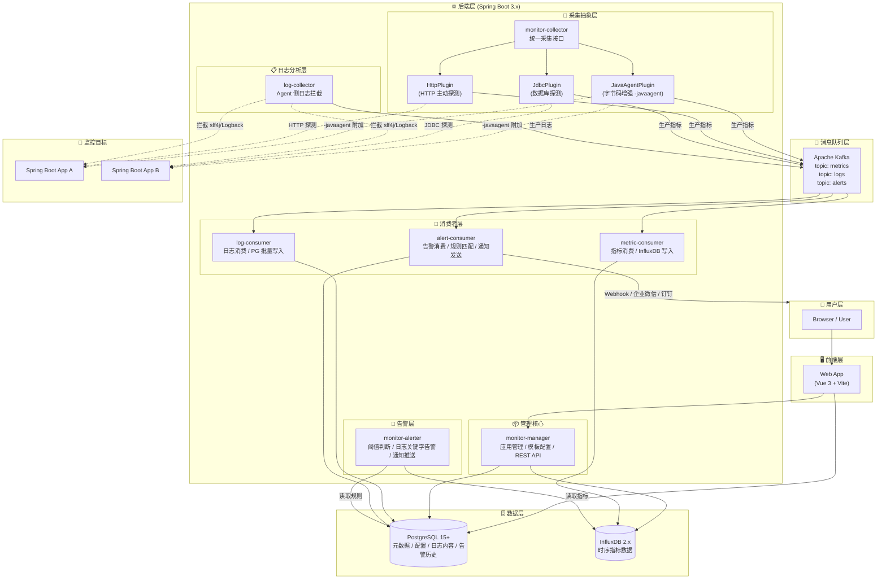

# Spring Boot 监控平台 — 生产级架构设计（PostgreSQL + Kafka + InfluxDB）

## 1. 生产级架构图

```mermaid
graph TB
    subgraph User["👤 用户层"]
        Browser["Browser / User"]
    end

    subgraph Frontend["🖥️ 前端层"]
        WebApp["Web App<br/>(Vue 3 + Vite)"]
    end

    subgraph Backend["⚙️ 后端层 (Spring Boot 3.x)"]
        subgraph Manager["📦 管理核心"]
            MB["monitor-manager<br/>应用管理 / 模板配置 / REST API"]
        end

        subgraph Collect["📡 采集抽象层"]
            CA["monitor-collector<br/>统一采集接口"]
            AgentCol["JavaAgentPlugin<br/>(字节码增强 -javaagent)"]
            HttpCol["HttpPlugin<br/>(HTTP 主动探测)"]
            JdbcCol["JdbcPlugin<br/>(数据库探测)"]
        end

        subgraph LogAna["📋 日志分析层"]
            LogCollector["log-collector<br/>Agent 侧日志拦截"]
        end

        subgraph Alert["🔔 告警层"]
            AL["monitor-alerter<br/>阈值判断 / 日志关键字告警 / 通知推送"]
        end

        subgraph Consumer["🔄 消费者层"]
            MetricConsumer["metric-consumer<br/>指标消费 / InfluxDB 写入"]
            LogConsumer["log-consumer<br/>日志消费 / PG 批量写入"]
            AlertConsumer["alert-consumer<br/>告警消费 / 规则匹配 / 通知发送"]
        end
    end

    subgraph MQ["📨 消息队列层"]
        Kafka["Apache Kafka<br/>topic: metrics<br/>topic: logs<br/>topic: alerts"]
    end

    subgraph DataBase["🗄️ 数据层"]
        PG[(PostgreSQL 15+<br/>元数据 / 配置 / 日志内容 / 告警历史)]
        TSDB[(InfluxDB 2.x<br/>时序指标数据)]
    end

    subgraph Target["🎯 监控目标"]
        SB1["Spring Boot App A"]
        SB2["Spring Boot App B"]
    end

    Browser --> WebApp
    WebApp --> MB
    WebApp --> PG
    MB --> PG
    MB --> TSDB
    CA --> AgentCol
    CA --> HttpCol
    CA --> JdbcCol
    AgentCol -.->|"-javaagent 附加"| SB1
    AgentCol -.->|"-javaagent 附加"| SB2
    HttpCol -.->|"HTTP 探测"| SB1
    JdbcCol -.->|"JDBC 探测"| SB2

    AgentCol -->|"生产指标"| Kafka
    HttpCol -->|"生产指标"| Kafka
    JdbcCol -->|"生产指标"| Kafka
    LogCollector -.->|"拦截 slf4j/Logback"| SB1
    LogCollector -.->|"拦截 slf4j/Logback"| SB2
    LogCollector -->|"生产日志"| Kafka

    Kafka --> MetricConsumer
    Kafka --> LogConsumer
    Kafka --> AlertConsumer
    MetricConsumer --> TSDB
    LogConsumer --> PG
    AlertConsumer --> PG
    AlertConsumer -->|"Webhook / 企业微信 / 钉钉"| User

    AL -->|"读取规则"| PG
    AL -->|"读取指标"| TSDB
```
