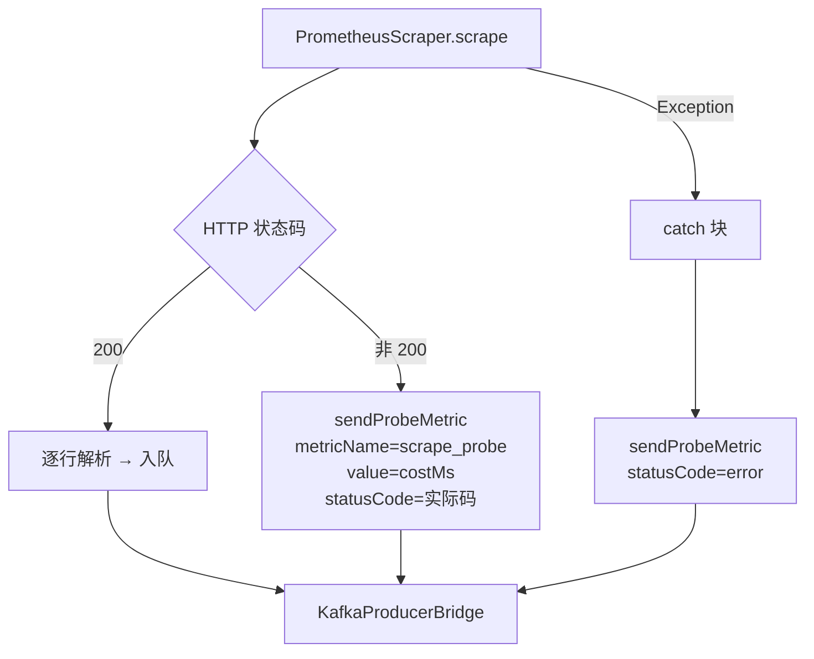

# Prometheus 拉取数据流向（mock-test）

> 基于日志 `PrometheusScraper : Prometheus拉取成功 - app=mock-test, url=http://localhost:9464/metrics, metrics=51, cost=13ms` 追踪  
> 采集周期：`@Scheduled fixedDelay = 15000ms`（默认，可在 `spring-watch.collector.interval` 覆盖）

---

## 1. 端到端数据流图

```mermaid
flowchart LR
    A["CollectorScheduler<br/>@Scheduled 15s"] -->|findByStatus('active')| B[(PostgreSQL<br/>monitor_app)]
    B -->|List&lt;MonitorApp&gt;| A
    A -->|collect_mode=prometheus| C["PrometheusScraper.scrape()"]

    C -->|"HTTP GET<br/>:9464/metrics"| D["mock-test App<br/>(Spring Boot)"]
    D -->|"200 OK<br/>Prometheus 文本协议"| C

    C -->|"逐行解析<br/>parsePrometheusLine()"| E["List&lt;ParsedMetric&gt;<br/>name/tags/value"]
    E -->|"每条包装为"| F["MetricEvent<br/>appName/metricName/value/timestamp/tags"]
    F -->|"循环发送"| G["KafkaProducerBridge.sendMetric()"]

    G -->|"ObjectMapper<br/>writeValueAsString"| H["JSON 字符串"]
    H -->|"KafkaTemplate.send<br/>topic=monitor-metrics<br/>key=appName"| I[(Kafka<br/>topic: monitor-metrics)]

    I -->|"@KafkaListener<br/>groupId=spring-watch-metric-consumer"| J["MetricConsumer.onMetric()"]
    J -->|"ObjectMapper<br/>readValue"| F2["MetricEvent"]
    F2 -->|"Point.measurement('springboot_metrics')<br/>addTag/addField/time(NS)"| K["InfluxDB Point"]
    K -->|"WriteApi.writePoint()"| L[(InfluxDB 2.7<br/>Bucket: metrics<br/>Org: spring-watch)]
```

---

## 2. 关键阶段拆解

| # | 阶段 | 代码入口 | 关键动作 | 产物 |
|---|------|----------|----------|------|
| 1 | 调度 | `CollectorScheduler:21` | 15s 拉一次 `status=active` 的应用列表 | `List<MonitorApp>` |
| 2 | 路由 | `CollectorScheduler:35-46` | 按 `collect_mode` 派发：`prometheus`/`http_probe`/`both` | `MonitorAppScraper` |
| 3 | 拉取 | `PrometheusScraper:23-77` | `HttpURLConnection` GET `:9464/metrics`（connect 5s / read 10s） | 原始文本流 |
| 4 | 解析 | `PrometheusScraper:113-155` | 跳过 `#` 注释；按 `{...}` 拆 metric 名/labels/数值 | `ParsedMetric` record |
| 5 | 封装 | `PrometheusScraper:49-57` | 每条 → `MetricEvent`（含 `appName`、`method=prometheus_scrape`、`statusCode` tag） | `MetricEvent` |
| 6 | 发送 | `KafkaProducerBridge:25-27, 37-50` | `ObjectMapper` → JSON → `kafkaTemplate.send("monitor-metrics", appName, json)` | Kafka Record |
| 7 | 投递 | Kafka Broker | topic=`monitor-metrics`，**按 `appName` 做分区 Key**（保证单应用有序） | 分区日志 |
| 8 | 消费 | `MetricConsumer:22-47` | `@KafkaListener` 反序列化 → 构建 `Point`（`measurement=springboot_metrics`） | `Point` |
| 9 | 落库 | `MetricConsumer:43` | `WriteApi.writePoint()`（NS 精度时间戳） | InfluxDB 行 |

---

## 3. 数据结构演化

```mermaid
graph LR
    A["Prometheus 文本<br/>jvm_memory_used_bytes{area=\"heap\"} 1.23e8"] -->|parsePrometheusLine| B["ParsedMetric(<br/>  name=jvm_memory_used_bytes,<br/>  tags={area:heap},<br/>  value=1.23e8)"]
    B -->|builder| C["MetricEvent(<br/>  appName=mock-test,<br/>  metricName=jvm_memory_used_bytes,<br/>  method=prometheus_scrape,<br/>  value=1.23e8,<br/>  timestamp=2026-06-11T21:20:47.722+08:00,<br/>  tags={area:heap, statusCode:200})"]
    C -->|ObjectMapper| D["JSON<br/>{...}"]
    D -->|Kafka| E["Kafka Record<br/>(topic=monitor-metrics, key=mock-test, value=JSON)"]
    E -->|Consumer| F["Point(measurement=springboot_metrics,<br/>  tag:app=mock-test,<br/>  tag:metric=jvm_memory_used_bytes,<br/>  tag:method=prometheus_scrape,<br/>  tag:area=heap,<br/>  tag:statusCode=200,<br/>  field:value=1.23e8,<br/>  time=2026-06-11T21:20:47.722+08:00, NS)"]
    F -->|writePoint| G[("InfluxDB<br/>measurement: springboot_metrics")]
```

---

## 4. 当前日志观测到的事实

| 指标 | 值 | 含义 |
|------|----|------|
| `metrics=51` | 每周期 51 条 | 单次 scrape 解析出的有效指标行（去除 `#` 注释和空行） |
| `cost=13ms / 14ms / 53ms / 12ms` | 12~53ms | HTTP 连接 + 读取 + 解析 + 入队总耗时 |
| `interval ≈ 15s` | 调度间隔 | 日志时间戳 21:20:47 → 21:21:02 → 21:21:17 → 21:21:32 |
| `app=mock-test` | 当前唯一 active 应用 | `mock-test` 子模块作为被监控目标，暴露 `:9464/metrics` |
| 波动 `53ms` | 偶发尖刺 | GC 暂停 / 网络抖动 / 解析 CPU 竞争 |

---

## 5. 异常分支（同一管道的降级路径）



> 即：即使目标不可达，也会产出一条 `scrape_probe` 指标（带 `statusCode` tag），用于**自监控自身的采集健康度**。

---

## 6. 上下游关系速查

| 上游 | 下游 | 协议/位置 |
|------|------|-----------|
| `mock-test` Spring Boot | `PrometheusScraper` | HTTP GET `:9464/metrics` |
| `PrometheusScraper` | `Kafka` | `monitor-metrics` topic，key=`appName` |
| `Kafka` | `MetricConsumer` | `@KafkaListener(groupId="spring-watch-metric-consumer")` |
| `MetricConsumer` | `InfluxDB` | `WriteApi.writePoint`，measurement=`springboot_metrics`，精度 `NS` |
| `AlertConsumer` *(并联消费)* | `AlertEvaluator` → `AlertNotifier` | 同一 Kafka topic 触发告警评估（详见 `alerter/`） |
