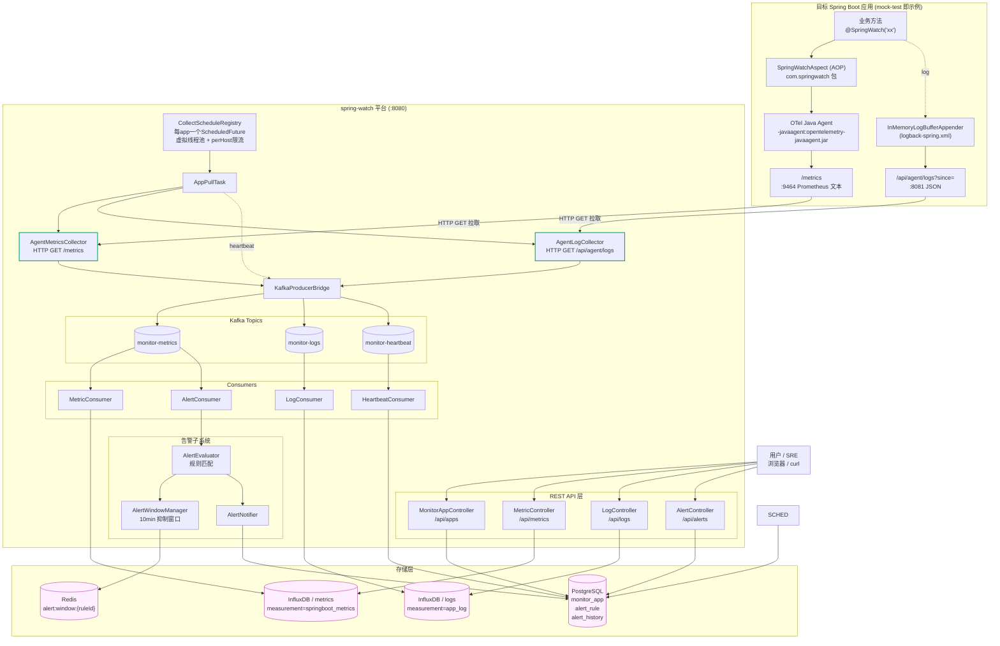

# spring-watch 当前架构图

> 基于代码现状(commit @ 2026-06-13)梳理,与《白皮书.md》5 大硬约束完全一致:**拉取模型 / 多应用平台 / 仅 Spring Boot / 指标源=Java Agent / 注解驱动**。

---

## 1. 总体架构图



---

## 2. 数据流详解(5 条主链路)

### 链路 1 — 指标拉取 (Metric Pull)

```
目标 JVM @SpringWatch + OTel Agent
   │  字节码 / AOP 计时
   ▼
:9464/metrics  (Prometheus 文本)
   │  HTTP GET 每 15~30s
   ▼
AgentMetricsCollector.parsePrometheusLine()
   │  封装 MetricEvent
   ▼
KafkaProducerBridge → Kafka topic=monitor-metrics  (key=appid)
   │
   ├─► MetricConsumer  → InfluxDB(measurement=springboot_metrics)
   └─► AlertConsumer   → AlertEvaluator
```

### 链路 2 — 日志拉取 (Log Pull)

```
业务日志 → logback → InMemoryLogBufferAppender (环形缓冲)
   │
   ▼
GET /api/agent/logs?since=<ISO>
   │  HTTP GET 每 15~30s
   ▼
AgentLogCollector → KafkaProducerBridge → monitor-logs
   │
   ▼
LogConsumer → InfluxDB(measurement=app_log)
            ↑ tag: appid/level/logger/threadName
            ↑ field: message/throwable/traceId
```

### 链路 3 — 心跳 (Heartbeat)

```
CollectorScheduler 拉取成功
   │
   ▼
sendHeartbeat() → monitor-heartbeat
   │
   ▼
HeartbeatConsumer → PostgreSQL.monitor_app
                    SET last_heartbeat=now, status=active
```

### 链路 4 — 告警评估 (Alert)

```
monitor-metrics → AlertConsumer → AlertEvaluator
                                    │ 查 alert_rule(status=enabled)
                                    │ 表达式匹配:metric op threshold
                                    ▼
                                  AlertWindowManager
                                    │ Redis ZSet: alert:window:{ruleId}
                                    │ 10min 内已触发 → 抑制
                                    ▼ 未抑制
                                  AlertNotifier → AlertHistory(PG)
```

### 链路 5 — 查询 API

| 端点 | 控制器 | 数据源 |
|---|---|---|
| `POST /api/apps` 注册返回 appid | MonitorAppController | PostgreSQL |
| `GET  /api/metrics?...` | MetricController | InfluxDB / metrics |
| `GET  /api/logs?...` | LogController | InfluxDB / logs |
| `*    /api/alerts/...` | AlertController | PostgreSQL |

---

## 3. 关键组件清单

### spring-watch 平台 (Spring Boot 4.0.1 / JDK 25)

| 包 | 关键类 | 职责 |
|---|---|---|
| `collector` | CollectScheduleRegistry / AppPullTask / AgentMetricsCollector / AgentLogCollector / KafkaProducerBridge / OtelConfigGenerator | 调度 + HTTP 拉取 + Kafka 桥接 |
| `consumer`  | MetricConsumer / LogConsumer / HeartbeatConsumer / AlertConsumer | Kafka 消费 → 存储/告警 |
| `alerter`   | AlertEvaluator / AlertWindowManager / AlertNotifier | 规则评估 + Redis 抑制 + 通知 |
| `web`       | MonitorAppController / MetricController / LogController / AlertController | REST 出口 |
| `service`   | MonitorAppService / MetricQueryService / LogQueryService / AlertRuleService | 查询/业务 |
| `repository`| MonitorAppRepository / AlertRuleRepository / AlertHistoryRepository | JPA |
| `model`     | entity / event / dto | MonitorApp / AlertRule / AlertHistory / MetricEvent / LogEvent / HeartbeatEvent |
| `config`    | KafkaConfig / InfluxDBConfig / InfluxDBBucketInitializer / RedisConfig / FlywayConfig | 基础设施 |
| `util`      | SnowFlakeIdGenerator | 53 bit `appid` 生成 |

### 目标应用 (mock-test, Spring Boot 3.4.1 / JDK 21)

| 路径 | 角色 |
|---|---|
| `com.springwatch.SpringWatch` / `SpringWatchAspect` | 客户复制 2 文件 → 注解 + AOP |
| `controller.AgentLogController` `/api/agent/logs` | 暴露日志拉取端点(被 spring-watch GET) |
| `logging.InMemoryLogBufferAppender` | logback appender 缓冲日志 |
| `metrics.BusinessMetrics` | 业务指标(走 OTel Meter) |
| `service.*` / `dao.*` | 演示业务逻辑(@SpringWatch 注解点) |

---

## 4. 基础设施 (docker-compose.yml)

| 容器 | 镜像 | 端口 | 用途 |
|---|---|---|---|
| sc-postgresql | postgres:16 | 5432 | `monitor_app` / `alert_rule` / `alert_history`(Flyway 管理) |
| sc-redis      | redis:7-alpine | 6379 | 告警抑制窗口 ZSet |
| sc-influxdb   | influxdb:2.7 | 8086 | `metrics` / `logs` 两个 bucket |
| sc-kafka      | apache/kafka:4.3.0 | 9092 / 9093 | 三 topic:metrics/logs/heartbeat |

---

## 5. 白皮书约束自检

| 约束 | 当前实现 | 状态 |
|---|---|---|
| ① 拉取模型 | CollectorScheduler 主动 `HttpURLConnection.GET` | ✅ |
| ② 多应用平台 | `monitor_app` 表 + `appid` 雪花 ID 贯穿 Kafka key / InfluxDB tag | ✅ |
| ③ 仅 Spring Boot | `@SpringWatch` + AOP 依赖 Spring 生态 | ✅ |
| ④ 指标源=Java Agent | `:metricsPort/metrics` 端点由 OTel Agent 暴露,不走 `/actuator/prometheus` | ✅ |
| ⑤ 注解驱动 / 业务零侵入 | 客户只复制 2 个 `.java`(SpringWatch / SpringWatchAspect) + 加注解 | ✅ |

---

## 6. 端口速查

| 端口 | 归属 | 说明 |
|---|---|---|
| 8080 | spring-watch | REST API |
| 8081 | mock-test | 业务 + `/api/agent/logs` |
| 9464 | mock-test (OTel) | Prometheus `/metrics` |
| 5432 | postgresql | 配置/告警库 |
| 6379 | redis | 告警窗口 |
| 8086 | influxdb | 时序库 |
| 9092 / 9093 | kafka | broker / controller |
