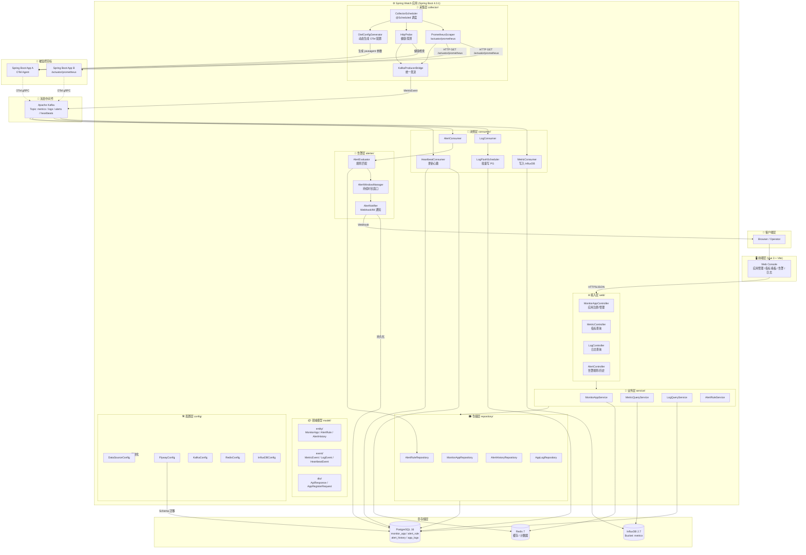
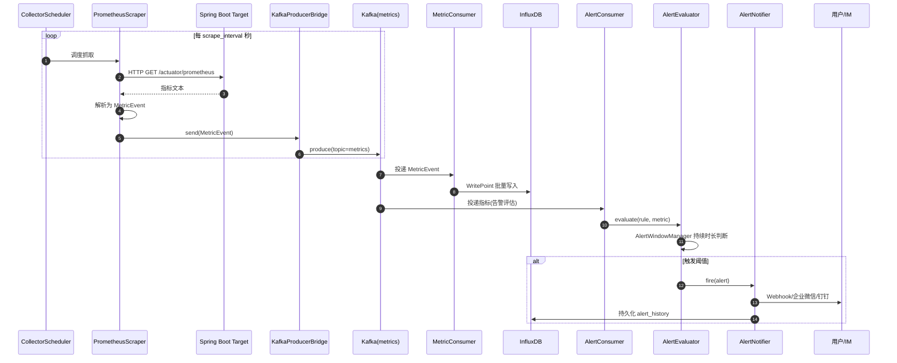
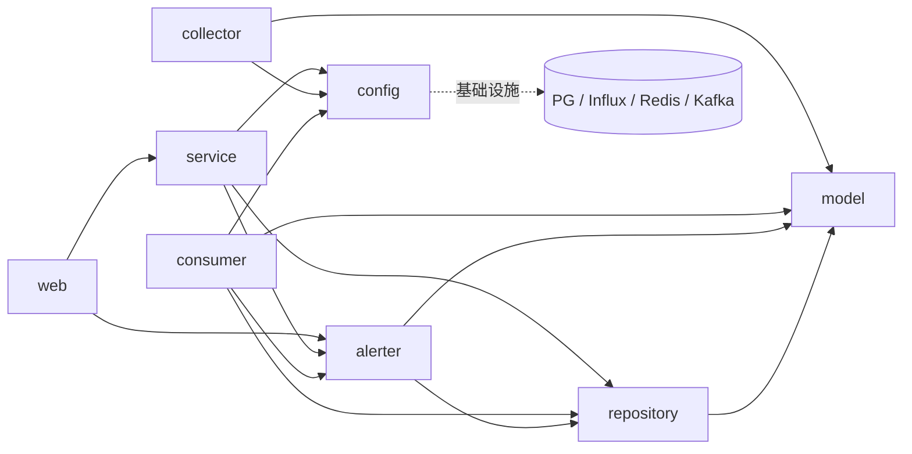
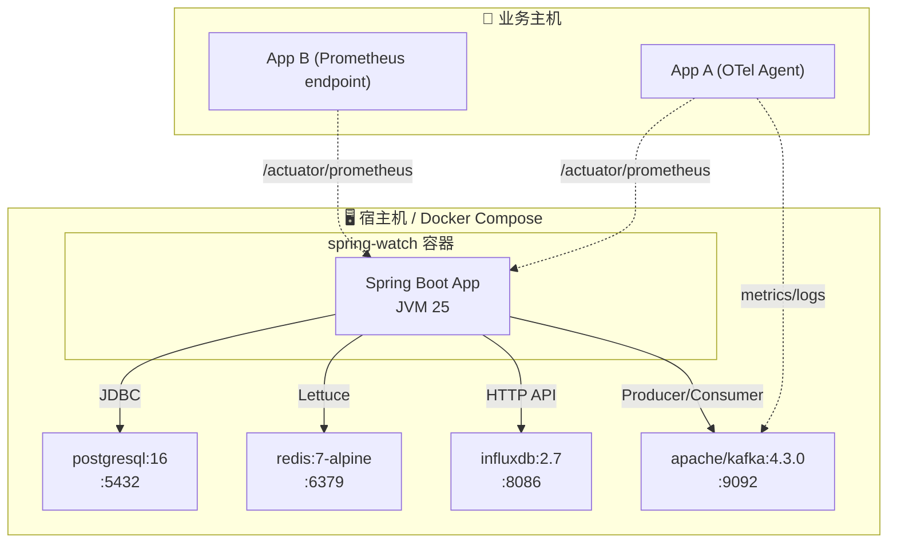

# Spring Watch 平台架构图

> 基于当前代码库（Spring Boot 4.0.1 + Java 25）的真实实现绘制  
> 包结构: `com.springwatch.{web, service, collector, consumer, alerter, config, model, repository}`

---

## 1. 总体架构图（全景视图）

---

## 2. 数据流时序图（指标采集 → 告警通知）

---

## 3. 模块依赖关系图（包级）

---

## 4. 部署拓扑图

---

## 5. 关键设计要点

| 模块 | 职责 | 关键技术 |
|------|------|----------|
| **web/** | REST API 接入 | Spring MVC, Validation, ApiResponse 统一封装 |
| **service/** | 业务编排、缓存、查询 | Spring Data JPA, Redis Cache, InfluxDB Query |
| **collector/** | 主动采集 + 推送 | `@Scheduled`, WebClient, KafkaTemplate |
| **consumer/** | 异步消费 + 批量落库 | `@KafkaListener`, JPA Batch Insert, Influx WritePoint |
| **alerter/** | 规则匹配、窗口抑制、通知 | 表达式解析, 持续时长窗口, Webhook |
| **config/** | 基础设施装配 | DataSource, Kafka, Redis, InfluxDB, Flyway |
| **model/** | 领域对象 | JPA Entity, Event(DTO), Request/Response DTO |
| **repository/** | 数据访问 | Spring Data JPA Repository |
