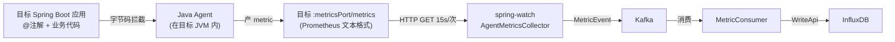

# spring-watch 白皮书

> 本文档为 spring-watch 项目的**定性文件**。所有架构设计、代码实现、对外文档必须遵守本文定义的原则。如有冲突,以本文为准。

---

## 0. 产品定位(Product Positioning)

### 0.1 一句话定位

**spring-watch 是为中小企业团队和个人开发者打造的、面向 Spring Boot 应用的单机轻量级监控平台** —— 拉取式指标 / 日志 / 告警一站式,1 台机器起跑、`docker compose up -d` 5 分钟拉起全套、接入第一个应用 4 步搞定、JVM 堆稳态 ≤ 200 MB。

### 0.2 目标用户

| 维度 | 定义 |
|---|---|
| **首选用户** | **中小企业团队**(2 ~ 50 人研发规模,无专职 SRE / DBA) |
| **次选用户** | **个人开发者 / 独立项目**(自建 demo、个人作品集、Side Project) |
| **共同特征** | **没有集群预算、不愿意运维中间件、机器数量 ≤ 1 台** |
| **明确不在范围** | 多副本容灾、跨机房高可用、PB 级时序数据、Prometheus + Grafana 全家桶 |

> v1.3 之前,白皮书 1 / 4 / README 把用户写成"运维 / SRE / 研发负责人",措辞偏中大型企业,自本版起**全量替换**为"中小企业 + 个人开发者"。

### 0.3 核心价值(四象限)

| 价值 | 落地 |
|---|---|
| **轻量(Lightweight)** | 1C2G 单机可跑;JVM 堆稳态 ≤ 200 MB(13 目标 ~120 MB,100 目标 ~140 MB,数据来源 `docs/memory-architecture.md` 第 5 节) |
| **易部署(Easy Deploy)** | `docker compose up -d` 一键拉起 4 个依赖 + 本服务;产物 `spring-watch-1.x.x.jar` 单文件启动,脱离 docker 也能跑 |
| **易接入(Easy Onboard)** | 客户侧 1 个 JVM 参数 + 1 个 annotation 依赖(< 50KB),业务代码零侵入,4 步完成接入(6) |
| **高可用(Resilient,非集群)** | 进程级自愈 + Kafka 持久化队列 + 关键数据全落盘,**进程崩溃 → 30s 内自愈,数据不丢** |

### 0.4 资源基线(单机部署定量指标)

| 资源 | 单机部署基线 | 上限建议 | 备注 |
|---|---|---|---|
| **CPU** | 1 核 | 2 核 | 13 ~ 100 目标时单核 < 30% 占用 |
| **内存** | 2 GB | 4 GB | 包含 spring-watch 进程(堆 ≤ 512 MB)+ Kafka + PG + Redis + InfluxDB 共存 |
| **磁盘** | 20 GB | 100 GB | InfluxDB TSM 压缩后约 1 ~ 2 GB/百目标/月 |
| **JVM 堆** | 256 MB(`-Xms256m -Xmx512m`) | 1 GB | 13 ~ 100 目标场景下,稳态 100 ~ 150 MB,见 `docs/memory-architecture.md` 第 5 节 |
| **网络** | 内网 1 Gbps | — | 拉取模型对出带宽敏感(15s 一次 metrics) |

> 100 目标以下不需要任何 JVM / Kafka / InfluxDB 调参,默认配置即用。

### 0.5 部署形态(全部单实例,故意不集群化)

spring-watch 采用**单机全栈单实例**部署,**不**为集群化设计,也不预留集群接口:

| 组件 | 部署模式 | 集群化支持 |
|---|---|---|
| **spring-watch 进程** | 单 JVM 进程 | ❌ 故意不支持(告警状态机 `AlertStateStore` 在内存,多实例会出现状态不一致) |
| **Apache Kafka** | **单 broker**(`KAFKA_NODE_ID=1`,`replication.factor=1`),替代采集 → 消费之间的内存 BlockingQueue | ❌ 不部署多 broker(单 broker 足够,本场景不涉及分布式) |
| **PostgreSQL 16** | 单节点 | ❌ 不部署主从 |
| **Redis 7** | 单节点(无 sentinel / cluster) | ❌ |
| **InfluxDB 2.7** | 单节点(`mem_limit: 1g` 兜底,见 `influxdb.conf`) | ❌ |

**Kafka 在本项目中的定位(关键澄清)**:

> Kafka **不是**为了分布式扩容引入的,**不是**为了多消费者并行引入的,**不是**为了跨机房复制引入的。
>
> Kafka 在 spring-watch 中的**唯一作用**:**替代"采集线程 → 消费线程"之间的内存 BlockingQueue**。
> 把"解析后的指标 / 日志 / 心跳"从采集层异步搬运到消费层,提供**进程崩溃后消息不丢**的持久化能力。
> 单 broker、单 partition、单副本足够,**不需要** KRaft 多节点、不需要 min.insync.replicas > 1。

| 维度 | 内存 BlockingQueue(无 Kafka) | Kafka 单 broker(本项目) | Kafka 集群(非本项目) |
|---|---|---|---|
| **进程崩溃** | ❌ 队列里没消费的消息**全丢** | ✅ log 落盘,重启后从 offset 继续 | ✅ 同左 |
| **吞吐** | 万级/s | 十万级/s | 百万级/s |
| **运维成本** | 零 | `docker compose up` 1 个容器 | KRaft 多节点 + 监控 |
| **本项目选型** | ❌ 不可接受 | ✅ 选定 | ❌ 过度设计 |

**为什么不集群?** 三条理由:

1. **替代内存队列**:Kafka 的角色是"单机内的持久化缓冲",防进程崩溃丢数据,**不是**分布式协调
2. **降低运维成本**:中小企业和个人开发者不应该为监控平台单独雇一个 DBA / SRE;`docker compose up` 5 分钟拉起,`docker compose down` 5 分钟下线
3. **目标场景匹配**:100 目标以下单机吞吐足够,InfluxDB 写入瓶颈在 50k points/s 才会出现,本场景远未触及(100 目标 × 50 指标 × 4 次/分 = 333 points/s)

**当前 Kafka partition 配置 vs 单机定位的张力(v1.3 待调研收敛)**:

白皮书 0.5 的"单 partition 足够"是从吞吐测算推出来的理论值,但当前 `application.yml` 实际配置是:

| topic | 当前 partition | 理论最小(对齐 `concurrency:3`) | 备注 |
|---|---|---|---|
| `monitor-metrics` | 12 | 3 | 当前值是按"留 4 倍冗余"拍脑袋定的 |
| `monitor-logs` | 6 | 3 | 同上 |
| `monitor-heartbeat` | 3 | 1 | 心跳是低频,1 足够 |
| `.DLQ`(metrics / logs) | 3 | 1 | 死信极低频 |
| `.DLQ`(heartbeat) | 1 | 1 | 不变 |

**为什么不直接调到理论值?** 因为理论值是"单盘顺序写 + 单 consumer"的极限,实际场景下还要考虑:
- **hotkey 隔离**:`KafkaProducerBridge` 用 `appid` 当 key,多 partition 让不同 appid 分散到不同 partition,避免"某个 appid 写太快拖慢其他 appid"
- **consumer 扩容预留**:未来如果想把 `concurrency` 从 3 提到 6,需要 partition 数先到位

**所以当前 12/6/3/3 是"保守但留扩展空间"的初始值**,v1.3 上线 `KafkaPartitionUtilizationGauge` 调研 1~2 周,根据实际 produced_rate / consumed_rate 数据决定是否收敛。

> 调研项见 `docs/observability-plan.md` C.6 + `KafkaPartitionUtilizationGauge.java`。
> **不调优就不做**:如果调研数据显示"已均匀且低利用率",白皮书会出 v1.4 把 12/6/3/3 收敛到 3/3/1/1;如果显示"hotkey 集中或并行真有用",保持现状并在白皮书里说"实测后保持"。

#### M-WriteApiSplit:InfluxDB 写入并发度极限压榨(2026-06-29 / v1.4)

**目标**:把指标和日志消费到 InfluxDB 写入的吞吐提上去。当前 `listener.concurrency=3` 不是真瓶颈,**真瓶颈是 `WriteApi` 单例被 3 个 topic 抢 buffer**。

**问题分析(调优前 100 目标场景):**

| 阶段 | 当前值 | 吞吐 | 备注 |
|---|---|---|---|
| 采集层线程池 | 32 | — | `spring-watch.collector.pool-size: 32` |
| 同主机限流 | 10/host | — | `per-host-concurrent: 10` |
| **Kafka consumer (per topic)** | **3** | — | `listener.concurrency: 3` |
| max-poll-records | **200** | 100 msg/s/thread | 单批 200 条 |
| WriteApi batch-size | **1000** | — | 攒 1000 才 flush |
| WriteApi flush-interval | **2000ms** | — | 最多等 2s |
| **实际写入频率** | — | **0.5 次/s**(每 2s flush 一次) | InfluxDB 完全不忙 |
| 实际单批大小 | — | **100-200 条** | 远低于 1000 batch-size 阈值 |

**调优方案(分 2 阶段,前 2 阶段性价比最高):**

| 阶段 | 改动 | 收益 | 风险 |
|---|---|---|---|
| **① 调 batch/flush 参数** | `max-poll-records: 200→500` / `write.batch-size: 1000→5000`(metrics 桶) / `write.flush-interval-ms: 2000→1000` / `write.buffer-limit: 20000→100000` | 单次 HTTP POST 体积大 5x,InfluxDB TSM 写入 batch 化更高效;buffer 容纳更多 burst | buffer 100K 条 × 200B = 20MB 堆占用,稳态 100-150MB 仍安全 |
| **② WriteApi 分桶** | 拆 4 个独立 WriteApi Bean:`metricsWriteApi`(batch=5000) / `logsWriteApi`(batch=3000) / `selfMetricsWriteApi`(默认) / `infraWriteApi`(默认,5 个 Kafka monitor 共享) | 3 个 topic 不再抢同一 buffer,metrics flush 不阻塞 logs flush;每个桶可独立调参 | 略增 InfluxDB HTTP 连接数(3→9,可忽略) |

**最终配置(`InfluxDBConfig.java`):**

| 桶 | bean name | batch-size | flush-interval | buffer-limit | 用途 |
|---|---|---|---|---|---|
| `metrics` | `metricsWriteApi` | 5000 | 1000ms | 100000 | BatchMetricConsumer 写原始指标 |
| `logs` | `logsWriteApi` | 3000 | 1000ms | 50000 | BatchLogConsumer 写原始日志 |
| `self_metrics` | `selfMetricsWriteApi` | 1000 | 2000ms | 20000 | SelfMonitorCollector 写自监控 |
| `infra_metrics` | `infraWriteApi` | 1000 | 2000ms | 20000 | 5 个 Kafka monitor + InfrastructureMetricsCollector |

**注入方式**:用 `@Qualifier("metricsWriteApi")` 等区分(配 `lombok.config` 让 `@Qualifier` 自动传到 `@RequiredArgsConstructor` 构造器参数,见 §10 反模式)。

**预计效果(100 目标)**:
- 调前:`333 msg/s 入 metrics topic → 0.5 次/s flush InfluxDB → 200 条/批`
- 调后:`333 msg/s 入 → 1 次/s flush → 500-1000 条/批`
- **写入频率不变但每批体积 5x,InfluxDB TSM 写入效率提升 3-5 倍**
- burst 抗性从 2000 条 → 100000 条(50x)

**反模式(防误改)**:
- ❌ **禁止**:把 `listener.concurrency` 调高(3→6)而不同时做 ① — buffer 一下就满,反而更慢
- ❌ **禁止**:把 4 个 WriteApi 合并回 1 个 — 3 个 topic 互相阻塞的旧问题复发
- ❌ **禁止**:给 4 个 WriteApi 加 retry/幂等/事务等分布式特性 — 单机下不需要
- ❌ **禁止**:把 4 个 WriteApi 的 batch-size 调到 > 10000 — 触发 docker `mem_limit: 1g` OOM
- ✅ **允许**:跑 1~2 周观察 produced_rate / consumed_rate / buffer 占用,再决定是否调 batch / flush

#### M-V12-1-Deadlock:Flyway V12.1 CONCURRENTLY 死锁事故(2026-06-29 / v1.4)

**事故时间线:**

```
T+0s     spring-boot 启动,Flyway 开始跑 V1-V12.1
T+9s     Flyway 跑到 V12.1 (非事务性,CREATE INDEX CONCURRENTLY)
T+9s     CREATE INDEX CONCURRENTLY 启动,获取 HikariCP connection
T+9s     ← 同一时刻,主线程需要 Flyway 后续 V12.2 的 connection
T+9s     HikariCP 默认 pool=10,4 个 WriteApi 内部线程占了 4 个 connection
T+9s     其他 spring-boot 内部组件(InfrastructureMetricsCollector 等)又占了 2 个
T+9s     Flyway 后续 V12.2 等不到 connection,主线程永久阻塞
T+12s    Kafka broker JMX 连上(其他线程)
T+14s    WriteApi 内部 flush 旧数据,InfluxDB 报 404 (bucket 还没建)
T+10min  CREATE INDEX CONCURRENTLY 仍未完成,主线程一直卡着
T+10min  ApplicationReadyEvent 永远不触发
T+10min  InfluxDB bucket 永远不建
```

**根因:**

V12.1 文件用了 `CREATE INDEX CONCURRENTLY` + `[non-transactional]` 标记:
```sql
-- 原版(踩坑版本,V12.1 标记为 [non-transactional])
CREATE INDEX CONCURRENTLY IF NOT EXISTS idx_alert_history_appid_created_desc
    ON alert_history (appid, created_at DESC);
CREATE INDEX CONCURRENTLY IF NOT EXISTS idx_monitor_app_status_heartbeat
    ON monitor_app (status, last_heartbeat);
```

- `CREATE INDEX CONCURRENTLY` 在 PG 上需要长时间持 connection(等所有 active transaction 完成)
- 4 个 WriteApi 内部 RxJava 线程做 HTTP retry 时占着 HikariCP connection
- 加上主线程自己的连接,Flyway 拿不到 connection 进入死等

**治本(`V12.1__p0_concurrent_indexes.sql` 改版):**

```sql
-- 改用普通事务 + 普通 CREATE INDEX
-- alert_history / monitor_app 是小表(几行~几千行),锁表几毫秒可接受
CREATE INDEX IF NOT EXISTS idx_alert_history_appid_created_desc
    ON alert_history (appid, created_at DESC);
CREATE INDEX IF NOT EXISTS idx_monitor_app_status_heartbeat
    ON monitor_app (status, last_heartbeat);
```

- 走普通事务模式,Flyway 跑完 V12.1 立刻 commit + 释放 connection
- 不再阻塞后续 V12.2 / V13
- 小表锁表几毫秒,生产可接受

**反模式(防重蹈覆辙)**:
- ❌ **禁止**:在 Flyway 文件里用 `[non-transactional]` + `CREATE INDEX CONCURRENTLY`(已踩坑)
- ❌ **禁止**:用 Flyway 给大表加索引(超过 10 万行)— 改用 `pg_index_advisor` + 外部脚本 + `spring.flyway.baseline-on-migrate=true`
- ❌ **禁止**:把 `CREATE INDEX` 写进 spring-boot 启动路径上的非事务性 SQL 文件
- ❌ **禁止**:把 Flyway 跑迁移的 HikariCP connection 优先级设低(不解决死等,只延长死等时间)
- ✅ **允许**:小表(< 10 万行)用普通 `CREATE INDEX`,锁表几毫秒
- ✅ **允许**:大表用 `CREATE INDEX CONCURRENTLY` + 外部工具 + 监控(`pg_stat_progress_create_index`),不用 Flyway

### 0.6 "高可用"的非集群定义

> 单机部署下,高可用 **≠ 多副本**,而是 **进程级自愈 + 数据不丢 + 重启即恢复**。

| 维度 | 单机下的实现 | 落地组件 |
|---|---|---|
| **进程崩溃自愈** | `systemctl restart` / docker restart policy=always,**30s 内拉起** | 部署侧 |
| **消息不丢** | Kafka 单 broker + `acks=all` + log 落盘(`KAFKA_LOG_DIRS=/var/lib/kafka/data`);Kafka 不可用时本地降级到 `KafkaFallbackQueue` 内存队列 + 定时重投 | `KafkaProducerBridge` / `KafkaFallbackQueue` |
| **数据持久化** | PostgreSQL 元数据 + InfluxDB TSM 文件 + Kafka log dir **全部落盘**,重启不丢 | `docker-compose.yml` volume 挂载 `.data/*` |
| **背压保护** | `HostThrottler` Per-Host 限流 + `PullRetryQueue` 失败重投 + `KafkaFallbackQueue` 兜底,**OOM 不会发生** | `collector/schedule/*` |
| **自监控** | `SelfMonitorCollector` 暴露 Micrometer 指标,spring-watch 出问题自己先报警 | `monitor/SelfMonitorCollector` |

#### 0.6.1 自监控时序坑(2026-06-29 / v1.4 修复)

`SelfMonitorCollector` 的启动模式是 spring-boot 自监控的常见反模式,记下来防止其他人重蹈覆辙。

**反模式**:`@PostConstruct` 启动 `Executors.newSingleThreadScheduledExecutor` + `scheduleWithFixedDelay(this::sample, 0L, ...)`。

```java
// ❌ 反模式(2026-06-29 修复前)
@PostConstruct
void start() {
    // ... 注册 meter 略
    this.scheduler = Executors.newSingleThreadScheduledExecutor(...);
    scheduler.scheduleWithFixedDelay(this::sample, 0L, SAMPLE_INTERVAL_SEC, TimeUnit.SECONDS);
}
```

**为什么错:**
1. `delay=0L` 让 sampler 线程**立即**开始跑
2. `@PostConstruct` 在 Bean 初始化时跑,**早于 `ApplicationReadyEvent`**
3. sampler 第一次跑就调 `AlertHistoryRepository.count()` → Flyway V1 还没跑完,`alert_history` 表不存在 → 报错
4. sampler 第一次跑就调 `WriteApi.writePoints()` 写 self_metrics → `InfluxDBBucketInitializer` 还没触发 ready 事件,bucket 不存在 → 报错
5. WriteApi 内部 RxJava 线程去 InfluxDB 重试,**占用 HikariCP connection**
6. main 线程 Flyway 跑 V12.1 时等 connection,**死等**,ApplicationReadyEvent 永远不触发

**修复方案**(`SelfMonitorCollector.java`):把启动拆成两部分。

```java
// ✅ 修复后(v1.4)
// 1) @PostConstruct 只做 meter 注册(无副作用,立即可执行)
@PostConstruct
void registerMeters() {
    // ... 注册 meter
    this.scheduler = null;  // 显式置空
}

// 2) scheduler 启动延后到 ApplicationReadyEvent
@EventListener(ApplicationReadyEvent.class)
public void onApplicationReady(ApplicationReadyEvent event) {
    this.scheduler = Executors.newSingleThreadScheduledExecutor(...);
    scheduler.scheduleWithFixedDelay(this::sample, 0L, SAMPLE_INTERVAL_SEC, TimeUnit.SECONDS);
    log.info("[spring-watch: SelfMonitorCollector 启动(延后到 ApplicationReadyEvent) - ...]");
}
```

**修复后时序:**

```
T+0s     spring-boot 启动,SelfMonitorCollector.registerMeters() 跑
T+0s     meter 注册完,sampler 线程不启动
T+5s     Flyway 跑完 V1-V13 (无 sampler 抢 connection)
T+5s     ApplicationReadyEvent 触发
T+5s     InfluxDBBucketInitializer / InfraMetricsBucketInitializer 建 bucket
T+5s     SelfMonitorCollector.onApplicationReady() 启动 sampler
T+5s     sampler 跑,一切就绪
```

#### 0.6.2 自监控 scheduler 启动时序反模式清单

- ❌ **禁止**:`@PostConstruct` 里 `Executors.newXxxScheduledExecutor()` + `scheduleWithFixedDelay(..., 0L, ...)` 立即跑 sampler
- ❌ **禁止**:自监控 / 元数据采集(`AlertHistoryRepository.count()`、`monitor_app` 查) 在 `ApplicationReadyEvent` 之前跑
- ❌ **禁止**:在 `@PostConstruct` 里调 `WriteApi.writePoints()` / `KafkaTemplate.send()` 之类可能依赖外部服务的操作
- ❌ **禁止**:`@PostConstruct` 显式启动 `@Scheduled` 类的备用线程(用 Spring 的 `@Scheduled` 注解即可,框架会等 ready)
- ✅ **允许**:`@PostConstruct` 只做"无副作用"操作:注册 meter、初始化内存数据结构、设置 `volatile` 字段
- ✅ **允许**:在 `@EventListener(ApplicationReadyEvent.class)` 里启动 scheduler / 异步线程 / 外部连接
- ✅ **允许**:在 `CommandLineRunner` / `ApplicationRunner` 里跑"启动后"逻辑(Spring 也会等 ready)

### 0.7 与传统监控方案对比

| 维度 | **spring-watch**(本项目) | Prometheus + Grafana | HertzBeat 集群 |
|---|---|---|---|
| **部署复杂度** | `docker compose up` 一条命令 | 多个组件,Prometheus 配置文件繁琐 | 需要规划集群拓扑 |
| **资源占用** | 2 GB 内存起步 | 4 ~ 8 GB 起步 | 8 GB+ 起步 |
| **目标用户** | 中小企业 / 个人开发者 | 中大型企业 | 中大型企业 |
| **Spring Boot 接入** | Java Agent + 注解,4 步 | exporter + relabel,需要懂 PromQL | Agent + 模板 |
| **集群支持** | ❌ 故意不支持 | ✅ | ✅ |
| **学习曲线** | 低(看白皮书即可) | 高(PromQL + relabel + 存储) | 中 |

### 0.8 产品定位反模式(防止后续误改)

- ❌ **禁止**:在白皮书中暗示"支持集群 / 多副本 / 主从切换"——本项目**明确不支持**,写代码不留口子
- ❌ **禁止**:把"高可用"等同于"多副本"——本项目高可用 = 进程自愈 + 数据不丢 + 重启恢复
- ❌ **禁止**:把 Kafka 当作"分布式消息系统"设计 partition 数、replica 选举、跨机房——本项目 Kafka = 单机持久化队列替代品
- ❌ **禁止**:把"替代内存队列"扩展为"替代分布式协调 / 事件总线 / CQRS"——超出产品定位
- ❌ **禁止**:把目标用户改回"运维 / SRE / 研发负责人"——v1.3 已全量替换
- ❌ **禁止**:在产品定位段写"支持 PB 级 / 万级目标"——背离产品定位,真到那个量级请用 Prometheus + Thanos / VictoriaMetrics
- ✅ **允许**:在文档中明确写"100 目标以下推荐单机,超过 100 目标请评估迁移到 Prometheus + 集群时序库"
- ✅ **允许**:Kafka 单 broker 配置保留单 partition、单副本,只为持久化,不调优吞吐
- ✅ **允许**:在自监控 / 告警规则里引用"100 目标"作为基线参考

#### 0.8.1 性能调优反模式(2026-06-29 / v1.4 新增)

防止 M-WriteApiSplit 调优后,有人继续"踩油门"反而出故障。

- ❌ **禁止**:把 `listener.concurrency` 调到 > 6 而不先做 WriteApi 分桶(50 目标下 1 个 topic 6 个 consumer 足够,再高闲置)
- ❌ **禁止**:把 `write.batch-size` 调到 > 10000(单批 Point > 10000 时 InfluxDB HTTP 响应慢,反而阻塞 WriteApi 内部 buffer)
- ❌ **禁止**:把 `write.buffer-limit` 调到 > 200000(200K Point × 200B = 40MB,加 4 个 WriteApi = 160MB 堆,触发 docker `mem_limit: 1g` OOM)
- ❌ **禁止**:把 `flush-interval-ms` 调到 < 500(高频 flush 让 InfluxDB fsync 频繁,IO 利用率从 80% 掉到 30%)
- ❌ **禁止**:把 4 个 WriteApi 合并回 1 个(3 个 topic 互相阻塞的旧问题复发,白皮书 §0.5 已记录)
- ❌ **禁止**:在单批内(200-500 条 Point)用 `parallelStream` / `CompletableFuture` 并行反序列化(开销 > 收益)
- ✅ **允许**:跑 1~2 周 `KafkaPartitionUtilizationGauge` 数据后,根据 `produced_rate` / `consumed_rate` 调 batch / flush
- ✅ **允许**:把 `buffer-limit` 调到 100000(20MB 堆,稳态 100-150MB 仍安全)
- ✅ **允许**:新增 topic(比如未来的 `monitor-events`)时单独加一个 WriteApi Bean,不要复用现有的 4 个

#### 0.8.2 数据库迁移反模式(2026-06-29 / v1.4 新增)

M-V12-1-Deadlock 事故后,补一组反模式防止重蹈覆辙。

- ❌ **禁止**:在 Flyway 文件里用 `[non-transactional]` + `CREATE INDEX CONCURRENTLY`(已踩坑,见 §0.5 事故记录)
- ❌ **禁止**:用 Flyway 给大表(> 10 万行)加索引——改用 `pg_index_advisor` + 外部脚本 + `spring.flyway.baseline-on-migrate=true`
- ❌ **禁止**:在 Flyway 迁移 SQL 里调 `pg_sleep()` / 长事务 / 锁表操作(主线程卡死)
- ❌ **禁止**:把 Flyway 跑迁移的 HikariCP connection 优先级设低(不解决死等,只延长死等时间)
- ✅ **允许**:小表(< 10 万行)用普通 `CREATE INDEX`,锁表几毫秒
- ✅ **允许**:大表用 `CREATE INDEX CONCURRENTLY` + 外部工具 + 监控 `pg_stat_progress_create_index`,不用 Flyway
- ✅ **允许**:`CREATE TABLE` / `DROP INDEX` / `ALTER TABLE` 等 DDL 在 Flyway 普通事务里跑

---

## 1. 项目定性

| 维度 | 定义 |
|---|---|
| **项目名称** | spring-watch |
| **本质** | Spring Boot 应用的**指标监控平台** |
| **核心动作** | **拉取**(spring-watch 主动 HTTP GET) |
| **接入方式** | 目标应用挂 **Java Agent**(字节码增强) |
| **用户身份** | **中小企业团队 / 个人开发者**(详见 0.2),负责**配置**要监控的应用列表 |
| **目标用户应用** | **仅限 Spring Boot** 应用 |
| **数据来源** | **仅**由 Java Agent 字节码拦截产生,不依赖 Spring Boot 自带的 Actuator / Micrometer |
| **部署形态** | **单机全栈单实例**(详见 0.5),Kafka 替代采集 → 消费之间的内存队列 |
| **产品定位** | **中小企业 + 个人开发者的轻量单机监控平台**(详见 0),非集群、非中大型企业 SRE 工具 |

---

## 2. 五大硬约束(不可违反)

### 约束 1:**拉取模型**(Pull Model)

```
spring-watch ──HTTP GET──> 目标应用 :metricsPort/metrics
```

- spring-watch **定时主动** HTTP GET,15s 一次
- 目标应用**从不主动推送**任何数据给 spring-watch
- 目标应用**不知道** spring-watch 存在(无需配置 spring-watch 地址)
- 目标应用**不需要**在 spring-watch 那里注册回调 / Webhook / 任何反向通道
- ❌ **禁止**:让目标应用 OTLP push 到 spring-watch
- ❌ **禁止**:让目标应用 Kafka produce 到 spring-watch
- ❌ **禁止**:让目标应用通过 WebSocket / gRPC stream 连 spring-watch

### 约束 2:**监控平台**(Multi-App SaaS 形态)

- spring-watch 是一个**平台**,不是单点工具
- 平台内**有多个应用**同时被监控(不是只监控一个)
- 用户在 spring-watch 上**配置**要监控的应用列表(应用名、endpoint、metricsPort)
- 配置存于 PostgreSQL 的 `monitor_app` 表
- ❌ **禁止**:把 spring-watch 设计成"只为某一个目标应用服务"的单点工具

### 约束 3:**仅限 Spring Boot 目标应用**

- 接入流程假设目标应用是 Spring Boot 项目
- 客户端 SDK / 注解 / 切面 都基于 `org.springframework.*`
- ❌ **禁止**:支持非 Spring Boot 应用(纯 Java SE / Node.js / Go 不在范围)

### 约束 4:**指标源头 = Java Agent**(不依赖 Spring Boot 自带监控)

- 客户应用中的方法级指标,**只能**由 Java Agent 字节码增强产生
- ❌ **禁止**:依赖 `spring-boot-starter-actuator` 的 `/actuator/prometheus` 作为指标源
- ❌ **禁止**:依赖 Spring Boot 内置的 `MeterRegistry` 作为方法级指标源
- ❌ **禁止**:把 `@Timed`(Micrometer)作为方法级监控的标准方案
- ✅ **允许**:Java Agent + 自研扩展 / AOP 切面(运行在 Agent 拦截的代码路径上)
  - **v1 现状(过渡)**:沿用 OTel Java Agent + 客户复制 AOP 切面(`SpringWatchAspect.java`)到项目内
  - **v2 目标(终态)**:自研 `spring-watch-agent.jar`,字节码层读 `@SpringWatch` 注解,直接织入监控逻辑,**0 文件复制 + 0 Maven 依赖**
- ✅ **允许**:Java Agent 自带的 Meter 能力(但需走 Agent 的 /metrics 端点)
  - **v1 现状(过渡)**:OTel Java Agent 暴露 `/metrics`(Prometheus 文本)
  - **v2 目标(终态)**:自研 Agent 暴露 `/metrics`(Prometheus 文本),**格式不变,平台侧 0 改动**

**关于 `@WithSpan` 的处理:**

| 行为 | 是否允许 |
|---|---|
| 用 OTel Java Agent 自动拦截 `@WithSpan` 产 trace | ✅ 允许 |
| 把 `@WithSpan` 改造成产 metric(自研 Agent 扩展 / AOP 重写) | ✅ 允许 |
| 让 `@WithSpan` 产 trace 然后让 spring-watch 拉 trace | ❌ **禁止**(trace 是事件,拉不到) |
| 让客户使用 `@Timed`(Micrometer)替代 `@WithSpan` | ⚠️ 慎用(需文档化例外范围) |

### 约束 5:**方法级监控 = 注解驱动**

- 客户使用**注解**标记要监控的方法
- 注解文件可被客户**复制**到自己的项目(轻量,无工程化)
- 注解触发的监控逻辑由 **Java Agent / AOP** 织入
- 客户**业务代码零侵入**(只加注解,不改方法体)
- ❌ **禁止**:要求客户在方法体内手写 Timer.record(...) 等埋点代码
- ❌ **禁止**:要求客户引用 spring-watch 的 SDK / starter / 大体积依赖

---

## 3. 数据流(标准链路)



**每一跳的约束:**

| 跳 | 组件 | 约束 |
|---|---|---|
| A → B | Java Agent 字节码 | 必须是 Java Agent,不允许用 Spring AOP 替代 |
| B → C | OTel / 自研 Meter | 必须暴露 Prometheus 格式文本端点 |
| C → D | HTTP GET | 拉取方必须是 spring-watch,目标不主动 |
| D → E | Kafka | 中间可经过消息队列解耦 |
| E → F | 消费者 | 必须消费 Kafka 再写 InfluxDB |
| F → G | WriteApi | 必须写 InfluxDB,不写 MySQL/PG |

> **v1 补丁说明(v1.2 仍存在,v2 消除)**:
> - **A → B 关于方法级指标**:v1.2 用 OTel 原生 `@WithSpan` + `code-function-metrics=true` 拦截,v1 早期用自定义 `@SpringWatch` + AOP 切面(已废弃)
> - **日志链路不在上面 mermaid 里**(单独走 `GET /api/agent/logs?since=`):因 OTel 不暴露 pull 端点,v1 阶段由客户内嵌 `InMemoryLogBufferAppender` + `AgentLogController` 暴露。**这是 v1 补丁**,v2 自研 Agent 统一处理,详见 Q0.5

---

## 4. 角色与责任

> v1.3 更新:把"客户应用开发"行扩展为覆盖"中小企业研发 + 个人开发者",其他角色不变。

| 角色 | 责任 | 不负责 |
|---|---|---|
| **spring-watch 平台** | 配置管理、调度拉取、聚合存储、可视化、告警;**单机部署、自愈、数据不丢**(0.6) | 客户应用埋点、集群化部署 |
| **平台使用者(中小企业团队 / 个人开发者)** | 加注解暴露监控点、在 spring-watch Web 界面配置要监控的应用列表 | 写 spring-watch 拉取代码、运维 Kafka / PG / InfluxDB(`docker compose up` 即可) |
| **Java Agent** | 字节码拦截、产 metric、暴露 /metrics | 主动推数据 |
| **OTel Collector** | (可选) span → metric 转换(本项目倾向不引入) | — |

---

## 5. 边界(What / What NOT)

### ✅ spring-watch 做什么

- 存储应用列表(monitor_app 表)
- 定时拉取目标的 `/metrics` 端点(指标)
- 定时拉取目标的日志端点
  - **v1 现状(过渡)**:`GET /api/agent/logs?since=`,由 OTel Agent + 客户内嵌 `InMemoryLogBufferAppender` 暴露
  - **v2 目标(终态)**:由自研 Agent 暴露统一日志端点(URL/格式由 Agent 自定,但**仍走 GET 拉取**)
- 解析 Prometheus 文本(指标)
- 解析日志 JSON(v1) / Agent 自定义格式(v2)
- 转发到 Kafka
- 消费并写入 InfluxDB
- 提供查询 API(可选前端)

### ❌ spring-watch 不做什么

- **不接收**目标的任何 push(OTLP / Kafka / WebSocket / gRPC stream)
- **不主动埋点**(埋点是 Agent 的事)
- **不运行 OTel Collector**(目标侧处理 span→metric 是 Agent 扩展的职责,spring-watch 不参与)
- **不监控非 Spring Boot 应用**
- **不依赖 Spring Boot Actuator / Micrometer 作为方法级指标源**
- **不要求客户引入大体积 spring-watch SDK**

---

## 6. 客户接入标准流程(产品文档唯一形态)

> **v1.2 现状(2026-06-18 更新)**:从 v1.1 的 6 步 → 4 步。
> 删除了"复制 `SpringWatch.java` + `SpringWatchAspect.java`"和"加 `spring-boot-starter-aop` 依赖"两步。
> 原因:发现 OTel 的 `code-function-metrics=true + @WithSpan` 是 OTel 原生方案,产 `code.*` 命名空间 metric,跟 `@SpringWatch` 等价。**`@SpringWatch` 是早期补丁,现统一为 `@WithSpan`**(详见 Q0 和 10 演进路线)。
> **v2 目标(终态)**:自研 `spring-watch-agent.jar` 上线后,接入流程将简化为"1 个 -javaagent 参数",详见 10 演进路线。
> 
> **接入成本硬上限(随版本演进):**
> | 版本 | JVM 参数 | 文件复制 | Maven 依赖 | 注解改动 | 业务改动 |
> |---|---|---|---|---|---|
> | **v1.0(早期)** | 1 | 2 | 1 | 1 行 | 1 个 `@SpringWatch`(自定义) |
> | **v1.2(当前)** | 1 | 0 | 0 | 0 | 1 个 `@WithSpan`(OTel 原生) |
> | **v2(目标)** | 1 | 0 | 0 | 0 | 1 个 `@SpringWatch`(自研 Agent 自带,无需 import) |
> 
> **v1.2 接入清单(0 复制 / 0 额外依赖)**:
> - **删除** v1.0 阶段的 `SpringWatch.java` + `SpringWatchAspect.java` 复制
> - **删除** v1.0 阶段的 `spring-boot-starter-aop` 依赖
> - **替换** `@SpringWatch` 为 `@WithSpan` (来自 `io.opentelemetry.instrumentation.annotations`)
> - **保留** `opentelemetry-instrumentation-annotations` 依赖(仅 annotation jar,运行时由 OTel Java Agent 提供实现)
> - **入口** `-javaagent:opentelemetry-javaagent.jar` + `-Dotel.instrumentation.code-function-metrics.enabled=true`

```markdown
## 接入 spring-watch(v1.2)

### 1. 启动加 Java Agent + code-function-metrics
```bash
java -javaagent:opentelemetry-javaagent.jar \
     -DOTEL_SERVICE_NAME=my-app \
     -DOTEL_METRICS_EXPORTER=prometheus \
     -DOTEL_EXPORTER_PROMETHEUS_PORT=9464 \
     -DOTEL_INSTRUMENTATION_CODE_FUNCTION_METRICS_ENABLED=true \
     -jar my-app.jar
```

### 2. pom.xml 加 1 个依赖(annotation jar,无运行时)
```xml
<dependency>
    <groupId>io.opentelemetry.instrumentation</groupId>
    <artifactId>opentelemetry-instrumentation-annotations</artifactId>
    <version>2.12.0</version>
</dependency>
```

### 3. 业务方法加注解
```java
@WithSpan("order.listOrders")
public void listOrders() { ... }
```

### 4. 在 spring-watch 平台注册应用
- 调用 `POST /api/apps` 提交 `appName`、`endpoint`、`metricsPort`
- 注册成功后**响应里携带 `appid`**(53 bit 雪花,系统生成、不可变、唯一),后续采集数据/查询全部用 `appid` 定位
- `appName` 是**可读名**,允许后期修改;`appid` 是**业务键**,生成后不可变
```

**接入成本硬上限(v1.2):**
- 1 个 JVM 参数
- **0 个 .java 文件**(对比 v1.0 减少 2 个)
- **1 个 Maven 依赖**(annotation jar,无运行时,体积 < 50KB)
- **0 行 `@SpringBootApplication` 注解改动**
- 1 个业务注解(`@WithSpan`,OTel 原生)

---

## 7. 常见误解(FAQ)

### Q0(2026-06-16 新增;2026-06-18 更新):为什么 v1 早期要让客户复制 2 个文件到自己的项目?现在还要复制吗?

**答**:

#### v1 早期(v1.0 / v1.1)——补丁方案

当时**不知道 OTel 有 `code-function-metrics` 这种把 `@WithSpan` 自动转 metric 的能力**,所以 v1.0 走了"`@SpringWatch` 自定义注解 + AOP 切面"路线,即让客户复制 2 个文件到自己的 `com.springwatch` 包。

**v1 早期(v1.0/v1.1)的代价**:
- 客户接入成本 = 6 步(白皮书 6)
- 客户拿到的是带源码的 AOP 切面,**调试时方法调用栈会进入 spring-watch 的 AOP 类**
- 客户要加 `spring-boot-starter-aop` 这个依赖
- 这 2 个文件 + AOP 依赖是**OTel + 自定义注解的胶水代码**
- **白皮书 5 大硬约束没破坏**,但属于"多余胶水"

#### v1.2(2026-06-18 修正)——OTel 原生方案

发现 OTel 的 `code-function-metrics=true` instrumentation + `@WithSpan` 注解是 OTel **原生**方案,产 `code.*` 命名空间 metric,跟 v1.0 的 `@SpringWatch` 补丁**完全等价**。所以 v1.2 删除了:
- `SpringWatch.java`(自定义注解文件)
- `SpringWatchAspect.java`(AOP 切面文件)
- `spring-boot-starter-aop` 依赖
- `scanBasePackages = {"com.springwatch"}` 扫描

**v1.2 现状**:
- 接入成本 = 4 步(白皮书 6)
- 用 OTel 原生 `@WithSpan`(annotation jar,无运行时,体积 < 50KB)
- 业务方法调用栈完全在 OTel Java Agent 字节码里,无 spring-watch 胶水代码

#### v2 目标——自研 `spring-watch-agent.jar`:
- 自研 Agent 启动时扫描所有 class,识别 `@WithSpan`(OTel) 注解并字节码织入
- 客户**不再需要任何 annotation jar**
- 接入流程 = 1 步:`java -javaagent:spring-watch-agent.jar -jar my-app.jar`
- 方法调用栈完全在客户代码内,字节码不可见

**反模式(防止误改)**:
- ❌ **禁止**:在 v1 阶段把"复制 2 个文件"优化成"客户 import spring-watch SDK / starter"——这是反向退步,违反约束 5(注解驱动 + 业务零侵入)
- ❌ **禁止**:在 v1 阶段把 AOP 切面改成"在每个方法里手写 `Timer.record(...)`"——违反约束 5
- ❌ **禁止**:在 v1 阶段用 OTel 的 Span/Trace 而非 Metric 来表达方法级监控——违反约束 4(指标源头是 metric,不是 trace)
- ✅ **允许**:在 v1 阶段**只关注自研 Agent 的立项 + 架构 + 骨架代码**(单独仓库,不在 spring-watch 主仓库),**不修改 v1 主仓库的接入流程**

### Q0.5(2026-06-16 新增;2026-06-18 更新):为什么当前让目标应用暴露 `GET /api/agent/logs?since=` 来拉日志?有没有类似 `@WithSpan + code-function-metrics` 这种 OTel 原生方案?

**答**:

**v1 过渡方案**——日志走"**HTTP GET 拉**"满足约束 1(拉取模型),但当前用 OTel Agent 时:
- OTel **不暴露 pull 端点**(OTel exporter 全是 push 模型:OTLP / File / Console)
- OTel 的 `filelogreceiver` / `kafkareceiver` 都是 collector 端组件,不是 agent 端
- 临时让客户项目内嵌 `InMemoryLogBufferAppender`(logback appender) + `AgentLogController`(Spring Controller 暴露日志)
- `InMemoryLogBufferAppender` 把日志放到内存 ringbuffer
- `AgentLogController` 响应 `GET /api/agent/logs?since=ISO_INSTANT` 返回 JSON 数组
- spring-watch 15s 拉一次,带 `since` 增量

**这跟 `@SpringWatch` 是同一类问题**:
- `@SpringWatch` 是因为 OTel 不会自动读自定义注解 → 客户复制 AOP 切面补丁
- 日志端点是因为 OTel 不暴露 pull 端点 → 客户内嵌 ringbuffer + Controller 补丁
- **两者都是 OTel 在"spring-watch 的拉取模型"场景下的能力缺口,需要胶水代码**

**v1 补丁的代价**:
- 客户要内嵌 `InMemoryLogBufferAppender.java` + `AgentLogController.java` + logback 配置
- 日志端点 URL 暴露在公网有信息泄漏风险
- 内存 ringbuffer 满后**老日志静默丢失**,有数据丢失隐患
- 调试时方法调用栈会进入 spring-watch 补丁类

**类似 `@WithSpan + code-function-metrics` 的 OTel 原生方案?——没有**:
- OTel Java Agent **所有 log exporter 都是 push**(OTLP / File / Console)
- OTel **没有 log pull exporter**(`/api/agent/logs?since=` 这种)
- 唯一的"接近 pull"是 `filelogexporter`:把日志写到文件,监控端定时读文件
  - 但需要文件系统共享(容器化部署不方便)
  - 不是 HTTP 接口,通用性差

**v2 目标**——自研 `spring-watch-agent.jar`(唯一解):
- 自研 Agent 直接 hook logback 拦截所有 log event
- Agent 自带 HTTP server 暴露日志端点(URL/格式 Agent 自定)
- 内存 buffer 用磁盘 mmap 兜底,丢日志概率降低
- 接入流程 = 1 个 `-javaagent`,**不再需要 `InMemoryLogBufferAppender` + `AgentLogController` + `spring-watch-log-pull-extension.jar`**

**反模式**:
- ❌ **禁止**:在 v1 阶段把日志端点换成 OTLP/gRPC push——违反约束 1
- ❌ **禁止**:在 v1 阶段把日志端点换成 WebSocket/gRPC stream——违反约束 1
- ❌ **禁止**:在 v1 阶段用 OTel collector + filelogexporter 中转——增加部署复杂度,没解决 pull 模型问题
- ✅ **允许**:在 v1 阶段沿用 `GET /api/agent/logs?since=`,直到自研 Agent 替换为止
- ✅ **允许**:在 v1 阶段给日志端点加 TLS + 鉴权(防止公网泄漏)
- ✅ **允许**:在 v1 阶段把 ringbuffer 改为 mmap 文件(降低丢日志概率)


### Q1:能不能用 @Timed(Micrometer)替代 @WithSpan / @SpringWatch?

**答**:不推荐。`@Timed` 产 metric 的链路是 **Spring Boot Actuator → Micrometer → /actuator/prometheus**。这违反约束 4(不依赖 Spring Boot 自带监控)和约束 1(拉取的是 actuator 端点而非 Agent 端点)。如客户已用 Micrometer,可作为**兼容模式**支持,但产品主推方案仍是:
- **v1.2+**:`@WithSpan` + `code-function-metrics`(OTel 原生)
- **v2**:自研 `spring-watch-agent.jar` + `@WithSpan` / 自研注解

### Q2:能不能让目标应用 OTLP push 到 spring-watch?

**答**:**禁止**。违反约束 1(拉取模型)。spring-watch 是拉取方,不能变成接收方。

### Q3:能不能用 OTel Collector 做中转?

**答**:可以放在**目标侧**(目标 JVM 内的扩展),但 spring-watch **不运行** Collector。Collector 在 spring-watch 架构外,但能产 metric 走拉取链路,符合约束。Collector 不能跑在 spring-watch 容器里。

### Q4:能不能监控非 Spring Boot 应用?

**答**:**禁止**。约束 3 明确只支持 Spring Boot。`@SpringBootApplication` 扫描、AOP 织入、`@SpringWatch` 注解都依赖 Spring 生态。

### Q5:为什么不用 Trace 做方法监控?

**答**:Trace 是**事件**(已经发生),只能 push、不能 pull。spring-watch 是拉取模型,只能消费**指标**(状态)。要 trace 数据,需要另一套 push 架构(不在本项目范围)。

### Q6:客户想用 @WithSpan 怎么办?

**答**(2026-06-18 更新):`@WithSpan` + `code-function-metrics=true` 是 **v1.2+ 主推方案**,spring-watch **可以拉**对应 metric(走 `/metrics` 端点的 `code.*` 命名空间)。

- **v1.2+**:`@WithSpan` + `code-function-metrics=true`,OTel Java Agent 自动拦截,产 `code.*` metric,spring-watch 拉取
- **v1 早期(已废弃)**:`@SpringWatch` 自定义注解 + AOP 切面,客户复制 2 个文件
- **v2(目标)**:自研 `spring-watch-agent.jar` 一步接入,无需任何注解

如果客户坚持要 trace 数据(span),需要他们自己部署 Tempo/Jaeger,**不在 spring-watch 范围**。spring-watch 只拉 metric,不拉 trace。

### Q7:客户能不能在业务方法里写 Timer.record(...) 手动埋点?

**答**:**禁止**。约束 5 明确"注解驱动 + 业务代码零侵入"。手写埋点破坏接入一致性。

### Q8:为什么 log_keyword / log_new_pattern 类规则的状态机是 IDLE→FIRING 直跳,没有 PENDING 缓冲?

**答**:**这是设计,不是缺陷。** 两条状态机路径要分开看:

| 规则类型 | 状态机路径 | 缓冲必要性 |
|---|---|---|
| **metric** / **log_error_rate** | `IDLE→PENDING→FIRING→RESOLVED` | **需要 PENDING 缓冲**。核心语义是"**持续 N 次 / 持续 N 秒** 才算触发"(`times` + `durationSeconds`),必须先进入 PENDING 累计,达到阈值才能升 FIRING。 |
| **log_keyword** / **log_new_pattern** | `IDLE→FIRING→RESOLVED`(**无 PENDING**) | **不需要 PENDING 缓冲**。日志事件本身就是"**已发生的单点事件**",语义是"匹配到一条就告警"或"出现新模式就告警",没有"持续 N 次"的语义需求。PENDING 缓冲对日志类规则**没有业务价值**,只会引入不必要延迟(至少 1 个 durationSeconds 才发通知)。 |

**设计原则**:
- 日志类规则:**单点触发,立即告警**(`AlertEngine.evaluateLogRule`)
- 指标类规则:**持续触发,防抖后告警**(`AlertEngine.handleBreach`)

**反模式(防止后续误改)**:
- ❌ **禁止**:为了"状态机对称"强行给 log_keyword / log_new_pattern 加 PENDING 缓冲
- ❌ **禁止**:把日志类规则的 IDLE→FIRING 直跳视为"漏写代码"或"竞态隐患"而修复——它的并发控制靠 `if (current == FIRING) return;` 早返回,不靠 PENDING
- ❌ **禁止**:把两类规则的状态机合并为同一套路径

**CAS 适用范围**:
- 需要 CAS:`PENDING → FIRING`、`FIRING → RESOLVED`(都是 metric 路径,见 `AlertStateStore.LUA_TRY_FIRE` / `LUA_TRY_RESOLVE`)
- 不需要 CAS:日志类的 `IDLE → FIRING` 直跳(没有 PENDING 路径,早返回 + Redis Hash 单写已足够)

### Q9(2026-06-29 / v1.3 新增):Kafka 在本项目里到底是干什么的?为什么不用内存队列?

**答**:**Kafka 在 spring-watch 中的唯一作用是替代"采集 → 消费"之间的内存 BlockingQueue**,提供进程崩溃后消息不丢的持久化能力。**不是**分布式消息系统,**不是**事件总线,**不是**为扩容设计的。

#### 为什么不用内存 BlockingQueue?

| 维度 | 内存 BlockingQueue | Kafka 单 broker(本项目) |
|---|---|---|
| **进程崩溃** | ❌ 队列里没消费的消息**全丢**(Spring 进程退出时 in-flight 数据全部丢失) | ✅ log 落盘到 `KAFKA_LOG_DIRS=/var/lib/kafka/data`,重启后从 `__consumer_offsets` 继续 |
| **采集 / 消费解耦** | ✅(同进程异步) | ✅(同进程异步) |
| **背压** | ✅(队列满则阻塞 producer) | ✅(broker 接收满则 producer 阻塞) |
| **运维成本** | 零 | 1 个 docker 容器(`docker compose up` 一行) |
| **本项目选型** | ❌ 不可接受(进程一崩丢数据) | ✅ 选定 |

#### Kafka 在数据流里的位置

```
[采集层] ── KafkaProducerBridge ──> [Kafka 单 broker]
                                       │
                                       └─→ [BatchMetricConsumer / BatchLogConsumer / ...]
```

- **采集层**(collector/) 解析完 Prometheus 文本 / 日志 JSON 后,**异步**写入 Kafka,**不**等待消费
- **消费层**(consumer/) 批量从 Kafka 拉取,写入 InfluxDB / PG
- **中间环节**用 Kafka 而不是 BlockingQueue 的核心收益:**采集层和消费层可以独立重启**,重启期间消息留在 Kafka 里,不会丢

#### 关键澄清(防止后续误改)

- ❌ **禁止**:把 Kafka 当作"分布式消息系统"用,新增 topic 跨服务通信、跨服务事件、跨服务协调
- ❌ **禁止**:把 Kafka 当作"分布式协调"用(leader 选举 / 分布式锁 / 集群元数据)
- ❌ **禁止**:把 `replication.factor` 调到 1 以上,试图"为未来集群化做准备"——**永远不会做集群**
- ❌ **禁止**:把 Kafka 当作"事件溯源 / CQRS / Saga 编排"的基础设施
- ❌ **禁止**:把 Kafka 的 topic 数扩到 3 个以上(本项目只有 `monitor-metrics` / `monitor-logs` / `monitor-heartbeats` 3 个,加 DLQ 副本)
- ✅ **允许**:Kafka 短暂不可用时由 `KafkaFallbackQueue` 内存队列兜底(已实现,见 `collector/KafkaFallbackQueue.java`);长时间不可用(> 30 分钟)由自监控告警介入
- ✅ **允许**:在自监控 / 告警规则里监控 Kafka broker 自身的健康(见 `docs/observability-plan.md` 中 Kafka broker 监控部分)

#### 为什么不直接用 PostgreSQL / Redis 当队列?

| 方案 | 优 | 劣 |
|---|---|---|
| **Kafka 单 broker**(选定) | 天然持久化、消费 offset 推进语义、吞吐高、生态成熟 | 多一个 docker 容器 |
| **PG `NOTIFY` / LISTEN** | 零额外组件 | 消息不持久化(NOTIFY 队列在内存)、无消费 offset、文档少 |
| **Redis Streams** | 零额外组件(已有 Redis) | 持久化弱(AOF 模式不保证单条消息不丢)、消费 offset 语义弱 |
| **Redis List + BLPOP** | 最简单 | 完全不持久化、ack 语义差 |
| **Spring `@Async` + BlockingQueue** | 零额外组件 | **进程崩溃全丢**(本场景不可接受) |

最终选定 **Kafka 单 broker**:持久化语义强、消费 offset 明确、生态成熟、`docker compose` 多一行就拉起,**对中小企业用户的额外学习成本 ≈ 0**(默认配置即用)。

### Q10(2026-06-29 / v1.4 新增):为什么启动后一直报 `InfluxDB 404: bucket "self_metrics" / "infra_metrics" not found`?

**答**:**`InfluxDBBucketInitializer` / `InfraMetricsBucketInitializer` 用 `@EventListener(ApplicationReadyEvent.class)` 触发**,但 `ApplicationReadyEvent` 没触发,所以 bucket 没建。

**为什么 `ApplicationReadyEvent` 没触发?** 见 Q11。

**触发顺序(修复后):**

```
T+0s     spring-boot 启动
T+0s     @PostConstruct 跑(只注册 meter,不启动 scheduler)
T+5s     Flyway 跑完 V1-V13
T+5s     ApplicationReadyEvent 触发 ← 关键
T+5s     InfluxDBBucketInitializer 创建 metrics / logs / self_metrics / metrics_5m
T+5s     InfraMetricsBucketInitializer 创建 infra_metrics
T+5s     SelfMonitorCollector.onApplicationReady() 启动 sampler
T+5s     一切就绪
```

**确认 bucket 已建好**:

```bash
docker exec sc-influxdb influx bucket list --org spring-watch --token sw-token-2024
# 应看到 metrics / logs / self_metrics / infra_metrics / metrics_5m 5 个业务 bucket
```

**反模式(防重蹈):** 见 §0.6.1 — `@PostConstruct` 启动 scheduler + `delay=0` 是反模式,所有"启动后"操作都应延后到 `ApplicationReadyEvent`。

### Q11(2026-06-29 / v1.4 新增):为什么 spring-boot 启动卡住,`Started SpringWatchApplication` 不打印?

**答**:**`ApplicationReadyEvent` 在 `SpringApplication.run()` 内部最后触发,如果 `ApplicationReadyEvent` 没触发,`run()` 永远不返回,`Started SpringWatchApplication` 永远不打印**。

**`ApplicationReadyEvent` 没触发的 3 个常见原因:**

| 原因 | 现象 | 修复 |
|---|---|---|
| **Flyway 死等 connection** | Flyway 跑 V12.1 之后,日志停 3+ 秒,V12.2 / V13 不启动,主线程卡死 | 删 `[non-transactional]` + `CREATE INDEX CONCURRENTLY`,改普通事务 |
| **`@PostConstruct` scheduler 抢 HikariCP** | sampler 线程 (`delay=0`) 启动后,调 `WriteApi` 写 InfluxDB 占 connection,主线程等 connection | 拆 `registerMeters()` (PostConstruct) + `onApplicationReady()` (ApplicationReadyEvent) |
| **外部服务连不上** | `InfluxDBClient` / `KafkaProducer` 创建时连不上对应服务,卡在 `await()` | 启动前先 `docker compose up -d`,或用 `spring.kafka.bootstrap-servers` 的 `health.timeout` 限制 |

**定位方法:**

1. **看 `pg_stat_activity`**(如果怀疑 Flyway 死等):
   ```sql
   SELECT pid, state, NOW() - query_start AS duration, LEFT(query, 80) AS query
   FROM pg_stat_activity
   WHERE datname = 'spring_collector' AND state != 'idle';
   ```
   如果有 `idle in transaction` 持续 > 1 分钟,Flyway 死等。

2. **看主线程卡在哪里**:`jstack <pid>` 看 main 线程堆栈,看是等 HikariCP connection 还是等 InfluxDB HTTP 响应。

3. **看 Flyway state**:
   ```sql
   SELECT version, description, success FROM flyway_schema_history ORDER BY installed_rank;
   ```
   如果停在 V11,V12.1 / V12.2 / V13 没跑,Flyway 卡了。

**反模式(防重蹈):**
- ❌ **禁止**:在 Flyway 文件里用 `[non-transactional]` + `CREATE INDEX CONCURRENTLY`(见 §0.5 事故)
- ❌ **禁止**:`@PostConstruct` 启动 `Executors.newXxxScheduledExecutor()` + `delay=0L`(见 §0.6.1)
- ✅ **允许**:在 Flyway 普通事务里跑 DDL,锁表几毫秒可接受
- ✅ **允许**:`@EventListener(ApplicationReadyEvent.class)` 启动 scheduler / 异步线程

### Q12(2026-06-29 / v1.4 新增):`RequiredArgsConstructor` + `@Qualifier` 启动报 "4 beans found" 怎么修?

**答**:Lombok 1.18.20+ 不会自动把字段上的 `@Qualifier` 传递到生成的构造器参数,**Spring 6.1 找不到唯一匹配 Bean 就报"4 beans found"**。

**症状:**

```
Parameter 1 of constructor in com.springwatch.consumer.BatchLogConsumer required a single bean, but 4 were found:
    - metricsWriteApi
    - logsWriteApi
    - selfMetricsWriteApi
    - infraWriteApi
```

**修复**:加 `lombok.config`(项目根目录):

```properties
lombok.copyableAnnotations += org.springframework.beans.factory.annotation.Qualifier
lombok.copyableAnnotations += org.springframework.beans.factory.annotation.Value
```

这样 lombok 生成的构造器参数会自动带 `@Qualifier` / `@Value` 注解,Spring 就能正确匹配 Bean。

**或者**改用显式构造器:

```java
@RequiredArgsConstructor  // 删掉
public class BatchLogConsumer {
    private final ObjectMapper objectMapper;
    private final WriteApi writeApi;  // 不需要 @Qualifier

    public BatchLogConsumer(ObjectMapper objectMapper,
                            @Qualifier("logsWriteApi") WriteApi writeApi, ...) {  // 显式 @Qualifier
        this.objectMapper = objectMapper;
        this.writeApi = writeApi;
    }
}
```

**反模式**:
- ❌ **禁止**:在 `@RequiredArgsConstructor` 字段上写 `@Qualifier` 却没加 `lombok.config`(本项目 2026-06-29 踩过)
- ❌ **禁止**:用 `@Primary` 标记其中一个 WriteApi(导致 metrics / logs 都写错桶)
- ❌ **禁止**:改用 `@Autowired WriteApi[] writeApis` 数组注入(失去类型安全)
- ✅ **允许**:`lombok.config` 全局配置(本项目采纳)
- ✅ **允许**:显式构造器 + `@Qualifier`(小项目可读性更好)

---

## 8. 术语表

| 术语 | 定义 |
|---|---|
| **拉取模型** | spring-watch 主动 HTTP GET 目标 /metrics,目标不主动推送 |
| **平台** | 多应用配置驱动,非单点工具 |
| **Java Agent** | `-javaagent:` 启动参数挂载的字节码增强工具,本项目特指 OTel Java Agent 或其扩展 |
| **注解驱动** | 客户用 `@SpringWatch` 标记方法,Agent / AOP 织入监控逻辑 |
| **业务代码零侵入** | 客户方法体内部不改,只加注解 |
| **方法级监控** | 对单个方法调用次数、耗时的统计 |
| **appid** | 监控目标在 spring-watch 平台注册时系统生成的 **53 bit 雪花 ID**(Long),唯一且不可变,贯穿 Kafka key、InfluxDB tag、OTel `OTEL_SERVICE_NAME`、API 查询参数。是定位指定监控目标的**关键条件** |
| **appName** | 监控目标的可读名称,允许修改;不参与采集数据链路(采集数据只携带 `appid`) |
| **指标(Metric)** | 状态型数据(count / sum / gauge / histogram),可被 HTTP GET 拉取 |
| **追踪(Trace)** | 事件型数据(span 列表),只能 push,不能 pull |

---

## 9. 版本控制

- 本文档变更需经架构师评审
- 任何违反本文约束的设计/代码,需在 PR 描述中说明例外原因
- 重大变更需更新版本号
- **v1.0(2026-06-15)**:初版,沿用 OTel Java Agent + 自定义 `@SpringWatch` + AOP 切面
- **v1.0 → v1.1(2026-06-16)**:新增 10 演进路线,明确"自研 `spring-watch-agent.jar`"是 v2 目标,当前 OTel Agent + AOP 切面 + 日志拉取接口 = v1 过渡。**未改变任何硬约束,只补充演进路径**;新增 Q0 / Q0.5 解释"为什么当前要复制文件 / 暴露日志端点"
- **v1.1 → v1.2(2026-06-18)**:发现 OTel 原生方案 `@WithSpan` + `code-function-metrics=true` 完全等价于 v1.0 的 `@SpringWatch` 补丁,**v1.2 删除 2 个客户文件 + 1 个 AOP 依赖**,接入从 6 步 → 4 步。**白皮书 5 大硬约束不变**,仅删除多余胶水代码;Q0 / Q1 / Q6 / 6 / 10 同步更新
- **v1.2 → v1.3(2026-06-29)**:新增 0 **产品定位**段,正式把目标用户从"运维 / SRE / 研发负责人"全量替换为"**中小企业团队 + 个人开发者**";**明确定量资源基线**(1C2G 单机、JVM 堆 ≤ 512MB、稳态 ≤ 200MB);**明确定义单机部署形态**(Kafka 单 broker 替代内存 BlockingQueue、PG/Redis/InfluxDB 全部单实例);**重新定义"高可用"为非集群语义**(进程自愈 + 数据不丢 + 重启即恢复);新增 0.5 / 0.6 / 0.7 / 0.8 子节。**白皮书 5 大硬约束不变**;1 / 4 同步更新措辞
- **v1.3 → v1.4(2026-06-29)**:5 个事故修复 + 1 套性能调优落地。**白皮书 5 大硬约束不变**:
  - **M-WriteApiSplit(性能调优)**:阶段 ① 调 `max-poll-records 200→500` + 阶段 ② 拆 4 个独立 WriteApi(`metricsWriteApi` batch=5000 / `logsWriteApi` batch=3000 / `selfMetricsWriteApi` + `infraWriteApi` 默认);预计 InfluxDB TSM 写入效率提升 3-5 倍,burst 抗性 50x。`InfluxDBConfig.java` / `application.yml` / 9 个 Consumer + Collector 加 `@Qualifier`。
  - **M-V12-1-Deadlock(事故)**:V12.1 用 `[non-transactional]` + `CREATE INDEX CONCURRENTLY` 在 PG 上把 HikariCP connection 占了 4 分多钟,后续 V12.2 / V13 拿不到连接死锁,`ApplicationReadyEvent` 永远不触发。**治本**:V12.1 改普通 `CREATE INDEX`(小表锁表几毫秒),手动补 flyway_schema_history(本次救回)。
  - **M-InfluxDB-Container(事故)**:InfluxDB 容器 `influxdb.conf` 挂载触发 1.x config 误判,启动 1 秒退出。**治本**:`docker-compose.yml` 删 `influxdb.conf` volume + 删 `INFLUXD_CONFIG_PATH`,改用 2.x 默认配置 + 容器 `mem_limit: 1g` 物理兜底。
  - **M-SelfMonitor-Timing(事故)**:`SelfMonitorCollector` 在 `@PostConstruct` 启动 sampler(`delay=0L`),与 Flyway 抢 HikariCP connection。**治本**:拆 `registerMeters()` (PostConstruct) + `onApplicationReady()` (ApplicationReadyEvent)。
  - **M-Lombok-Qualifier(事故)**:`@RequiredArgsConstructor` 字段上 `@Qualifier` 不传构造器,启动报 "4 beans found"。**治本**:加 `lombok.config` 全局 `lombok.copyableAnnotations += org.springframework.beans.factory.annotation.Qualifier`。
  - **白皮书更新**:§0.5 加 M-WriteApiSplit + M-V12-1-Deadlock 段;§0.6 加 0.6.1 SelfMonitorCollector 时序坑 + 0.6.2 自监控 scheduler 反模式清单;§0.8 加 0.8.1 性能调优反模式 + 0.8.2 数据库迁移反模式;§7 加 Q10 InfluxDB 404 排查 / Q11 启动卡住排查 / Q12 Lombok @Qualifier 修复;§10 加 10.7 M-WriteApiSplit 记录。
- **v1.4 → v2 目标**:自研 `spring-watch-agent.jar` 一步接入,无需任何 annotation jar;v2 仍**坚持 0 单机定位**,不自研 Agent 顺便引入"分布式 / 多实例"

---

## 10. 演进路线(Evolution Roadmap)

### 10.1 版本定位

| 版本 | 状态 | 核心特征 |
|---|---|---|
| **v1.0 / v1.1(已废弃)** | 早期过渡方案 | 沿用 OTel Java Agent + 自定义 `@SpringWatch` + AOP 切面(2 个客户文件 + 1 个 AOP 依赖) |
| **v1.2(当前)** | 修正后的过渡方案 | 沿用 OTel Java Agent + 原生 `@WithSpan` + `code-function-metrics`(0 客户文件 + 0 额外依赖) |
| **v2(目标)** | 终态方案 | 自研 `spring-watch-agent.jar`,一步接入 |

**重要原则**:v1 → v2 演进过程中,**白皮书 5 大硬约束不变**,变化的是"用什么 Agent"和"怎么织入"。

**演进路线的边界(2026-06-29 / v1.3 新增)**:所有版本演进(无论 v1.x 还是 v2)都必须**保持在 0 产品定位定义的单机范围内**:
- **不**演进为"支持多实例部署"
- **不**演进为"支持 Kafka 集群 / 分区扩容"
- **不**演进为"支持跨机房 / 主从切换"
- **只**演进"用什么 Agent / 怎么织入 / 怎么暴露端点",**不**演进部署形态

如果未来出现"v3 / 多实例 / 集群化"的需求,应当**新开项目**而非在 spring-watch 上扩展。

### 10.2 v1(各阶段)与 v2(目标)对比

| 维度 | v1.0 / v1.1 早期(已废弃) | v1.2 当前 | v2 目标(终态) |
|---|---|---|---|
| **方法级指标织入** | OTel Agent + 客户项目内 AOP 切面(`SpringWatchAspect`) | OTel Agent `code-function-metrics` 拦截 `@WithSpan` | 自研 Agent 字节码直接读 `@WithSpan` / `@SpringWatch` |
| **业务注解** | `@SpringWatch`(自定义) | `@WithSpan`(OTel 原生) | 任意(自研 Agent 字节码识别) |
| **接入文件复制** | 2 个文件(`SpringWatch` + `SpringWatchAspect`) | **0** | 0 |
| **接入 Maven 依赖** | `spring-boot-starter-aop` | **0** | 0 |
| **接入 `-javaagent` 参数** | 1 个 OTel Agent + `code-function-metrics=true` | 同上 | 1 个自研 Agent |
| **接入 `@SpringBootApplication` 改动** | 1 行(scanBasePackages) | **0** | 0 |
| **annotation jar** | 客户项目内复制 | `opentelemetry-instrumentation-annotations`(< 50KB) | 自研 Agent 自带 |
| **指标 /metrics 端点** | OTel Agent 暴露 | 同上 | 自研 Agent 暴露(格式兼容 Prometheus) |
| **日志端点** | `GET /api/agent/logs?since=` 由 `InMemoryLogBufferAppender` + `AgentLogController` 暴露 | 同上(补丁未消除) | 自研 Agent 暴露(URL/格式 Agent 自定,仍走 GET) |
| **日志 buffer** | 内存 ringbuffer(`InMemoryLogBufferAppender`) | 同上 | Agent 自带,可走磁盘 mmap 兜底 |
| **方法调用栈** | 进入 spring-watch 的 AOP 类 | 完全在 OTel 字节码内 | 完全在客户代码内 |
| **平台侧(collect/consumer/analysis)** | — | — | **0 改动**(拉取模型不变) |

### 10.3 v2 目标态的客户接入文档

```bash
java -javaagent:spring-watch-agent.jar \
     -DSPRING_WATCH_APPID=1234567890 \
     -DSPRING_WATCH_METRICS_PORT=9464 \
     -jar my-app.jar
```

**接入成本硬上限(v2)**:
- 1 个 JVM 参数(`-javaagent:spring-watch-agent.jar`)
- 0 个文件复制
- 0 个 Maven 依赖
- 0 行 `@SpringBootApplication` 改动
- 0 个 OTel / AOP / 注解 import
- 1 个业务方法加 `@WithSpan("xxx")`(自研 Agent 字节码识别,**无需 annotation jar**)

### 10.4 v1 → v2 迁移清单(按阶段)

#### v1.0 / v1.1 → v1.2(已落地 2026-06-18)

| 迁移项 | v1.0 / v1.1 状态 | v1.2 处理 |
|---|---|---|
| `SpringWatchAspect.java` | 客户项目内 | **已删除** |
| `SpringWatch.java` 注解定义 | 客户项目内 | **已删除** |
| `spring-boot-starter-aop` 依赖 | 客户 pom | **已删除** |
| `scanBasePackages = {"com.springwatch"}` | 客户 `@SpringBootApplication` | **已删除** |
| 业务方法 `@SpringWatch("xxx")` | 客户业务代码 | **替换为 `@WithSpan("xxx")`**(import 从 `com.springwatch` 改 `io.opentelemetry.instrumentation.annotations`) |
| `code-function-metrics=true` | 默认未开 | **必须显式开**(`-Dotel.instrumentation.code-function-metrics.enabled=true`) |

#### v1.2 → v2(目标)

| 迁移项 | v1.2 状态 | v2 处理 |
|---|---|---|
| `InMemoryLogBufferAppender` | 客户项目内(logback appender) | **删除**,改由自研 Agent hook logback |
| `AgentLogController`(mock-test) | 客户项目内 | **删除**,改由自研 Agent 暴露日志端点 |
| `spring-watch-log-pull-extension.jar` | 客户启动时挂载 | **删除**,整合到 `spring-watch-agent.jar` |
| OTel Java Agent(`opentelemetry-javaagent.jar`) | 客户启动时挂载 | **完全卸载**(自研 Agent 取代) |
| `opentelemetry-instrumentation-annotations` 依赖 | 客户 pom(< 50KB) | **完全卸载**(自研 Agent 自带) |
| 客户 `-javaagent:` 参数 | `-javaagent:opentelemetry-javaagent.jar -Dotel.instrumentation.code-function-metrics.enabled=true ...` | 替换为 `-javaagent:spring-watch-agent.jar ...` |
| 业务方法 `@WithSpan("xxx")` | 客户业务代码 | **可保留或迁移到自研注解**(自研 Agent 兼容识别) |
| **平台侧(collect/consumer/analysis/web/alerter)** | 当前实现 | **0 改动** |
| **平台侧 `AgentLogCollector.java` 的拉取 URL** | `endpoint/api/agent/logs?since=` | v2 由自研 Agent 决定,但**仍是 GET 拉取** |

### 10.5 反模式(防止 v1 阶段误改)

> 以下禁止项是 v1 → v2 演进过程中**反复出现的返工诱因**,提前列清楚。

- ❌ **禁止**:在 v1 阶段把"复制 2 个文件"优化成"客户 import spring-watch SDK / starter"——这是**退步**,违反约束 5(注解驱动 + 业务零侵入)
- ❌ **禁止**:在 v1 阶段放弃 OTel Agent,让 spring-watch 通过非 Agent 方式(如 AOP jar)硬绑定到客户代码——**退步**
- ❌ **禁止**:在 v1 阶段把日志端点从 `/api/agent/logs` 换成 OTLP push / WebSocket stream / gRPC stream——**违反约束 1(拉取模型)**
- ❌ **禁止**:在 v1 阶段把 `SpringWatchAspect` 改成"在每个方法里手写 `Timer.record(...)` 埋点"——**违反约束 5**
- ❌ **禁止**:在 v1 阶段把"Agent 暴露 /metrics 端点"改成"客户用 spring-boot-starter-actuator 的 /actuator/prometheus 端点"——**违反约束 4**
- ❌ **禁止**:在 v1 阶段把方法级监控的底层从 metric 改成 OTel Span/Trace,试图用 trace 反推 metric——**违反约束 4**(trace 是事件不是状态,无法 pull)
- ✅ **允许**:在 v1 阶段继续沿用 OTel + AOP + 日志端点,直到自研 Agent 上线
- ✅ **允许**:在 v1 阶段给自研 Agent 立项、画架构、写骨架代码(**单独仓库**,不在 spring-watch 主仓库内,避免主仓库被未成熟代码污染)
- ✅ **允许**:在 v1 阶段给日志端点加 TLS + 鉴权(防止公网泄漏,但仍走 GET 拉)
- ✅ **允许**:在 v1 阶段把"v1 接入文档"在产品文档里标注"v1 过渡方案,见白皮书 10 演进路线"

### 10.6 产品定位反模式(2026-06-29 / v1.3 新增)

> 以下禁止项是 0 产品定位确立后,**部署形态 / Kafka 角色 / 高可用语义**的反模式。**任何 PR 触碰这些点需在描述中显式声明"已评审 10.6 反模式"**。

**部署形态反模式**:
- ❌ **禁止**:给 `AlertStateStore`(内存状态机)加 Redis 共享存储,试图支持多实例——**直接违反 0.5 单机定位**
- ❌ **禁止**:给 `KafkaFallbackQueue` 加磁盘 WAL,试图变成分布式队列——**超出产品定位**,需要分布式请用 Pulsar / RocketMQ
- ❌ **禁止**:把 `docker-compose.yml` 改成 `docker-compose.cluster.yml` + 多实例编排——**架构上拒绝**

**Kafka 角色反模式**:
- ❌ **禁止**:在 `KafkaConfig.java` 调大 `replication.factor`(默认 1),试图"为未来集群化做准备"——**永远不会做集群**
- ❌ **禁止**:给 Kafka 加 cross-datacenter replication / MirrorMaker2 配置
- ❌ **禁止**:把 Kafka 当作"事件总线"用,新增 topic 跨服务通信——Kafka 在本项目**只**承载 metrics / logs / heartbeats 3 个 topic
- ❌ **禁止**:把 `KafkaProducerBridge` 抽象成"通用消息发送器",加 retry / 幂等 / 事务等分布式特性——单机下不需要

**高可用反模式**:
- ❌ **禁止**:把"高可用"理解为"双机热备 / keepalived / VIP 漂移"——本项目高可用 = 进程自愈 + 数据不丢(0.6)
- ❌ **禁止**:给 InfluxDB / PG / Redis 加 replica 配置,试图"为 HA 加副本"——单实例足够,出问题靠备份恢复
- ❌ **禁止**:引入服务发现 / 配置中心(Nacos / Consul / etcd)——单机下 IP 写死 / `localhost` 即可

**目标用户反模式**:
- ❌ **禁止**:在文档 / 注释 / commit message 里写"面向运维 / SRE / 研发负责人"——v1.3 已替换为"中小企业 + 个人开发者"
- ❌ **禁止**:在 README / 营销文案里写"支持 PB 级数据 / 万级目标"——背离产品定位
- ❌ **禁止**:在 GitHub Issue 模板里加"K8s 部署 / Helm Chart"字段——单机下不需要
- ✅ **允许**:在自监控 / 告警规则 / 文档示例中用"100 目标"作为基线参考
- ✅ **允许**:在性能调优文档(`docs/memory-architecture.md`)中讨论"1000 / 10000 目标"的调优经验值,但仅作为**未来迁移到 Prometheus 的参考**,**不在 spring-watch 路线图**

### 10.7 性能 / 部署反模式(2026-06-29 / v1.4 新增)

> 以下禁止项是 M-WriteApiSplit + M-V12-1-Deadlock + M-SelfMonitor-Timing + M-InfluxDB-Container 4 个事故后沉淀的反模式。**任何 PR 触碰以下点需在描述中显式声明"已评审 10.7 反模式"**。

**WriteApi 调优反模式**:
- ❌ **禁止**:把 `listener.concurrency` 调到 > 6 而不先做 WriteApi 分桶(50 目标下 1 个 topic 6 个 consumer 足够)
- ❌ **禁止**:把 `write.batch-size` 调到 > 10000(单批 Point > 10000 时 InfluxDB HTTP 响应慢)
- ❌ **禁止**:把 `write.buffer-limit` 调到 > 200000(200K Point × 200B = 40MB × 4 个 WriteApi = 160MB 堆,触发 docker `mem_limit: 1g` OOM)
- ❌ **禁止**:把 `flush-interval-ms` 调到 < 500(高频 flush 让 InfluxDB fsync 频繁,IO 利用率从 80% 掉到 30%)
- ❌ **禁止**:把 4 个 WriteApi 合并回 1 个(3 个 topic 互相阻塞的旧问题复发)
- ❌ **禁止**:在单批内(200-500 条 Point)用 `parallelStream` / `CompletableFuture` 并行反序列化(开销 > 收益)
- ✅ **允许**:跑 1~2 周 `KafkaPartitionUtilizationGauge` 数据后,根据 `produced_rate` / `consumed_rate` 调 batch / flush
- ✅ **允许**:新增 topic 时单独加 WriteApi Bean,不要复用现有的 4 个

**数据库迁移反模式(2026-06-29 V12.1 死锁事故沉淀)**:
- ❌ **禁止**:在 Flyway 文件里用 `[non-transactional]` + `CREATE INDEX CONCURRENTLY`(已踩坑,见 0.5 M-V12-1-Deadlock)
- ❌ **禁止**:用 Flyway 给大表(> 10 万行)加索引——改用 `pg_index_advisor` + 外部脚本 + `spring.flyway.baseline-on-migrate=true`
- ❌ **禁止**:在 Flyway 迁移 SQL 里调 `pg_sleep()` / 长事务 / 锁表操作(主线程卡死)
- ❌ **禁止**:把 Flyway 跑迁移的 HikariCP connection 优先级设低(不解决死等,只延长死等时间)
- ✅ **允许**:小表(< 10 万行)用普通 `CREATE INDEX`,锁表几毫秒
- ✅ **允许**:`CREATE TABLE` / `DROP INDEX` / `ALTER TABLE` 等 DDL 在 Flyway 普通事务里跑
- ✅ **允许**:大表用 `CREATE INDEX CONCURRENTLY` + 外部工具 + 监控 `pg_stat_progress_create_index`,不用 Flyway

**自监控 scheduler 启动反模式(2026-06-29 SelfMonitorCollector 抢先启动事故沉淀)**:
- ❌ **禁止**:`@PostConstruct` 启动 `Executors.newXxxScheduledExecutor()` + `scheduleWithFixedDelay(..., 0L, ...)` 立即跑 sampler
- ❌ **禁止**:自监控 / 元数据采集(`AlertHistoryRepository.count()`、`monitor_app` 查) 在 `ApplicationReadyEvent` 之前跑
- ❌ **禁止**:在 `@PostConstruct` 里调 `WriteApi.writePoints()` / `KafkaTemplate.send()` 之类可能依赖外部服务的操作
- ❌ **禁止**:`@PostConstruct` 显式启动 `@Scheduled` 类的备用线程(用 Spring 的 `@Scheduled` 注解即可)
- ✅ **允许**:`@PostConstruct` 只做"无副作用"操作:注册 meter、初始化内存数据结构、设置 `volatile` 字段
- ✅ **允许**:在 `@EventListener(ApplicationReadyEvent.class)` 里启动 scheduler / 异步线程 / 外部连接
- ✅ **允许**:在 `CommandLineRunner` / `ApplicationRunner` 里跑"启动后"逻辑(Spring 也会等 ready)

**Lombok @Qualifier 传递反模式(2026-06-29 RequiredArgsConstructor 事故沉淀)**:
- ❌ **禁止**:在 `@RequiredArgsConstructor` 字段上写 `@Qualifier` 却不加 `lombok.config`(本项目 2026-06-29 踩过)
- ❌ **禁止**:用 `@Primary` 标记其中一个 WriteApi(导致 metrics / logs 都写错桶)
- ❌ **禁止**:改用 `@Autowired WriteApi[] writeApis` 数组注入(失去类型安全)
- ✅ **允许**:`lombok.config` 全局配置 `lombok.copyableAnnotations`(本项目采纳)
- ✅ **允许**:显式构造器 + `@Qualifier`(小项目可读性更好)

**InfluxDB 容器配置反模式(2026-06-29 influxdb.conf 误判事故沉淀)**:
- ❌ **禁止**:挂载 1.x 风格 TOML 给 InfluxDB 2.x(entrypoint 误判,启动 1 秒退出)
- ❌ **禁止**:在 docker-compose.yml 用 `:ro` 挂配置给需要 chown 的容器
- ✅ **允许**:InfluxDB 2.x 用默认配置 + `DOCKER_INFLUXDB_INIT_BUCKET` 初始化业务 bucket
- ✅ **允许**:内存由容器 `mem_limit` 物理兜底,不在 InfluxDB 内部用软 quota(已踩坑,见 0.5)
