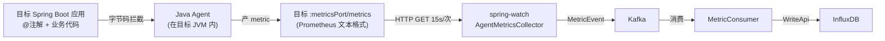

# spring-watch 白皮书

> 本文档为 spring-watch 项目的**定性文件**。所有架构设计、代码实现、对外文档必须遵守本文定义的原则。如有冲突,以本文为准。

---

## 1. 项目定性

| 维度 | 定义 |
|---|---|
| **项目名称** | spring-watch |
| **本质** | Spring Boot 应用的**指标监控平台** |
| **核心动作** | **拉取**(spring-watch 主动 HTTP GET) |
| **接入方式** | 目标应用挂 **Java Agent**(字节码增强) |
| **用户身份** | 平台使用者(运维 / SRE / 研发负责人),负责**配置**要监控的应用列表 |
| **目标用户应用** | **仅限 Spring Boot** 应用 |
| **数据来源** | **仅**由 Java Agent 字节码拦截产生,不依赖 Spring Boot 自带的 Actuator / Micrometer |

---

## 2. 五大硬约束(不可违反)

### 约束 1:**拉取模型**(Pull Model)

```
spring-watch ──HTTP GET──> 目标应用 :metricsPort/metrics
```

- spring-watch **定时主动** HTTP GET,15s 一次
- 目标应用**从不主动推送**任何数据给 spring-watch
- 目标应用**不知道** spring-watch 存在(无需配置 spring-watch 地址)
- 目标应用**不需要**在 spring-watch 那里注册回调 / Webhook / 任何反向通道
- ❌ **禁止**:让目标应用 OTLP push 到 spring-watch
- ❌ **禁止**:让目标应用 Kafka produce 到 spring-watch
- ❌ **禁止**:让目标应用通过 WebSocket / gRPC stream 连 spring-watch

### 约束 2:**监控平台**(Multi-App SaaS 形态)

- spring-watch 是一个**平台**,不是单点工具
- 平台内**有多个应用**同时被监控(不是只监控一个)
- 用户在 spring-watch 上**配置**要监控的应用列表(应用名、endpoint、metricsPort)
- 配置存于 PostgreSQL 的 `monitor_app` 表
- ❌ **禁止**:把 spring-watch 设计成"只为某一个目标应用服务"的单点工具

### 约束 3:**仅限 Spring Boot 目标应用**

- 接入流程假设目标应用是 Spring Boot 项目
- 客户端 SDK / 注解 / 切面 都基于 `org.springframework.*`
- ❌ **禁止**:支持非 Spring Boot 应用(纯 Java SE / Node.js / Go 不在范围)

### 约束 4:**指标源头 = Java Agent**(不依赖 Spring Boot 自带监控)

- 客户应用中的方法级指标,**只能**由 Java Agent 字节码增强产生
- ❌ **禁止**:依赖 `spring-boot-starter-actuator` 的 `/actuator/prometheus` 作为指标源
- ❌ **禁止**:依赖 Spring Boot 内置的 `MeterRegistry` 作为方法级指标源
- ❌ **禁止**:把 `@Timed`(Micrometer)作为方法级监控的标准方案
- ✅ **允许**:Java Agent + 自研扩展 / AOP 切面(运行在 Agent 拦截的代码路径上)
- ✅ **允许**:Java Agent 自带的 Meter 能力(但需走 Agent 的 /metrics 端点)

**关于 `@WithSpan` 的处理:**

| 行为 | 是否允许 |
|---|---|
| 用 OTel Java Agent 自动拦截 `@WithSpan` 产 trace | ✅ 允许 |
| 把 `@WithSpan` 改造成产 metric(自研 Agent 扩展 / AOP 重写) | ✅ 允许 |
| 让 `@WithSpan` 产 trace 然后让 spring-watch 拉 trace | ❌ **禁止**(trace 是事件,拉不到) |
| 让客户使用 `@Timed`(Micrometer)替代 `@WithSpan` | ⚠️ 慎用(需文档化例外范围) |

### 约束 5:**方法级监控 = 注解驱动**

- 客户使用**注解**标记要监控的方法
- 注解文件可被客户**复制**到自己的项目(轻量,无工程化)
- 注解触发的监控逻辑由 **Java Agent / AOP** 织入
- 客户**业务代码零侵入**(只加注解,不改方法体)
- ❌ **禁止**:要求客户在方法体内手写 Timer.record(...) 等埋点代码
- ❌ **禁止**:要求客户引用 spring-watch 的 SDK / starter / 大体积依赖

---

## 3. 数据流(标准链路)



**每一跳的约束:**

| 跳 | 组件 | 约束 |
|---|---|---|
| A → B | Java Agent 字节码 | 必须是 Java Agent,不允许用 Spring AOP 替代 |
| B → C | OTel / 自研 Meter | 必须暴露 Prometheus 格式文本端点 |
| C → D | HTTP GET | 拉取方必须是 spring-watch,目标不主动 |
| D → E | Kafka | 中间可经过消息队列解耦 |
| E → F | 消费者 | 必须消费 Kafka 再写 InfluxDB |
| F → G | WriteApi | 必须写 InfluxDB,不写 MySQL/PG |

---

## 4. 角色与责任

| 角色 | 责任 | 不负责 |
|---|---|---|
| **spring-watch 平台** | 配置管理、调度拉取、聚合存储、可视化 | 客户应用埋点 |
| **客户应用开发** | 加注解暴露监控点 | 写 spring-watch 拉取代码 |
| **Java Agent** | 字节码拦截、产 metric、暴露 /metrics | 主动推数据 |
| **OTel Collector** | (可选) span → metric 转换(本项目倾向不引入) | — |

---

## 5. 边界(What / What NOT)

### ✅ spring-watch 做什么

- 存储应用列表(monitor_app 表)
- 定时拉取目标的 `/metrics` 端点
- 解析 Prometheus 文本
- 转发到 Kafka
- 消费并写入 InfluxDB
- 提供查询 API(可选前端)

### ❌ spring-watch 不做什么

- **不接收**目标的任何 push(OTLP / Kafka / WebSocket / gRPC stream)
- **不主动埋点**(埋点是 Agent 的事)
- **不运行 OTel Collector**(目标侧处理 span→metric 是 Agent 扩展的职责,spring-watch 不参与)
- **不监控非 Spring Boot 应用**
- **不依赖 Spring Boot Actuator / Micrometer 作为方法级指标源**
- **不要求客户引入大体积 spring-watch SDK**

---

## 6. 客户接入标准流程(产品文档唯一形态)

```markdown
## 接入 spring-watch

### 1. 启动加 Java Agent
```bash
java -javaagent:opentelemetry-javaagent.jar \
     -DOTEL_SERVICE_NAME=my-app \
     -DOTEL_METRICS_EXPORTER=prometheus \
     -DOTEL_EXPORTER_PROMETHEUS_PORT=9464 \
     -jar my-app.jar
```

### 2. 复制 2 个文件到目标项目 com.springwatch 包
- SpringWatch.java(注解)
- SpringWatchAspect.java(切面)

### 3. pom.xml 加 1 个依赖
```xml
<dependency>
    <groupId>org.springframework.boot</groupId>
    <artifactId>spring-boot-starter-aop</artifactId>
</dependency>
```

### 4. @SpringBootApplication 加扫描范围
```java
@SpringBootApplication(scanBasePackages = {"com.your.app", "com.springwatch"})
```

### 5. 业务方法加注解
```java
@SpringWatch("order.listOrders")
public void listOrders() { ... }
```

### 6. 在 spring-watch 平台注册应用
- 调用 `POST /api/apps` 提交 `appName`、`endpoint`、`metricsPort`
- 注册成功后**响应里携带 `appid`**(53 bit 雪花,系统生成、不可变、唯一),后续采集数据/查询全部用 `appid` 定位
- `appName` 是**可读名**,允许后期修改;`appid` 是**业务键**,生成后不可变
```

**接入成本硬上限:**
- 1 个 JVM 参数
- 2 个 .java 文件
- 1 个 Maven 依赖
- 1 行 `@SpringBootApplication` 注解改动
- 1 个业务注解

---

## 7. 常见误解(FAQ)

### Q1:能不能用 @Timed(Micrometer)替代 @SpringWatch?

**答**:不推荐。`@Timed` 产 metric 的链路是 **Spring Boot Actuator → Micrometer → /actuator/prometheus**。这违反约束 4(不依赖 Spring Boot 自带监控)和约束 1(拉取的是 actuator 端点而非 Agent 端点)。如客户已用 Micrometer,可作为**兼容模式**支持,但产品主推方案仍是 `@SpringWatch` + Java Agent。

### Q2:能不能让目标应用 OTLP push 到 spring-watch?

**答**:**禁止**。违反约束 1(拉取模型)。spring-watch 是拉取方,不能变成接收方。

### Q3:能不能用 OTel Collector 做中转?

**答**:可以放在**目标侧**(目标 JVM 内的扩展),但 spring-watch **不运行** Collector。Collector 在 spring-watch 架构外,但能产 metric 走拉取链路,符合约束。Collector 不能跑在 spring-watch 容器里。

### Q4:能不能监控非 Spring Boot 应用?

**答**:**禁止**。约束 3 明确只支持 Spring Boot。`@SpringBootApplication` 扫描、AOP 织入、`@SpringWatch` 注解都依赖 Spring 生态。

### Q5:为什么不用 Trace 做方法监控?

**答**:Trace 是**事件**(已经发生),只能 push、不能 pull。spring-watch 是拉取模型,只能消费**指标**(状态)。要 trace 数据,需要另一套 push 架构(不在本项目范围)。

### Q6:客户想用 @WithSpan 怎么办?

**答**:`@WithSpan` 产 trace,spring-watch 拉不到 metric。客户如果想监控,推荐改用 `@SpringWatch`(产品主推)。如果客户坚持要 trace 数据,需要他们自己部署 Tempo/Jaeger,**不在 spring-watch 范围**。

### Q7:客户能不能在业务方法里写 Timer.record(...) 手动埋点?

**答**:**禁止**。约束 5 明确"注解驱动 + 业务代码零侵入"。手写埋点破坏接入一致性。

### Q8:为什么 log_keyword / log_new_pattern 类规则的状态机是 IDLE→FIRING 直跳,没有 PENDING 缓冲?

**答**:**这是设计,不是缺陷。** 两条状态机路径要分开看:

| 规则类型 | 状态机路径 | 缓冲必要性 |
|---|---|---|
| **metric** / **log_error_rate** | `IDLE→PENDING→FIRING→RESOLVED` | **需要 PENDING 缓冲**。核心语义是"**持续 N 次 / 持续 N 秒** 才算触发"(`times` + `durationSeconds`),必须先进入 PENDING 累计,达到阈值才能升 FIRING。 |
| **log_keyword** / **log_new_pattern** | `IDLE→FIRING→RESOLVED`(**无 PENDING**) | **不需要 PENDING 缓冲**。日志事件本身就是"**已发生的单点事件**",语义是"匹配到一条就告警"或"出现新模式就告警",没有"持续 N 次"的语义需求。PENDING 缓冲对日志类规则**没有业务价值**,只会引入不必要延迟(至少 1 个 durationSeconds 才发通知)。 |

**设计原则**:
- 日志类规则:**单点触发,立即告警**(`AlertEngine.evaluateLogRule`)
- 指标类规则:**持续触发,防抖后告警**(`AlertEngine.handleBreach`)

**反模式(防止后续误改)**:
- ❌ **禁止**:为了"状态机对称"强行给 log_keyword / log_new_pattern 加 PENDING 缓冲
- ❌ **禁止**:把日志类规则的 IDLE→FIRING 直跳视为"漏写代码"或"竞态隐患"而修复——它的并发控制靠 `if (current == FIRING) return;` 早返回,不靠 PENDING
- ❌ **禁止**:把两类规则的状态机合并为同一套路径

**CAS 适用范围**:
- 需要 CAS:`PENDING → FIRING`、`FIRING → RESOLVED`(都是 metric 路径,见 `AlertStateStore.LUA_TRY_FIRE` / `LUA_TRY_RESOLVE`)
- 不需要 CAS:日志类的 `IDLE → FIRING` 直跳(没有 PENDING 路径,早返回 + Redis Hash 单写已足够)

---

## 8. 术语表

| 术语 | 定义 |
|---|---|
| **拉取模型** | spring-watch 主动 HTTP GET 目标 /metrics,目标不主动推送 |
| **平台** | 多应用配置驱动,非单点工具 |
| **Java Agent** | `-javaagent:` 启动参数挂载的字节码增强工具,本项目特指 OTel Java Agent 或其扩展 |
| **注解驱动** | 客户用 `@SpringWatch` 标记方法,Agent / AOP 织入监控逻辑 |
| **业务代码零侵入** | 客户方法体内部不改,只加注解 |
| **方法级监控** | 对单个方法调用次数、耗时的统计 |
| **appid** | 监控目标在 spring-watch 平台注册时系统生成的 **53 bit 雪花 ID**(Long),唯一且不可变,贯穿 Kafka key、InfluxDB tag、OTel `OTEL_SERVICE_NAME`、API 查询参数。是定位指定监控目标的**关键条件** |
| **appName** | 监控目标的可读名称,允许修改;不参与采集数据链路(采集数据只携带 `appid`) |
| **指标(Metric)** | 状态型数据(count / sum / gauge / histogram),可被 HTTP GET 拉取 |
| **追踪(Trace)** | 事件型数据(span 列表),只能 push,不能 pull |

---

## 9. 版本控制

- 本文档变更需经架构师评审
- 任何违反本文约束的设计/代码,需在 PR 描述中说明例外原因
- 重大变更需更新版本号(v1 → v2)
