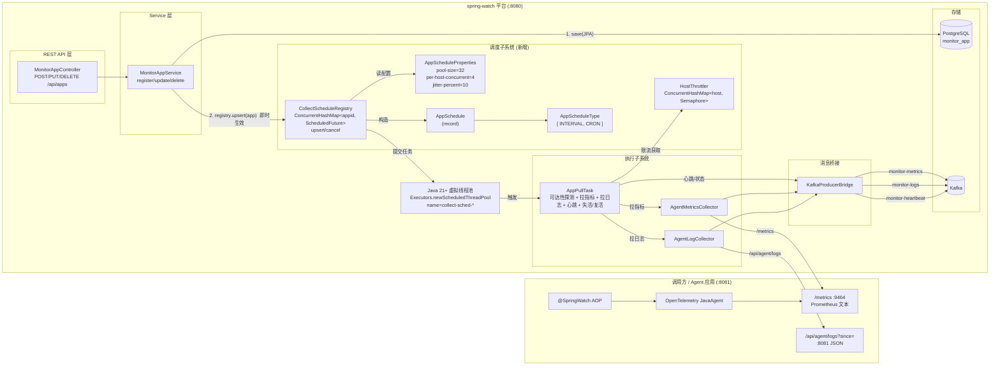
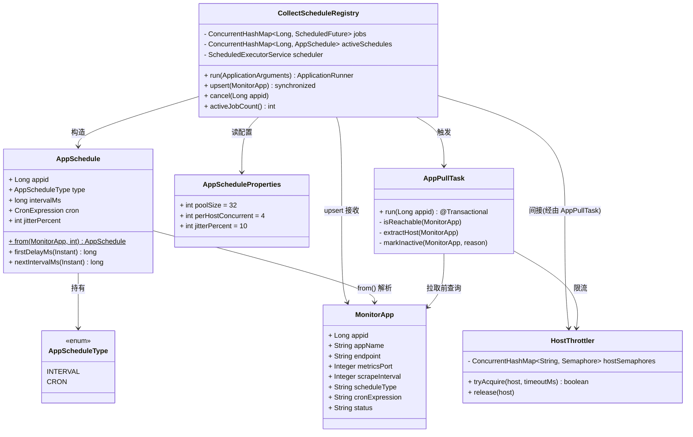
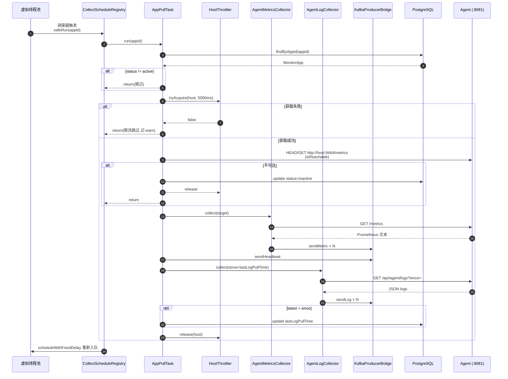
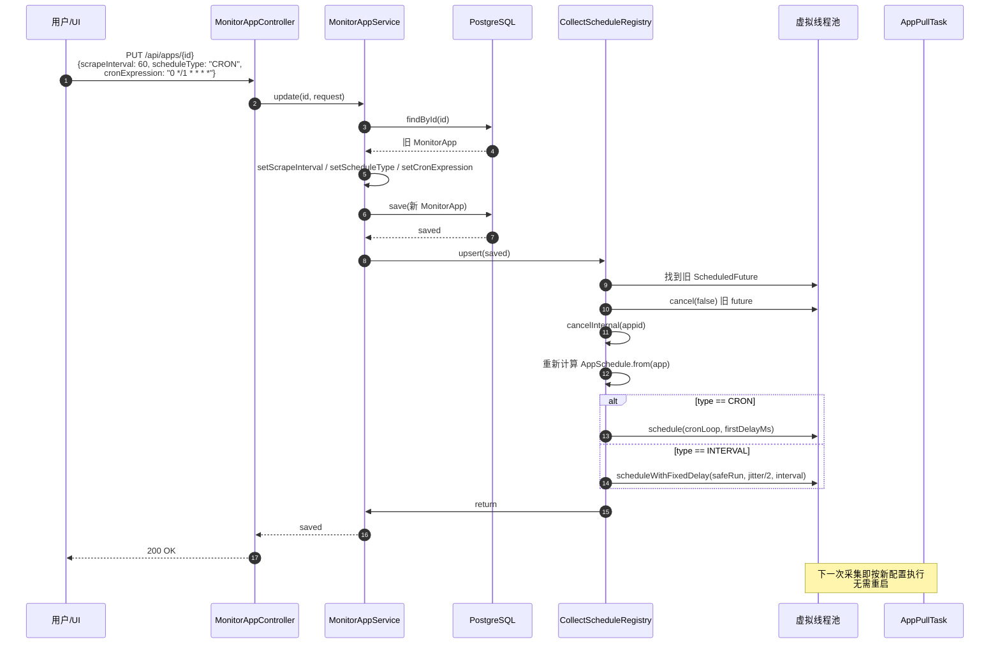
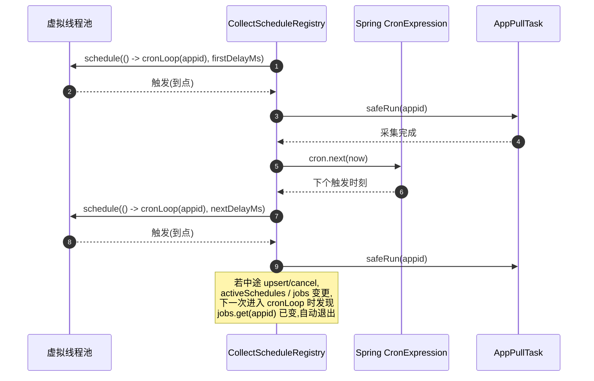

# spring-watch 采集层架构图

> 适用版本:基于 HertzBeat 调研结论改造后的 spring-watch
> 改造时间:2026-06-13
> 核心变化:由"全局 `@Scheduled` 拉所有应用" → **"每应用一个 `ScheduledFuture`,支持 interval 与 cron 双模式,热更新"**

---

## 一、问题与目标

### 改造前

```
@Scheduled(fixedDelay = 30s) {
    for (MonitorApp app : findAll()) {
        pull(app);     // ← 全局一把梭,所有 app 在同一时间窗
    }
}
```

问题:
- `scrapeInterval` 字段存了但**没生效**,所有应用共用一个固定周期
- 不支持 cron 表达式
- 改完周期需重启或被动等下个 tick,无热更新通道
- 无错峰,大量 app 同时拉 → 雪崩
- 限流粒度粗(没有)
- 单 app 拉取慢会阻塞后续 app

### 改造后

- 每应用一个调度任务,周期/cron 由 `monitor_app` 行决定
- `MonitorAppService` 的 `register/update/delete` 即刻同步到调度器,**热更新**
- 虚拟线程池 + per-host 限流 + jitter 错峰
- INTERVAL/CRON 双模式,坏 cron 自动回退

---

## 二、整体架构图



---

## 三、调度子系统内部组件关系



---

## 四、调度时序 - 单次采集周期(INTERVAL 模式)



---

## 五、调度时序 - 热更新(用户修改 scrapeInterval / cron)



---

## 六、调度时序 - CRON 模式循环



---

## 七、关键设计点对照 HertzBeat 经验

| 设计点 | HertzBeat 经验 | spring-watch 落地 |
|---|---|---|
| 调度模型 | 每 Monitor 一个时间轮槽 | 每 app 一个 `ScheduledFuture` |
| 时间结构 | Dubbo `HashedWheelTimer` | `ScheduledExecutorService` + 虚拟线程 |
| 执行线程 | Java 21 虚拟线程 | Java 25 虚拟线程(`Thread.ofVirtual().factory()`) |
| 周期策略 | INTERVAL 或 CRON,二选一 | 同上,坏 CRON 自动回退 INTERVAL |
| 错峰 | HertzBeat 用 LCM 差分(无 jitter) | **`±jitterPercent` 随机抖动**,启动时防雪崩 |
| 限流 | 全局 `Semaphore(512)` | **per-host `Semaphore(perHostConcurrent)`** |
| 热更新 | delete + add 重建 | delete + add 重建,加 `activeSchedules` 检测防止僵尸 future |
| 启停 | `SchedulerInit.run()` + `reBalance` | `ApplicationRunner.run()`(启动加载) + `@PreDestroy`(优雅关闭) |
| 配置 | `@Value` 硬编码 | `@ConfigurationProperties` + yml,`pool-size/per-host/jitter` 可调 |

---

## 八、文件落点一览

```
src/main/java/com/springwatch/
├── collector/
│   ├── AppPullTask.java                    ← 新增:拉取主逻辑
│   ├── AgentMetricsCollector.java          ← 保留
│   ├── AgentLogCollector.java              ← 保留
│   ├── KafkaProducerBridge.java            ← 保留
│   ├── OtelConfigGenerator.java            ← 保留
│   └── schedule/                           ← 新增包
│       ├── AppScheduleType.java            ← 枚举
│       ├── AppSchedule.java                ← record
│       ├── AppScheduleProperties.java      ← 配置
│       ├── HostThrottler.java              ← per-host 限流
│       └── CollectScheduleRegistry.java    ← 调度核心
├── model/
│   ├── entity/MonitorApp.java              ← 改:+scheduleType, cronExpression
│   └── dto/AppRegisterRequest.java         ← 改:同上
└── service/
    └── MonitorAppService.java              ← 改:register/update/delete 接入 Registry

src/main/resources/
├── application.yml                         ← 改:+pool-size/per-host-concurrent/jitter-percent
└── db/migration/
    └── V5__add_schedule_fields.sql         ← 新增
```

`CollectorScheduler.java` 已删除,功能完全被新调度体系替代。
